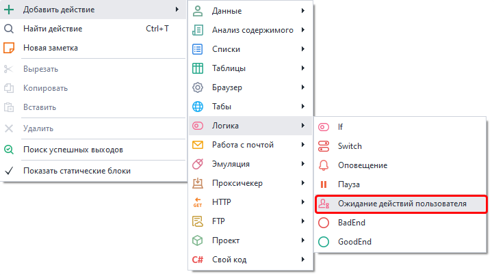
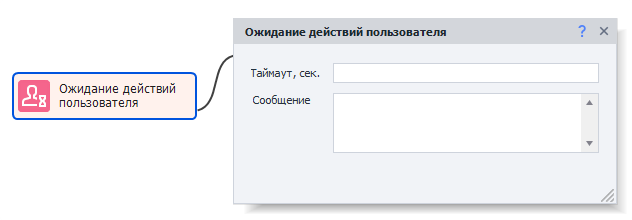
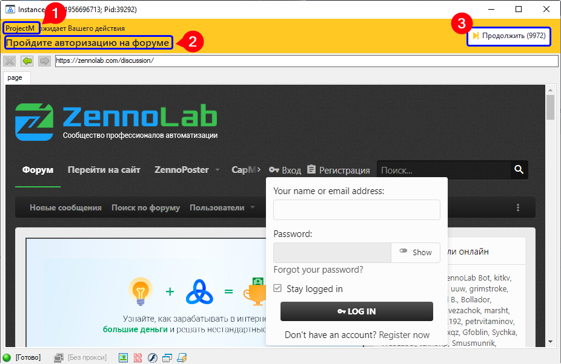

---
sidebar_position: 5
title: "Ожидание действий пользователя"
description: ""
date: "2025-08-04"
converted: true
originalFile: "Ожидание действий пользователя.txt"
targetUrl: "https://zennolab.atlassian.net/wiki/spaces/RU/pages/2110259201"
---
:::info **Пожалуйста, ознакомьтесь с [*Правилами использования материалов на данном ресурсе*](../Disclaimer).**
:::

> 🔗 **[Оригинальная страница](https://zennolab.atlassian.net/wiki/spaces/RU/pages/2110259201)** — Источник данного материала

_______________________________________________  
# Ожидание действий пользователя

:::info Информация
Добавлено в ZennoPoster 7.7.0.0  
В предыдущих версиях программы это действие было одной из подфункций экшена Настройки браузера.
:::

## Описание

Экшен будет полезен в тех случаях, когда нужно вручную провести какие-то действия внутри браузера ZennoPoster.

## Как добавить действие в проект?

Через контекстное меню **Добавить действие** → **Логика** → **Ожидание действий пользователя**

Либо воспользуйтесь [❗→ умным поиском](https://zennolab.atlassian.net/wiki/spaces/RU/pages/506200090/ProjectMaker+7#%D0%A3%D0%BC%D0%BD%D1%8B%D0%B9-%D0%BF%D0%BE%D0%B8%D1%81%D0%BA-%D0%B4%D0%B5%D0%B9%D1%81%D1%82%D0%B2%D0%B8%D0%B9 "https://zennolab.atlassian.net/wiki/spaces/RU/pages/506200090/ProjectMaker+7#%D0%A3%D0%BC%D0%BD%D1%8B%D0%B9-%D0%BF%D0%BE%D0%B8%D1%81%D0%BA-%D0%B4%D0%B5%D0%B9%D1%81%D1%82%D0%B2%D0%B8%D0%B9").

## Как работать с экшеном?

### Таймаут

Количество секунд в течение которых должны быть выполнены все необходимые действия (если оно неизвестно, установите 99999, например). По истечению таймаута шаблон продолжит работу дальше.

### Сообщение

Данный текст будет показан пользователю в верхней части открывшегося окна инстанса.

## Окно ожидания действий

После того, как будет запущен этот экшен откроется окно браузера.
В верхней части окна (на оранжевом фоне), слева сверху находится название проекта(1), который вызвал это окно (в данном случае *ProjectM).
Под именем проекта текст, который был задан в экшене(2).
Справа кнопка “Продолжить”(3), а в скобках количество оставшихся секунд, до автоматического закрытия окна.

## Пример использвания

Экшен можно использовать для тех пользователей шаблона, которые боятся сохранять данные для входа на сайты или для ввода данных кредитных карт.

## Полезные ссылки

- [❗→ Настройки браузера](https://zennolab.atlassian.net/wiki/spaces/RU/pages/489324572 "https://zennolab.atlassian.net/wiki/spaces/RU/pages/489324572")