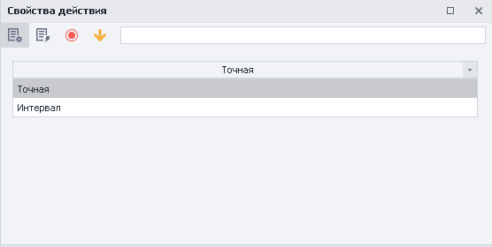
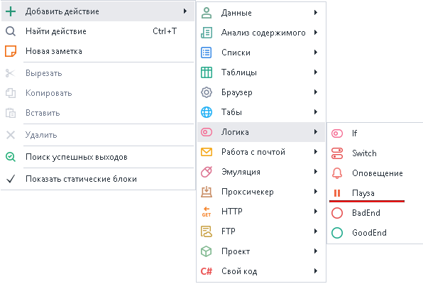
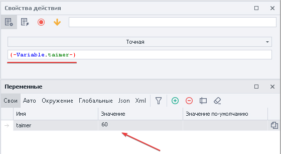
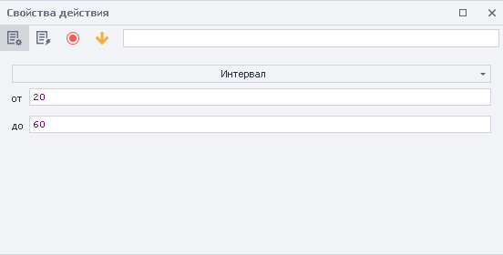
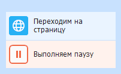

---
sidebar_position: 4
title: "Пауза"
description: ""
date: "2025-08-04"
converted: true
originalFile: "Пауза.txt"
targetUrl: "https://zennolab.atlassian.net/wiki/spaces/RU/pages/534053057"
---
:::info **Пожалуйста, ознакомьтесь с [*Правилами использования материалов на данном ресурсе*](../Disclaimer).**
:::

> 🔗 **[Оригинальная страница](https://zennolab.atlassian.net/wiki/spaces/RU/pages/534053057)** — Источник данного материала

_______________________________________________  
# Пауза

## Описание

Действие остановки проекта на заданный промежуток времени - в секундах.

## Как добавить действие в проект?

Через контекстное меню **Добавить действие** → **Логика** → **Пауза**

Либо воспользуйтесь [❗→ умным поиском](https://zennolab.atlassian.net/wiki/spaces/RU/pages/506200090/ProjectMaker+7#%D0%A3%D0%BC%D0%BD%D1%8B%D0%B9-%D0%BF%D0%BE%D0%B8%D1%81%D0%BA-%D0%B4%D0%B5%D0%B9%D1%81%D1%82%D0%B2%D0%B8%D0%B9 "https://zennolab.atlassian.net/wiki/spaces/RU/pages/506200090/ProjectMaker+7#%D0%A3%D0%BC%D0%BD%D1%8B%D0%B9-%D0%BF%D0%BE%D0%B8%D1%81%D0%BA-%D0%B4%D0%B5%D0%B9%D1%81%D1%82%D0%B2%D0%B8%D0%B9").

## Для чего это используется?

- Для ожидания полной загрузки сайта
- Создания человеческого поведения на сайте с помощью случайных пауз
- Задать промежуток времени между выполнениями действий

## Как работать с экшеном?

:::info Информация
Значение устанавливается в секундах. Если используете переменные, то значение должно быть цифровым.
:::

### **Точная** 

Проект остановит выполнение на указанное количество секунд. Значение можно указать самому или указав переменную с цифровым значением.

  

### **Интервал**

Указывается пауза в заданном цифровом промежутке, можно использовать переменные.

- **От**  - минимальное время в секундах.
- **До -** максимальная пауза в секундах, **НЕ ВКЛЮЧИТЕЛЬНО.**

Проект уйдет в ожидание на время, выбранное случайным образом из диапазона с 20 до 59 секунд.

  

## Пример использования

Представим, что нам нужно сделать несколько однотипных действий на сайте. Чтобы они не выглядели роботизировано из-за молниеносного выполнения, рекомендуем делать случайные паузы между действиями.

Выглядит это следующим образом:

1. Загружаем ресурс
2. Выполняем необходимые действия
3. Задаём паузу в интервале
4. Выполняем действия

Таким образом, выдерживая паузы между действиями, сайт расценивает нас как “живого“ пользователя, а не бота.

  

## Полезные ссылки

1. [❗→ Переход на страницу](https://zennolab.atlassian.net/wiki/spaces/RU/pages/534052989/Navigate "https://zennolab.atlassian.net/wiki/spaces/RU/pages/534052989/Navigate")