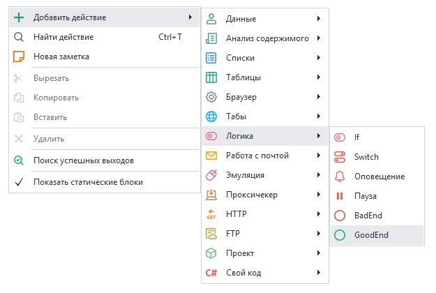

:::info **Пожалуйста, ознакомьтесь с [*Правилами использования материалов на данном ресурсе*](../Disclaimer).**
:::

> 🔗 **[Оригинальная страница](https://zennolab.atlassian.net/wiki/spaces/RU/pages/1406632097/Google.com)** — Источник данного материала

_______________________________________________  
# Google.com

При попытке отправить тестовое сообщение (при условии, что пароль указан верно), Вы можете получить сообщение об ошибке, в котором указано, что `Username and password not accepted`. Это связано с политикой безопасности Google, которые считаю все сторонние приложения небезопасными.

Это может означать, что в вашем аккаунте Google не включено разрешение доступа из сторонних приложений. 

**Решить это можно двумя путями:** создать пароль приложения (если включена двухэтапная аутентификация) или разрешить доступ для ненадежных приложений (если двухэтапная аутентификация выключена).

### Создание пароля приложения

Использование пароля приложения является наиболее предпочтительным способом использования аккаунта почты Google по соображениям безопасности.

Для того чтобы создать пароль приложения необходимо включить двухэтапную аутентификацию. Если это по какой-либо причине не возможно, то создать пароль приложения не получится.

Включение двухэтапной аутентификации описано в [статье](https://support.google.com/accounts/answer/185839 "https://support.google.com/accounts/answer/185839").

После этого необходимо проделать следующее.

1. На странице "Аккаунт Google" откройте раздел [Безопасность](https://myaccount.google.com/security "https://myaccount.google.com/security") и перейдите в раздел “[Пароли приложений](https://myaccount.google.com/apppasswords "https://myaccount.google.com/apppasswords")“
2. В открывшемся окне в выпадающих списках выберите Приложение → Почта, Устройство → Компьютер Windows и нажмите кнопку “Создать“

3. Созданный пароль будет показан в открывшемся окне, его необходимо скопировать и вставить в **Настройки почтового сервиса**

4. После этого повторите тестовую отправку почты. Если все сделано правильно, то в строке статуса “Тестовое письмо отправлено успешно“.

### Разрешить доступ для ненадежных приложений

Этот способ доступен только в том случае, если двухэтапная аутентификация.

Для того, чтобы решить это, вам необходимо проделать следующее:

1. На странице "Аккаунт Google" откройте раздел [Безопасность](https://myaccount.google.com/security "https://myaccount.google.com/security"), найдите раздел “Ненадежные приложения, у которых есть доступ к аккаунту” и внизу страницы перейдите по ссылке “[Открыть доступ](https://myaccount.google.com/lesssecureapps "https://myaccount.google.com/lesssecureapps")“

2. На открывшейся странице установите чек-бокс “Небезопасные приложения разрешены“

3. После этого повторите тестовую отправку почты. Если все сделано правильно, то в строке статуса “Тестовое письмо отправлено успешно“.

