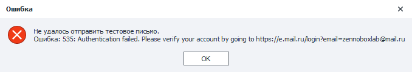
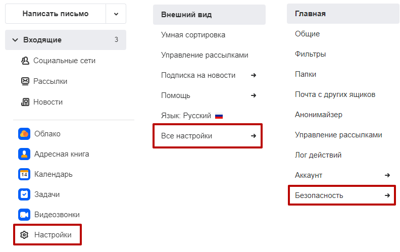
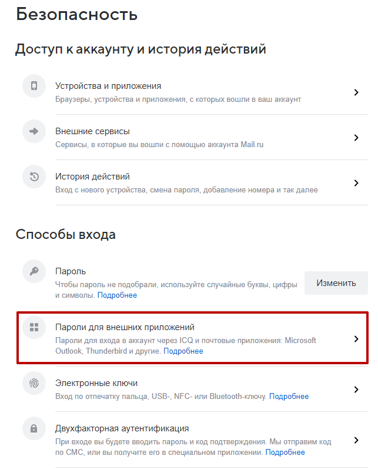
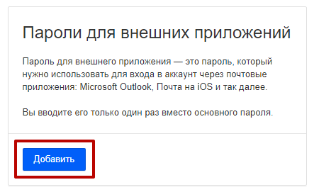
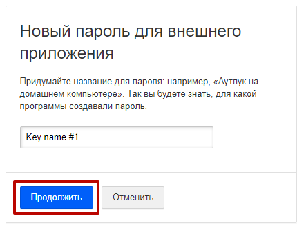
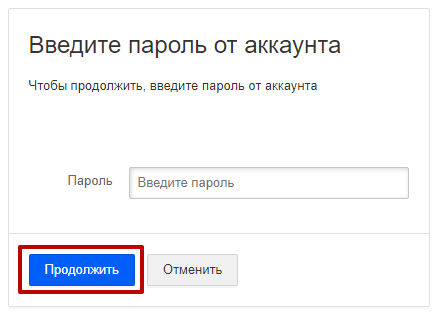
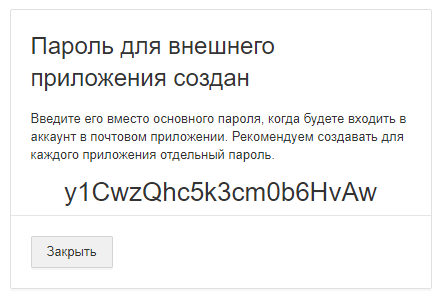

---
sidebar_position: 1
title: "Mail.ru"
description: ""
date: "2025-08-04"
converted: true
originalFile: "Mail.ru.txt"
targetUrl: "https://zennolab.atlassian.net/wiki/spaces/RU/pages/2060156937/Mail.ru"
---
:::info **Пожалуйста, ознакомьтесь с [*Правилами использования материалов на данном ресурсе*](../Disclaimer).**
:::

> 🔗 **[Оригинальная страница](https://zennolab.atlassian.net/wiki/spaces/RU/pages/2060156937/Mail.ru)** — Источник данного материала

_______________________________________________  
# Mail.ru

При попытке отправить тестовое сообщение (при условии, что пароль указан верно), Вы можете получить сообщение об ошибке `535: Authentication failed. Please verify your account by going to https://e.mail.ru/login?email=`. 

Это может быть связано с политикой безопасности Mail.ru, в соответствии с которой для доступа из сторонних сервисов необходимо использовать отдельный специально созданный пароль.

**Для того, чтобы создать пароль, вам необходимо проделать следующее:**

Откройте настройки Вашего аккаунта Mail.ru в браузере и перейти по пути **"Настройки" → "Все настройки" → "Безопасность"**

Перейдите в настройку **"Пароли для внешних приложений"** 

На открывшейся странице нажмите кнопку **"Добавить"**

Задайте произвольное название для нового пароля и нажмите кнопку **"Продолжить"**

Далее введите основной пароль от вашего аккаунта и нажмите кнопку **"Продолжить"**

После этого Mail.ru создаст пароль для доступа из внешних приложений. 

Созданный пароль необходимо скопировать и вставить в **Настройки почтового сервиса**