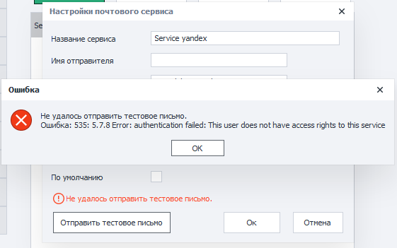
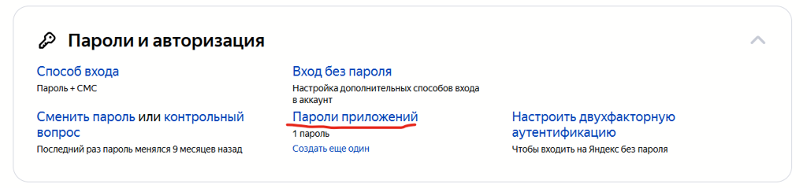
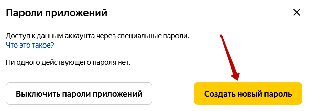
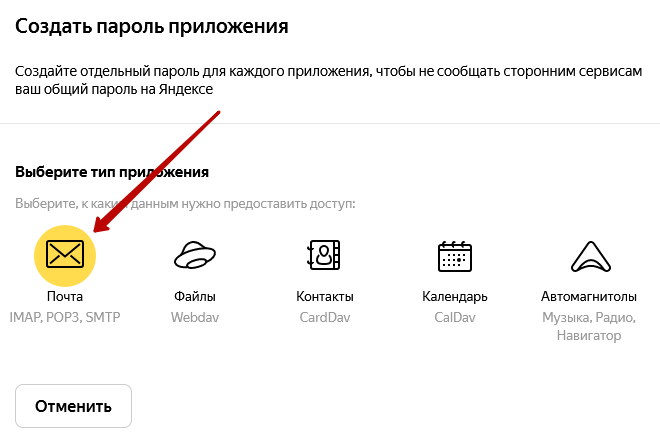
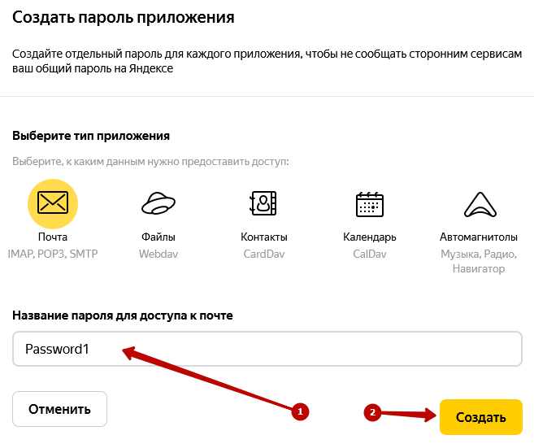
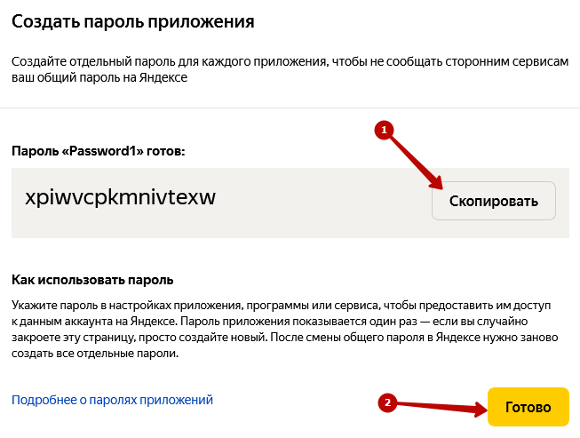
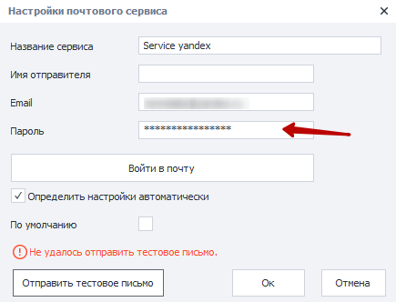
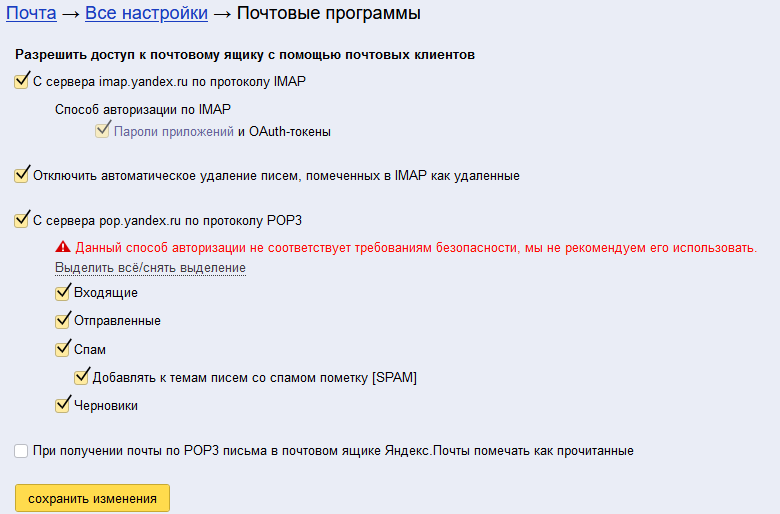
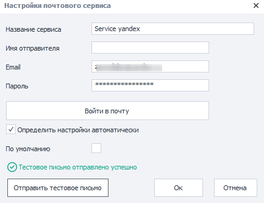

---
sidebar_position: 3
title: "Yandex.ru"
description: ""
date: "2025-08-04"
converted: true
originalFile: "Yandex.ru.txt"
targetUrl: "https://zennolab.atlassian.net/wiki/spaces/RU/pages/1406632028/Yandex.ru"
---
:::info **Пожалуйста, ознакомьтесь с [*Правилами использования материалов на данном ресурсе*](../Disclaimer).**
:::

> 🔗 **[Оригинальная страница](https://zennolab.atlassian.net/wiki/spaces/RU/pages/1406632028/Yandex.ru)** — Источник данного материала

_______________________________________________  
# Yandex.ru

При попытке отправить тестовое сообщение (при условии, что пароль указан верно), Вы можете получить сообщение об ошибке, в котором указано, что `This user does not have access rights to this service` (этот пользователь не имеет прав для доступа к сервису). 

Это означает, что Яндекс Вас узнал, но вы не имеете доступа к своему почтовому ящику через сторонние сервисы.

**Для того, чтобы решить это, вам необходимо проделать следующее:**

1. Откройте страницу профиля в Яндекс.Паспорт https://passport.yandex.ru/profile. Прокрутите вниз до пункта **Пароли и авторизация → Пароли приложений.**

2. В открывшемся окне выберите "Создать новый пароль"

3. Выберите тип приложения "Почта"

4. Введите произвольное название для пароля (1) и нажмите кнопку "Создать" (2)

5. В открывшемся окне нажмите кнопку "Скопировать" (1) и кнопку "Готово" (2)

6. Вставьте скопированный пароль в свойства почтового сервиса Zennoposter

7. Следующим шагом необходимо перейти на страницу настроек почты **Почта → Все настройки → Почтовые программы** [<u data-renderer-mark="true">https://mail.yandex.ru/?uid=322585007#setup/client</u>](https://mail.yandex.ru/?uid=322585007#setup/client "https://mail.yandex.ru/?uid=322585007#setup/client")
8. Разрешите доступ к почтовому ящику из сторонних почтовых клиентов и сохраните изменения.

9. После этого повторите тестовую отправку почты. Если все сделано правильно, то в строке статуса "Тестовое письмо отправлено успешно".

