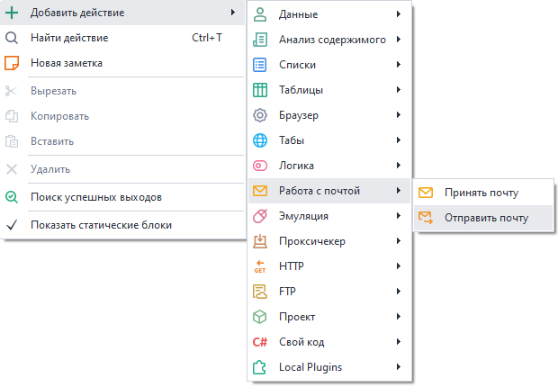
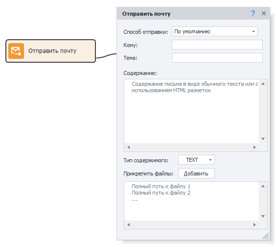

---
sidebar_position: 0
title: "Отправить почту"
description: ""
date: "2025-08-04"
converted: true
originalFile: "Отправить почту.txt"
targetUrl: "https://zennolab.atlassian.net/wiki/spaces/RU/pages/1399914500"
slug: PM_Editor_Actions_SendMail
---
import DisclaimerNotice from '@site/src/components/DisclaimerNotice';

<DisclaimerNotice />

> 🔗 **[Оригинальная страница](https://zennolab.atlassian.net/wiki/spaces/RU/pages/1399914500)** — Источник данного материала

_______________________________________________  
## Описание
С этим экшеном вы можете отправить письмо на любой адрес электронной почты, используя SMTP сервер.  

Подходит для:  
- Отправки уведомления о событиях в проекте (успешное выполнение, возникла ошибка и так далее);  
- Передачи сообщений на указанные адреса со своего ящика;  

### Как добавить в проект?  
Через контекстное меню: **Добавить действие → Работа с почтой → Отправить почту**.  

_______________________________________________ 
## Принцип работы
:::info **Перед началом работы добавьте данные вашего ящика.**
Сделать это можно в настройках программы в разделе [**Почта**](../Settings/Mailbox). Там указываются аккаунты, с которых будут отправляться письма.  
:::  

### Способ отправки.  
Здесь отобразятся все почтовые ящики, которые вы добавили в [**Настройках программы**](../Settings/Mailbox). Выбираем из них один, с которого произведётся отправка.  

Доступно использование [**Переменных проекта**](../Data/WorkWithVariables).  

### Кому.  
Указываем Email-адрес получателя.

### Тема. 
Задаём тему для нашего письма.

### Содержание.  
Сюда помещаем основной текст сообщения. Поддерживается HTML-разметка.

### Тип содержимого.  
#### TEXT.  
Оставляем этот вариант, если хотим отправить обычый текст.  
#### HTML.  
Этот же пункт выбираем, когда содержимое включает HTML-разметку.

### Прикрепить файлы.
Вместе с письмом можно отправить любое количество файлов. В данном поле указывается путь к нужным файлам, каждый с новой строки.  

Путь к файлам можно прописать вручную или выбрать через кнопку **Добавить**. Поддерживаются также **Переменные проекта**.  
_______________________________________________ 
## Полезные ссылки

- [❗→ Почта (PM)](https://zennolab.atlassian.net/wiki/spaces/RU/pages/2096660481 "https://zennolab.atlassian.net/wiki/spaces/RU/pages/2096660481")
- [❗→ Принять почту](https://zennolab.atlassian.net/wiki/spaces/RU/pages/735576144 "https://zennolab.atlassian.net/wiki/spaces/RU/pages/735576144")