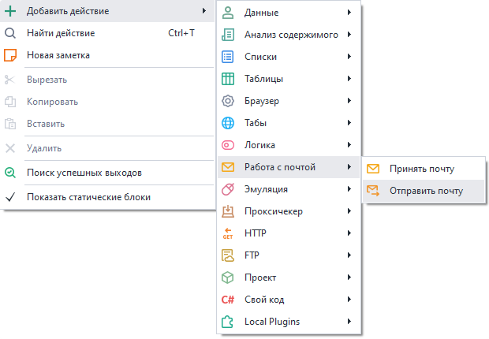
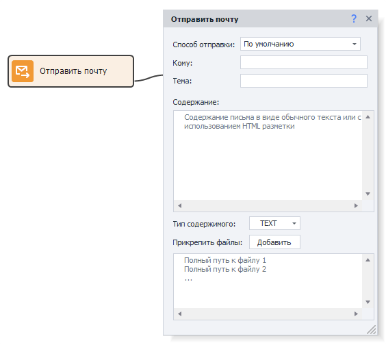

---
sidebar_position: 0
title: "Отправить почту"
description: ""
date: "2025-08-04"
converted: true
originalFile: "Отправить почту.txt"
targetUrl: "https://zennolab.atlassian.net/wiki/spaces/RU/pages/1399914500"
---
:::info **Пожалуйста, ознакомьтесь с [*Правилами использования материалов на данном ресурсе*](../Disclaimer).**
:::

> 🔗 **[Оригинальная страница](https://zennolab.atlassian.net/wiki/spaces/RU/pages/1399914500)** — Источник данного материала

_______________________________________________  
# Отправить почту

  

## Описание

Отправка уведомления на любой адрес электронной почты, используя SMTP сервер.

  

## Как добавить действие в проект?

Через контекстное меню **Добавить действие → Работа с почтой → Отправить почту**

Либо воспользуйтесь [❗→ умным поиском](https://zennolab.atlassian.net/wiki/spaces/RU/pages/506200090/ProjectMaker+7#%D0%A3%D0%BC%D0%BD%D1%8B%D0%B9-%D0%BF%D0%BE%D0%B8%D1%81%D0%BA-%D0%B4%D0%B5%D0%B9%D1%81%D1%82%D0%B2%D0%B8%D0%B9 "https://zennolab.atlassian.net/wiki/spaces/RU/pages/506200090/ProjectMaker+7#%D0%A3%D0%BC%D0%BD%D1%8B%D0%B9-%D0%BF%D0%BE%D0%B8%D1%81%D0%BA-%D0%B4%D0%B5%D0%B9%D1%81%D1%82%D0%B2%D0%B8%D0%B9").

  

## Для чего это используется?

- Можно использовать для уведомления о событиях в проекте - успешное выполнение, возникла ошибка и других.
- Посылать сообщения на указанные адреса со своего адреса.

  

## Как работать с экшеном?

:::info Информация
Прежде всего нужно добавить в программу аккаунты, с помощью которых будут отправляться уведомления. Сделать это можно в настройках, на вкладке Почта.
:::

### Способ отправки

Аккаунт с которого будет отправлено уведомление. Добавить новый аккаунт можно в [❗→ настройках программы](https://zennolab.atlassian.net/wiki/spaces/RU/pages/2096660481 "https://zennolab.atlassian.net/wiki/spaces/RU/pages/2096660481").
Также в этом поле можно использовать [❗→ переменные проекта](https://zennolab.atlassian.net/wiki/spaces/RU/pages/486309922 "https://zennolab.atlassian.net/wiki/spaces/RU/pages/486309922").

### Кому

Email адрес получателя.

### Тема

Тема письма.

### Содержимое

Текст сообщения. Можно использовать HTML разметку.

### Тип содержимого

- TEXT - выбирайте этот пункт, если “Содержимое” сообщения содержит простой текст.
- HTML - этот пункт нужно выбирать в том случае, если “Содержимое” включает в себя HTML разметку.

### Прикрепить файлы

Вместе с письмом можно отправить любое количество файлов. В данном поле нужно указать пути к файлам, каждый путь с новой строки.
Пути можно прописать вручную, выбрать с помощью кнопки “Добавить” или указать с помощью [❗→ переменных проекта](https://zennolab.atlassian.net/wiki/spaces/RU/pages/486309922 "https://zennolab.atlassian.net/wiki/spaces/RU/pages/486309922").

  

## Полезные ссылки

- [❗→ Почта (PM)](https://zennolab.atlassian.net/wiki/spaces/RU/pages/2096660481 "https://zennolab.atlassian.net/wiki/spaces/RU/pages/2096660481")
- [❗→ Принять почту](https://zennolab.atlassian.net/wiki/spaces/RU/pages/735576144 "https://zennolab.atlassian.net/wiki/spaces/RU/pages/735576144")