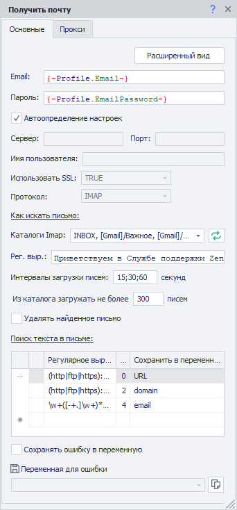
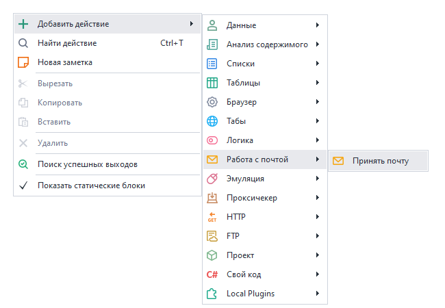
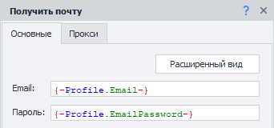
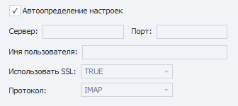
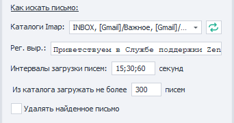
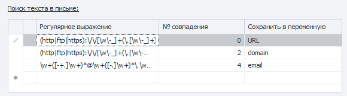
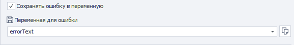
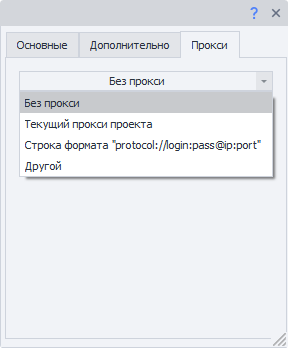
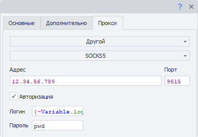

---
sidebar_position: 1
title: "Принять почту"
description: ""
date: "2025-08-04"
converted: true
originalFile: "Принять почту.txt"
targetUrl: "https://zennolab.atlassian.net/wiki/spaces/RU/pages/735576144"
---
import DisclaimerNotice from '@site/src/components/DisclaimerNotice';

<DisclaimerNotice />

> 🔗 **[Оригинальная страница](https://zennolab.atlassian.net/wiki/spaces/RU/pages/735576144)** — Источник данного материала

_______________________________________________  
## Описание
Позволяет найти нужное письмо и информацию в нём. Подходит для массовой обработки входящей корреспонденции.  

### Как добавить действие в проект?
Через контекстное меню: **Добавить действие** → **Работа с почтой** → **Принять почту**

### Используется для:
- Быстрого доступа к письмам;  
- Получения данных из письма;  
- Активации учетных записей;  
- Удаление ненужных писем;  
- Удаление загруженных писем.
_______________________________________________ 
:::info Для работы В ВАШЕЙ УЧЕТНОЙ ЗАПИСИ должна быть АКТИВИРОВАНА ОПЦИЯ ДОСТУПА ЧЕРЕЗ IMAP.
:::

## Вкладка «Основные»

### Расширенный вид
При клике по данной кнопке откроется окно [Обработка e-mail](/zennoposter/ProjectMaker/Tools/Email_Processing).

### Email и Пароль
Указываем эти данные от электронного ящика.

### Настройки подключения

#### **Автоопределение настроек**
При включении данной настройки ZennoPoster автоматически подберёт параметры для соединения с почтовым сервером.

:::warning Работает не со всеми почтовыми провайдерами.
:::

#### **Сервер, Порт, Имя пользователя, Использовать SSL, Протокол**
Все эти параметры надо уточнять в документации выбранного почтового провайдера.

### Как искать письмо

#### **Каталоги Imap**

Здесь можно выбрать папки почтового ящика, в которых будет производиться поиск письма.

 — эта кнопка обновляет список доступных папок.

#### **Рег. выр. (Регулярное выражение)**
В данное поле необходимо внести регулярное выражение, согласно которому будет происходить поиск письма в ящике.

#### **Интервалы загрузки писем**
Письма от сервисов могут приходить с задержкой. Поэтому можно указать промежуток времени в секундах и количество попыток скачивания списка писем.  

Разделитель `;` указывает на количество попыток. Например, на скриншоте это: первая через 15 сек, вторая - 30 сек, третья - 60 сек.  

#### **Из каталога загружать не более писем**
Указываем количество писем, которые будут загружены.

#### **Удалять найденное письмо**
При включении данной настройки найденное письмо будет удалено из ящика после обработки.

### Поиск текста в письме
 

Можно сохранять результат работы сразу нескольких регулярных выражений!  

Например, в письме есть: 
- код активации,  
- адрес сайта,  
- номер телефона,  
- имя и фамилия.   
Все это можно достать за одно действие! Достаточно под каждый элемент составить регулярное выражение и добавить переменные, в которые будет сохранён результат работы.  

#### **Регулярное выражение**
Тут указываем регулярное выражение для поиска нужного текста.

#### **№ совпадения**
Часто для одного регулярного выражения может быть сразу несколько совпадений. Тут отобразится порядковый номер найденного элемента. **Нумерация с нуля**.  

:::warning НЕ РЕКОМЕНДУЕМ ПРИВЯЗЫВАТЬСЯ К НОМЕРУ СОВПАДЕНИЯ
Так как структура проекта может измениться, а вместе с ней и порядковый номер ссылки.

Старайтесь подбирать регулярное выражение таким образом, чтобы в результате его работы оставалось только одно совпадение.  
:::

#### **Сохранить в переменную**
В этой колонке нужно выбрать существующую или создать новую переменную, куда будет сохранён результат работы регулярного выражения.
  
### Сохранить ошибку в переменную
  

Если во время работы экшена возникнет ошибка, то эта настройка сохранит её текст в переменную (новую или уже созданную).
_______________________________________________ 
## Вкладка «Прокси»

### Без прокси
Работа экшена будет происходить через реальный ip компьютера/сервера.

### Текущий прокси проекта
Используется установленный в проекте прокси.

### Строка формата

Указываем прокси в формате:  
- ***С авторизацией***. `socks5://логин:пароль@ip:port` или `http://логин:пароль@ip:port`  
- ***Без авторизации***. `socks5://ip:port` или `http://ip:port`  
- ***Без указания протокола*** *(по умолчанию http://)*. `логин:пароль@ip:port` или `ip:port`  

:::tip **Можно указывать переменные.**  
::: 

### Другой

Выбираем, когда необходимо указать детальные настройки прокси. Такие как: тип прокси, данные авторизации, адрес и порт. Эту информацию можно узнать у поставщика услуг.  

:::tip Во всех полях ввода можно использовать переменные.
:::

:::info Если не указан протокол прокси, то по умолчанию будет использоваться `http://`
:::
_______________________________________________ 
## Пример использования
Допустим, что после регистрации в приложении нам нужно подтвердить свою учетную запись, перейдя по ссылке из письма.  

1. Регистрируемся в приложении.  
2. Добавляем в проект экшен **Принять почту** и настраиваем его.  
3. Получаем письмо для активации аккаунта.  
4. Переходим по ссылке.  
5. Аккаунт успешно подтвержден.  

Это особенно удобно при массовых действиях в приложениях, так как работа без отдельного почтового клиента экономит время и ресурсы. 
_______________________________________________  
## Полезные ссылки

1. [❗→ Обработка e-mail](https://zennolab.atlassian.net/wiki/spaces/RU/pages/534086094/e-mail "https://zennolab.atlassian.net/wiki/spaces/RU/pages/534086094/e-mail")
2. [❗→ Тестер регулярных выражений](https://zennolab.atlassian.net/wiki/spaces/RU/pages/534086111 "https://zennolab.atlassian.net/wiki/spaces/RU/pages/534086111")