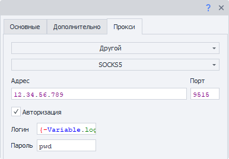

:::info **Пожалуйста, ознакомьтесь с [*Правилами использования материалов на данном ресурсе*](../Disclaimer).**
:::

> 🔗 **[Оригинальная страница](https://zennolab.atlassian.net/wiki/spaces/RU/pages/735576144)** — Источник данного материала

_______________________________________________  
# Принять почту

## Описание

Работа с почтовыми аккаунтами не используя окно браузера. Позволяет найти нужное письмо и информацию в нём. Подходит для массовой обработки входящей корреспонденции.

## Как добавить действие в проект?

Через контекстное меню **Добавить действие** → **Работа с почтой** → **Принять почту**

Либо воспользуйтесь [❗→ умным поиском](https://zennolab.atlassian.net/wiki/spaces/RU/pages/506200090/ProjectMaker+7#%D0%A3%D0%BC%D0%BD%D1%8B%D0%B9-%D0%BF%D0%BE%D0%B8%D1%81%D0%BA-%D0%B4%D0%B5%D0%B9%D1%81%D1%82%D0%B2%D0%B8%D0%B9 "https://zennolab.atlassian.net/wiki/spaces/RU/pages/506200090/ProjectMaker+7#%D0%A3%D0%BC%D0%BD%D1%8B%D0%B9-%D0%BF%D0%BE%D0%B8%D1%81%D0%BA-%D0%B4%D0%B5%D0%B9%D1%81%D1%82%D0%B2%D0%B8%D0%B9").

## Для чего это используется?

- Быстрый доступ к письмам
- Получения данных из письма
- Активация учетных записей на сайтах
- Удаление нужных писем из ящика
- Удаление загруженных писем

## Как работать с экшеном?

:::note На заметку
Перед работой с экшеном убедитесь, что в вашей учетной записи активирована опция работы через Imap.
:::

### Вкладка “Основные”

#### Расширенный вид

При клике по данной кнопке откроется окно [❗→ Обработки почты](https://zennolab.atlassian.net/wiki/spaces/RU/pages/534086094/e-mail "https://zennolab.atlassian.net/wiki/spaces/RU/pages/534086094/e-mail").

#### Email

Адрес электронного ящика.

#### Пароль

Пароль от электронного ящика.

  

#### Настройки подключения

##### **Автоопределение настроек**

При включении данной настройки ZennoPoster автоматически подберёт параметры для соединения с почтовым сервером.

:::warning Внимание
Работает не со всеми почтовыми провайдерами.
:::

##### **Сервер, Порт, Имя пользователя, Использовать SSL, Протокол**

Все эти параметры надо уточнять в документации выбранного почтового провайдера

  

#### Как искать письмо

##### **Каталоги Imap**

Здесь Вы можете выбрать папки в электронной почте, в которых будет производиться поиск письма.

С помощью кнопки, которая находится правее поля с выбранными каталогами, можно обновить список папок.

##### **Рег. выр. (Регулярное выражение)**

В данное поле необходимо внести [❗→ регулярное выражение](https://zennolab.atlassian.net/wiki/spaces/RU/pages/534086111 "https://zennolab.atlassian.net/wiki/spaces/RU/pages/534086111"), согласно которому будет происходить поиск письма в ящике.

##### **Интервалы загрузки писем**

Письма от сервисов могут приходить с задержкой, для этого указываем промежуток времени в секундах и количество попыток скачивания списка писем. Разделитель “**;**“ на скриншоте указывает на количество попыток. Первая через *15 сек, вторая - *30 сек, третья - *60 сек.

##### **Из каталога загружать не более писем**

Указываем количество писем, которые будут загружены.

##### **Удалять найденное письмо**

Если включена данная настройка, то найденное письмо будет удалено из ящика после обработки.

  

#### Поиск текста в письме

Можно сохранять результат работы сразу нескольких регулярных выражений!
Например, в письме есть активационный код, адрес сайта, номер телефона, имя и фамилия - всё это Вы можете достать за одно действие! Достаточно под каждый элемент составить регулярное выражение и добавить переменные, в которые будет сохранён результат работы.

##### **Регулярное выражение**

Тут надо ввести регулярное выражение для поиска нужного текст.

##### **№ совпадения**

Часто по одному [❗→ регулярному выражению](https://zennolab.atlassian.net/wiki/spaces/RU/pages/534086111 "https://zennolab.atlassian.net/wiki/spaces/RU/pages/534086111") может быть сразу несколько результатов. Тут отображается порядковый номер найденного элемента (нумерация с нуля!).

:::warning Внимание
Не рекомендуется в своих проекта привязываться к номеру совпадения. Т.к. сегодня письмо имеет одну структуру и нужная ссылка вторая, завтра текст письма изменится и нужная ссылка будет уже 7-я.Старайтесь подбирать регулярное выражение таким образом, чтоб в результате его работы оставалось только одно совпадение.
:::

##### **Сохранить в переменную**

В этой колонке Вы должны выбрать существующую или создать новую переменную, куда будет сохранён результат работы регулярки.

  

#### Сохранить ошибку в переменную

Если во время работы экшена возникнет ошибка, то Вы можете сохранить её текст включив данную настройку и выбрав (или создав) переменную, в которую запишется текст.

  

### Вкладка “Прокси”

### Без прокси

Работа экшена происходит используя реальный ip компьютера\сервера.

### Текущий прокси проекта

Используется [❗→ установленный в проекте прокси](https://zennolab.atlassian.net/wiki/spaces/RU/pages/489324572#%D0%A3%D1%81%D1%82%D0%B0%D0%BD%D0%BE%D0%B2%D0%B8%D1%82%D1%8C-%D0%BF%D1%80%D0%BE%D0%BA%D1%81%D0%B8 "https://zennolab.atlassian.net/wiki/spaces/RU/pages/489324572#%D0%A3%D1%81%D1%82%D0%B0%D0%BD%D0%BE%D0%B2%D0%B8%D1%82%D1%8C-%D0%BF%D1%80%D0%BE%D0%BA%D1%81%D0%B8").

### Строка формата

Указываем прокси в формате (можно указать [❗→ переменную](https://zennolab.atlassian.net/wiki/spaces/RU/pages/486309922 "https://zennolab.atlassian.net/wiki/spaces/RU/pages/486309922")):  
a) *С авторизацией* - `socks5://логин:пароль@ip:port` или `http://логин:пароль@ip:port`  
b) *Без авторизации* - `socks5://ip:port` или `http://ip:port`  
c) *Без указания протокола (по умолчанию будет использован http://)*- `логин:пароль@ip:port` или `ip:port`  

### Другой

Выбираем если необходимо указать детальные настройки прокси. Тип прокси, данные авторизации, адрес и порт. Информацию уточняйте у своего поставщика услуг.

:::note На заметку
Во всех полях ввода можно использовать переменные.
:::

:::warning Внимание
Если не указан протокол прокси, то по умолчанию будет использоваться http://
:::

  

## Пример использования

После регистрации на сайте нам нужно подтвердить свою учетную запись перейдя в почту, получить ссылку для активации аккаунта и перейти по ней для подтверждения своего аккаунта.

1. Регистрируемся на сайте.  
2. Добавляем экшен *Принять почту* в проект и настраиваем.  
3. Получаем ссылку активации из нужного письма.  
4. Переходим по ссылке.  
5. Наш аккаунт активирован.  

При массовых действиях на сайтах работа без браузера экономит время и ресурсы. Проект не будет загружать сайт почтового сервиса. Таким образом, экшен позволит быстро обрабатывать информацию в почтовых ящиках.

  

## Полезные ссылки

1. [❗→ Обработка e-mail](https://zennolab.atlassian.net/wiki/spaces/RU/pages/534086094/e-mail "https://zennolab.atlassian.net/wiki/spaces/RU/pages/534086094/e-mail")
2. [❗→ Тестер регулярных выражений](https://zennolab.atlassian.net/wiki/spaces/RU/pages/534086111 "https://zennolab.atlassian.net/wiki/spaces/RU/pages/534086111")