---
sidebar_position: 14
title: "Плагины"
description: ""
date: "2025-08-04"
converted: true
originalFile: "Плагины.txt"
targetUrl: "https://zennolab.atlassian.net/wiki/spaces/RU/pages/475365697"
---
import DisclaimerNotice from '@site/src/components/DisclaimerNotice';

<DisclaimerNotice />

> 🔗 **[Оригинальная страница](https://zennolab.atlassian.net/wiki/spaces/RU/pages/475365697)** — Источник данного материала

_______________________________________________  
## Описание
Плагинами называются экшены, которые созданы пользователем. По сути — это шаблоны с [интерфейсом бота (BotUI)](/zennoposter/ProjectMaker/Project-editor/Actions-in-ProjectMaker-Actions-Blocks/Project/BotUI_Bot_Interface), сохранённые особым образом.  

Плагины имеют расширение `.zpg` и могут возвращать результат своей работы. 

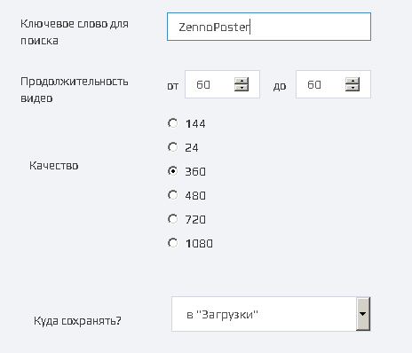

> *Каждое поле ввода поддерживает [макросы переменных](/zennoposter/ProjectMaker/Project-editor/Actions-in-ProjectMaker-Actions-Blocks/Data/Variable_Processing).*

Плагины похожи на [проект в проекте](/zennoposter/ProjectMaker/Project-editor/Actions-in-ProjectMaker-Actions-Blocks/Project/Project_in_Project_Nested_Projects), но они удобнее по следующим причинам:
- **создание интерфейса** для передачи в него значений. В отличие от «проекта в проекте», плагины избавляют от ручного сопоставления переменных и необходимости постоянно заглядывать в подшаблон, чтобы вспомнить их назначение.  
- **глобальная доступность и стабильность**. Плагины интегрируются в ProjectMaker как стандартные кубики. Вам не нужно прописывать пути к файлам, а проекты не «ломаются» при перемещении или переименовании компонентов на диске.
- **выгодная монетизация**. Количество плагинов не влияет на стоимость размещения ($12 за весь проект). Это гораздо выгоднее классической схемы с вложенными проектами, где каждый подшаблон увеличивает конечную цену.

### Область применения
В плагин можно упаковать любые повторяющиеся действия:  
#### Поиск видео на YouTube и сохранение ссылок  
Представьте, что у вас для этого уже есть группа экшенов (или даже отдельный шаблон). Для добавления этого функционала в другой шаблон приходится либо подключать **Проект в проекте**, либо копировать экшены и вставлять в нужном месте.  

Метод «скопировать и вставить» кажется удобным, но не для повторения большого количества раз в разных местах шаблона. Любое изменение в логике поиска превращается в ад — вам придется вручную править каждый экземпляр.  

Плагин же позволяет внести правку в одном месте. Вы обновляете его, и изменения мгновенно вступают в силу везде, где он используется.  

#### Отправка оповещений в мессенджерах и соц.сетях  
Если вы отправляете *только текст*, то будет достаточно одного экшена с запросом [GET](./Http/GET-request) или [POST](./Http/POST-request).  

Но когда понадобится отправлять форматированный текст, добавлять к нему картинки, аудио файлы и другие вложения, то это повод задуматься об упаковке всех дополнительных экшенов, связанных с этим, в плагин.

#### Получение случайной строки из указанного текстового файла 
Обычно для этого требуется выстроить серию из как минимум трех экшенов:  
- **Подготовка данных**: создать отдельный список, проверить физическое наличие нужного файла на диске и привязать его к этому списку.  
- **Извлечение**: получить случайную строку.  
- **Форматирование** (опционально): перевести текст в верхний или нижний регистр, либо жестко обрезать строку, например, до 80 символов.  

Вместо того чтобы собирать эту громоздкую конструкцию каждый раз заново, вы можете упаковать весь алгоритм в единый плагин.

#### Любой шаблон можно сделать плагином  
:::tip Возможности безграничны — всё зависит от вашей фантазии.
::: 

### Как добавить плагины в проект?
- Через контекстное меню: **Добавить действие** → **Local Plugins**
- В самом низу **Окна действия**
- Либо с помощью **Умного поиска**

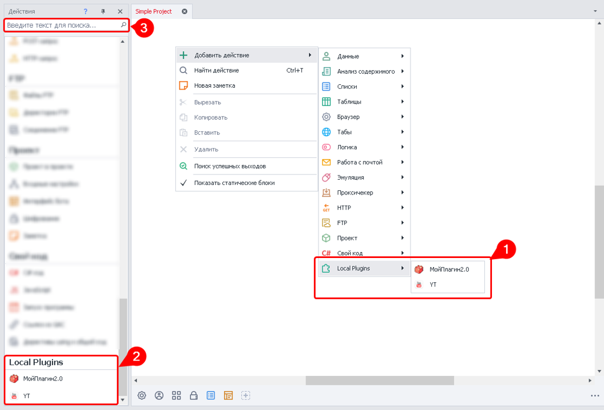
_______________________________________________ 
## Установка плагинов
Существует несколько способов установки готовых плагинов:
#### Двойной клик по файлу плагина  
Самый простой способ. Если плагин с таким же именем файла уже был ранее установлен, то появится диалоговое окно с предложением заменить его.  

Во время первой установки вы увидите окно, сообщающее об успехе.  

#### Добавление через [настройки](/zennoposter/ProjectMaker/ProjectMaker%20Settings/Settings_Plugins)  
Преимуществом данного метода является то, что можно выделить сразу несколько файлов и установить их все сразу.  

Если попытаться добавить плагин имя которого совпадает с уже установленным, то появится окно с перечислением плагинов, которые не удалось установить.  

После добавления плагины сразу же готовы к работе.

#### Копирование в локальную директорию на компьютере  
> *по умолчанию это `C:\Users\[имя_пользователя]\Documents\ZennoLab\Plugins\Local`*  

После копирования необходимо перезагрузить ProjectMaker.

## Удаление плагинов
#### Через [настройки](/zennoposter/ProjectMaker/ProjectMaker%20Settings/Settings_Plugins)

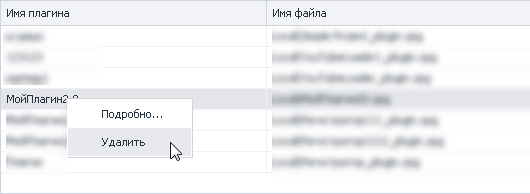

#### Удаление из локальной директории на компьютере 
По завершению требуется перезагрузить ProjectMaker.
_______________________________________________ 

> Работа с пользовательскими плагинами практически ничем не отличается от работы со стандартными экшенами — добавляете плагин в проект и заполняете входящие настройки.
  
## Сохранение шаблона как плагина
Существует несколько способов сохранение шаблона в виде плагина:  

### Через верхнее меню  
**Файл → Сохранить проект как плагин**  

### Через публикацию проекта
**В верхнем меню → Файл → Опубликовать проект** (либо комбинация `Ctrl`+`Alt`+`P`). 

| 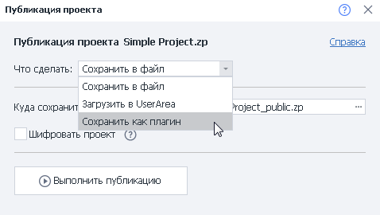    |
| -------- | 
| **В появившемся окне → Что сделать → Сохранить как плагин**  |

### Через контекстное меню
Кликаем ПКМ по нужной вкладке в окне с проектами и выбираем **Сохранить проект как плагин**:

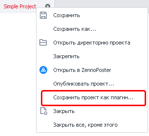
_______________________________________________ 
## Настройки сохранения
### Главное окно
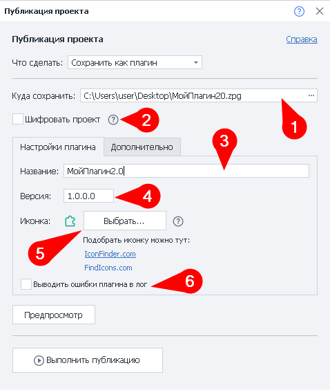

:::tip Всплывающая подсказка по настройке
Появляется при наведении курсора мыши на поле ввода или его название.
:::

#### **Куда сохранять**
Выбираем место на компьютере, куда сохранится файл плагина.

:::info Директория установленных плагинов
Туда будет скопирован файл при установке плагина в программу.
:::

#### **Шифровать проект**
Эта опция позволяет зашифровать весь файл с проектом. Если включено встраивание внешних библиотек, они так же будут зашифрованы.

:::warning Не шифруйте свои плагины при продаже
Так как их повторное шифрование невозможно. То есть, вы не сможете перепродать плагин, который купили сами.
:::

#### **Название**
Задаём название для плагина, с которым он будет отображаться в ProjectMaker. 

:::tip Программа позволяет сохранять плагины с одинаковыми именами
Однако мы рекомендуем придумывать уникальные имена во избежание путаницы.
:::

#### **Версия**
Присваиваем плагину подходящую версию.

#### **Иконка**
Загружаем иконку для своего плагина. Так его будет проще визуально отличить среди других экшенов. 

:::info Поддерживаемые форматы
- `png`  
- `ico` 
- `bmp`  

**Размеры**: от **16х16** до **128х128**
:::

#### **Выводить ошибки плагина в лог**
При включении этой опции в логе будет отображаться текст ошибки, которая помешала шаблону завершиться. Например — *`Не найден HTML элемент по условиям поиска`*.  

Иначе вы будете видеть только сообщение: *`Ошибка при обработке плагина`*.

### Вкладка «Дополнительно»  
> Данную вкладку нужно заполнять при продаже или передаче плагина другим людям.

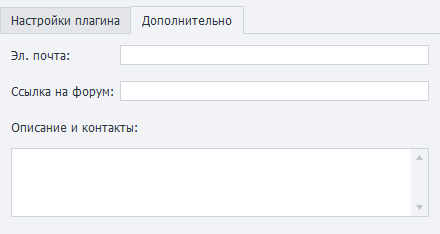

Тут вы указываете свой email и другие способы связи, добавляете описание плагина, а так же ссылку на тему по плагину на форуме http://zennolab.com. 

:::tip Для прикрепления плагина в тему
Сначала создайте её на форуме, а затем через редактирование добавьте сам плагин после его публикации.
:::

#### Предпросмотр и публикация
Перед сохранением плагина можно через **Предпросмотр** оценить, как будет выглядеть его описание.

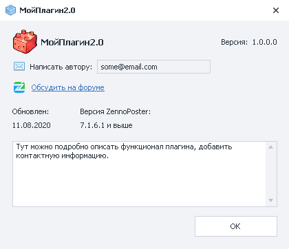

После клика по кнопке **Выполнить публикацию** начнётся проверка и сборка проекта в плагин. Если в процессе сборки не возникнет ошибок, то появятся две новые кнопки: 

- **Открыть папку с плагином**
- **Добавить в ProjectMaker**

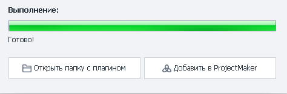
_______________________________________________ 
## Входящие настройки плагина
Входящие настройки для плагинов создаются с использованием [BotUI](./Project/BotUI_Bot_Interface). При этом есть несколько дополнительных функций — это **Mapper** и **возвращаемое значение**.

### Mapper
Этот инструмент позволяет передавать в плагин из основного шаблона [Списки](./Lists/List_Operations), [Таблицы](./Tables/Operations_on_Tables) или [Google таблицы](./Tables/Operations_on_Google_Sheets).

:::warning Изменения внесённые внутри плагина в список/таблицу
Также повлияют и на основной шаблон.
:::

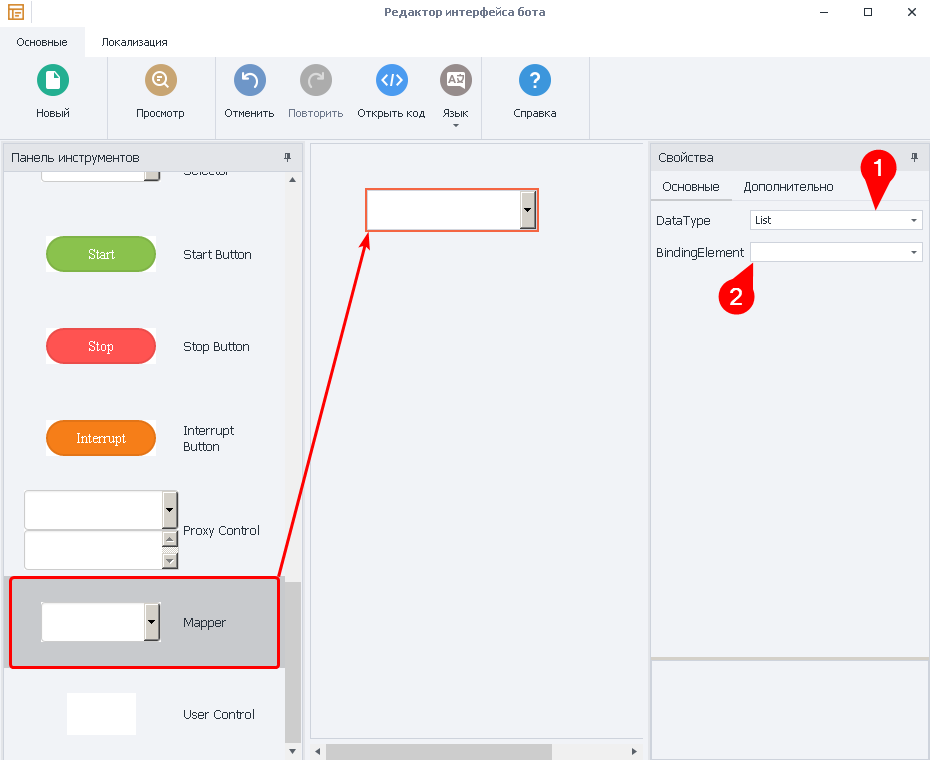

**Mapper** находится в самом низу **Панели инструментов**. Перетаскивайте его на пустое поле справа и настраивайте следующие параметры:

#### DataType
> *Тип передаваемого объекта*  

Возможные значения:
- [List (список)](./Lists/List_Operations)
- [Table (простая таблица)](./Tables/Operations_on_Tables)
- [GoogleSpreadsheet (Google таблица)](./Tables/Operations_on_Google_Sheets)

#### BindingElement  
Это внутренний объект (список или таблица), в который будут попадать данные из внешнего шаблона. Указанный объект уже должен существовать на момент создания настроек.

| Теперь мы можем с лёгкостью передать список в плагин:    |
| -------- | 
| 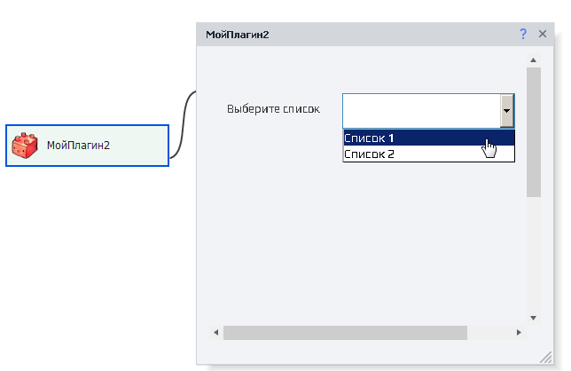  |

### Возвращаемое значение
Плагин может возвращать результат своей работы. Для включения этой возможности необходимо в основном окне **Редактора интерфейса** кликнуть в любом пустом месте и затем справа отметить чекбокс **Возвращать значение**:

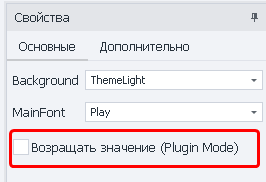

Существует несколько типов возвращаемых значений:

1. [Переменная или несколько переменных](/zennoposter/ProjectMaker/Project-editor/Actions-in-ProjectMaker-Actions-Blocks/Data/Variable_Processing)
2. [Список](./Lists/List_Operations)
3. [Таблица](./Tables/Operations_on_Tables)  
> *Дополнительно можно придумать описание для каждой переменной для удобства использования другими людьми.*

| Вид настроек при <ins>создании</ins> плагина   |         Вид настроек при <ins>использовании</ins> плагина             |
| -------- | -------- | 
| 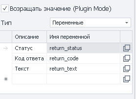  |        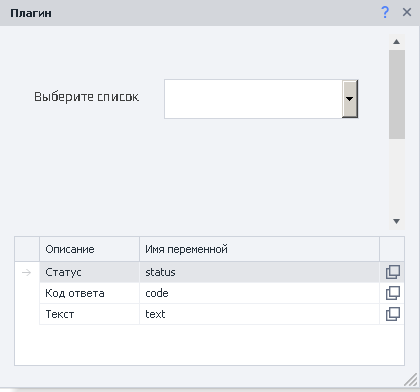           |

Для любого типа возвращаемого значения нужно назначить внутренний объект, который будет служить для него хранилищем.
_______________________________________________ 
## Пользовательские плагины с [нашего форума](https://zenno.club/discussion/)

:::warning Не запускайте плагины из ненадёжных источников
Они могут нанести вред вашему компьютеру!
:::

С открытым исходным кодом:

- [FindPhraseOrExc](https://zennolab.com/discussion/threads/plugin-uluchshenie-dejstvija-sozdat-proverku-nalichija-vydelennogo-teksta-plagin-findphraseorexc.57861/ "https://zennolab.com/discussion/threads/plugin-uluchshenie-dejstvija-sozdat-proverku-nalichija-vydelennogo-teksta-plagin-findphraseorexc.57861/")
- [Диалоговое окно](https://zennolab.com/discussion/threads/plugin-dialogovoe-okno.54849/ "https://zennolab.com/discussion/threads/plugin-dialogovoe-okno.54849/")

С закрытым кодом:

- [Плагин отправки уведомлений в Telegram](https://zennolab.com/discussion/threads/otlov-oshibok-shablona-s-momentalnym-opovescheniem-v-telegram.46438/page-5#post-492430 "https://zennolab.com/discussion/threads/otlov-oshibok-shablona-s-momentalnym-opovescheniem-v-telegram.46438/page-5#post-492430")
- [Свой кубик для лога.](https://zennolab.com/discussion/threads/plugin-projectmaker-svoj-kubik-dlja-loga.70497/ "https://zennolab.com/discussion/threads/plugin-projectmaker-svoj-kubik-dlja-loga.70497/")
- [Ошибки шаблона, с моментальным оповещением в telegram](https://zennolab.com/discussion/threads/plugin-oshibki-shablona-s-momentalnym-opovescheniem-v-telegram.72596/ "https://zennolab.com/discussion/threads/plugin-oshibki-shablona-s-momentalnym-opovescheniem-v-telegram.72596/")

  
_______________________________________________ 
## Полезные ссылки

- [❗→ Интерфейс бота BotUI](https://zennolab.atlassian.net/wiki/spaces/RU/pages/492175377 "https://zennolab.atlassian.net/wiki/spaces/RU/pages/492175377")
- [❗→ Работа с переменными](https://zennolab.atlassian.net/wiki/spaces/RU/pages/486309922 "https://zennolab.atlassian.net/wiki/spaces/RU/pages/486309922")
- [❗→ Проект в проекте (Вложенные проекты)](https://zennolab.atlassian.net/wiki/spaces/RU/pages/489291822 "https://zennolab.atlassian.net/wiki/spaces/RU/pages/489291822")
- [❗→ Продажа ботов с плагинами](https://zennolab.atlassian.net/wiki/spaces/RU/pages/494895200 "https://zennolab.atlassian.net/wiki/spaces/RU/pages/494895200")
- [❗→ Окно действий](https://zennolab.atlassian.net/wiki/spaces/RU/pages/727777324 "https://zennolab.atlassian.net/wiki/spaces/RU/pages/727777324")
- [❗→ Список](https://zennolab.atlassian.net/wiki/spaces/RU/pages/534053375 "https://zennolab.atlassian.net/wiki/spaces/RU/pages/534053375")
- [❗→ Таблица](https://zennolab.atlassian.net/wiki/spaces/RU/pages/735903776 "https://zennolab.atlassian.net/wiki/spaces/RU/pages/735903776")
- [❗→ Google таблицы (PM)](https://zennolab.atlassian.net/wiki/spaces/RU/pages/735576090 "https://zennolab.atlassian.net/wiki/spaces/RU/pages/735576090")
