---
sidebar_position: 2
title: "Входные настройки"
description: ""
date: "2025-08-04"
converted: true
originalFile: "Входные настройки.txt"
targetUrl: "https://zennolab.atlassian.net/wiki/spaces/RU/pages/492339208"
---
import DisclaimerNotice from '@site/src/components/DisclaimerNotice';

<DisclaimerNotice />

> 🔗 **[Оригинальная страница](https://zennolab.atlassian.net/wiki/spaces/RU/pages/492339208)** — Источник данного материала

_______________________________________________  
## Описание
С помощью входных настроек можно задать необходимые значения для корректного запуска проекта.  

:::warning **Входные настройки считываются только при старте!**
Их изменение во время выполнения проекта не будет применено до следующего запуска.
:::  

### Как добавить «Входные настройки» в проект?  
Через контекстное меню: **Добавить действие → Проект → Входные настройки**.  

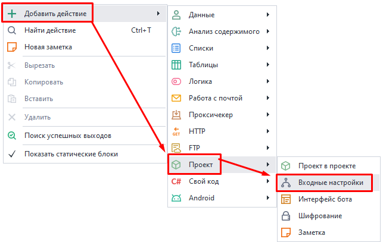  

Или через ***Панель статических блоков***:  

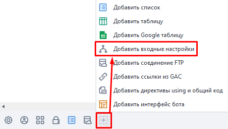    

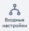 На панели появится соответствующая иконка.  

:::info **Данный блок настроек не совместим с *Интерфейсом бота*.**
Так что при добавлении одного, другой сразу удаляется из проекта. Будьте внимательны и предварительно сохраняйте настройки.  

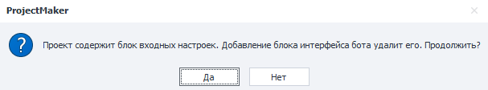
:::  
_______________________________________________
## Редактирование входных параметров.  
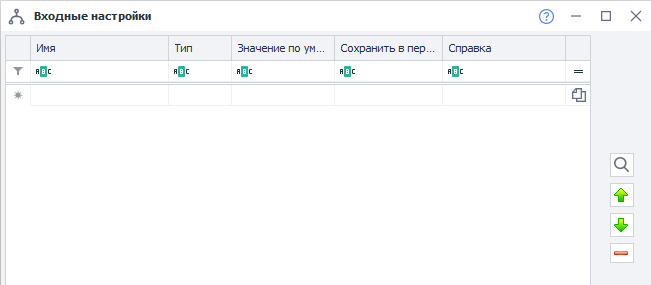 

### Доступные поля:  
#### Имя.  
Здесь задаем название для создаваемой настройки.  

#### Тип.  
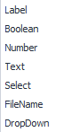 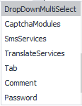 

Поддерживаются разные типы данных. Они определяют, какую информацию сможет внести пользователь, а также вид отображаемой настройки.  

Ниже, в отдельной секции, мы рассмотрим каждый из них подробнее.  

#### Значение по умолчанию.  
Начальное значение параметра. При старте проекта оно также будет находиться в ***переменной проекта***.  

#### Сохранить в переменную.  
Имя переменной, в которую запишется указанное значение.  

#### Справка.  
Справочное пояснение для настройки в виде всплывающей подсказки.  

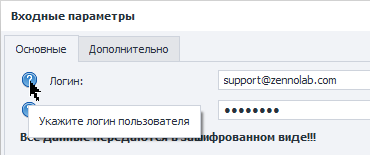  
_______________________________________________
### Кнопки справа.  
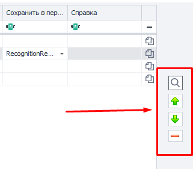  

#### Предварительный просмотр.   
Значок «Лупы» позволяет в любой момент посмотреть на то, как будут выглядеть созданные настройки.  

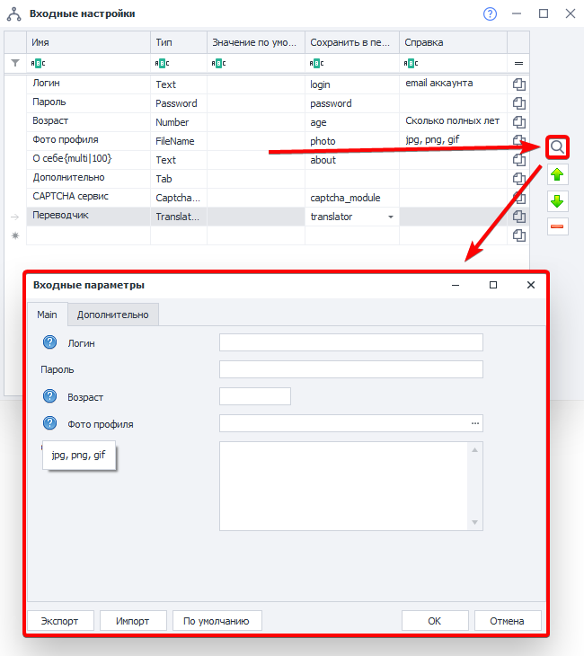  

#### Перемещение настроек вверх и вниз.  
Для того, чтобы переместить настройку выше или ниже по списку её надо выделить и перемещать с помощью стрелочек.  

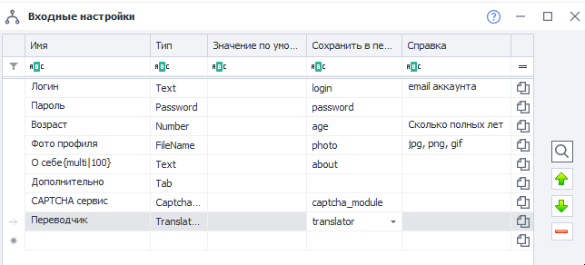  

#### Удаление настройки.  
Для удаления надо выделить настройку и нажать на минус.  

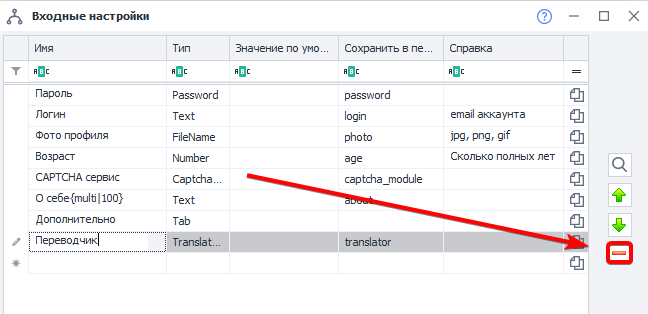  

#### Скопировать макрос переменной.  
Для того, чтобы скопировать макрос в буфер обмена, надо кликнуть по значку файлика справа.  

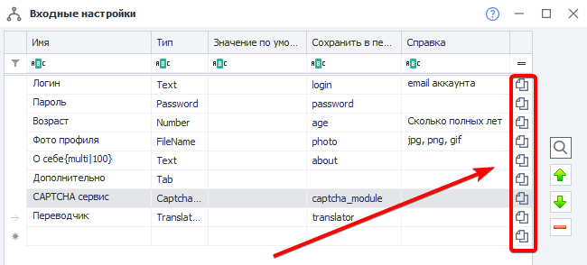 
_______________________________________________
### Кнопки предварительного просмотра.  
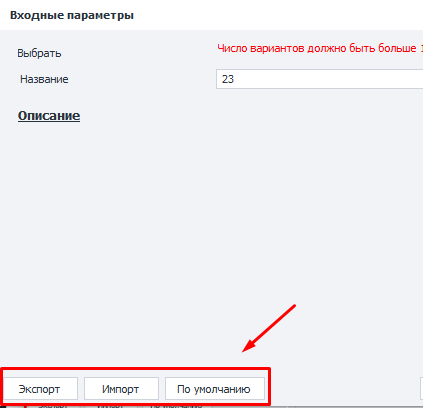  

#### Экспорт.
Позволяет сохранить текущие настройки в файл.  

#### Импорт.  
Дает возможность загрузить из файла настройки, которые были сохранены ранее.  

#### По умолчанию.  
Сбрасывает настройки до значений, выставленных по умолчанию.  
_______________________________________________
## Доступные типы параметров.  
### Label.  
Заголовок. Используется для визуального разделения логических секций.  

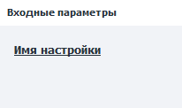  
_______________________________________________
### Boolean.  
Чекбокс (галочка). Либо она есть, либо ее нет (значения True или False).  

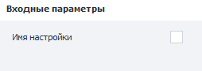  
_______________________________________________
### Number.  
Поле с указанием целого числа.  

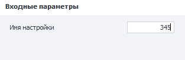  
_______________________________________________
### Text.  
Текстовое поле.  
#### Однострочный текст.  
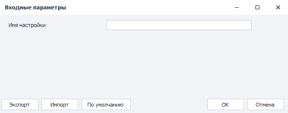  

Используется по умолчанию.  

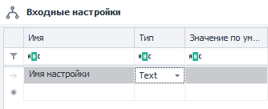  

#### Многострочный текст.  
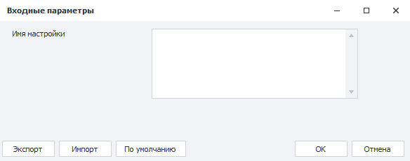  

Чтобы вставить многострочный текст, нужно указать в имени дополнительную установку: `{multi|height}`, где `height` — это высота поля в пикселях.  

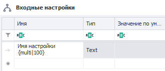  
_______________________________________________
### Select.  
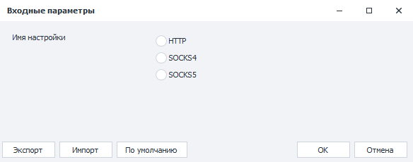  

Группа кнопок, представляющая собой выбор из нескольких вариантов. Вам нужно указать в имени параметра все возможные варианты, например: `{HTTP|SOCKS4|SOCKS5}`.  

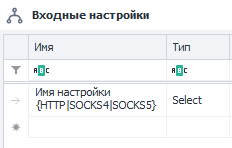  
_______________________________________________
### FileName.  
Поле ввода для указания пути к файлу или директории в файловой системе. Можно прописать вручную, либо выбрать через окно выбора файлов, кликнув по кнопке […].  

**Доступные варианты:**  
#### Открыть файл.  
Открывается окно выбора существующего файла. Поведение этого поля по умолчанию.   

| 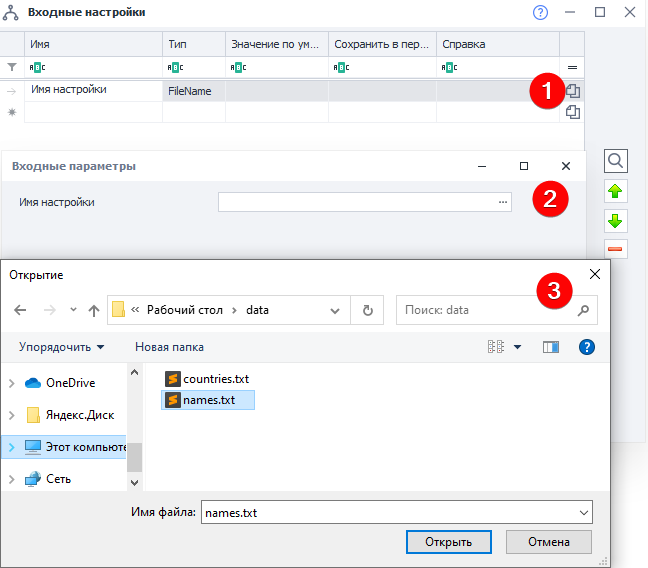 |
| :--: |
| **Редактор настроек (1) → Окно для пользователя (2) → Диалоговое окно для выбора файла в Windows 10 (3)** |

#### Сохранить файл.  
Сохраняет результат работы в файл. Для вызова нужно добавить к имени настройки конструкцию `{save}`  

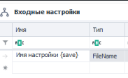

:::info **Можно сохранить даже в файл, которого еще не существует.**  
В то время как опция «Открыть файл» работает только с существующим файлом.
:::  

#### Путь к директории.  
Для работы с директорией нужно к имени параметра добавить `{folder}`  

| 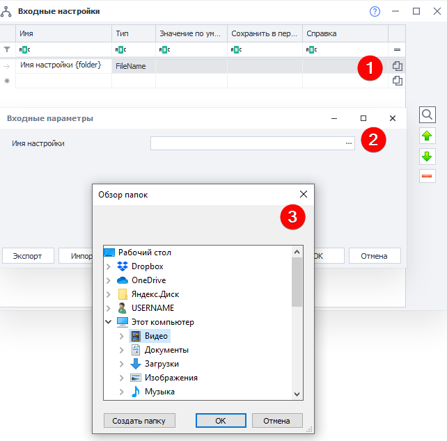 |
| :--: |
| **Редактор настроек (1) → Окно для пользователя (2) → Диалоговое окно для выбора директории (3)** |
_______________________________________________
### Dropdown.  
Выпадающий список с выбором значения. Доступно 2 опции:  
#### Отображать элементы «Как есть».  
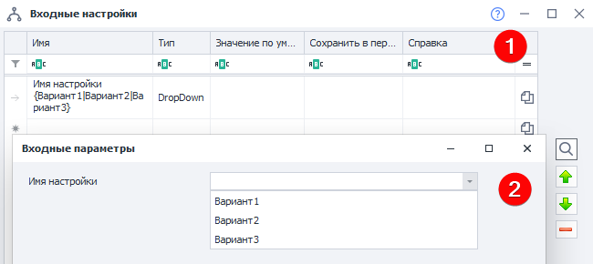  

Варианты в выпадающем списке будут отображены как и в редакторе настроек.  
Синтаксис такой: `Имя настройки {Вариант1|Вариант2|Вариант3}`.  

#### Именованные элементы.  
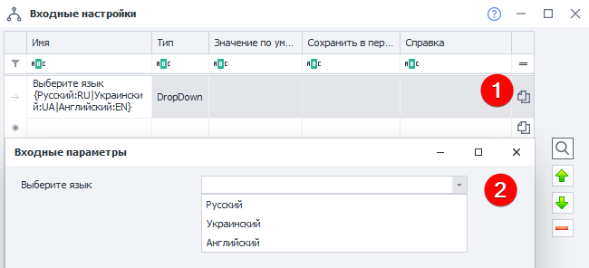  

Синтаксис: `Имя настройки {Вариант1:Значение1|Вариант2:Значение2|Вариант3:Значение3}`.  
`Вариант` — это настройка, которая видна пользователю.  
`Значение` — то, что сохранится в переменную.  
_______________________________________________
### DropDownMultiSelect.  
Выпадающий список с множественным выбором значений. Позволяет выбрать чекбоксами несколько значений одновременно.  

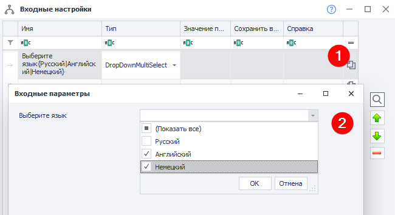  

В поле **Значения по умолчанию** можно прописать несколько значений через запятую.  
Синтаксис такой же как и у типа DropDown. Если выбрано несколько вариантов, то в переменную они сохранятся через запятую.  
:::info **Только элементы «Как есть» — *Именованные* значения не поддерживаются**
:::  
_______________________________________________
### CaptchaModules.  
Выбор сервиса для решения капчи из списка доступных.  

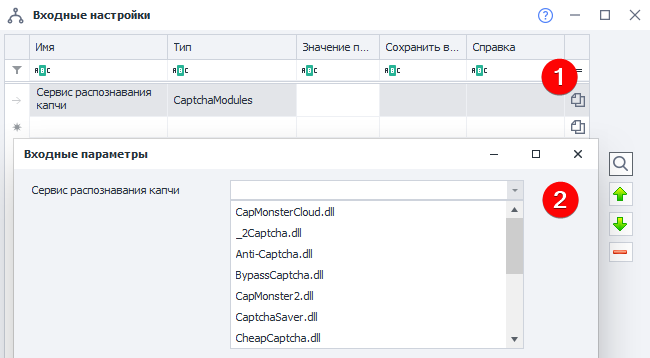  
_______________________________________________
### SmsServices.  
Выбор сервиса для приёма SMS из списка доступных.  

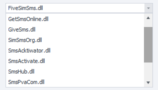  
_______________________________________________
### TranslateServices.  
Выбор сервиса для ***перевода текста*** из списка доступных.  

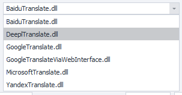  
_______________________________________________
### Tab.  
Добавление ещё одной вкладки в окно настроек. Например, можно разделить «Основные» и «Дополнительные настройки» по вкладкам.  

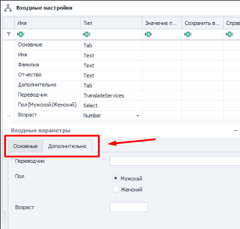  
_______________________________________________
### Comment.  
Поле, позволяющее вставлять текст во всю ширину окна настроек. Может использоваться как описание или комментарий к другим настройкам.  

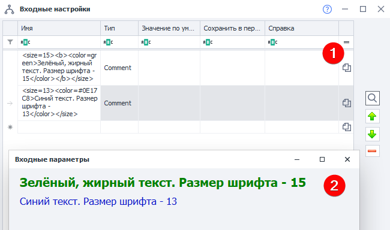  

Отображаемый текст в этом поле можно форматировать. Поддерживаемые теги:  
| Свойство | Синтаксис |
| -------- | ------- |
| Жирный текст  | `<b>Текст</b>`  |
| Цвет шрифта | `<color=red>Красный цвет шрифта</color>`  |
| Размер букв| `<size=6>Размер текста</size>`    |  

:::tip **Пример со скриншота выше.**  
- **Первая строка:** *`<size=15><b><color=green>Зелёный, жирный текст. Размер шрифта - 15</color></b></size>`*  
- **Вторая строка:** *`<size=13><color=#0E17C8>Синий текст. Размер шрифта - 13</color></size>`*
:::  
_______________________________________________
### Password.  
Данные, которые сюда вводятся, скрываются от просмотра. Но в самом проекте будут видны!  

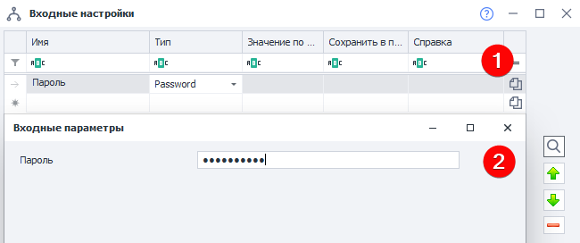   
_______________________________________________ 
:::info **Символы Unicode.**  
Во всех полях можно использовать Unicode символы. Пример — ± ♻ 📞 💙 🚢.  
Хоть браузер и отображает их цветным, в настройках самой программы они черно-белые.
:::
_______________________________________________
## Обзор входных настроек в ZennoPoster.  
Открыть входные настройки в ZD можно нажатием **ПКМ по проекту в списке → Настройки**. Или дважды кликнуть по нему:  

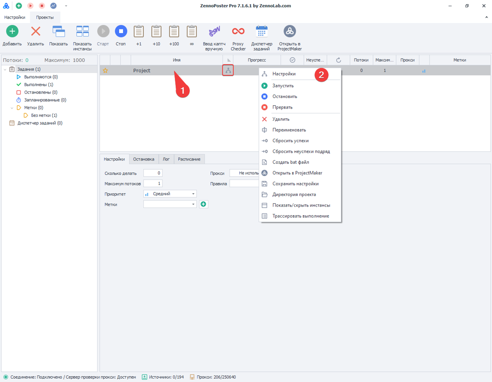

| Получился вот такой простой и понятный интерфейс входных настроек. Теперь можно передавать проект другому пользователю. |
| :--: |
| 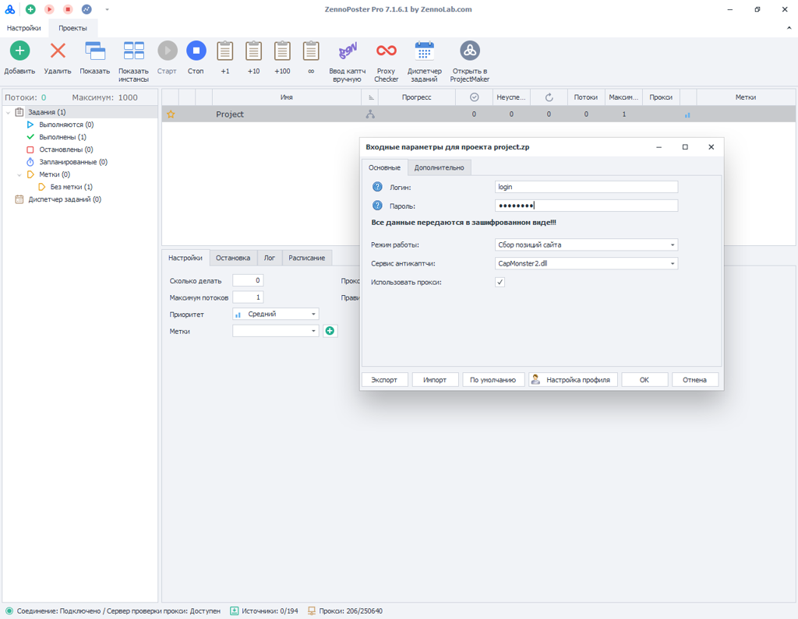 |

_______________________________________________