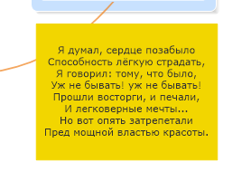
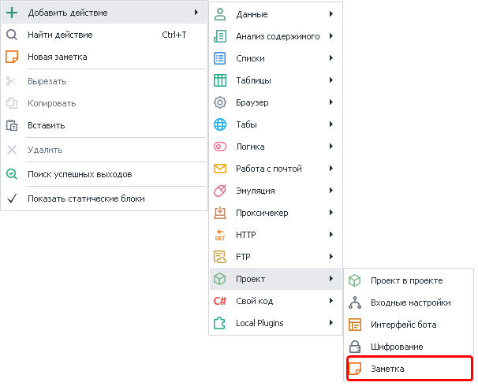
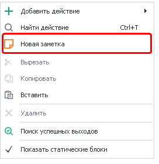
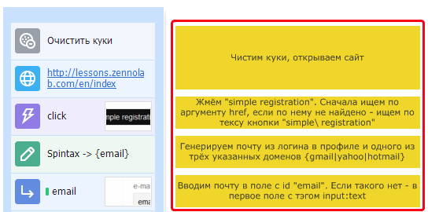
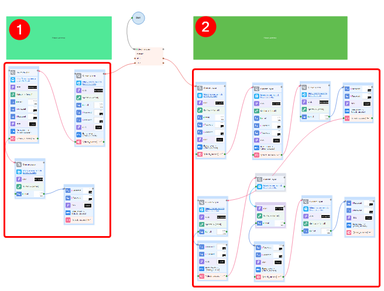
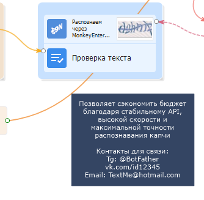
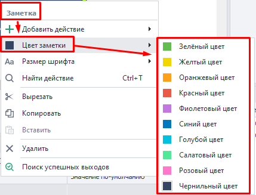
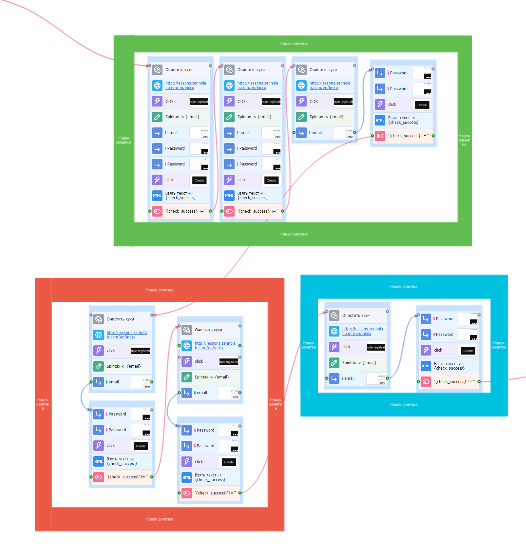
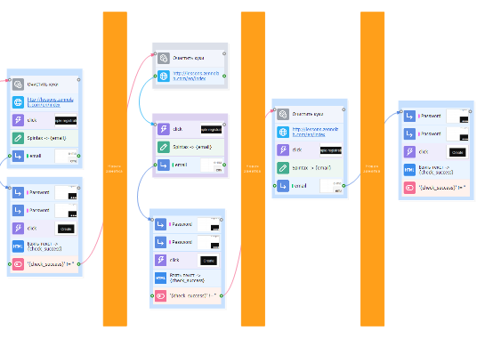

---
sidebar_position: 5
title: "Заметки в проекте"
description: ""
date: "2025-08-04"
converted: true
originalFile: "Заметки в проекте.txt"
targetUrl: "https://zennolab.atlassian.net/wiki/spaces/RU/pages/534020312"
---
import DisclaimerNotice from '@site/src/components/DisclaimerNotice';

<DisclaimerNotice />

> 🔗 **[Оригинальная страница](https://zennolab.atlassian.net/wiki/spaces/RU/pages/534020312)** — Источник данного материала

_______________________________________________  
## Описание
**Заметка** выглядит как отдельный блок с цветной заливкой, на котором можно оставить многострочный комментарий. Подобно бумажным стикерам, которые вы клеите в офисе или на холодильнике.

### Как добавить действие в проект?
Через контекстное меню: **Добавить действие → Проект → Заметка**:  

  

Или **ПКМ по холсту → Новая заметка**:  

 
_______________________________________________
## Примеры использования
### Развёрнутое описание конкретного экшена.  
   

Иногда есть необходимость подробно описать свои действия, так как с первого взгляда это может быть не очевидно. Внутренний комментарий в теле экшена ограничен всего несколькими словами. Поэтом на помощь приходят Заметки.  
_______________________________________________
### Комментирование сразу большого числа экшенов. 

Бывает, что проект разростается до огромных размеров, и уже тяжело визуально в нем ориентироваться. Например, на скриншоте выше есть два отдельных древа экшенов, а сверху над ними зеленые заметки с кратким описанием.  
_______________________________________________
### Передача шаблона другим людям.  
    

Если вы хотите поделиться своим проектом с кем-то еще, то Заметки могут содержать полезные данные или ваши контакты. Их использование ограничено только вашей фантазией.  
_______________________________________________ 
:::info **Различные примеры использования также доступны в тестовых проектах на *[Стартовой странице](/zennoposter/ProjectMaker/Start_Page)*.**
::: 
_______________________________________________  
## Настройки.  
Нажмите ПКМ по заметке, чтобы изменить ее внешний вид.

### Цвет заметки

### Размер шрифта
> *По умолчанию установлен размер **8***  

_______________________________________________ 
## Примеры оформления
> Заметками можно визуально отделять разные логические блоки друг от друга

