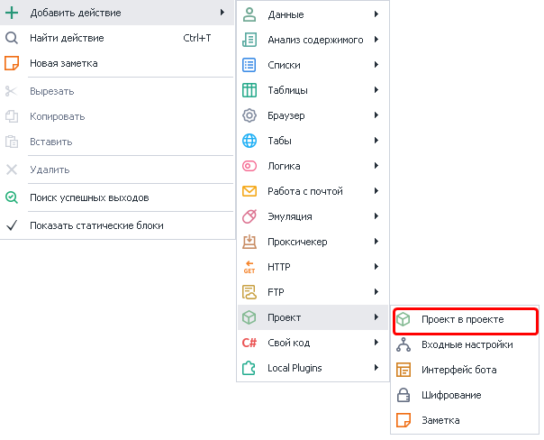
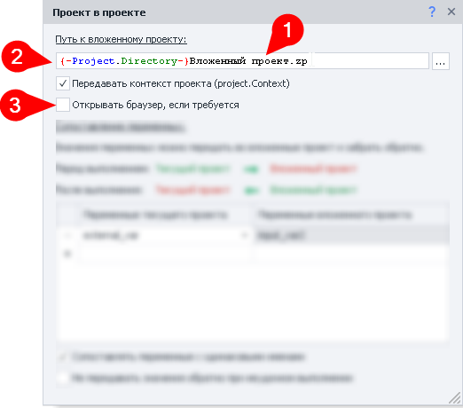
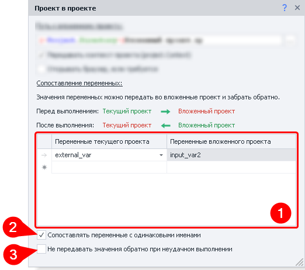
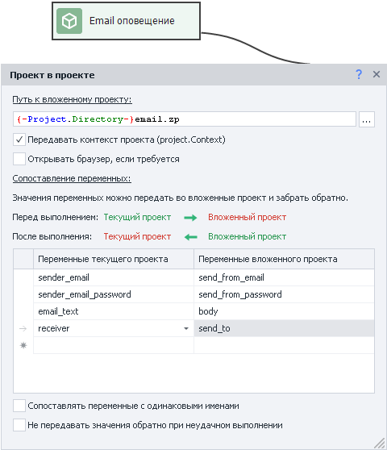
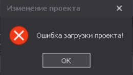

---
sidebar_position: 1
title: "Проект в проекте"
description: ""
date: "2025-08-04"
converted: true
originalFile: "Проект в проекте (Вложенные проекты).txt"
targetUrl: "https://zennolab.atlassian.net/wiki/spaces/RU/pages/489291822"
---
import DisclaimerNotice from '@site/src/components/DisclaimerNotice';

<DisclaimerNotice />

> 🔗 **[Оригинальная страница](https://zennolab.atlassian.net/wiki/spaces/RU/pages/489291822)** — Источник данного материала

_______________________________________________  
## Описание
Этот экшен позволяет подключить уже готовый проект к текущему, над которым вы еще работаете.  

Чаще всего используется для повторяющихся частей. Например:  

**1.** Для работы с конкретным сайтом у вас есть несколько отдельных шаблонов:  
- Парсер товаров;  
- Парсер пользователей;  
- Рассыльщик сообщений.  

**2.** При этом нужно быть авторизованным.  
**3.** В каждом из шаблонов есть одинаковый участок с авторизацией.  
**4.** Выносим этот участок в отдельный подшаблон и подключаем его в нужных местах.  
**5.** Теперь мы можем вносить правки только в один подшаблон, а не сразу в нескольких проектах.  

Также этот экшен подойдет для:  
- Вынесения универсальных функций в подшаблон для использования в других проектах:  
    - *генерация текста*,  
    - *проверка на уникальность*,  
    - *загрузка изображений на хостинги*.  
- Разбивка одного большого шаблона на несколько маленьких по функциям.  
- Использования шаблона как вложенного. Все ограничено лишь вашей фантазией.  

### Как добавить действие в проект?
Через контекстное меню: **Добавить действие** → **Проект** → **Проект в проекте**

_______________________________________________ 
## Принцип работы
### Базовые настройки

##### Путь к вложенному проекту.  
Тут нужно указать абсолютный путь к подшаблону. Можно использовать переменные, например, `{-Project.Directory-}` *(путь к текущей папке проекта)*.  

#### Передавать контекст проекта (project.Context).  
Данная опция используется при работе с ***C# кодом***. `project.Context` позволяет сохранять С# объекты и переносить их между разными частями шаблона.  

#### Открывать браузер если требуется
Включение данной настройки позволяет вложенному шаблону запускать **Браузер**, даже если во внешнем проекте он отключен [**Настройками проекта**](/zennoposter/ProjectMaker/Project-editor/Static_blocks/Project_Settings).  
_______________________________________________ 
### Передача переменных

#### Сопоставление переменных.  
В данном окне происходит передача данных из внешнего проекта во внутренний.  
Передать данные можно только с помощью переменных.  

#### Сопоставлять переменные с одинаковыми именами.  
При включении данной опции все переменные, имена которых идентичны в обоих проектах, будут автоматически сопоставлены, без необходимости ручной настройки.  

:::warning **Ручная настройка имеет больший приоритет.**  
Например, в обоих проектах есть переменная `variable`. Вы включили опцию *Сопоставлять переменные*, но вручную ассоциировали эту переменную с другой — `second_var`. Так что теперь переменные `variable` из обоих проектов будут сопоставлены с `second_var`, а не друг с другом.
:::  

#### Не передавать значения обратно при неудачном выполнении.  
По умолчанию все изменения переменных во внутреннем проекте отражаются также и на переменных из внешнего проекта. При включении данной настройки изменения переменных будут игнорироваться внешним проектом в случае ошибочного завершения внутреннего.  
_______________________________________________
## Пример использования
В качестве примера отправим себе оповещение через Email.

Создаем шаблон, который будет автоматически определять настройки для соединения с сервером на основе переданного Email. После этого нам нужно будет только передать со внешнего проекта текст сообщения, данные отправителя и получателя.
_______________________________________________
## Продажа шаблонов, которые содержат вложенные проекты

При продаже своих шаблонов, которые используют вложенные проекты, стоит не забывать про [**Комиссию**](/zennoposter/ZennoPoster/Project_sales/ZennoBox#комиссия). 
_______________________________________________
## Ошибка загрузки проекта
Если во время создания проекта появилась такая ошибка, то скорее всего проблема в том, что вы пытаетесь запустить закрытый шаблон на неактивном оборудовании.  

Для исправления вам нужно зайти в [**Личный кабинет → вкладка Оборудование**](https://userarea.zennolab.com/lk/userarea/UserAddHardware.aspx) и активировать оборудование, с которого вы сейчас работаете.  
_______________________________________________
## Искать проект с расширением `.zp`
:::info Добавлено в ZennoPoster 7.4.0.0
:::

Включение [Данной настройки](/zennoposter/ZennoPoster/Settings_ZP_and_ProxyChecker/Settings_ZennoPoster/Project_Execution_Settings#искать-проект-с-расширением-zp-при-выполнении-действия-проект-в-проекте) обеспечивает автоматическую совместимость форматов. Если в действии указан устаревший файл проекта (`.xmlz`), но он отсутствует в директории, система автоматически попытается найти и запустить проект с аналогичным именем в современном формате (`.zp`).  

**`.xmlz`** — формат проектов, применявшийся в ZennoPoster 5 и более ранних версиях. 
**`.zp`** — актуальный формат, используемый в ZennoPoster 7.
_______________________________________________
## Полезные ссылки

- [❗→ Плагины](https://zennolab.atlassian.net/wiki/spaces/RU/pages/475365697 "https://zennolab.atlassian.net/wiki/spaces/RU/pages/475365697")
- [❗→ Окно переменных](https://zennolab.atlassian.net/wiki/spaces/RU/pages/735608872 "https://zennolab.atlassian.net/wiki/spaces/RU/pages/735608872")