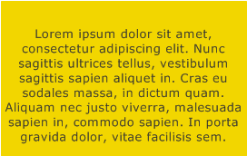
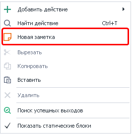
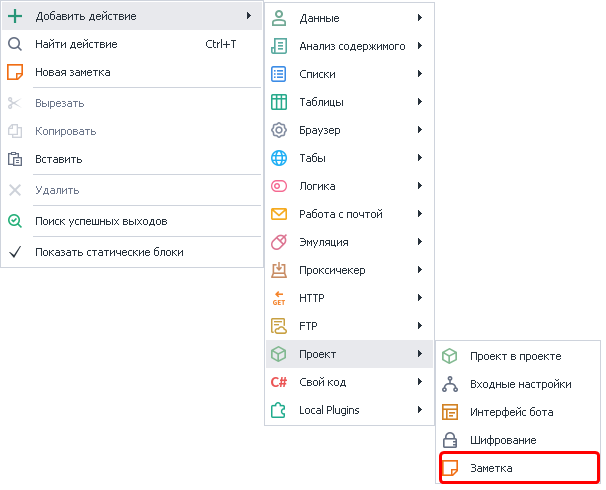
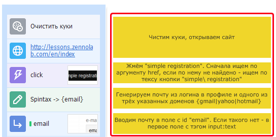
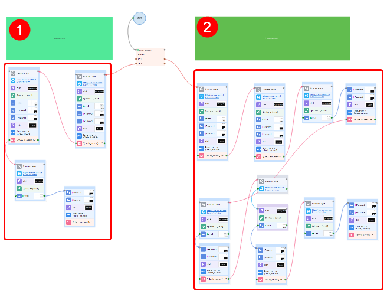
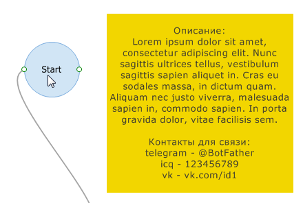
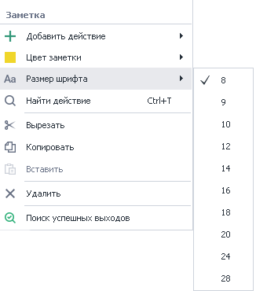
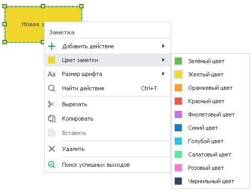
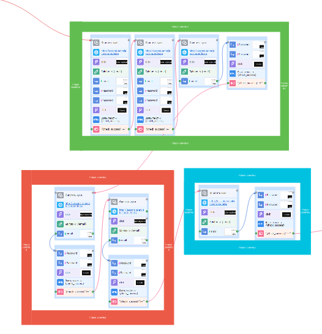
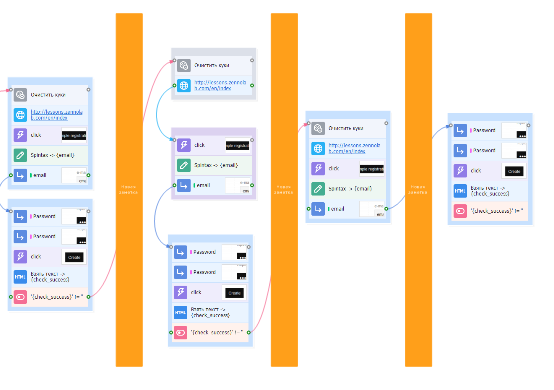

---
sidebar_position: 5
title: "Заметки в проекте"
description: ""
date: "2025-08-04"
converted: true
originalFile: "Заметки в проекте.txt"
targetUrl: "https://zennolab.atlassian.net/wiki/spaces/RU/pages/534020312"
---
:::info **Пожалуйста, ознакомьтесь с [*Правилами использования материалов на данном ресурсе*](../Disclaimer).**
:::

> 🔗 **[Оригинальная страница](https://zennolab.atlassian.net/wiki/spaces/RU/pages/534020312)** — Источник данного материала

_______________________________________________  
# Заметки в проекте

## Описание

*Заметка* - полотно, на котором можно оставить многострочный комментарий.

## Как добавить действие в проект?

Существует два способа добавить заметку в проект.

**Способ №1** 

Клик ПКМ по холсту с экшенами и выбрать **Новая заметка**

**Способ №2** 

Через контекстное меню **Добавить действие** → **Проект** → **Заметка**

Либо воспользуйтесь [❗→ умным поиском](https://zennolab.atlassian.net/wiki/spaces/RU/pages/506200090/ProjectMaker+7#%D0%A3%D0%BC%D0%BD%D1%8B%D0%B9-%D0%BF%D0%BE%D0%B8%D1%81%D0%BA-%D0%B4%D0%B5%D0%B9%D1%81%D1%82%D0%B2%D0%B8%D0%B9 "https://zennolab.atlassian.net/wiki/spaces/RU/pages/506200090/ProjectMaker+7#%D0%A3%D0%BC%D0%BD%D1%8B%D0%B9-%D0%BF%D0%BE%D0%B8%D1%81%D0%BA-%D0%B4%D0%B5%D0%B9%D1%81%D1%82%D0%B2%D0%B8%D0%B9").

## Для чего это используется?

- Для развёрнутого комментирования конкретного экшена
    - можно оставить комментарий и в теле самого экшена, но он там крайне ограничен - буквально несколько слов, а иногда есть необходимость подробного описания действия, т.к. с первого взгляда может быть не очевидным, что делает экшен. Примеры можно увидеть в тестовых проектах, которые доступны на [❗→ *Стартовой странице](https://zennolab.atlassian.net/wiki/spaces/RU/pages/735608964 "https://zennolab.atlassian.net/wiki/spaces/RU/pages/735608964") ProjectMaker.

- Для комментирования сразу большого количества экшенов.
    - Это будет полезно в случаях, когда шаблон разросся до больших размеров и уже становится тяжело визуально определять что за что отвечает. 

 На скриншоте красными рамками выделены две отдельные ветки шаблона (их может быть гораздо больше), а над этими ветками под номерами 1 и 2 отмечены заметки, в которых можно просто написать название того, что делает эта часть шаблона (“Поиск товара”, “Публикация товара”) или же можно сюда добавить подробное описание работы этой ветки.  
- Если Вы хотите поделиться своим [❗→ открытым](https://zennolab.atlassian.net/wiki/spaces/RU/pages/534315498 "https://zennolab.atlassian.net/wiki/spaces/RU/pages/534315498") шаблоном с другими людьми, то можете с помощью заметки оставить описание шаблона и/или контактную информацию.

- В заметках можно хранить любую информацию, которую Вы считает нужной.

## Как работать с экшеном?

### Размер шрифта заметки

  

### Цвет фона заметки

  

## Пример использования

Помимо прочего с помощью заметок можно визуально отделять разные логические блоки друг от друга

