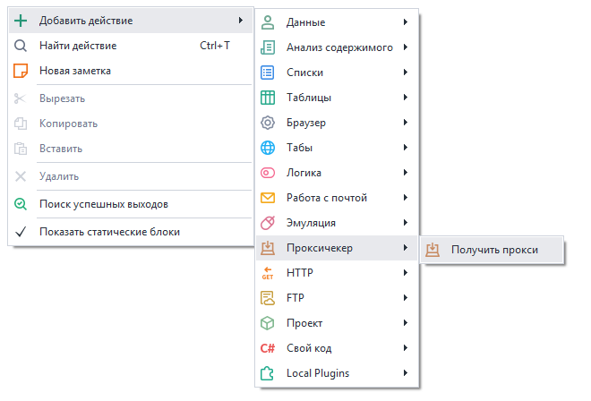
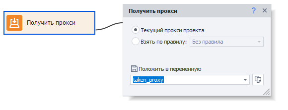
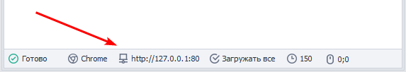
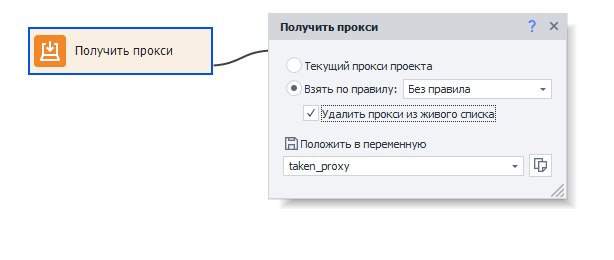

---
sidebar_position: 1
title: "Получить прокси"
description: ""
date: "2025-08-04"
converted: true
originalFile: "Получить прокси.txt"
targetUrl: "https://zennolab.atlassian.net/wiki/spaces/RU/pages/492208129"
---
import DisclaimerNotice from '@site/src/components/DisclaimerNotice';

<DisclaimerNotice />

> 🔗 **[Оригинальная страница](https://zennolab.atlassian.net/wiki/spaces/RU/pages/492208129)** — Источник данного материала

_______________________________________________  
## Описание
В ZennoPoster вы можете использовать сторонний прокси-сервер для работы с приложениями во время выполнения проекта. Данный экшен подходит для получения значений из Proxychecker.   

### Этот экшен нужен для:
- получения **прокси из Proxychecker** и установки его в проект.
- получения **нынешнего прокси** проекта.

### Как добавить действие в проект?
Через контекстное меню: **Добавить действие** → **Проксичекер** → **Получить прокси**

_______________________________________________ 
## Принцип работы

### Текущий прокси проекта
Это прокси с которым сейчас работает шаблон, он устанавливается через действие [Установить прокси](/zennoposter/ProjectMaker/Project-editor/Actions-in-ProjectMaker-Actions-Blocks/Browser/Browser_settings#установить-прокси).  

Его можно увидеть в окне браузера, в самом низу: 

После выбора этой опции текущий прокси проекта добавится в указанную переменную (например - `{ -Variable.taken_proxy- }`).  

### Взять по правилу
При установке открывается возможность выбора варианта из выпадающего списка.

> *Редактировать сами правила нужно в **Proxychecker**.*

Вариант **Без правил** позволяет изымать прокси в порядке очереди.  

Опция *Удалять прокси из живого списка* убирает прокси-сервер из списка после получения.

Прокси также будет установлена в качестве значения указанной переменной, в нашем случае — `{ -Variable.taken_proxy- }`

:::info Установить полученный прокси 
Можно через экшен [Настройки браузера](/zennoposter/ProjectMaker/Project-editor/Actions-in-ProjectMaker-Actions-Blocks/Browser/Browser_settings)
:::
_______________________________________________
## Полезные ссылки

- [❗→ Настройки браузера](https://zennolab.atlassian.net/wiki/spaces/RU/pages/489324572 "https://zennolab.atlassian.net/wiki/spaces/RU/pages/489324572")
- [❗→ Прокси-сервисы](https://zennolab.atlassian.net/wiki/spaces/RU/pages/809140312/- "https://zennolab.atlassian.net/wiki/spaces/RU/pages/809140312/-")
- [❗→ Окно браузера](https://zennolab.atlassian.net/wiki/spaces/RU/pages/534315373 "https://zennolab.atlassian.net/wiki/spaces/RU/pages/534315373")