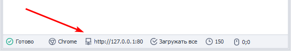

:::info **Пожалуйста, ознакомьтесь с [*Правилами использования материалов на данном ресурсе*](../Disclaimer).**
:::

> 🔗 **[Оригинальная страница](https://zennolab.atlassian.net/wiki/spaces/RU/pages/492208129)** — Источник данного материала

_______________________________________________  
# Получить прокси

## Описание

ZennoPoster позволяет использовать сторонний прокси-сервер для работы с сайтами во время выполнения проекта. Это удобно, если Ваш IP-адрес заблокирован на целевом сайте или Вы хотите сохранить анонимность. 

## Как добавить действие в проект?

Через контекстное меню **Добавить действие** → **Проксичекер** → **Получить прокси**

Либо воспользуйтесь [❗→ умным поиском](https://zennolab.atlassian.net/wiki/spaces/RU/pages/506200090/ProjectMaker+7#%D0%A3%D0%BC%D0%BD%D1%8B%D0%B9-%D0%BF%D0%BE%D0%B8%D1%81%D0%BA-%D0%B4%D0%B5%D0%B9%D1%81%D1%82%D0%B2%D0%B8%D0%B9 "https://zennolab.atlassian.net/wiki/spaces/RU/pages/506200090/ProjectMaker+7#%D0%A3%D0%BC%D0%BD%D1%8B%D0%B9-%D0%BF%D0%BE%D0%B8%D1%81%D0%BA-%D0%B4%D0%B5%D0%B9%D1%81%D1%82%D0%B2%D0%B8%D0%B9").

## Для чего это используется?

- Для получения прокси из проксичекера и установки его в проект для анонимности, обхода блокировок и т.п.
- Для получения нынешнего прокси проекта.

## Как работать с экшеном?

### Текущий прокси проекта

Текущий прокси проекта - это прокси с которым сейчас работает шаблон, он устанавливается через действие [❗→ Установить прокси](https://zennolab.atlassian.net/wiki/spaces/RU/pages/489324572 "https://zennolab.atlassian.net/wiki/spaces/RU/pages/489324572"). Его можно увидеть в окне браузера, в самом низу: 

При выборе этой функции, текущий прокси проекта кладётся в указанную переменную (в приведенном варианте - `{ -Variable.taken_proxy- }`. Текущий прокси 

  

### Взять по правилу

При установке, открывается возможность выбора варианта из выпадающего списка.

Редактировать правила нужно в прокси-чекере.

Если выбрать вариант “Без правил”, то прокси будут изыматься в порядке очереди. Галочка “Удалять прокси из живого списка” позволяет удалять прокси-сервер из списка прокси-чекера после получения.

Прокси также будет установлена в качестве значения указанной переменной, в нашем случае - `{ -Variable.taken_proxy- }`

:::info Информация
После получения прокси, его необходимо установить через экшен Настройки браузера
:::

  

## Пример использования

Представим ситуацию, в которой нам необходимо выполнить большое количество однотипных действий на определенном сайте.

Для этого пригодится прокси-сервер, он позволяет нам скрыть наш реальный IP-адрес от систем защиты того или иного сайта.

  

## Полезные ссылки

- [❗→ Настройки браузера](https://zennolab.atlassian.net/wiki/spaces/RU/pages/489324572 "https://zennolab.atlassian.net/wiki/spaces/RU/pages/489324572")
- [❗→ Прокси-сервисы](https://zennolab.atlassian.net/wiki/spaces/RU/pages/809140312/- "https://zennolab.atlassian.net/wiki/spaces/RU/pages/809140312/-")
- [❗→ Окно браузера](https://zennolab.atlassian.net/wiki/spaces/RU/pages/534315373 "https://zennolab.atlassian.net/wiki/spaces/RU/pages/534315373")