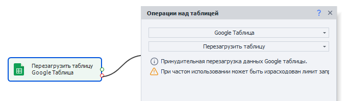
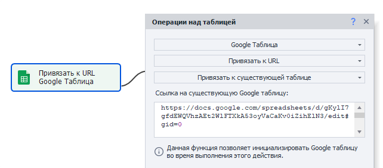
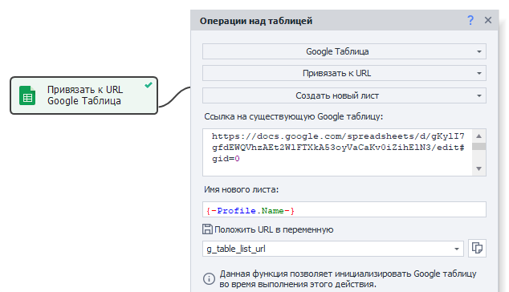
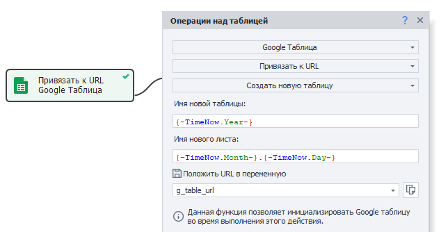

---
sidebar_position: 2
title: "Операции над Google таблицами"
description: " "
date: "2025-07-24"
converted: true
originalFile: "Операции над Google-таблицами.txt"
targetUrl: "https://zennolab.atlassian.net/wiki/spaces/RU/pages/509411347/Google-"
---
import DisclaimerNotice from '@site/src/components/DisclaimerNotice';

<DisclaimerNotice />

> 🔗 **[Оригинальная страница](https://zennolab.atlassian.net/wiki/spaces/RU/pages/509411347/Google-)** — Источник данного материала

_______________________________________________  
## Описание
:::info Подключение Google таблиц
Сначала вам нужно [получить API-ключ](../../../Recording-and-creating-projects/Setting_Up_Google_Sheets_Connection), а затем указать его в [Настройках программы](../../../ProjectMaker%20Settings/Google_Sheets_PM)
:::

Во многом они похожи на простые [Таблицы](./Operations_on_Tables). Для работы используется тот же экшен **Операции над таблицами**, и все действия также актуальны *(кроме **Привязки к файлу**)*. Но у Google-таблиц все-таки есть несколько уникальных функций, с которыми мы познакомимся ниже.  

### Как добавить экшен в проект?
Через контекстное меню: **Добавить действие → Таблицы → Операции над таблицей**

_______________________________________________ 
## Принцип работы
:::info **Экшен «Операции над таблицами»**  
В данной статье описаны только уникальные для Google Таблиц функции. Про все остальные операции можно прочитать в статье [Операции над таблицами](./Operations_on_Tables).
::: 

:::tip Во всех полях можно использовать статичный текст
А также переменные и их комбинации.
:::

### Перезагрузить таблицу
:::info Добавлено в ZennoPoster 7.7.0.0
:::

Данная функция позволяет обновить Google Таблицу и получить актуальные данные из нее.

Пригодится, если в таблицу были внесены изменения вручную или с помощью другого шаблона.

:::warning ЛОКАЛЬНАЯ ТАБЛИЦА БУДЕТ ПЕРЕЗАПИСАНА ДАННЫМИ ИЗ ТАБЛИЦЫ В ОБЛАКЕ.
:::

### Привязать к существующей таблице
С помощью этого действия можно привязаться к таблице в процессе выполнения проекта. Удобно использовать, когда на момент старта шаблона адрес таблицы неизвестен.

#### Ссылка на существующую Google таблицу
В поле ввода нужно указать ссылку на таблицу, к которой привязываемся.

### Создать новый лист
Создает новый лист в Google таблице.

#### Ссылка на существующую Google таблицу
Указываем ссылку на таблицу, в которой создаем новый лист.

#### Имя нового листа
Придумываем имя для листа.

#### Положить URL в переменную
Можно указать переменную для сохранения ссылки на новый лист.

### Создать новую таблицу
Как не сложно догадаться, данное действие позволяет создать новую Google таблицу.

#### Имя новой таблицы
Указать имя для новой таблицы.

#### Имя нового листа
Таблица создаётся с одним листом. Здесь нужно указать имя для него.

#### Положить URL в переменную
Можно указать переменную, в которую сохранится ссылка на новую таблицу.
_______________________________________________ 
## Полезные ссылки
- [❗→ Настройка подключения Google Таблиц](/wiki/spaces/RU/pages/1667727363 "/wiki/spaces/RU/pages/1667727363")
- [❗→ Google таблица](/wiki/spaces/RU/pages/724566092 "/wiki/spaces/RU/pages/724566092")
- [❗→ Google таблицы (PM)](/wiki/spaces/RU/pages/735576090 "/wiki/spaces/RU/pages/735576090")
- [❗→ Операции над таблицами](/wiki/spaces/RU/pages/534052972 "/wiki/spaces/RU/pages/534052972")