---
sidebar_position: 1
title: "Операции над таблицами"
description: " "
date: "2025-07-24"
converted: true
originalFile: "Операции над таблицами.txt"
targetUrl: "https://zennolab.atlassian.net/wiki/spaces/RU/pages/534052972"
---
import DisclaimerNotice from '@site/src/components/DisclaimerNotice';

<DisclaimerNotice />

> 🔗 **[Оригинальная страница](https://zennolab.atlassian.net/wiki/spaces/RU/pages/534052972)** — Источник данного материала

_______________________________________________  
## Описание
Таблицы используются для получения более сложно организованных данных, чем [**списки**](../Lists/List_Operations). Это может быть каталог товаров для интернет-магазина, в котором построчно прописаны разные данные: название, цена, описание и тд.  

#### Они могут использоваться для:  
- Работы с комплексом данных;  
- Добавления и получения элементов таблицы;  
- Удаления строк, столбцов и дублей;  
- Привязки к файлу;  
- Получение количества строк и столбцов;  

:::info Перед началом работы таблицу надо создать.
:::

### Как создать таблицу?

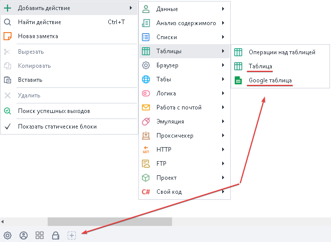

### Как добавить экшен в проект?
Через контекстное меню: **Добавить действие → Таблицы → Операции над таблицей**

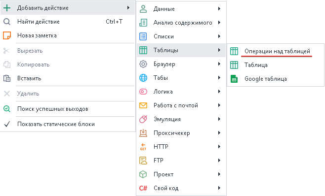
_______________________________________________
## Принцип работы
:::tip На заметку
В качестве номера столбца можно использовать числа (нумерация с нуля), либо буквы латинского алфавита (в верхнем регистре).
:::

### Взять столбец
Позволяет взять значения определенного столбца из таблицы и положить его в список.

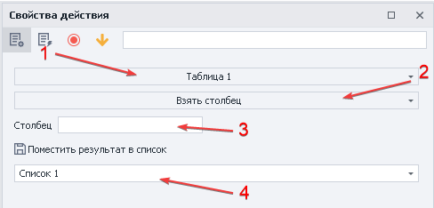

1. Выбираем таблицу.
2. Определяем функцию.
3. Указываем Столбец, который хотим забрать (или переменную). 
4. Выбираем список, в который сохраним все значения столбца.

Пример

Поместим все значения столбца B из Таблицы 1 в Список 1

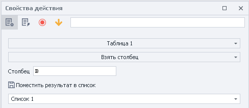

| Таблица      | Список | 
| ---        |    ----   |         
| 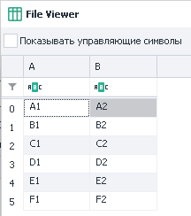     | 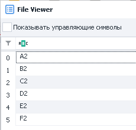      | 

  
_______________________________________________
### Взять строки
Получаем строки с возможностью удаления их из таблицы и записью в список или переменные.

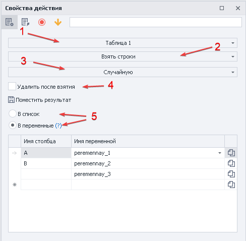

- **Критерии выбора строк:**  
    - *Все*;  
    - *Не содержит текст*;  
    - *Неудовлетворяющие регулярному выражению*;  
    - *Первую*;  
    - *Под номерами*;  
    - *Случайную*;  
    - *Содержит текст*;  
    - *Удовлетворяющие регулярному выражению*;  
- **Удалить после взятия.** Определяет, останутся ли взятые строки в таблице или нет.  
- **Поместить результат.** Строку можно отправить В список или в Переменные. А далее идет таблица, где мы можем это контроллировать.  

Пример

Берём случайные строки из Таблицы 1 и кладём в переменные с дальнейшим удалением.

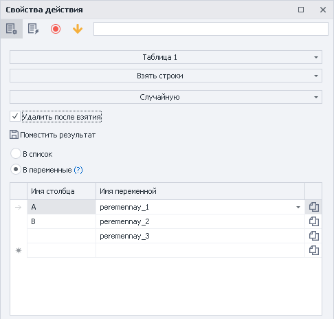

| Таблица после обработки      | Окно переменных | 
| ---        |    ----   |         
| 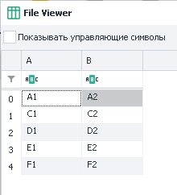     | 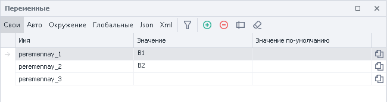      | 

> Переменная `peremennay_3` пустая, так как таблица содержит только столбцы **A** и **B**

  
_______________________________________________
### Добавить список
Здесь же наоборот, можно положить выбранный список в определенный столбец таблицы.

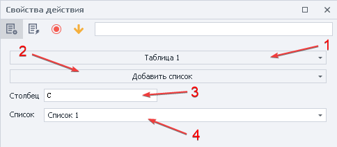

**Выбираем столбец, в который положим → Указываем список.**  

Пример

Берём значение из Списка 1 и помещаем его в столбец D Таблицы 1

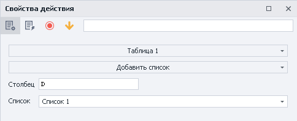

| Список 1      | Таблица 1 после обработки | 
| ---        |    ----   |         
| 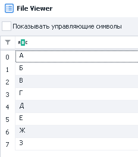     | 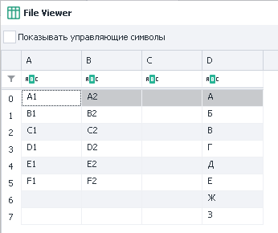      | 

> *Значения из списка не удаляются*

  
_______________________________________________
### Добавить строку
:::tip **Обработка текста с функцией «В таблицу»**  
Больше подходит для одновременного добавления нескольких строк в таблицу.
::: 

С помощью этой функции в таблицу можно положить статический текст (string) или переменную. Эти данные будут добавлены в конец таблицы.   

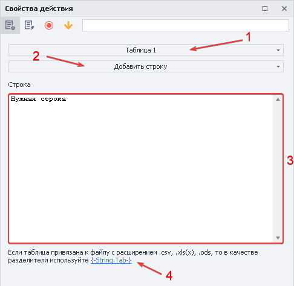

:::warning **Обратите внимание**  
Если таблица привязана к файлу с расширениями `.csv`, `.xls(x)` или `.ods`, то в качестве разделителя нужно использовать `{-String.Tab-}`. 
:::   

Пример

Добавим строку своего текста в разные столбцы.

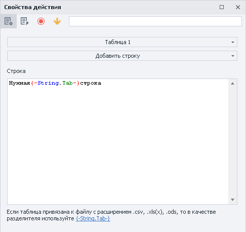

| До обработки     | После | 
| ---        |    ----   |         
| 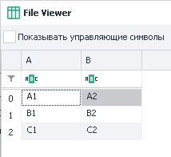     | 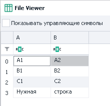     | 

  
_______________________________________________
### Записать ячейку
Добавляет текст в конкретную ячейку.

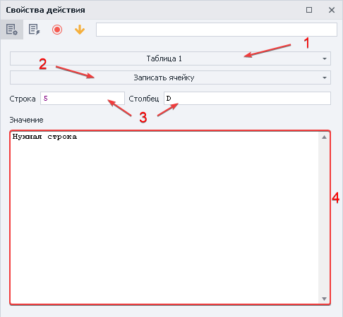

- **Строка и Столбец**. Здесь указываем статические координаты ячейки. Это также можно сделать через переменные.  
- **Значение**. Пишем статический текст (string) или переменную. 

Пример

Добавляем текст вместе с заданной ячейкой

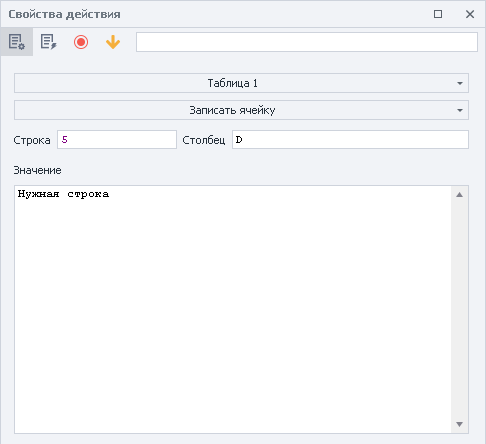

| До обработки     | После | 
| ---        |    ----   |         
|     | 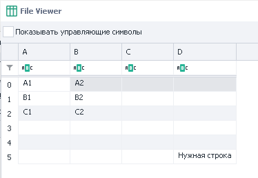     | 

> Строки всегда добавляются в конец таблицы

  
_______________________________________________
### Получить количество столбцов
Так можно узнать, сколько всего столбцов содержит таблица.

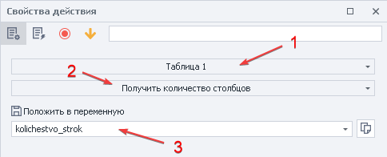

:::info Результат можно положить в переменную
Cодержит только числовое значение `int`.
:::

Пример

Получаем количество столбцов Таблицы 1 и кладём в переменную

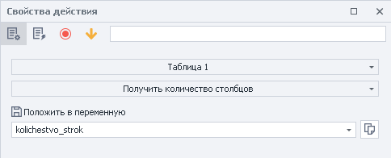

| Таблица 1      | Переменная `kolichestvo_strok` | 
| ---        |    ----   |         
| 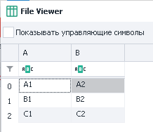    | 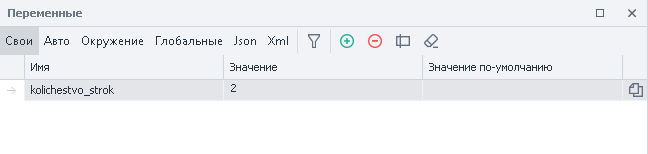      | 

  
_______________________________________________
### Получить количество строк
Эта операция показывает, сколько строк содержит таблица.

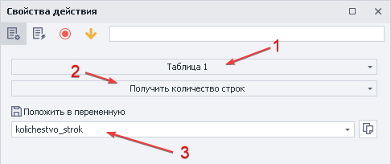

1. Выбираем таблицу с которой будем работать.
2. Указываем функцию.
3. Переменная для получения результата.

:::info Результат можно положить в переменную
Cодержит только числовое значение `int`.
:::

Пример

Получаем в переменную количество строк из Таблицы 1 

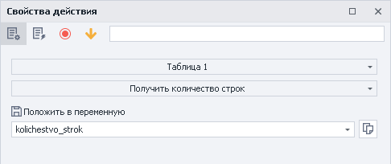

| Таблица 1      | Переменная `kolichestvo_strok` | 
| ---        |    ----   |         
|     | 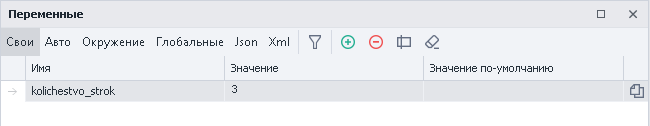      | 

  
_______________________________________________
### Привязать к файлу
Позволяет привязать таблицу к файлу в ходе выполнения проекта.

Этот экшен нужно использовать, если путь файла не известен на момент старта шаблона, а будет вычислен только во время выполнения.  

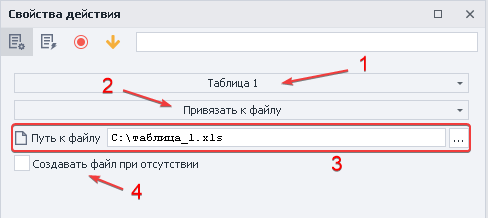

- **Путь к файлу**. Выбираем файл или указываем переменную, содержащую путь к файлу.  
- **Создавать файл при отсутствии**. Если файл отсутствует по указанному пути, то он будет автоматически создан. 

Пример

Привязываем Таблицу 1 к выбранному файлу

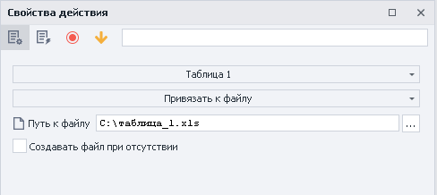

  
_______________________________________________
### Прочитать ячейку
Получить значение из заданной ячейки

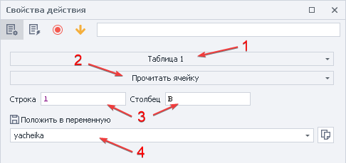

- **Строка и Столбец**. Здесь указываем статические координаты ячейки. Это также можно сделать через переменные.  
- **Положить в переменную**. Указываем переменную, в которую положим результат.  

Пример

Получаем в переменную значение из ячейки B2 Таблицы 1

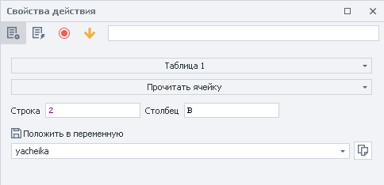

| Таблица 1      | Переменная `yacheika` | 
| ---        |    ----   |         
| 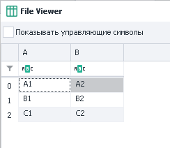    | 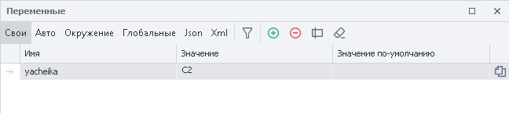  | 

  
_______________________________________________
### Сортировать таблицу
Сортирует элементы таблицы по убыванию или возрастанию.

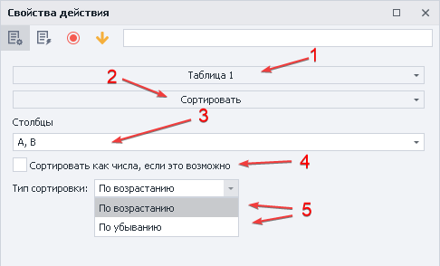

- **Столбцы**. Выбираем нужные.   
ZennoDroid автоматически определяет столбцы со значениями и предлагает их.  
- **Сортировать как числа, если это возможно**. Использовать принцип сортировки как у чисел.  
:::info **Условие для работы**  
*Данная опция сработает, только если в столбце находятся целые числа. Если же там присутствуют дробные числа, то столбец отсортируется по принципу строк.*  
:::   
- **Тип сортировка**. Сортируем По возрастанию или По убыванию.  

Пример

Отсортируем по убыванию значения всех столбцов Таблицы 1

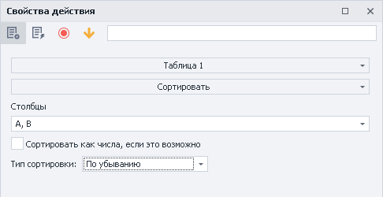

| До обработки     | После | 
| ---        |    ----   |         
| 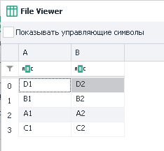    | 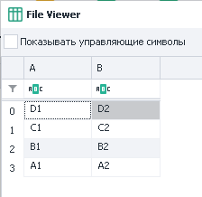     | 

  
_______________________________________________
### Сохранить в файл
Сохранение таблицы в файл во время выполнения проекта.

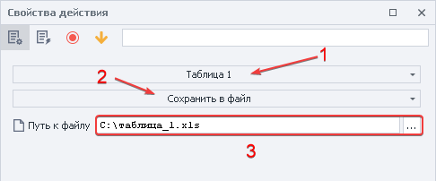

Для работы нужно выбрать файл или указать переменную, содержащую путь к нему.

:::warning ОБРАТИТЕ ВНИМАНИЕ
Функция умеет только **перезаписывать** существующий файл.
:::

Пример

Сохраняем значения Таблицы 1 в файл

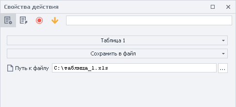

| Таблица 1      | Получившийся файл | 
| ---        |    ----   |         
| 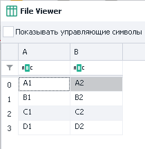| 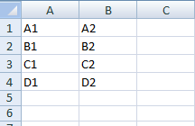  | 

  
_______________________________________________
### Удалить дубли
Эта функция удаляет повторяющиеся значения из таблицы.

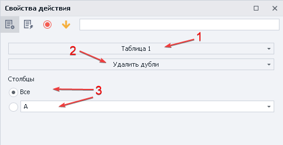

- **Столбцы**. Проверяем на дубли *Все* или *конкретные*.  

> ZennoPoster автоматически определяет столбцы со значениями и предлагает их.  

Пример

Удаляем все дубли из Таблицы 1

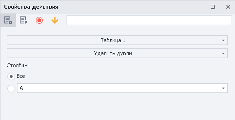

| До обработки     | После | 
| ---        |    ----   |         
| 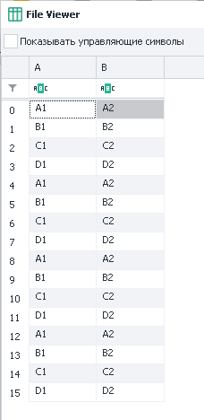    | 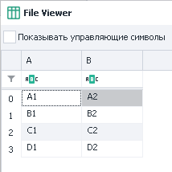     | 

  
_______________________________________________
### Удалить столбец
Целиком удаляет выбранный столбец из таблицы.

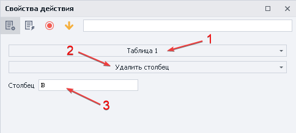

Указываем конкретный столбец или переменную.

:::warning Столбец будет удалён со всеми значениями
:::

Пример

Удаляем столбец B из Таблицы 1

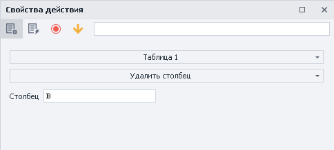

| До обработки     | После | 
| ---        |    ----   |         
|     | 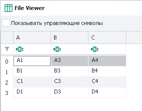   | 

  
_______________________________________________
### Удалить строки
Позволяет удалить определенные строки во всех столбцах.

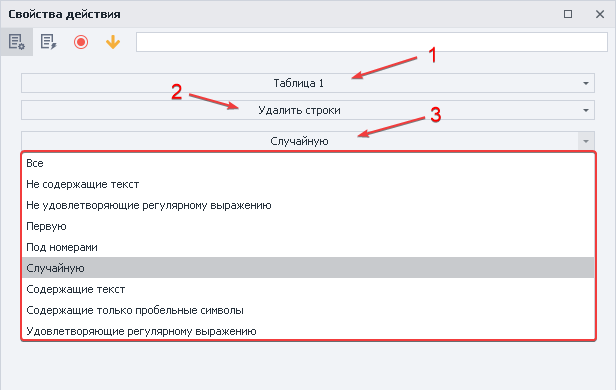

- **Критерии выбора строк**:  
    - Все;
    - Не содержит текст;
    - Неудовлетворяющие регулярному выражению;
    - Первую;
    - Под номерами (*нумерация с нуля*);
    - Случайную;
    - Содержит текст;
    - Содержащие только пробельные символы;
    - Удовлетворяющие регулярному выражению;  

:::warning Заданная строка будет удалена во всех столбцах
:::

Пример

Удаляем третью строчку из Таблицы 1

| До обработки     | После | 
| ---        |    ----   |         
|    |    | 

> **Третья строка была удалена целиком**

  
_______________________________________________
## Советы при работе с таблицами
:::tip **Эта информация будет полезна для корректной работы в проектах**  
:::  

- Не стоит привязывать к таблице слишком большие файлы (*100мб и более*) без опции ***«Сохранять изменения таблицы в файл»***. Особенно, если у вас мало оперативной памяти.  
- При работе с таблицой, которая привязана к одному файлу сразу в нескольких проектах, нужно использовать одинаковый разделитель. Например, если в одном шаблоне столбцы разделены через `;` , а в другом через `-` , то произойдет ошибка.  
- Когда проект работает в многопоточном режиме, а каждый поток при этом обрабатывает свою отдельную строку, то лучше включить опцию ***«Сохранять изменения таблицы в файл»***. Это позволит брать данные из таблицы и *удалять их после взятия*.  
- Если вы синхронизируетесь с файлом, то все изменения в каждом из потоков будут сразу отображаться в проекте, так как таблица одна на все потоки.  
- Однако если вы не используете синхронизацию с файлом, то для каждого потока будет создаваться своя копия таблицы. В этом случае удаление строки таблицы из одного потока не меняет таблицу в других потоках.  
- Стоит учитывать, что таблицы в оперативной памяти занимают намного больше места, чем исходный файл на жестком диске. Например, таблица на основе файла CSV размером 10 MB в 100 потоков без синхронизации с файлом, может занять 5 GB оперативной памяти. Поэтому старайтесь не использовать списки и таблицы в режиме ***«без синхронизации»*** с файлом без необходимости. 
_______________________________________________
## Пример использования
Собрать со страниц название нужных товаров в список и добавить их из списка в таблицу для дальнейшего использования.

1. Загружаем страницы.
2. Собираем необходимые значения в список.
3. Создаём таблицу.
4. Добавляем экшен и указываем функцию добавить список.
5. Указываем список и столбец в который сохраним значения.
_______________________________________________
## Полезные ссылки

1. [❗→ Таблица](/wiki/spaces/RU/pages/735903776 "/wiki/spaces/RU/pages/735903776")
2. [❗→ Google таблицы](/wiki/spaces/RU/pages/735576090 "/wiki/spaces/RU/pages/735576090")
3. [❗→ Список](/wiki/spaces/RU/pages/534053375 "/wiki/spaces/RU/pages/534053375")
4. [❗→ Операции над списком](/wiki/spaces/RU/pages/534085798 "/wiki/spaces/RU/pages/534085798")
5. [❗→ Переменные проекта](/wiki/spaces/RU/pages/735608872 "/wiki/spaces/RU/pages/735608872")
6. [❗→ Тестер регулярных выражений](/wiki/spaces/RU/pages/534086111 "/wiki/spaces/RU/pages/534086111")
7. [❗→ Диапазоны значений](/wiki/spaces/RU/pages/488964137 "/wiki/spaces/RU/pages/488964137")