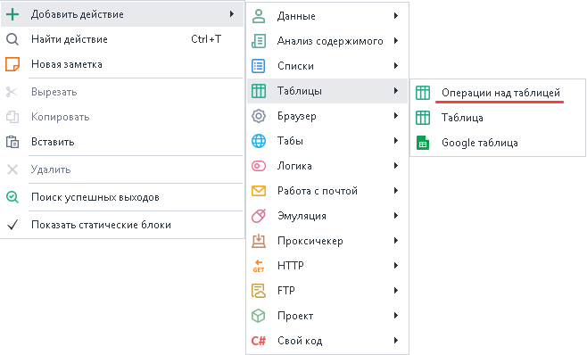
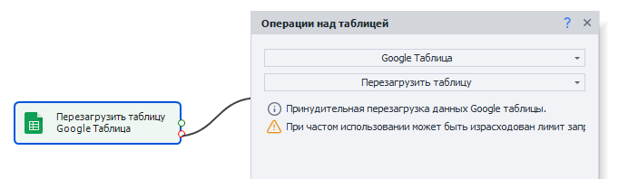
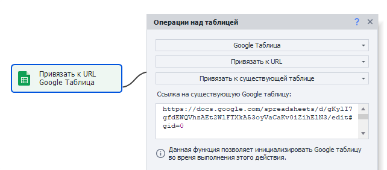
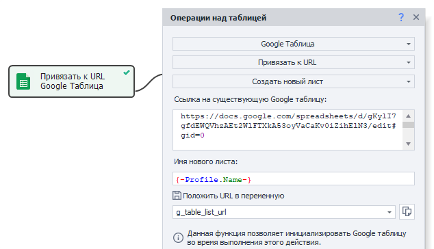
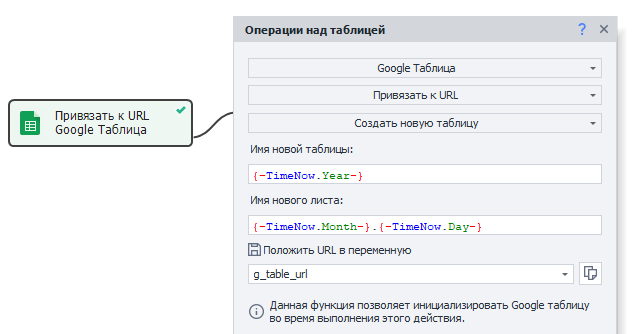

---
sidebar_position: 2
title: "Операции над Google-таблицами"
description: "Конвертировано из HTML в MDX"
date: "2025-07-24"
converted: true
originalFile: "Операции над Google-таблицами.txt"
targetUrl: "https://zennolab.atlassian.net/wiki/spaces/RU/pages/509411347/Google-"
---
:::info **Пожалуйста, ознакомьтесь с [*Правилами использования материалов на данном ресурсе*](../Disclaimer).**
:::

> 🔗 **[Оригинальная страница](https://zennolab.atlassian.net/wiki/spaces/RU/pages/509411347/Google-)** — Источник данного материала

_______________________________________________  
  
## Описание

:::warning Внимание
Прежде, чем начать работать с Google-таблицами, их необходимо подключить в программу Настройка подключения Google Таблиц и создать - Google таблица
:::

Google таблицы во многом очень похожи на простые [❗→ Таблицы](/wiki/spaces/RU/pages/735903776 "/wiki/spaces/RU/pages/735903776").

Для работы используется тот же экшен [❗→ Операции над таблицами](/wiki/spaces/RU/pages/534052972 "/wiki/spaces/RU/pages/534052972") и все действия, которые применяются для простых Таблиц, можно использовать и для Google Таблиц (кроме *Привязки к файлу), но для последних есть несколько уникальных функций, которые будут описаны ниже.

  

## Как добавить экшен в проект?

Через контекстное меню **Добавить действие** → **Таблицы** → **Операции над таблицей**

Либо воспользуйтесь [❗→ умным поиском](https://zennolab.atlassian.net/wiki/spaces/RU/pages/506200090/ProjectMaker+7#%D0%A3%D0%BC%D0%BD%D1%8B%D0%B9-%D0%BF%D0%BE%D0%B8%D1%81%D0%BA-%D0%B4%D0%B5%D0%B9%D1%81%D1%82%D0%B2%D0%B8%D0%B9 "https://zennolab.atlassian.net/wiki/spaces/RU/pages/506200090/ProjectMaker+7#%D0%A3%D0%BC%D0%BD%D1%8B%D0%B9-%D0%BF%D0%BE%D0%B8%D1%81%D0%BA-%D0%B4%D0%B5%D0%B9%D1%81%D1%82%D0%B2%D0%B8%D0%B9").

  

## Действия с Google таблицей

:::note На заметку
Для работы с Google Таблицами используется экшен Операции над таблицами. В данной статье описаны те функции, которые уникальны для Google Таблиц. Про все остальные операции можно прочитать в статье Операции над таблицами
:::

:::warning Внимание
Во всех полях можно использовать как статичный текст, так и переменные, и их комбинации.
:::

### Перезагрузить таблицу

:::info Информация
Добавлено в ZennoPoster 7.7.0.0
:::

Данная функция позволяет получить актуальные данные из Google Таблицы.

Может быть полезно, если в таблицу были внесены изменеия вручную или с помощью другого шаблона.

:::warning Внимание
Локальная таблица будет перезаписана данными из удалённой таблицы.
:::

### Привязать к URL → Привязать к существующей таблице

Это действие позволяет привязаться к таблице в процессе выполнения проекта. Удобно использовать когда на момент старта шаблона адрес таблицы не известен (например таблица создаётся самим же шаблоном (как это сделать описано ниже)).

**Ссылка на существующую Google таблицу**

Здесь указываем ссылку на таблицу, к которой нужно привязаться.

### Привязать к URL → Создать новый лист

Позволяет создать новый лист в Google таблице.

**Ссылка на существующую Google таблицу**

Здесь указываем ссылку на таблицу, в которой будем создавать новый лист.

**Имя нового листа**

Тут указать имя листа.

**Положить URL в переменную**

Здесь нужно указать переменную, в которую сохранится ссылка на новый лист.

### Привязать к URL → Создать новую таблицу

Как не сложно догадаться, данное действие позволяет создать новую Google таблицу.

**Имя новой таблицы**

Тут указать имя таблицы.

**Имя нового листа**

Таблица создаётся с одним листом. Здесь нужно указать имя этого листа.

**Положить URL в переменную**

Здесь нужно указать переменную, в которую сохранится ссылка на новую таблицу.

  

## Многопоточная работа с Google-таблицами до 7.1.6.1 включительно

:::note На заметку
Для версий программы, начиная с 7.1.7.0 был изменен алгоритм многопоточной работы с Google таблицами. Подробнее: Многопоточная работа с Google-таблицами (Версия 7.1.7.0 и выше)
:::

### ZennoPoster поддерживает многопоточную работу с Google-таблицами

Это значит, что к одной таблице можно обращаться через несколько потоков. При выполнении, для всех потоков будет один инстанс виртуальной таблицы, изменения из которой будут периодически синхронизироваться с таблицей в облаке.

### Несколько копий ZennoPoster может работать с одной Google-таблицей

Но нужно учитывать, что изменения из программы поступают в облако не моментально, а в течении 30-60 секунд. Следовательно, эта задержка будет действовать между разными копиями программы ZennoPoster.

### Как оптимизировать многопоточную запись данных в одну Google-таблицу

Для этого есть решение. Допустим, если Вы осуществляете парсинг каких-то данных пачками и складываете все результаты в одну Google-таблицу.

ZennoPoster устроен таким образом, что пытается всегда синхронизировать виртуальную таблицу и таблицу в облаке. Если имеется несколько копий ZennoPoster и/или таблица имеет много данных, синхронизация может занять много времени.

В таком случае, если Вам не нужны актуальные данные из таблицы в каждой копии ZennoPoster, Вы можете настроить режим быстрой записи через опцию [❗→ **Редактирование → Настройки → Google таблицы → Политика обработки изменений таблиц**](https://zennolab.atlassian.net/wiki/spaces/RU/pages/735576090/Google%2BPM#%D0%9F%D0%BE%D0%BB%D0%B8%D1%82%D0%B8%D0%BA%D0%B0-%D0%BE%D0%B1%D1%80%D0%B0%D0%B1%D0%BE%D1%82%D0%BA%D0%B8-%D0%B8%D0%B7%D0%BC%D0%B5%D0%BD%D0%B5%D0%BD%D0%B8%D0%B9-%D1%82%D0%B0%D0%B1%D0%BB%D0%B8%D1%86 "https://zennolab.atlassian.net/wiki/spaces/RU/pages/735576090/Google%2BPM#%D0%9F%D0%BE%D0%BB%D0%B8%D1%82%D0%B8%D0%BA%D0%B0-%D0%BE%D0%B1%D1%80%D0%B0%D0%B1%D0%BE%D1%82%D0%BA%D0%B8-%D0%B8%D0%B7%D0%BC%D0%B5%D0%BD%D0%B5%D0%BD%D0%B8%D0%B9-%D1%82%D0%B0%D0%B1%D0%BB%D0%B8%D1%86"):

В этом режиме, каждая копия программы будет лишь отправлять данные, не заботясь об их чтении в программу (и не будет тратить на это время). Все отправленные данные из разных копий ZennoPoster будут записаны в облако.

  

## Полезные ссылки

- [❗→ Настройка подключения Google Таблиц](/wiki/spaces/RU/pages/1667727363 "/wiki/spaces/RU/pages/1667727363")
- [❗→ Google таблица](/wiki/spaces/RU/pages/724566092 "/wiki/spaces/RU/pages/724566092")
- [❗→ Google таблицы (PM)](/wiki/spaces/RU/pages/735576090 "/wiki/spaces/RU/pages/735576090")
- [❗→ Операции над таблицами](/wiki/spaces/RU/pages/534052972 "/wiki/spaces/RU/pages/534052972")