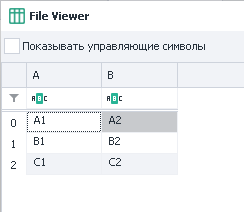

:::info **Пожалуйста, ознакомьтесь с [*Правилами использования материалов на данном ресурсе*](../Disclaimer).**
:::

> 🔗 **[Оригинальная страница](https://zennolab.atlassian.net/wiki/spaces/RU/pages/534052972)** — Источник данного материала

_______________________________________________  
  
## Описание

Таблицы используются для получения более сложно организованных данных, чем [❗→ списки](/wiki/spaces/RU/pages/534053375 "/wiki/spaces/RU/pages/534053375"), (например, список товаров для интернет-магазина, где построчно представлены разные данные: название, цена, описание и тд.).

:::note На заметку
Экшен используется как при работе с Таблицами так и с Google Таблицами, но у Google Таблиц есть несколько уникальных действий, которые описаны в статье Операции над Google-таблицами
:::

  

## Как добавить Таблицу в проект?

:::info Информация
Перед началом работы необходимо создать Таблицу или Google таблицу.
:::

## Как добавить экшен в проект?

Через контекстное меню **Добавить действие** → **Таблицы** → **Операции над таблицей**

Либо воспользуйтесь [❗→ умным поиском](https://zennolab.atlassian.net/wiki/spaces/RU/pages/506200090/ProjectMaker+7#%D0%A3%D0%BC%D0%BD%D1%8B%D0%B9-%D0%BF%D0%BE%D0%B8%D1%81%D0%BA-%D0%B4%D0%B5%D0%B9%D1%81%D1%82%D0%B2%D0%B8%D0%B9 "https://zennolab.atlassian.net/wiki/spaces/RU/pages/506200090/ProjectMaker+7#%D0%A3%D0%BC%D0%BD%D1%8B%D0%B9-%D0%BF%D0%BE%D0%B8%D1%81%D0%BA-%D0%B4%D0%B5%D0%B9%D1%81%D1%82%D0%B2%D0%B8%D0%B9").

## Для чего это используется?

- Работа с комплексом данных
- Добавление и получение элементов таблицы
- Удаление строк, столбцов и дублей
- Привязка к файлу
- Получение количества строк и столбцов

## Как работать с экшеном?

:::note На заметку
В качестве номера столбца можно использовать либо числа (нумерация с нуля!), либо, как в Excel, буквы латинского алфавита в верхнем регистре!
:::

### Взять столбец

Положить значения заданного столбца в [❗→ список](/wiki/spaces/RU/pages/534053375 "/wiki/spaces/RU/pages/534053375")

1. Выбираем таблицу с которой будем работать.
2. Указываем функцию.
3. Задаём столбец или переменную.
4. [❗→ Список](/wiki/spaces/RU/pages/534053375 "/wiki/spaces/RU/pages/534053375") в который сохраним все значения столбца.

Пример

Положить все значения столбца B из [❗→ Таблицы](/wiki/spaces/RU/pages/735903776 "/wiki/spaces/RU/pages/735903776") 1 в [❗→ Список](/wiki/spaces/RU/pages/534053375 "/wiki/spaces/RU/pages/534053375") 1

[❗→ Таблица](/wiki/spaces/RU/pages/735903776 "/wiki/spaces/RU/pages/735903776") 1

До обработки

После обработки

Значения заданного столбца не удаляются после обработки

[❗→ Список](/wiki/spaces/RU/pages/534053375 "/wiki/spaces/RU/pages/534053375") 1

  

### Взять строки

Получение строк с возможностью удаления из таблицы и записью в [❗→ список](/wiki/spaces/RU/pages/534053375 "/wiki/spaces/RU/pages/534053375"), [❗→ переменные](/wiki/spaces/RU/pages/735608872 "/wiki/spaces/RU/pages/735608872").

1. Выбираем таблицу с которой будем работать.
2. Указываем функцию.
3. Критерии строк (можно указать переменную) : 
a) Все
b) Не содержит текст
c) Неудовлетворяющие [❗→ регулярному выражению](/wiki/spaces/RU/pages/534086111 "/wiki/spaces/RU/pages/534086111")
d) Первую
e) [❗→ Под номерами](/wiki/spaces/RU/pages/488964137 "/wiki/spaces/RU/pages/488964137") (нумерация с нуля!)
f) Случайную
g) Содержит текст
h) Удовлетворяющие [❗→ регулярному выражению](/wiki/spaces/RU/pages/534086111 "/wiki/spaces/RU/pages/534086111")
4. Стоит ли удалять строки после обработки?
5. Положить результат в [❗→ список](/wiki/spaces/RU/pages/534053375 "/wiki/spaces/RU/pages/534053375") или переменные.

Пример

Взять случайные строки из [❗→ Таблицы](/wiki/spaces/RU/pages/735903776 "/wiki/spaces/RU/pages/735903776") 1 и положить в переменные с удалением.

[❗→ Таблица](/wiki/spaces/RU/pages/735903776 "/wiki/spaces/RU/pages/735903776") 1

До обработки

После обработки

Переменные

Переменная *peremennay\_3 пустая так как таблица содержит только столбцы A и B

  

### Добавить список

Положить значения из списка в заданный столбец.

1. Выбираем таблицу с которой будем работать.
2. Указываем функцию.
3. Задаём столбец или переменную.
4. [❗→ Список](/wiki/spaces/RU/pages/534053375 "/wiki/spaces/RU/pages/534053375") со значениями.

Пример

Взять значения из [❗→ списка](/wiki/spaces/RU/pages/534053375 "/wiki/spaces/RU/pages/534053375") 1 и положить в столбец D [❗→ таблицы](/wiki/spaces/RU/pages/735903776 "/wiki/spaces/RU/pages/735903776") 1

[❗→ Список](/wiki/spaces/RU/pages/534053375 "/wiki/spaces/RU/pages/534053375") 1

[❗→ Таблица](/wiki/spaces/RU/pages/735903776 "/wiki/spaces/RU/pages/735903776") 1

До обработки

После обработки

Значения из списка не удаляются

  

### Добавить строку

Добавляем строку в таблицу.

1. Выбираем таблицу с которой будем работать.
2. Указываем функцию.
3. Вставляем статический текст или переменную.
4. Важное примечание

:::note На заметку
Строка будет добавлена в конец таблицы
:::

:::tip Совет
Если нужно добавить сразу несколько строк в таблицу, то стоит воспользоваться экшеном Обработка текста-В таблицу.
:::

Пример

Добавить строку своего текста в разные столбцы.

[❗→ Таблица](/wiki/spaces/RU/pages/735903776 "/wiki/spaces/RU/pages/735903776") 1

До обработки

После обработки

  

### Записать ячейку

Добавить текст в конкретную ячейку.

1. Выбираем таблицу с которой будем работать.
2. Указываем функцию.
3. Задаём статические координаты ячейки или через [❗→ переменные](/wiki/spaces/RU/pages/735608872 "/wiki/spaces/RU/pages/735608872").
4. Вставляем статический текст или переменную.

Пример

Добавить текст и заданную ячейку

[❗→ Таблица](/wiki/spaces/RU/pages/735903776 "/wiki/spaces/RU/pages/735903776") 1

До обработки

После обработки

Строки всегда добавляются в конец таблицы

  

### Получить количество столбцов

Сколько столбцов содержит таблица

1. Выбираем таблицу с которой будем работать.
2. Указываем функцию.
3. Переменная для получения результата.

:::note На заметку
Переменная всегда будет содержать только цифровое значение
:::

Пример

Получить количество столбцов [❗→ Таблицы](/wiki/spaces/RU/pages/735903776 "/wiki/spaces/RU/pages/735903776") 1 в переменную

Содержание [❗→ Таблицы](/wiki/spaces/RU/pages/735903776 "/wiki/spaces/RU/pages/735903776") 1

Получаем результат в переменную *kolichestvo\_strok

  

### Получить количество строк

Сколько строк содержит таблица

1. Выбираем таблицу с которой будем работать.
2. Указываем функцию.
3. Переменная для получения результата.

:::note На заметку
Переменная всегда будет содержать только цифровое значение
:::

Пример

Получить количество строк [❗→ Таблицы](/wiki/spaces/RU/pages/735903776 "/wiki/spaces/RU/pages/735903776") 1 в переменную

Содержание [❗→ Таблицы](/wiki/spaces/RU/pages/735903776 "/wiki/spaces/RU/pages/735903776") 1

Получаем результат в переменную *kolichestvo\_strok

  

### Привязать к файлу

Привязка таблицы к файлу в ходе выполнения проекта.

Этот экшен стоит использовать когда путь файла не известен на момент старта шаблона и будет вычислен только во время выполнения проекта.

1. Выбираем таблицу с которой будем работать.
2. Указываем функцию.
3. Выбираем файл или указываем переменную, содержащую путь к файлу.
4. Если файл отсутствует по указанному пути, **Zennoposter** автоматически создаст его.

Пример

Привязать [❗→ таблицу](/wiki/spaces/RU/pages/735903776 "/wiki/spaces/RU/pages/735903776") 1 к заданному файлу

[❗→ Таблица](/wiki/spaces/RU/pages/735903776 "/wiki/spaces/RU/pages/735903776") 1 будет привязана к соответствующему файлу

  

### Прочитать ячейку

Получить значения из заданной ячейки

1. Выбираем таблицу с которой будем работать.
2. Указываем функцию.
3. Задаём статические координаты ячейки или через переменные.
4. Переменная для результата.

Пример

Получить в переменную значение из ячейки B2 [❗→ таблицы](/wiki/spaces/RU/pages/735903776 "/wiki/spaces/RU/pages/735903776") 1

Содержание [❗→ таблицы](/wiki/spaces/RU/pages/735903776 "/wiki/spaces/RU/pages/735903776") 1

После выполнения экшена получаем результат в переменную *yacheika

  

### Сортировать таблицу

Сортировка элементов таблицы по убыванию или возрастанию.

1. Выбираем таблицу с которой будем работать.
2. Указываем функцию.
3. **Zennoposter** автоматически определит столбцы, содержащие значения и предложит выбор.
4. Использовать принцип как у чисел (данная опция сработает, если в столбце находятся только целочисленные значения. Если же там присутствуют дробные числа, то столбец будет сортирован по принципу строк).
5. Задаём тип сортировки *по убыванию или *возрастанию.

Пример

Отсортировать по убыванию значения всех столбцов [❗→ таблицы](/wiki/spaces/RU/pages/735903776 "/wiki/spaces/RU/pages/735903776") 1

[❗→ Таблица](/wiki/spaces/RU/pages/735903776 "/wiki/spaces/RU/pages/735903776") 1

До обработки

После обработки

  

### Сохранить в файл

Сохранение таблицы в файл в ходе выполнения проекта

1. Выбираем таблицу с которой будем работать.
2. Указываем функцию.
3. Выбираем файл или указываем переменную, содержащую путь к файлу.

:::warning Внимание
Функция имеет опцию только перезаписи файла
:::

Пример

Сохранить значения [❗→ таблицы](/wiki/spaces/RU/pages/735903776 "/wiki/spaces/RU/pages/735903776") 1 в файл

Содержание [❗→ таблицы](/wiki/spaces/RU/pages/735903776 "/wiki/spaces/RU/pages/735903776") 1

После выполнения в файл будут записаны все значения

  

### Удалить дубли

Удаляем повторяющиеся значения в таблице

1. Выбираем таблицу с которой будем работать.
2. Указываем функцию.
3. **Zennoposter** автоматически определит столбцы, содержащие значения и предложит выбор.

Пример

Удалить все дубли в [❗→ таблице](/wiki/spaces/RU/pages/735903776 "/wiki/spaces/RU/pages/735903776") 1

[❗→ Таблица](/wiki/spaces/RU/pages/735903776 "/wiki/spaces/RU/pages/735903776") 1 

До обработки

После обработки

  

### Удалить столбец

Целиком удаляет заданный столбец таблицы

1. Выбираем таблицу с которой будем работать.
2. Указываем функцию.
3. Задаём столбец или переменную.

:::warning Внимание
Столбец будет удалён со всеми значениями
:::

Пример

Удалить столбец B из [❗→ таблицы](/wiki/spaces/RU/pages/735903776 "/wiki/spaces/RU/pages/735903776")1

[❗→ Таблица](/wiki/spaces/RU/pages/735903776 "/wiki/spaces/RU/pages/735903776") 1

До обработки

После обработки

  

### Удалить строки

Удаляет заданные строки во всех столбцах

1. Выбираем таблицу с которой будем работать.
2. Указываем функцию.
3. Критерии строк (можно указать переменную) : 
a) Все
b) Не содержит текст
c) Неудовлетворяющие [❗→ регулярному выражению](/wiki/spaces/RU/pages/534086111 "/wiki/spaces/RU/pages/534086111")
d) Первую
e) [❗→ Под номерами](/wiki/spaces/RU/pages/488964137 "/wiki/spaces/RU/pages/488964137") (нумерация с нуля!)
f) Случайную
g) Содержит текст
h) Содержащие только пробельные символы
i) Удовлетворяющие [❗→ регулярному выражению](/wiki/spaces/RU/pages/534086111 "/wiki/spaces/RU/pages/534086111")

:::warning Внимание
Заданная строка будет удалена во всех столбцах
:::

Пример

Удалить третью строчку из [❗→ таблицы](/wiki/spaces/RU/pages/735903776 "/wiki/spaces/RU/pages/735903776") 1

[❗→ Таблица](/wiki/spaces/RU/pages/735903776 "/wiki/spaces/RU/pages/735903776") 1

До обработки

После обработки

Третья строка была удалена целиком

  

### Рекомендации при работе с таблицами

:::note На заметку
Необходимо строго соблюдать для корректной работы проектов
:::

- Не привязывайте к таблице очень большие файлы в сотни мегабайт без опции «[❗→ Сохранять изменения таблицы в файл](https://zennolab.atlassian.net/wiki/spaces/RU/pages/735903776#%D0%A1%D0%BE%D1%85%D1%80%D0%B0%D0%BD%D1%8F%D1%82%D1%8C-%D0%B8%D0%B7%D0%BC%D0%B5%D0%BD%D0%B5%D0%BD%D0%B8%D1%8F-%D1%82%D0%B0%D0%B1%D0%BB%D0%B8%D1%86%D1%8B-%D0%B2-%D1%84%D0%B0%D0%B9%D0%BB "https://zennolab.atlassian.net/wiki/spaces/RU/pages/735903776#%D0%A1%D0%BE%D1%85%D1%80%D0%B0%D0%BD%D1%8F%D1%82%D1%8C-%D0%B8%D0%B7%D0%BC%D0%B5%D0%BD%D0%B5%D0%BD%D0%B8%D1%8F-%D1%82%D0%B0%D0%B1%D0%BB%D0%B8%D1%86%D1%8B-%D0%B2-%D1%84%D0%B0%D0%B9%D0%BB")», особенно если у Вас мало оперативной памяти.
- При использовании таблицы, привязанной к одному файлу в нескольких шаблонах, используйте один разделитель. Если в одном шаблоне столбцы разделены через `;`, а в другом через `-` то произойдет ошибка.
- Если шаблон работает в многопоточном режиме и Вам нужно, чтобы каждый поток работал со своей строкой, включите опцию «[❗→ Сохранять изменения таблицы в файл](https://zennolab.atlassian.net/wiki/spaces/RU/pages/735903776#%D0%A1%D0%BE%D1%85%D1%80%D0%B0%D0%BD%D1%8F%D1%82%D1%8C-%D0%B8%D0%B7%D0%BC%D0%B5%D0%BD%D0%B5%D0%BD%D0%B8%D1%8F-%D1%82%D0%B0%D0%B1%D0%BB%D0%B8%D1%86%D1%8B-%D0%B2-%D1%84%D0%B0%D0%B9%D0%BB "https://zennolab.atlassian.net/wiki/spaces/RU/pages/735903776#%D0%A1%D0%BE%D1%85%D1%80%D0%B0%D0%BD%D1%8F%D1%82%D1%8C-%D0%B8%D0%B7%D0%BC%D0%B5%D0%BD%D0%B5%D0%BD%D0%B8%D1%8F-%D1%82%D0%B0%D0%B1%D0%BB%D0%B8%D1%86%D1%8B-%D0%B2-%D1%84%D0%B0%D0%B9%D0%BB")» и берите данные из таблицы с [❗→ удалением после взятия](https://zennolab.atlassian.net/wiki/spaces/RU/pages/534052972#%D0%92%D0%B7%D1%8F%D1%82%D1%8C-%D1%81%D1%82%D1%80%D0%BE%D0%BA%D0%B8 "https://zennolab.atlassian.net/wiki/spaces/RU/pages/534052972#%D0%92%D0%B7%D1%8F%D1%82%D1%8C-%D1%81%D1%82%D1%80%D0%BE%D0%BA%D0%B8").
- Если все проекты только читают файл, то проблем никаких не будет. Когда Вы используете синхронизацию с файлом, то таблица для всех потоков одна и все изменения в любом потоке отображаются в таблице.
- Если Вы не используете синхронизацию с файлом, то для каждого потока будет создаваться своя копия таблицы. В этом случае при удалении строки таблицы в одном потоке в других потоках таблица не изменится.
- Учитывайте, что таблицы в оперативной памяти занимают намного больше места чем исходный файл на жестком диске. Например, в оперативной памяти таблица на основе файла CSV в 10 MB в 100 потоков <u data-renderer-mark="true">без синхронизации</u> с файлом, может занять 5 GB. Старайтесь не использовать списки и таблицы в режиме «без синхронизации» с файлом без необходимости.

  

## Пример использования

Собрать со страниц название нужных товаров в список и добавить их из списка в таблицу для дальнейшего использования.

1. Загружаем страницы.
2. Собираем необходимые значения в список.
3. Создаём таблицу.
4. Добавляем экшен и указываем функцию добавить список.
5. Указываем список и столбец в который сохраним значения.

  

## Полезные ссылки

1. [❗→ Таблица](/wiki/spaces/RU/pages/735903776 "/wiki/spaces/RU/pages/735903776")
2. [❗→ Google таблицы](/wiki/spaces/RU/pages/735576090 "/wiki/spaces/RU/pages/735576090")
3. [❗→ Список](/wiki/spaces/RU/pages/534053375 "/wiki/spaces/RU/pages/534053375")
4. [❗→ Операции над списком](/wiki/spaces/RU/pages/534085798 "/wiki/spaces/RU/pages/534085798")
5. [❗→ Переменные проекта](/wiki/spaces/RU/pages/735608872 "/wiki/spaces/RU/pages/735608872")
6. [❗→ Тестер регулярных выражений](/wiki/spaces/RU/pages/534086111 "/wiki/spaces/RU/pages/534086111")
7. [❗→ Диапазоны значений](/wiki/spaces/RU/pages/488964137 "/wiki/spaces/RU/pages/488964137")