---
sidebar_position: 9
title: "Распознать каптчу"
description: " "
date: "2025-07-30"
converted: true
originalFile: "Распознать каптчу.txt"
targetUrl: "https://example.com/target-page"
---
import DisclaimerNotice from '@site/src/components/DisclaimerNotice';

<DisclaimerNotice />

> 🔗 **[Оригинальная страница](https://example.com/target-page)** — Источник данного материала

_______________________________________________  
## Описание
Этот экшен используется как для [**автоматического решения каптч через сервисы**](https://capmonster.cloud), так и для **ввода вручную**.  

**Капча** — это автоматически генерируемый тест для проверки, является ли пользователь человеком или компьютером (ботом). Простые их варианты часто представляет собой искаженную надпись из букв и/или цифр. Они могут быть написаны в различных цветовых сочетаниях с применением шума, искривлений, наложения дополнительных линий или произвольных фигур.  

| 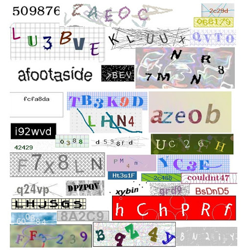    | 
| :--------: | 
| **Примеры текстовых капч.**  |  

Встречаются и другие виды капч, где надо не просто ввести символы с картинки, а произвести какое-то действие. Например, вас просят найти автобусы, пальмы, мотоциклы и другие предметы; решить пазл; расставить предметы в определённом порядке или рассортировать их.  

#### Дополнительные примеры капч: 
| 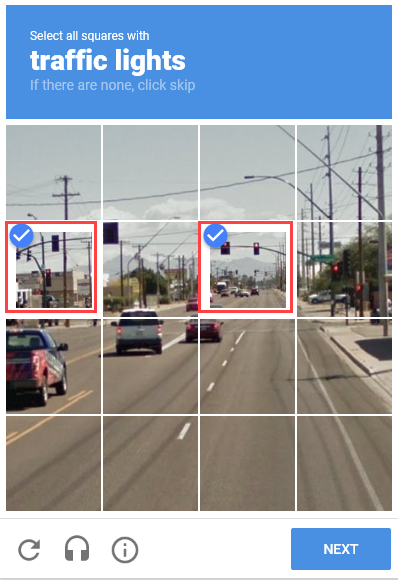    | 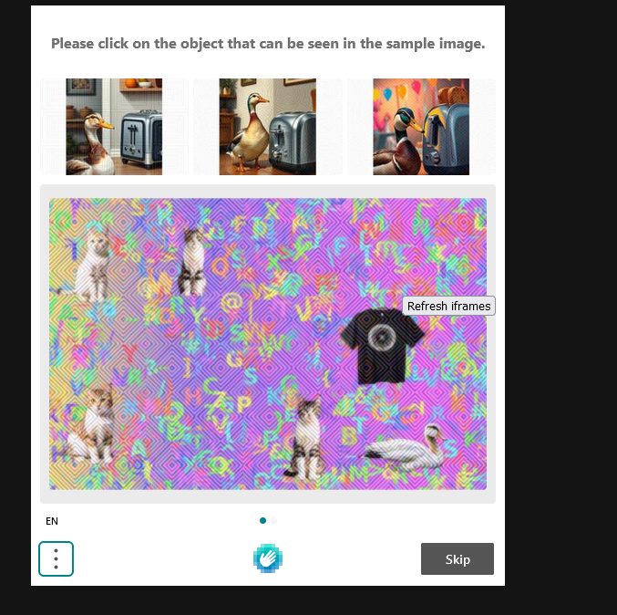 |
| :--------: | :-------: |
| [**ReCaptcha**](https://developers.google.com/recaptcha)  | [**HCaptcha**](https://www.hcaptcha.com/)    |  

|     |  |
| :--------: | :-------: |
| [**FunCaptcha**](https://www.arkoselabs.com/arkose-matchkey/)  | [**CloudFlare**](https://www.cloudflare.com/)    |

### Как добавить действие в проект?
- Через контекстное меню: **Добавить действие → Табы → Распознать капчу**

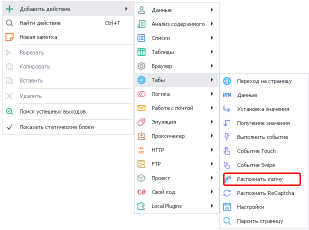

> *предварительно надо скачать изображение на компьютер, чтобы потом указать путь к файлу в экшене.*

- **В окне браузера:** кликнуть ПКМ по картинке на сайте и выбрать пункт **Это каптча!**

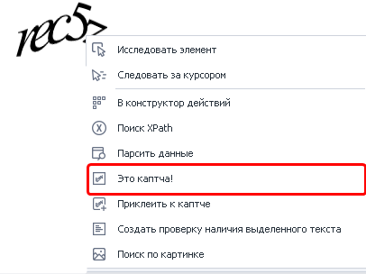

После добавления экшена сразу откроется окно [распознавания каптчи вручную](/zennoposter/ProjectMaker/Tools/Manual_Captcha_Entry), которое пока можно закрыть и перейти к настройкам экшена.
_______________________________________________
## Принцип работы
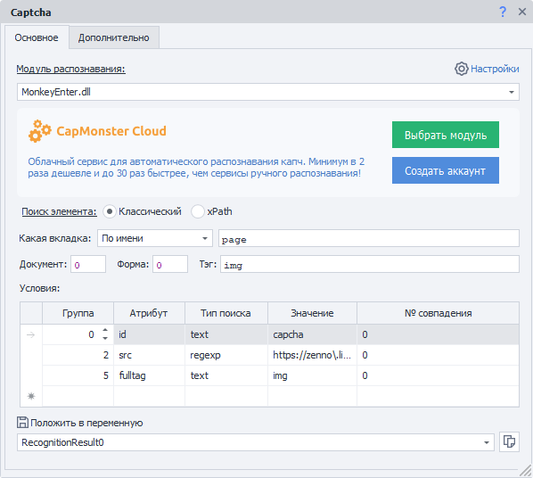

### Модуль распознавания
Из выпадающего списка выбираем модуль (каптча-сервис), через который будет распознана каптча. *Можно использовать переменные*.   

> *Предварительно надо указать его [API ключ в настройках](/zennoposter/ZennoPoster/Settings_ZP_and_ProxyChecker/Settings_ZennoPoster/Captchas).*  

По умолчанию стоит `MonkeyEnter.dll`. 

### Поиск элемента
Прежде чем взаимодействовать с элементом на странице, его надо найти. Для экшенов:  
- [Выполнить событие](../../../Project-editor/Actions-in-ProjectMaker-Actions-Blocks/Tabs/Perform_Event),  
- [Установка значений](../../../Project-editor/Actions-in-ProjectMaker-Actions-Blocks/Tabs/Setting_Value),  
- [Взятие значений](../../../Project-editor/Actions-in-ProjectMaker-Actions-Blocks/Tabs/Getting_Value),  
- [Событие Touch](../../../Project-editor/Actions-in-ProjectMaker-Actions-Blocks/Tabs/Touch_Event),  
- [Событие Swipe](../../../Project-editor/Actions-in-ProjectMaker-Actions-Blocks/Tabs/Swipe_Event)  

существует два способа поиска элементов — классический и с помощью XPath.

#### Классический
Поиск по параметрам HTML элемента: тэг, атрибут и его значение.


#### XPath 
Поиск с помощью XPath выражений. Он позволяет реализовать более универсальный и устойчивый к изменениям вёрстки способ поиска данных в сравнении с классическим поиском или регулярными выражениями.


_______________________________________________
## Доступные параметры
### Какая вкладка
Выбираем вкладку, на которой будет производиться поиск элемента.  

#### Возможные значения:
- **Активная вкладка**;
- **Первая**;
- **По имени** — при выборе данного пункта появится поле ввода для названия вкладки;
- **По номеру** — в поле ввода надо будет ввести порядковый номер вкладки *(нумерация начинается с нуля!)*.

### Документ
Рекомендуется ставить значение `-1` (поиск во всех документах на странице). 

### Форма
Тоже лучше ставить `-1` (поиск по всем формам на странице). При выборе такого значения шаблон будет более универсальным.

:::tip Почему лучше ставить `-1` ?
**Пример.**
На странице размещены три формы: форма поиска, форма регистрации и форма оформления заказа. Для клика по кнопке в форме заказа в настройках действия указано значение поля «Форма» — `2` (нумерация начинается с нуля).  

Со временем на сайте появляется новая форма — форма входа, которая добавляется перед формой заказа. В результате форма заказа смещается, и под индексом `2` теперь оказывается форма входа.  

В такой ситуации шаблон либо выдаст ошибку о том, что нужная кнопка не найдена, либо — что гораздо опаснее — выполнит клик по другой кнопке в другой форме, приводя к некорректной работе шаблона.  
:::

#### Примечание
В настройках программы можно включить два параметра: **«Искать во всех формах на странице»** и **«Искать во всех документах на странице»**.
При их активации при добавлении элемента в *Конструктор действий* значения полей **«Номер документа»** и **«Номер формы»** автоматически устанавливаются в `-1`, что означает поиск элемента по всей странице без привязки к конкретному документу или форме.

### Тэг (только классический поиск)


Это HTML тэг, у которого нужно получить значение.

:::tip Можно указать сразу несколько тегов через `;` *(точка с запятой)*
:::

### Условия (только классический поиск)


:::info Для удаления условия поиска
Нужно кликнуть ЛКМ по полю слева от него (на скриншоте выделено синим цветом) и нажать кнопку `DELETE` на клавиатуре.
:::

**1.** **Группа** — это параметр, определяющий приоритет условия поиска. Чем меньше значение группы, тем выше приоритет условия.  

Поиск выполняется последовательно: сначала проверяются условия с наивысшим приоритетом. Если элемент по ним не найден, система переходит к условиям со следующим приоритетом и продолжает поиск до тех пор, пока элемент не будет найден или не закончатся все условия.  

Допускается добавление нескольких условий с одинаковым приоритетом. В этом случае поиск выполняется одновременно по всем условиям, относящимся к одной группе.  
**2.** **Атрибут** — атрибут HTML тэга по которому производится поиск.  
**3.** **Тип поиска**:
    - *text* — поиск по полному либо частичному вхождению текста;
    - *notext* — поиск элементов в которых не будет указанного текста;
    - *regexp* — поиск с использованием регулярных выражений. По умолчанию поиск выполняется без учёта регистра символов.  
    Если необходимо учитывать регистр, добавьте в начало регулярного выражения конструкцию `(?-i)`, которая отключает регистронезависимый режим поиска.  
4. **Значение** — значение атрибута HTML тега.
5. **№ совпадения** — порядковый номер найденного элемента *(нумерация с нуля!)*. В этом поле можно использовать **диапазоны** и **макросы переменных**.

:::tip Для поиска нужного элемента можно использовать несколько условий.
:::

> Всегда важно стараться подбирать условия поиска таким образом, чтоб оставался только один элемент, т.е. порядковый номер был `0` (нумерация с нуля).  
_______________________________________________
## Вкладка «Дополнительно»
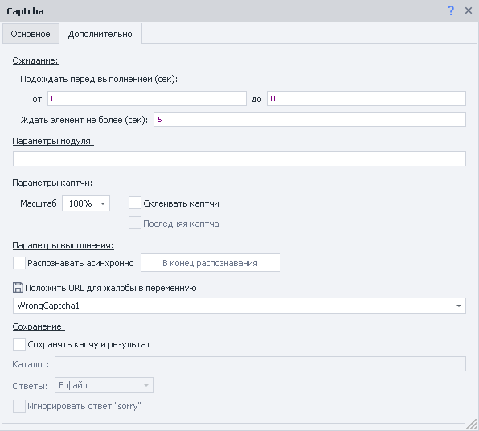

### Ожидание

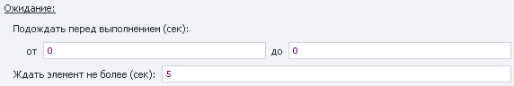

#### Подождать перед выполнением
Указываем интервал времени *в секундах*, который шаблон будет ждать **перед** нажатием.

#### Ждать элемент не более
Если по истечении указанного времени *в секундах* элемент **не появился** на странице, то экшен завершит работу с ошибкой.

### Параметры модуля 
В этом поле можно указать дополнительные параметры или условия, необходимые для разгадывания капчи. Например:  
- *Чувствительность к регистру*;  
- *Распознавание кириллицы*;  
- *Математическое значение*;  
- *Несколько слов*.  

:::info **Формат записи дополнительных параметров**
`название_параметра=значение_параметра`  
> *Несколько значений разделяются символом `&`*
:::  

**Примеры записи для CapMonster Cloud API:**  
- `CapMonsterModule = ZennoLab.vk` (выбор одного из текстовых модулей);  
- `CaseSensitive = true` (чувствительность к регистру);  
- `Numeric = false` (капча состоит не только из цифр);  
- `Math = true` (в задании присутствует математическая операция).  

### Параметры каптчи

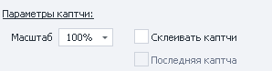

#### Масштаб 
С помощью этой настройки можно уменьшить или увеличить размер отправляемой картинки с капчей.

#### Склеивать каптчи
Некоторые капчи состоят из нескольких картинок, поэтому может понадобиться объединить их для быстрого и корректного решения.  

Установите флаг на **Склеивать каптчи** для первого элемента. Затем по каждому следующему элементу кликайте **ПКМ → Приклеить к каптче** из контекстного меню.  

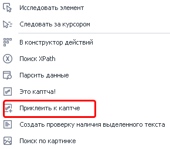  

При каждом клике будет создаваться новый экшен. У последнего нужно обязательно поставить чекбокс **Последняя капча**. 

### Асинхронное распознавание
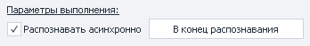

Эта настройка позволяет не ждать ответа от сервиса, а продолжать выполнение шаблона.  

При этом создаётся экшен **Ожидание распознавания капчи**. Настроек у него нет, доступна лишь одна кнопка **В начало распознавания**, после клика на которую вас перенаправит на основной экшен решения капчи. Это особенно удобно, если на холсте эти экшены находятся далеко друг от друга. В основном же экшене есть обратная кнопка **В конец распознавания**.  

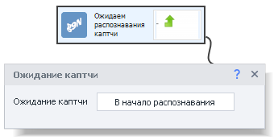  

**Процесс работы:**  
1. Шаблон доходит до основного экшена **Распознать капчу**.  
2. Отправка капчи на сервис.  
3. Продолжение работы шаблона вплоть до экшена **Ожидание капчи**.  
4. Ждёт ответа от сервиса.  
5. После получения результата его можно поместить в переменную.  

### Положить URL для жалобы.  
Данная опция нужна, чтобы пожаловаться сервису на некорректное распознавание конкретной капчи. По условиям некоторых солверов вы можете потребовать возврат денег за неуспешно пройденную капчу.  

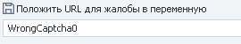

В поле вы указываете название переменной, в которой будет храниться URL-сервиса, на который нужно отправлять жалобы.  

:::warning **Рекомендуем ответственно использовать эту возможность.**
Если будете часто жаловаться и запрашивать возврат средств, то сервис может вас заблокировать.  

Сначала постарайтесь разобраться в причинах частых ошибок и устранить их.
:::  

### Сохранение
В этом разделе вы можете сохранить картинку с капчей и ответ на неё в указанный каталог.  

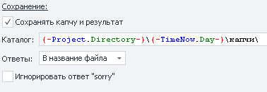

#### Доступные параметры:  
- **Каталог**. Указываем директорию, в которую будем загружать картинки. Можно использовать [**переменные**](../../Data/WorkWithVariables).  
- **Ответы**. Выбираем из двух вариантов, куда будут сохраняться ответы на капчи:  
    - *В названии файла*.  
    Удобно, но не всегда получается использовать, потому что Windows не поддерживает символы, встречающиеся в некоторых заданиях.  
    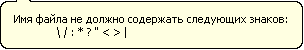  
    - *В файл*.  
    Картинка с капчей будет сохраняться с именем `captcha(X).png`, где **X** — это порядковый номер капчи.  
    Также будет создан текстовый файл `captcha(X).txt` с ответом на эту капчу.  
- **Игнорировать ответ “sorry”**. При возникновении некоторых ошибок экшен возвращает **`sorry`** вместо ответа на капчу. Если включить эту опцию, то программа не будет сохранять капчи с таким ответом.  

:::tip **Сохранение капч с ответами может быть полезно**.
При [создании собственного модуля](https://capmonster.cloud/UserModules) в **CapMonster Cloud**.
:::  
_______________________________________________
## Полезные советы
### Текстовые каптчи
Иногда на слабозащищенных ресурсах встречаются капчи, которые не нарисованы графическим текстом на картинке, а написаны обычным текстом (просто буквы как, например, в блокноте).  

Такую капчу нужно не отсылать на сервис, а просто спарсить прямо из текста страницы. Сделать это можно через экшен [**Обработка текста**](/zennoposter/ProjectMaker/Project-editor/Actions-in-ProjectMaker-Actions-Blocks/Data/Text_Processing). Выбираете текст страницы, включив опцию **парсить результат**, и в параметры вписываете [**регулярное выражение**](/zennoposter/ProjectMaker/Tools/Regular_Expression_Tester) для парсинга страницы.  

### Математическа каптча
Ещё встречаются такие же простые текстовые капчи, как в прошлом примере, но с математическими выражениями (сложение, вычетание, умножение или деление).  

Их содержание можно превратить в изображение и отправить на сервис для распознавание, а можно использовать [**JavaScript**](../Custom_code/JavaScript_Code) из раздела **Свой код**.  

В поле кода вставляем ссылку на переменную с математическим выражением, а в качестве результата получаем ответ на него.  

### Flash каптча и каптча из любого другого элемента
Её также можно просто превратить в обычную картинку и отправить на сервис. Найдите этот flash в [**Древе элементов**](/zennoposter/ProjectMaker/Program-interface/Element_Tree_Window) и через ПКМ откройте контекстное меню. Там нужно выбрать пункт **Это капча!**

### Как обрабатывать ошибки распознавания CAPTCHA
:::info Видео записано для устаревшей версии ZennoPoster
Но сам алгоритм остался прежним.
:::

<iframe width="560" height="315" src="https://www.youtube.com/embed/z1uLzCEUcZ8" title="YouTube video player" frameborder="0" allow="accelerometer; autoplay; clipboard-write; encrypted-media; gyroscope; picture-in-picture; web-share" allowfullscreen></iframe>


### Как сделать скриншот браузера с помощью экшена Распознать капчу?
Иногда возникает необходимость сделать скриншот определённого HTML элемента или всего сайта (даже тех частей, которые находятся вне зоны видимости). Для этого: 

- добавьте в проект экшен Распознавания каптчи (**обязательно через контекстное меню браузера**)
- в качестве модуля распознавания выберите `CaptchaSaver.dll`
- задайте критерии поиска элемента, для которого надо сделать скриншот
- во вкладке «Дополнительно» в *Параметрах модуля* укажите полный путь для сохранения изображения (можно использовать *макросы переменных*)

:::warning Лучше воспользоваться экшеном «Обработка изображений»
Когда нужен скриншот только видимой области сайта 
:::


<details>
<summary>Пример настроек экшена для скриншота всего сайта</summary>

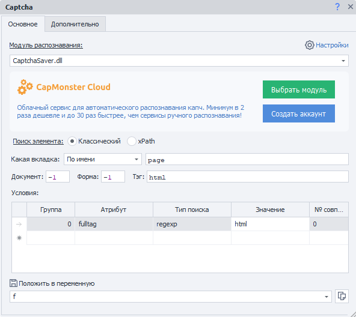

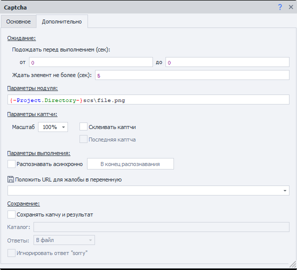

</details>

_______________________________________________
## Пример использования
### Типичный случай
Рассмотрим стандартный пример решения капчи, который встречается чаще всего:  
1. Кликаем ПКМ по изображению капчи и выбираем из контекстного меню **Это каптча!**.  
2. Сразу после добавления этого экшена откроется **Окно ручного распознавания**, которое можно закрыть.
3. Выбираем необходимый модуль распознавания (по умолчанию стоит `MonkeyEnter.dll` — ввод вручную).
> *Убедитесь, что вы указали API ключ в Настройках и на балансе сервиса есть средства.*
4. Теперь жмём ПКМ в поле, куда надо ввести ответ на капчу. Выбираем пункт *Поле для результата распознавания каптчи*. После чего будет добавлен ещё один экшен для ввода ответа на капчу *(для этого должна быть включена **Запись** в проекте)*.  
5. Либо можно вручную найти поле с помощью **Конструктора действий** и ввести ответ при помощи экшена [Установка значения](./Setting_Value).

### Склеивание
Для данного примера будет использоваться страница следующего содержания:

<details>
<summary>Исходный код тестовой страницы.</summary>

```html
<!DOCTYPE html>
<html>
<head>
	<title>CAPTCHA Test</title>
</head>
<body>
	
	
	
	
</body>
</html>
```

</details>  

> Каждый символ здесь — **отдельный HTML элемент**.   
1. Кликаем ПКМ по первой картинке → **Это каптча!**.  
2. В настройках выбираем **Склеивать каптчи**.  
3. Также кликаем ПКМ по остальным картинкам → из контекстного меню выбираем **Приклеить к каптче**.  
4. В итоге должно получиться четыре экшена:  
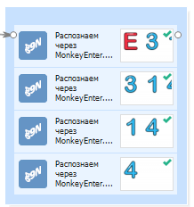

После запуска первые три экшена будут собирать картинки и приклеивать их друг к другу, а уже последний экшен, приклеив заключительную часть, отправит на сервис полную каптчу для распознавания.

### Решение с дополнительными параметрами
Представим, что есть подобная капча:


Она состоит из отдельных частей, а нам надо получить результат выражения *(конкретно здесь — сложения)*.

<details>
<summary>Исходный код страницы с каптчей</summary>

```html
<!DOCTYPE html>
<html>
<head>
	<title>CAPTCHA Test</title>
</head>
<body>
	
	
	
	
</body>
</html>
```

</details> 

1. Сначала склеиваем все картинки в одну.  
2. Затем у последнего экшена выбираем подходящий сервис (например, RuCaptcha).  
3. В **Параметрах** на вкладке «Дополнительно» указываем, что капча математическая — `calc=1`.  

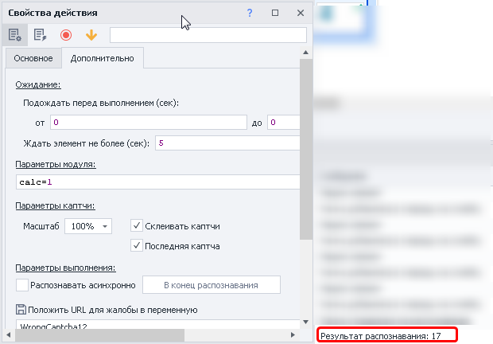
_______________________________________________
## Полезные ссылки
- [❗→ Экшен ReCaptcha2](https://zennolab.atlassian.net/wiki/spaces/RU/pages/534053033/ReCaptcha "https://zennolab.atlassian.net/wiki/spaces/RU/pages/534053033/ReCaptcha")
- [❗→ Настройки каптча сервисов](/wiki/spaces/RU/pages/808845385 "/wiki/spaces/RU/pages/808845385")
- [Страниц с разными видами каптч](https://lessons.zennolab.com/captchas/ "https://lessons.zennolab.com/captchas/")
- [❗→ Браузер](/wiki/spaces/RU/pages/534315373 "/wiki/spaces/RU/pages/534315373")
- [❗→ Тестер регулярных выражений](/wiki/spaces/RU/pages/534086111 "/wiki/spaces/RU/pages/534086111")