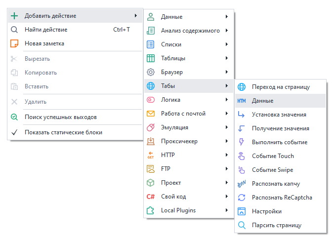
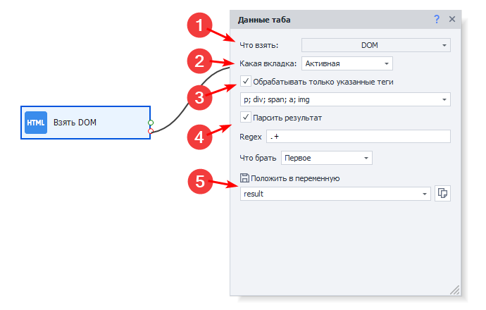
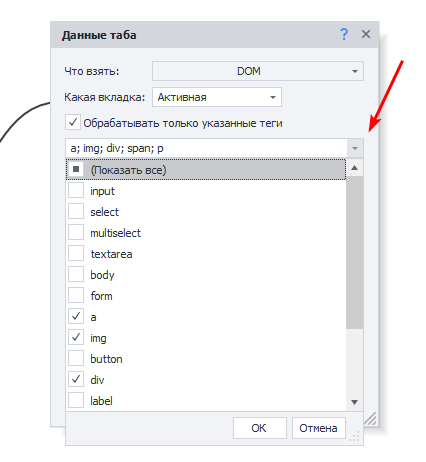
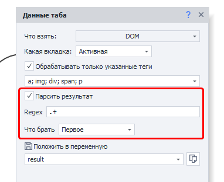
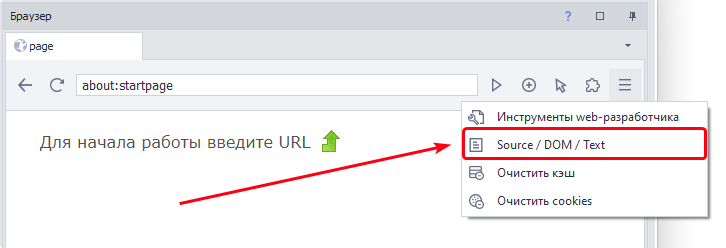
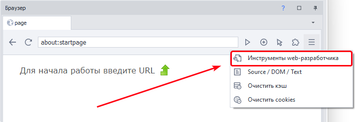
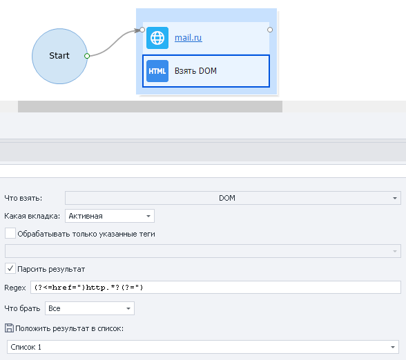

---
sidebar_position: 2
title: "Данные"
description: ""
date: "2025-07-30"
converted: true
originalFile: "Данные (операции с табом).txt"
targetUrl: "https://zennolab.atlassian.net/wiki/spaces/RU/pages/534085840"
---
import DisclaimerNotice from '@site/src/components/DisclaimerNotice';

<DisclaimerNotice />

> 🔗 **[Оригинальная страница](https://zennolab.atlassian.net/wiki/spaces/RU/pages/534085840)** — Источник данного материала

_______________________________________________  
## Описание
Данный экшен предназначен для получения данных со страницы. 

### Как добавить действие в проект?
Через контекстное меню: **Добавить действие → Табы → Данные**

### Для чего это используется?
- Найти и сохранить нужную информацию со страницы
- Проверить, есть ли какие-то значения на странице
- Спарсить текст со страницы
- Взять URL страницы
_______________________________________________ 
## Принцип работы

### Что взять
Выбираем тип данных, которые хотим получить:
- **DOM** — объектная модель документа;
- **Source** — исходный код страницы;
- **Text** — видимый текст страницы;
- **URL** — адрес ссылки из адресной строки.

### Какая вкладка
Определяем вкладку, с которой берём данные:
- **Активная** — текущая активная вкладка;
- **Первая** — если вкладок несколько, то взять первую по счёту;
- **По имени** — выбрать вкладку по её имени;
- **По номеру** — выбрать вкладку по номеру (если их несколько).

### Обрабатывать только указанные теги
Если необходимо обрабатывать один конкретный или несколько определённых HTML-тегов, то активируем чекбокс и выбираем нужные варианты.  

### Парсить результат
При необходимости результат можно распарсить, указав регулярное выражение (Regex), нужные совпадения и место сохранения — переменную или таблицу.  

> *Подобрать подходящее регулярное выражение можно с помощью [Тестера регулярных выражений](/zennoposter/ProjectMaker/Tools/Regular_Expression_Tester)*.

:::tip «[Парсить страницу](./Parse_Page_Collect_Data)»
Это более удобный инструмент для получения данных со страницы. 
:::
_______________________________________________
## Разница между «Source» и «DOM»
**Source** — исходный код страницы, который получен с сервера.  

**DOM** — это дерево объектов, которые браузер создает в памяти компьютера на основании исходного кода, полученного им от сервера.

Если сильно упростить, то браузер работает следующим образом:
1. Вы вводите в адресную строку URL и нажимаете `Enter`.
2. Браузер отправляет запрос на сервер.
3. Сервер возвращает ответ в виде исходного HTML-кода страницы (**Source**).
4. На основе исходного кода браузер строит **DOM** (Data Object Model — объектная модель документа). А также: 
    - обрабатывает ошибки (добавляет теги html, body, head и другие, если они не были написаны).
    - закрывает незакрытые теги.
    - добавляет тег `<tbody>` к таблицам (`<table>`), если его не было. А в HTML этот тег можно не использовать. *Учитывайте это при построении [XPath](/zennoposter/ProjectMaker/Recording-and-creating-projects/General-information/XPath) и [Регулярных выражений](/zennoposter/ProjectMaker/Tools/Regular_Expression_Tester)*
    - обрабатывает скрипты, которые могут добавлять новые элементы во время и после полной загрузки страницы.
5. По итогу браузер на основе DOM отрисовывает и показывает содержимое веб-страницы.

**DOM** может содержать элементы, отсутствующие в исходном коде (**Source**), поскольку он формируется с учётом контента, динамически добавляемого через JavaScript.

:::tip При работе с [HTTP-запросами](/zennoposter/ProjectMaker/Project-editor/Actions-in-ProjectMaker-Actions-Blocks/Http/HTTP-request) вы всегда будете иметь дело именно с «Source».
:::

### Два инструмента для просмотра «Source» и «DOM»
#### [Просмотр исходного кода](/zennoposter/ProjectMaker/Browser_Window/#просмотр-исходного-кода)

#### [Инструменты web-разработчика](/zennoposter/ProjectMaker/Browser_Window/Web_Developer_Tools_DevTools) (только для движка Chrome)

_______________________________________________
## Пример использования
Хотим получить все ссылки со страницы.  

Что взять: «Source» или «DOM» → затем парсить результат → указываем регулярное выражение Regex: `(?<=href=")http.*?(?=")`

Берём все значения, а результат отправляем в список.

В итоге, как и хотели, получим все ссылки, имеющиеся на выбраной странице.
_______________________________________________
## Полезные ссылки

- [❗→ Тестер регулярных выражений](/wiki/spaces/RU/pages/534086111 "/wiki/spaces/RU/pages/534086111")
- [❗→ 💻Окно браузера](/wiki/spaces/RU/pages/534315373 "/wiki/spaces/RU/pages/534315373")