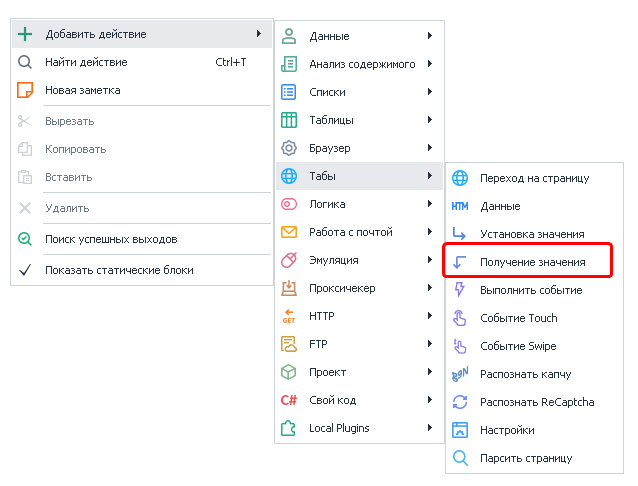
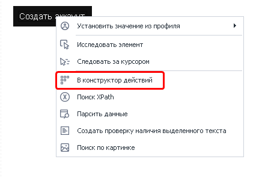
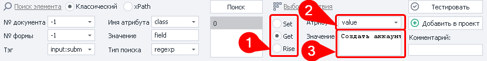
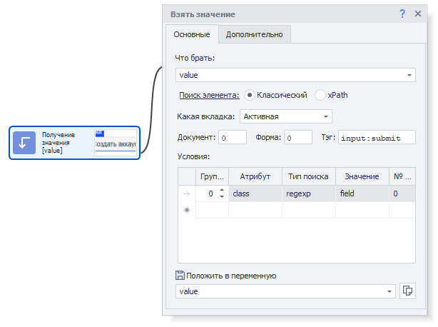
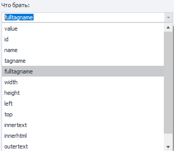
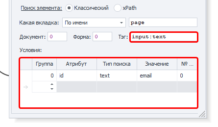
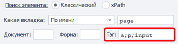
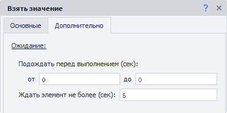

---
sidebar_position: 4
title: "Получение значения"
description: ""
date: "2025-07-30"
converted: true
originalFile: "Получение значения.txt"
targetUrl: "https://zennolab.atlassian.net/wiki/spaces/RU/pages/534315124"
---
import DisclaimerNotice from '@site/src/components/DisclaimerNotice';

<DisclaimerNotice />

> 🔗 **[Оригинальная страница](https://zennolab.atlassian.net/wiki/spaces/RU/pages/534315124)** — Источник данного материала

_______________________________________________  
## Описание
Данный экшен служит для получения значения указанного элемента. Это может быть:

- Высота\ширина
- Внутренний текст\HTML код
- HTML атрибуты - id, class, name, style и др.
- Имя тэга
- И многое другое

### Как добавить действие в проект?
Через контекстное меню: **Добавить действие → Табы → Получение значения**

### Для чего это используется?
- **Парсинг данных**.  
> *Однако мы рекомендуем использовать для этого [специальный инструмент](./Parse_Page_Collect_Data).* 
- **Проверка наличия элемента** на странице. Это может быть полезно для:
  - определения успешной авторизации. Например, появляется ли кнопка перехода в личный кабинет. Либо наоборот, пропадает кнопка «Вход».  
  - поиск сообщений с ошибками. К примеру, когда капча разгадана неверно, то часто на странице появляется новый HTML элемент с текстом ошибки.  
  > *Для проверки наличия текста на странице используйте [специальный экшен](./Text_Presence_Check).*
- **Проверка видимости элемента**. Бывают случаи, когда найденный элемент по факту не отображается на странице. Чтобы точно проверить его отображение, можно взять атрибуты `height` (высота) и `width` (ширина) и проверить, что каждый из них больше `0`.
_______________________________________________
## Выбор элемента для получения значения
> Рассмотрим на примере https://lessons.zennolab.com/ru/registration.  

Представим, что нам нужно получить текст кнопки, которая отправляет заполненную форму создания аккаунта. Для этого делаем клик ПКМ по этой кнопке → выбираем **В конструктор действий**.

Под окном браузера откроется [Конструктор действий](/zennoposter/ProjectMaker/Browser_Window/Action_Constructor_and_XPath_Search).

Данные для поиска будут автоматически подобраны таким образом, что в результате останется только один элемент.  

**Ваши действия:**
- Выбираем **Get (1)** *(получить)*.
- Текст кнопки хранится в атрибуте `value`, поэтому выбираем именно его из выпадающего списка **Атрибут (2)**.  
- В поле **Значение** появится текст **`Создать аккаунт` (3)**.
- Перед добавлением экшена рекомендуем **протестировать** его работу *(особенно если вы вносили изменения)*.
- Также советуем добавить **комментарий** к экшену *(подпись по умолчанию малоинформативна)*.
- **Добавляем** экшен в проект, нажав соответствующую кнопку.
______________________________________________
## Вкладка «Основные» 

### Что брать
Из выпадающего списка выбираем, что именно хотим получить.  

> *Значение можно указать и вручную, не обязательно выбирать из предложенных.*  

На сайтах часто встречаются атрибуты `data-...`. Например: `data-name`, `data-value`, `data-testid`, `data-whatever`. Их нет среди заготовленного списка, поэтому нужно указывать вручную.

:::tip Поддерживаются переменные проекта (`{ -Variable.var\_name- }`)
:::
### Поиск элемента
Прежде чем взаимодействовать с элементом на странице, его надо найти. Для экшенов:  
- [Выполнить событие](../../../Project-editor/Actions-in-ProjectMaker-Actions-Blocks/Tabs/Perform_Event),  
- [Установка значений](../../../Project-editor/Actions-in-ProjectMaker-Actions-Blocks/Tabs/Setting_Value),  
- [Взятие значений](../../../Project-editor/Actions-in-ProjectMaker-Actions-Blocks/Tabs/Getting_Value),  
- [Событие Touch](../../../Project-editor/Actions-in-ProjectMaker-Actions-Blocks/Tabs/Touch_Event),  
- [Событие Swipe](../../../Project-editor/Actions-in-ProjectMaker-Actions-Blocks/Tabs/Swipe_Event)  

существует два способа поиска элементов — классический и с помощью XPath.

#### Классический
Поиск по параметрам HTML элемента: тэг, атрибут и его значение.

#### XPath 
Поиск с помощью XPath выражений. Он позволяет реализовать более универсальный и устойчивый к изменениям вёрстки способ поиска данных в сравнении с классическим поиском или регулярными выражениями.

_______________________________________________
## Доступные параметры
### Какая вкладка
Выбираем вкладку, на которой будет производиться поиск элемента.  

#### Возможные значения:
- **Активная вкладка**;
- **Первая**;
- **По имени** — при выборе данного пункта появится поле ввода для названия вкладки;
- **По номеру** — в поле ввода надо будет ввести порядковый номер вкладки *(нумерация начинается с нуля!)*.

### Документ
Рекомендуется ставить значение `-1` (поиск во всех документах на странице). 

### Форма
Тоже лучше ставить `-1` (поиск по всем формам на странице). При выборе такого значения шаблон будет более универсальным.

:::tip Почему лучше ставить `-1` ?
**Пример.**
На странице размещены три формы: форма поиска, форма регистрации и форма оформления заказа. Для клика по кнопке в форме заказа в настройках действия указано значение поля «Форма» — `2` (нумерация начинается с нуля).  

Со временем на сайте появляется новая форма — форма входа, которая добавляется перед формой заказа. В результате форма заказа смещается, и под индексом `2` теперь оказывается форма входа.  

В такой ситуации шаблон либо выдаст ошибку о том, что нужная кнопка не найдена, либо — что гораздо опаснее — выполнит клик по другой кнопке в другой форме, приводя к некорректной работе шаблона.  
:::

#### Примечание
В настройках программы можно включить два параметра: **«Искать во всех формах на странице»** и **«Искать во всех документах на странице»**.
При их активации при добавлении элемента в *Конструктор действий* значения полей **«Номер документа»** и **«Номер формы»** автоматически устанавливаются в `-1`, что означает поиск элемента по всей странице без привязки к конкретному документу или форме.

### Тэг (только классический поиск)

Это HTML тэг, у которого нужно получить значение.

:::tip Можно указать сразу несколько тегов через `;` *(точка с запятой)*
:::

### Условия (только классический поиск)

:::info Для удаления условия поиска
Нужно кликнуть ЛКМ по полю слева от него (на скриншоте выделено синим цветом) и нажать кнопку `DELETE` на клавиатуре.
:::

**1.** **Группа** — это параметр, определяющий приоритет условия поиска. Чем меньше значение группы, тем выше приоритет условия.  

Поиск выполняется последовательно: сначала проверяются условия с наивысшим приоритетом. Если элемент по ним не найден, система переходит к условиям со следующим приоритетом и продолжает поиск до тех пор, пока элемент не будет найден или не закончатся все условия.  

Допускается добавление нескольких условий с одинаковым приоритетом. В этом случае поиск выполняется одновременно по всем условиям, относящимся к одной группе.  
**2.** **Атрибут** — атрибут HTML тэга по которому производится поиск.  
**3.** **Тип поиска**:
    - *text* — поиск по полному либо частичному вхождению текста;
    - *notext* — поиск элементов в которых не будет указанного текста;
    - *regexp* — поиск с использованием регулярных выражений. По умолчанию поиск выполняется без учёта регистра символов.  
    Если необходимо учитывать регистр, добавьте в начало регулярного выражения конструкцию `(?-i)`, которая отключает регистронезависимый режим поиска.  
4. **Значение** — значение атрибута HTML тега.
5. **№ совпадения** — порядковый номер найденного элемента *(нумерация с нуля!)*. В этом поле можно использовать **диапазоны** и **макросы переменных**.

:::tip Для поиска нужного элемента можно использовать несколько условий.
:::

> Всегда важно стараться подбирать условия поиска таким образом, чтоб оставался только один элемент, т.е. порядковый номер был `0` (нумерация с нуля).
_______________________________________________
## Вкладка «Дополнительно»

### 1. Подождать перед выполнением
Указываем интервал времени *в секундах*, который шаблон будет ждать **перед** установкой значения.

### 2. Ждать элемент не более
Если по истечении указанного времени *в секундах* элемент **не появился** на странице, то экшен завершит работу с ошибкой.
_______________________________________________
## Пример использования
Рассмотрим работу экшена на реальном примере. В качестве тестового сайта используем страницу: https://lessons.zennolab.com/ru/advanced.

Заполняем поля формы с помощью экшенов: [Установка значения](./Setting_Value) и [Обработка переменных](../Data/Variable_Processing).  

Далее *(если бы это был реальный проект)* нам бы пришлось [решать капчу](./Captcha_Recognition) с помощью сервисов или [вручную](/zennoposter/ProjectMaker/Tools/Manual_Captcha_Entry). Но на этой тестовой странице картинка с капчей всегда одна и та же.  

Вводим все данные с помощью экшена [Выполнить событие](./Perform_Event) и кликаем по кнопке **Создать аккаунт**. Далее события могут развиваться в нескольких направлениях:
- мы **всё верно** заполнили и правильно разгадали капчу. Тогда получим страницу с текстом `Wellcome!`

- **капча разгадана неверно**. В этом случае загрузится страница с текстом `wrong captcha`

Теперь, используя конструктор действий, создаём экшен **Получение значения**, в который сохранится текст, показанный на скриншотах выше. В переменную при этом попадает много лишнего — текст `adv\_reg` и названия пунктов меню.  

Используя [Обработку текста](../Data/Text_Processing) и регулярное выражение: **`(Wellcome!|wrong\ captcha)`** ищем либо `Wellcome` либо `wrong captcha`. Далее через [Switch](../Logic/Switch_Multiple_Options) делаем проверку содержимого переменной. В зависимости от результата появится соответствующее сообщение в [**Логе**](/zennoposter/ProjectMaker/Program-interface/Log_Window).
_______________________________________________
## Полезные ссылки
- [❗→ Конструктор действий и Поиск по XPath](/wiki/spaces/RU/pages/483426337 "/wiki/spaces/RU/pages/483426337")
- [❗→ Установка значения](/wiki/spaces/RU/pages/534315117 "/wiki/spaces/RU/pages/534315117")
- [❗→ Выполнить событие](/wiki/spaces/RU/pages/534020211 "/wiki/spaces/RU/pages/534020211")
- [❗→ Обработка текста](/wiki/spaces/RU/pages/488865793 "/wiki/spaces/RU/pages/488865793")
- [❗→ Тестер регулярных выражений](/wiki/spaces/RU/pages/534086111 "/wiki/spaces/RU/pages/534086111")
- [❗→ Парсить страницу (Собрать данные со страницы)](/wiki/spaces/RU/pages/534085857 "/wiki/spaces/RU/pages/534085857")
- [❗→ Работа с переменными](/wiki/spaces/RU/pages/486309922 "/wiki/spaces/RU/pages/486309922")
- [❗→ XPath](/wiki/spaces/RU/pages/862093419 "/wiki/spaces/RU/pages/862093419")
- [❗→ Диапазоны значений](/wiki/spaces/RU/pages/488964137 "/wiki/spaces/RU/pages/488964137")
- [❗→ Проверка наличия текста](/wiki/spaces/RU/pages/1308426253 "/wiki/spaces/RU/pages/1308426253")