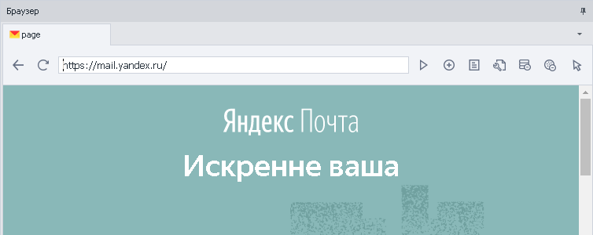
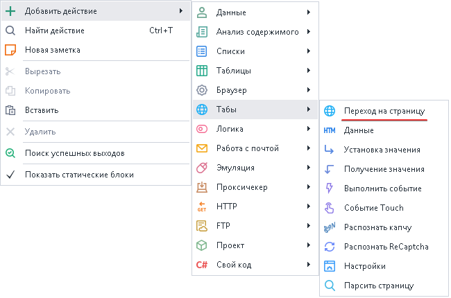
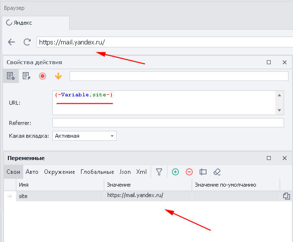
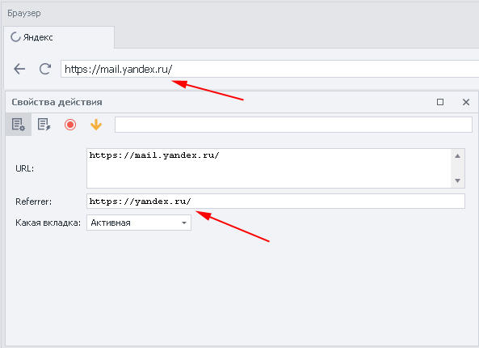
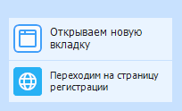

---
sidebar_position: 1
title: "Переход на страницу"
description: ""
date: "2025-07-30"
converted: true
originalFile: "Переход на страницу (Открыть страницуNavigate).txt"
targetUrl: "https://zennolab.atlassian.net/wiki/spaces/RU/pages/534052989/Navigate"
---
import DisclaimerNotice from '@site/src/components/DisclaimerNotice';

<DisclaimerNotice />

> 🔗 **[Оригинальная страница](https://zennolab.atlassian.net/wiki/spaces/RU/pages/534052989/Navigate)** — Источник данного материала

_______________________________________________  
## Описание
Это действие загрузит нужный сайт или точную страницу в указанной вкладке браузера.

|  |
| :--: |
| В активной вкладке браузера открылась заданная страница сайта |

### Где можно применить: 
- Для загрузки сайта
- Открытие точной страницы сайта
- Активация учетных записей
- Имитация перехода с сайта на другой ресурс
- Загрузка сайта в неактивной вкладке браузера

### Как добавить действие в проект?
Через контекстное меню: **Добавить действие → Табы → Переход на страницу**

_______________________________________________
## Принцип работы
#### URL
В этом поле нужно указать страницу сайта или переменную, содержащую адрес, для последующего открытия.

#### Referrer
Здесь указываем ресурс, **с** которого был произведён переход, тем самым показывая сайту, что мы живой пользователь. 

> *Можно вставить переменную с готовым списком.*

|  |
| :--: |
| Переход на сайт Яндекс.Почта со стартовой страницы Яндекса |

#### Какая вкладка 
Указываем точно в каком окне загружать сайт или страницу.

- **Активная** — вкладка, которая находится непосредственно у вас перед глазами.
- **Первая** — загрузит сайт, который открыт в самой первой вкладке слева.
- **По имени** — пишем имя вкладки с учетом регистра букв или указываем переменную, где оно лежит.
- **По номеру** — номер вкладки отсчитывается слева направо, начиная с нуля (`0`).

:::tip Активное окно не изменится
Если загружаем сайт в первой вкладке **По имени** или **По номеру**.  

**Сайт откроется в неактивном табе.**
:::
_______________________________________________
## Пример использования: 
Представим, что необходимо во второй вкладке загрузить сайт почты для активации учетной записи.  

1. В активном окне делаем необходимые действия для регистрации.
2. Указываем вкладку с номером **1** *(то есть вторую, так как отсчёт с нуля)*. Загружаем параллельно сайт почты.
3. Переходим в нужный таб и активируем аккаунт.
_______________________________________________
## Полезные ссылки
1. [❗→ Управление табом](/wiki/spaces/RU/pages/534020201 "/wiki/spaces/RU/pages/534020201")
2. [❗→ Настройки](https://zennolab.atlassian.net/wiki/spaces/RU/pages/534020228/- "https://zennolab.atlassian.net/wiki/spaces/RU/pages/534020228/-")