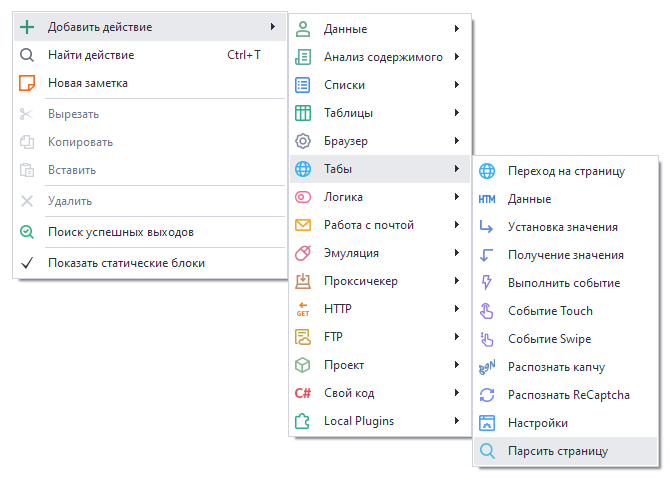
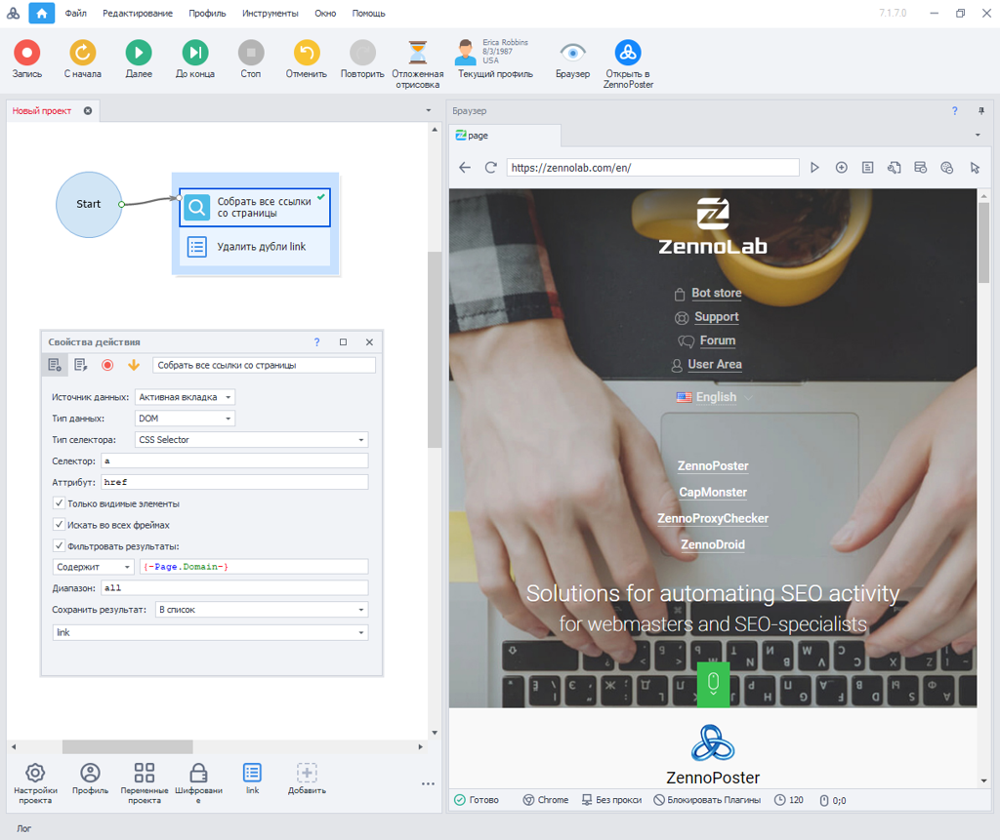
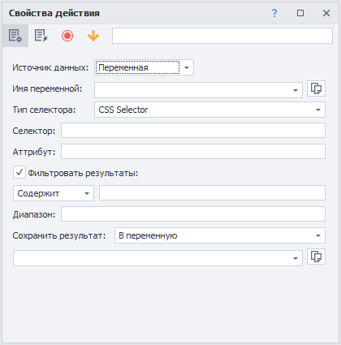
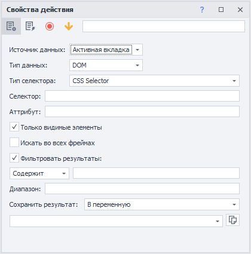
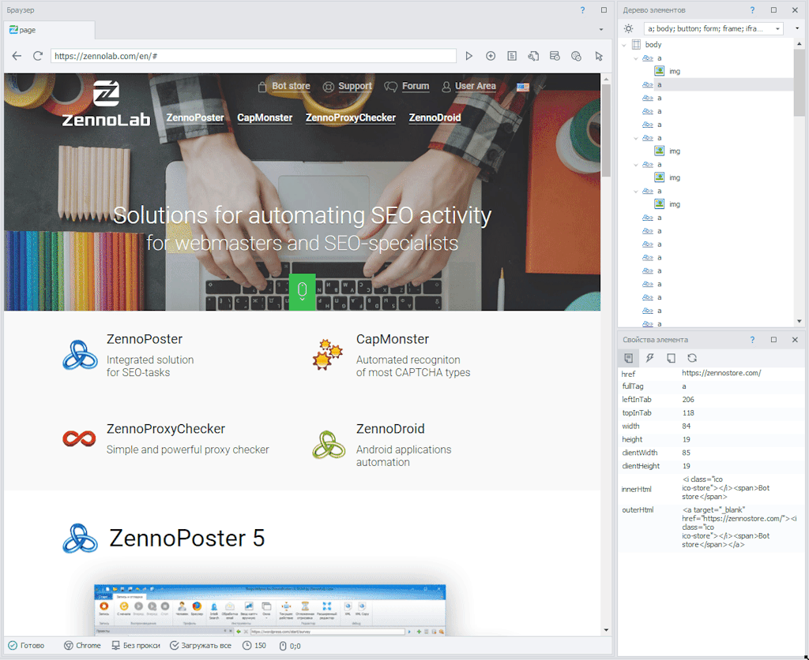

---
sidebar_position: 13
title: "Парсить страницу"
description: ""
date: "2025-07-30"
converted: true
originalFile: "Парсить страницу (Собрать данные со страницы).txt"
targetUrl: "https://zennolab.atlassian.net/wiki/spaces/RU/pages/534085857"
---
import DisclaimerNotice from '@site/src/components/DisclaimerNotice';

<DisclaimerNotice />

> 🔗 **[Оригинальная страница](https://zennolab.atlassian.net/wiki/spaces/RU/pages/534085857)** — Источник данного материала

_______________________________________________  
## Описание
Данный экшен **собирает данные со страницы**, позволяя получить необходимую информацию. Можно задавать разные условия, что делает поиск более гибким и точным.  

### Как добавить действие в проект?

Через контекстное меню: **Добавить действие** → **Табы** → **Парсить страницу**

  
_______________________________________________ 
## Пример использования
Представим, что нам нужно собрать **все видимые ссылки со страницы текущего домена**.

В результате работы экшена мы получим данные в [Список](/zennoposter/ProjectMaker/Project-editor/Actions-in-ProjectMaker-Actions-Blocks/Lists/List_Operations) проекта. А с помощью функции **Удалить дубли** оставим в списке только уникальные ссылки.
_______________________________________________ 
## Свойства действия
Нажав дважды ЛКМ по действию в рабочей области проекта, вы откроете окно с его свойствами.  

### Источник данных: Переменная

Для «Переменной» доступны следующие параметры:

- **Имя переменной** — переменная проекта, в которой находится HTML-код.
- **Тип селектора** — язык запросов: *XPath* или *CSS Selector*.
- **Селектор** — путь до конкретного элемента веб-страницы, к которому нужно обратиться. Указывается через **XPath** или **CSS Selector** (в зависимости от выбора выше).
- **Атрибут** — свойство HTML-тега, которое необходимо получить в ходе сбора данных. 
- **Фильтровать результат** — если включено, то можно задать условие для выбора объекта: *Содержит*, *Не содержит*, *Regex (регулярное выражение)*.
- [**Диапазон**](/zennoposter/ProjectMaker/Recording-and-creating-projects/General-information/Value_Ranges) — условие для отбора данных из массива объектов.
- **Сохранить результат** — после окончания сбора данных, можно поместить результат в переменную или список.

### Источник данных: Активная вкладка

Параметры, характерные только для «Активной вкладки»:
- **Тип данных** — DOM или HTML. Нужны для работы с объектами.
- **Только видимые элементы** — при включении будут выбираться только те элементы, которые отображены на странице.
- **Искать во всех фреймах** (от англ. frame) — нужный элемент будет искаться не только в основном HTML-коде страницы, но и внутри всех встроенных в нее окон (фреймов). Обычно это теги `<iframe>`.  
_______________________________________________ 
## Быстрый способ сбора данных
Альтернативный способ для быстрой настройки сбора данных, располагается в контекстном меню панели «[Дерево элементов](/zennoposter/ProjectMaker/Program-interface/Element_Tree_Window)».  

> *Либо клик ПКМ в браузере → пункт «Парсить данные».*  

В открывшемся окне можно в несколько кликов мыши задать параметры поиска и начать незамедлительный сбор информации. При этом без особых знаний языков запросов **XPath** или **CSS Selector**.

_______________________________________________
## Полезные ссылки
- [❗→ Конструктор действий и Поиск по XPath](/wiki/spaces/RU/pages/483426337 "/wiki/spaces/RU/pages/483426337")
- [❗→ Окно дерева элементов](/wiki/spaces/RU/pages/727777355 "/wiki/spaces/RU/pages/727777355")
- [❗→ Окно свойства элемента](/wiki/spaces/RU/pages/735608879 "/wiki/spaces/RU/pages/735608879")
- [❗→ XPath](/wiki/spaces/RU/pages/862093419 "/wiki/spaces/RU/pages/862093419")
- [❗→ Тестер регулярных выражений](/wiki/spaces/RU/pages/534086111 "/wiki/spaces/RU/pages/534086111")
- [❗→ Диапазоны значений](/wiki/spaces/RU/pages/488964137 "/wiki/spaces/RU/pages/488964137")