---
sidebar_position: 5
title: "Выполнить событие"
description: ""
date: "2025-07-30"
converted: true
originalFile: "Выполнить событие.txt"
targetUrl: "https://zennolab.atlassian.net/wiki/spaces/RU/pages/534020211"
---
import DisclaimerNotice from '@site/src/components/DisclaimerNotice';

<DisclaimerNotice />

> 🔗 **[Оригинальная страница](https://zennolab.atlassian.net/wiki/spaces/RU/pages/534020211)** — Источник данного материала

_______________________________________________   
## Описание
Данный экшен применяется для взаимодействия с сайтом.  

> *Для ввода текста используется экшен [Установить значение](./Setting_Value)*.

Действия, которые можно эмулировать:
- **клик по элементу**
- **наведение курсора мыши**
- **нажатие кнопки**
- **перетягивание элементов по сайту *(drag & drop)***
- и прочие

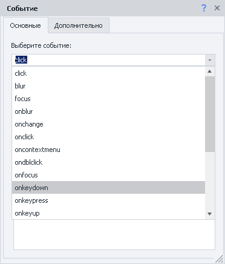

:::tip Cписок возможных действий
Их довольно много. Поэтому для получения более подробной информации о каждом, скопируйте его название, вставьте в поисковую строку любого браузера и добавьте `javascript`. В итоге должно получиться что-то такое: `oncontextmenu javascript` или `javascript ondblclick`.  

Таким образом можно найти описание интересующего вас действия.
:::

### Как добавить действие в проект?
Через контекстное меню: **Добавить действие → Табы → Выполнить событие**

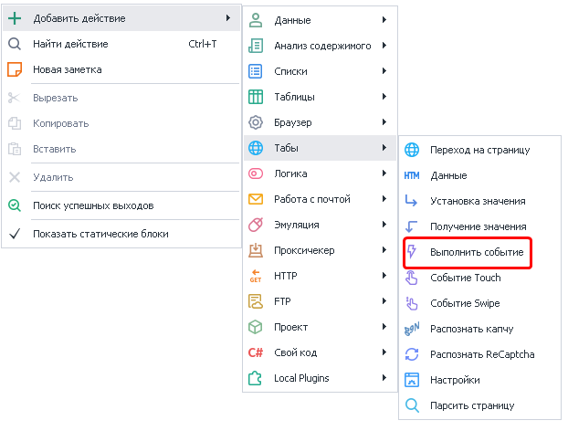

### Области применения
- чаще всего этот экшен используется для кликов по кнопкам, чекбоксам и пунктам в меню
- перемещение элементов по сайту
- эмуляция наведения мыши для получения всплывающей подсказки
- вызов JavaScript событий для полей ввода
> Иногда создатели сайтов добавляют на поля ввода дополнительные JS-скрипты, без срабатывания которых невозможно продолжить работу. Например, проверка корректности введённых данных. В подобных случаях могут помочь события `onchange` и `onkeypress`.  
> 
> *Если вызов этих событий не помогает, то воспользуйтесь [эмуляцией клавиатуры](../Emulation/Keyboard_Emulation) и [эмуляцией мыши](../Emulation/Mouse_Emulation).*
_______________________________________________ 
## Выбор элемента для события
> Рассмотрим на примере [этой страницы](https://learn.javascript.ru/article/mousemove-mouseover-mouseout-mouseenter-mouseleave/mouseoverout/ "https://learn.javascript.ru/article/mousemove-mouseover-mouseout-mouseenter-mouseleave/mouseoverout/").

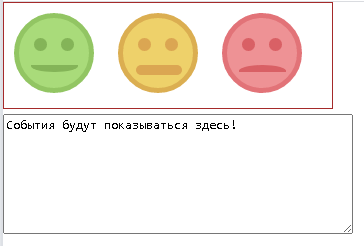

Когда курсор мыши наводится на один из смайлов, он меняет цвет (включая фон, глаза и рот). Кликаем по нужному смайлу правой кнопкой мыши и отправляем его в **Конструктор действий (1)**.  

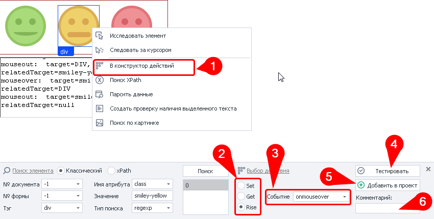

Параметры поиска подставились автоматически, поэтому на них не будем заострять внимание. Идём дальше:

- в пункте **Выбор действия (2)** необходимо выбрать *Rise* (по умолчанию стоит *Set*).
- среди **Событий (3)** выбираем [`onmouseover`](https://learn.javascript.ru/mousemove-mouseover-mouseout-mouseenter-mouseleave).
- перед добавлением экшена рекомендуем **протестировать (4)** его работу *(жёлтый смайлик должен сменить цвет)*.
- также советуем добавить **комментарий (6)** к экшену *(подпись по умолчанию малоинформативна)*.

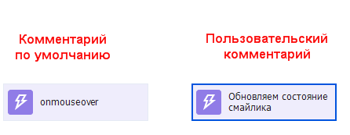

- если всё настроено и работает корректно, то **добавляйте экшен в проект (5)**
_______________________________________________ 
## Вкладка «Основные» 
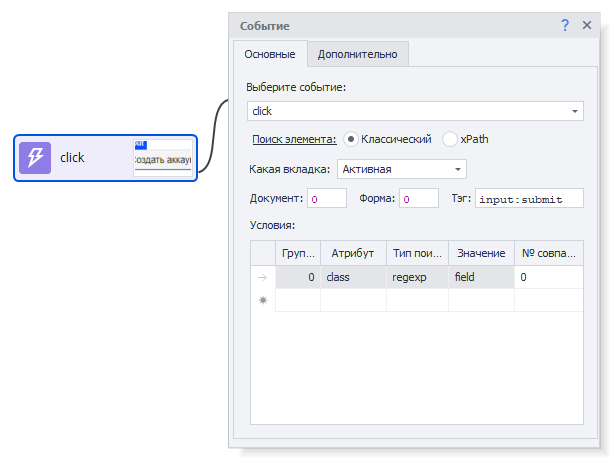

### Выберите событие
Из выпадающего списка выбираем то, что хотим сделать с элементом.  

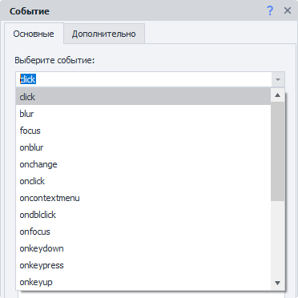

> *Значение можно указать и вручную, не обязательно выбирать из предложенных.* 
>
> *Или использовать переменные проекта `{ -Variable.var_name- }`* 

### Поиск элемента
Прежде чем взаимодействовать с элементом на странице, его надо найти. Для экшенов:  
- [Выполнить событие](../../../Project-editor/Actions-in-ProjectMaker-Actions-Blocks/Tabs/Perform_Event),  
- [Установка значений](../../../Project-editor/Actions-in-ProjectMaker-Actions-Blocks/Tabs/Setting_Value),  
- [Взятие значений](../../../Project-editor/Actions-in-ProjectMaker-Actions-Blocks/Tabs/Getting_Value),  
- [Событие Touch](../../../Project-editor/Actions-in-ProjectMaker-Actions-Blocks/Tabs/Touch_Event),  
- [Событие Swipe](../../../Project-editor/Actions-in-ProjectMaker-Actions-Blocks/Tabs/Swipe_Event)  

существует два способа поиска элементов — классический и с помощью XPath.

#### Классический
Поиск по параметрам HTML элемента: тэг, атрибут и его значение.

#### XPath 
Поиск с помощью XPath выражений. Он позволяет реализовать более универсальный и устойчивый к изменениям вёрстки способ поиска данных в сравнении с классическим поиском или регулярными выражениями.

_______________________________________________
## Доступные параметры
### Какая вкладка
Выбираем вкладку, на которой будет производиться поиск элемента.  

#### Возможные значения:
- **Активная вкладка**;
- **Первая**;
- **По имени** — при выборе данного пункта появится поле ввода для названия вкладки;
- **По номеру** — в поле ввода надо будет ввести порядковый номер вкладки *(нумерация начинается с нуля!)*.

### Документ
Рекомендуется ставить значение `-1` (поиск во всех документах на странице). 

### Форма
Тоже лучше ставить `-1` (поиск по всем формам на странице). При выборе такого значения шаблон будет более универсальным.

:::tip Почему лучше ставить `-1` ?
**Пример.**
На странице размещены три формы: форма поиска, форма регистрации и форма оформления заказа. Для клика по кнопке в форме заказа в настройках действия указано значение поля «Форма» — `2` (нумерация начинается с нуля).  

Со временем на сайте появляется новая форма — форма входа, которая добавляется перед формой заказа. В результате форма заказа смещается, и под индексом `2` теперь оказывается форма входа.  

В такой ситуации шаблон либо выдаст ошибку о том, что нужная кнопка не найдена, либо — что гораздо опаснее — выполнит клик по другой кнопке в другой форме, приводя к некорректной работе шаблона.  
:::

#### Примечание
В настройках программы можно включить два параметра: **«Искать во всех формах на странице»** и **«Искать во всех документах на странице»**.
При их активации при добавлении элемента в *Конструктор действий* значения полей **«Номер документа»** и **«Номер формы»** автоматически устанавливаются в `-1`, что означает поиск элемента по всей странице без привязки к конкретному документу или форме.

### Тэг (только классический поиск)

Это HTML тэг, у которого нужно получить значение.

:::tip Можно указать сразу несколько тегов через `;` *(точка с запятой)*
:::

### Условия (только классический поиск)

:::info Для удаления условия поиска
Нужно кликнуть ЛКМ по полю слева от него (на скриншоте выделено синим цветом) и нажать кнопку `DELETE` на клавиатуре.
:::

**1.** **Группа** — это параметр, определяющий приоритет условия поиска. Чем меньше значение группы, тем выше приоритет условия.  

Поиск выполняется последовательно: сначала проверяются условия с наивысшим приоритетом. Если элемент по ним не найден, система переходит к условиям со следующим приоритетом и продолжает поиск до тех пор, пока элемент не будет найден или не закончатся все условия.  

Допускается добавление нескольких условий с одинаковым приоритетом. В этом случае поиск выполняется одновременно по всем условиям, относящимся к одной группе.  
**2.** **Атрибут** — атрибут HTML тэга по которому производится поиск.  
**3.** **Тип поиска**:
    - *text* — поиск по полному либо частичному вхождению текста;
    - *notext* — поиск элементов в которых не будет указанного текста;
    - *regexp* — поиск с использованием регулярных выражений. По умолчанию поиск выполняется без учёта регистра символов.  
    Если необходимо учитывать регистр, добавьте в начало регулярного выражения конструкцию `(?-i)`, которая отключает регистронезависимый режим поиска.  
4. **Значение** — значение атрибута HTML тега.
5. **№ совпадения** — порядковый номер найденного элемента *(нумерация с нуля!)*. В этом поле можно использовать **диапазоны** и **макросы переменных**.

:::tip Для поиска нужного элемента можно использовать несколько условий.
:::

> Всегда важно стараться подбирать условия поиска таким образом, чтоб оставался только один элемент, т.е. порядковый номер был `0` (нумерация с нуля).

### Координаты курсора мыши (только события drag и drop)

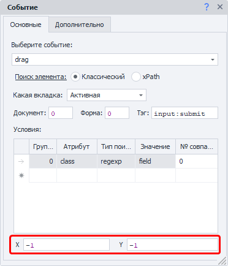

Это уникальные свойства, доступные только для событий перетаскивания элементов: **drag** — откуда нужно перетащить элемент, и **drop** — куда его нужно переместить.
_______________________________________________
## Вкладка «Дополнительно»

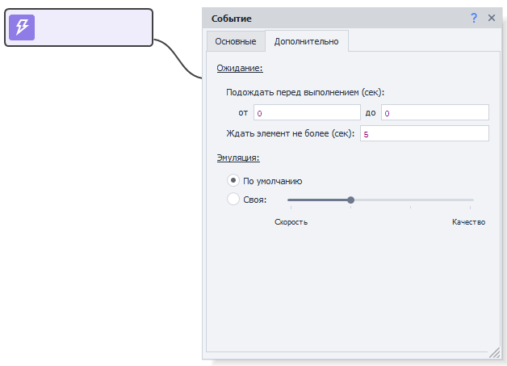

### 1. Подождать перед выполнением
Указываем интервал времени *в секундах*, который шаблон будет ждать **перед** выполнением события.

### 2. Ждать элемент не более
Если по истечении указанного времени *в секундах* элемент **не появился** на странице, то экшен завершит работу с ошибкой.

### 3. Эмуляция
- **По умолчанию** — берётся значение из [Настроек проекта](/zennoposter/ProjectMaker/Project-editor/Static_blocks/Project_Settings).
- **Своя** — выставляем персональный уровень эмуляции для данного экшена.  
*Настройки проекта в таком случае будут игнорироваться*.
_______________________________________________
## Простые клики
В простых кликах можно потренироваться на странице [с переключателями и чекбоксами](https://lessons.zennolab.com/ru/index) или на [кнопке создания аккаунта](https://lessons.zennolab.com/ru/registration).

| ПКМ по любому чекбоксу или переключателю → В конструктор действий → Rise → click → Тестировать или Добавить в проект |
| -------- | 
| 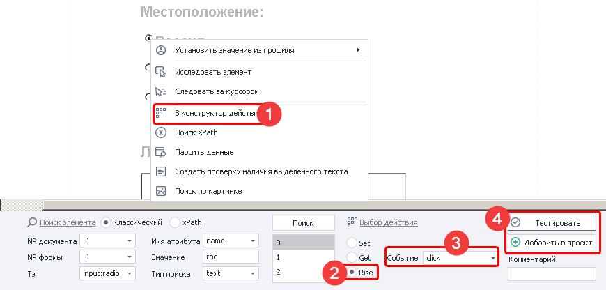 | 

_______________________________________________
## Всплывающая подсказка
### Пример №1
Такие подсказки появляются при наведении курсора на некоторые элементы сайта. 

> [**Пример:**](https://learn.javascript.ru/task/behavior-tooltip)
>
> 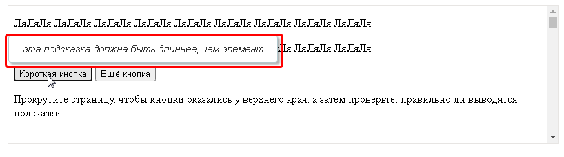

В данном случае можно не утруждаться подбором и эмуляцией событий. Достаточно взглянуть на исходный код страницы и заметить, что текст подсказки хранится в атрибуте: `data-tooltip`. Его значение можно легко получить через экшен [Получение значения](./Getting_Value).  

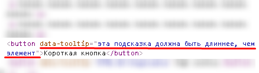

:::tip Атрибуты таких подсказок часто хранятся в коде страницы.
:::
______________________________________________
### Пример №2
Но иногда всё немного сложнее. При наведении курсора мыши отправляется запрос на сервер. Далее происходит ожидание ответа, который затем встраивается в тело страницы. Всё это происходит с помощью скрипта на JavaScript.  

В качестве примера возьмём форум Zennolab. Если навести курсора на название темы, то спустя короткое время появится небольшое окно с её контентом.  

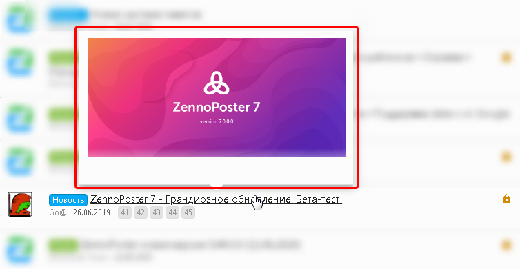

Есть несколько вариантов развития:

- можно с помощью экшена **Выполнить событие** эмулировать `onmouseover` и дожидаться появления окна. Затем с помощью [Получения значения](./Getting_Value) парсить `innerHtml`, а потом уже через [Обработку текста](../Data/Text_Processing) достать нужные нам значения.  
- либо попробовать повторить запрос, который отправляется на сервер. С этим помогут встроенные средства:  
    - [DevTools](/zennoposter/ProjectMaker/Browser_Window/Web_Developer_Tools_DevTools) *(доступно только для Chrome)*,  
    - [Окно трафика](/zennoposter/ProjectMaker/Program-interface/Traffic_Window).

Инструменты для работы с запросами

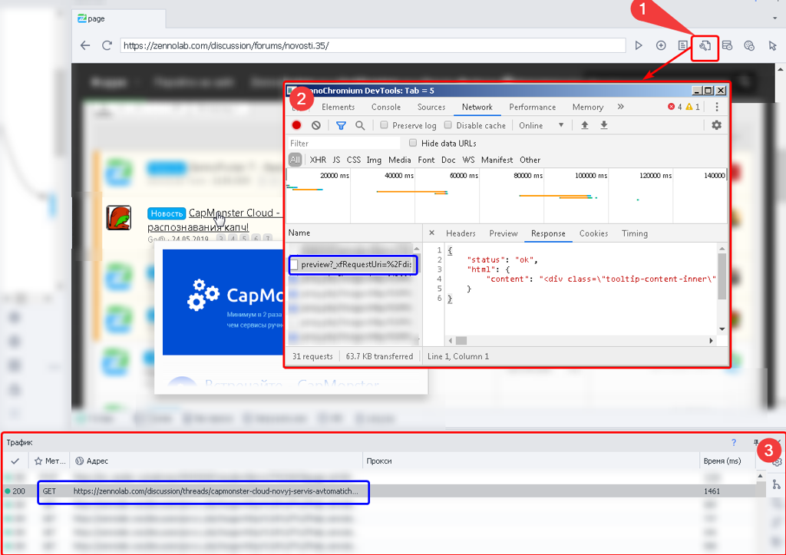

1. Кнопка запуска инструментов web-разработчика
2. Собственно окно инструментов web-разработчика
3. Монитор трафика

Синим выделен один и тот же запрос в инструментах и в окне трафика.

:::tip Создать действие из запроса
Одним из преимуществ **Окна трафика** является то, что из него автоматически можно создать экшен запроса через ПКМ.

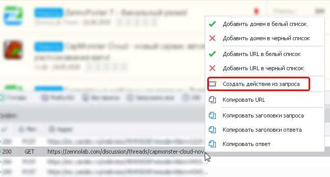
:::
______________________________________________
## Drag&Drop 
- Кликаем ПКМ по элементу, который хотим перетянуть, и отправляем его в **Конструктор действий**. Там мы:  
    - выбираем действие `Rise` и событие `drag`
    - устанавливаем **X** и **Y** — это координаты начала движения. Они отсчитываются от верхнего левого угла выбранного элемента. У нас это `X=15` и `Y=5`. Тут шаблон совершит первый клик c захватом (*drag*).
- Теперь делаем клик ПКМ по месту, в которое надо перетащить, и так же отправляем в **Конструктор действий**. В котором:
    - снова выбираем действие `Rise`, но теперь с событием `drop`
    - устанавливаем **X** и **Y** — здесь это координаты конца движения. Они отсчитываются от верхнего левого угла выбранного элемента. У нас это `X=20` и `Y=30`. В эту точку второго элемента шаблон перетащит (*drop*) первый элемент.

| 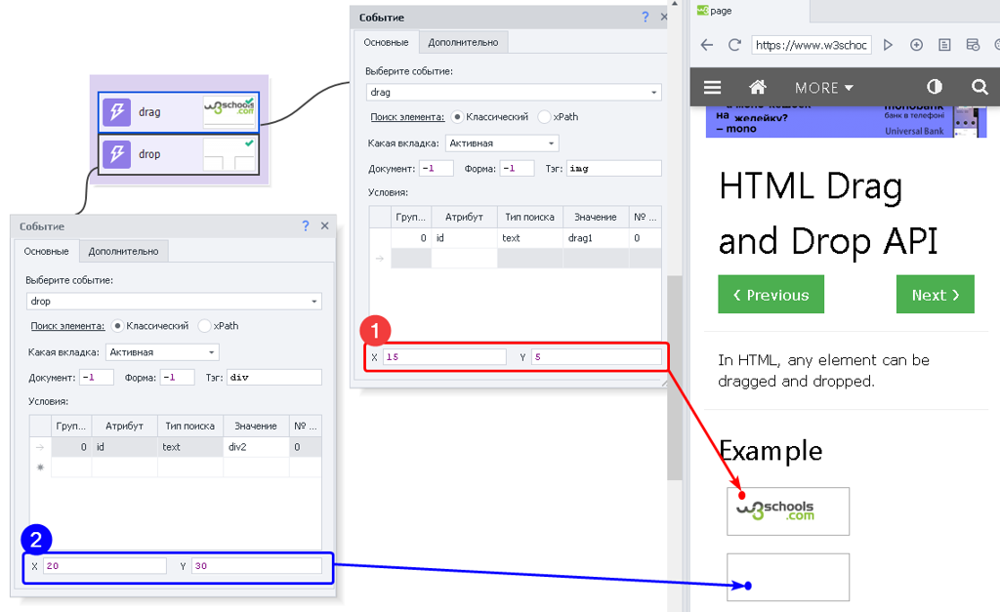 |
| :--------: | 
| **(1) *Откуда* начинается движение → (2) *Куда* элемент перетягивается** | 
______________________________________________
- [❗→ Конструктор действий и Поиск по XPath](https://zennolab.atlassian.net/wiki/spaces/RU/pages/483426337 "https://zennolab.atlassian.net/wiki/spaces/RU/pages/483426337")
- [❗→ Установка значения](https://zennolab.atlassian.net/wiki/spaces/RU/pages/534315117 "https://zennolab.atlassian.net/wiki/spaces/RU/pages/534315117")
- [❗→ Получение значения](https://zennolab.atlassian.net/wiki/spaces/RU/pages/534315124 "https://zennolab.atlassian.net/wiki/spaces/RU/pages/534315124")
- [❗→ Тестер регулярных выражений](https://zennolab.atlassian.net/wiki/spaces/RU/pages/534086111 "https://zennolab.atlassian.net/wiki/spaces/RU/pages/534086111")
- [❗→ Диапазоны значений](https://zennolab.atlassian.net/wiki/spaces/RU/pages/488964137 "https://zennolab.atlassian.net/wiki/spaces/RU/pages/488964137")
- [❗→ XPath](https://zennolab.atlassian.net/wiki/spaces/RU/pages/862093419 "https://zennolab.atlassian.net/wiki/spaces/RU/pages/862093419")
- [❗→ Работа с переменными](https://zennolab.atlassian.net/wiki/spaces/RU/pages/486309922 "https://zennolab.atlassian.net/wiki/spaces/RU/pages/486309922")
- [❗→ Эмуляция клавиатуры](https://zennolab.atlassian.net/wiki/spaces/RU/pages/735608949 "https://zennolab.atlassian.net/wiki/spaces/RU/pages/735608949")
- [❗→ Эмуляция мыши](https://zennolab.atlassian.net/wiki/spaces/RU/pages/534315158 "https://zennolab.atlassian.net/wiki/spaces/RU/pages/534315158")