---
sidebar_position: 10
title: "Распознать ReCaptcha"
description: ""
date: "2025-07-30"
converted: true
originalFile: "Распознать ReCaptcha.txt"
targetUrl: "https://zennolab.atlassian.net/wiki/spaces/RU/pages/534053033/ReCaptcha"
---
import DisclaimerNotice from '@site/src/components/DisclaimerNotice';

<DisclaimerNotice />

> 🔗 **[Оригинальная страница](https://zennolab.atlassian.net/wiki/spaces/RU/pages/534053033/ReCaptcha)** — Источник данного материала

_______________________________________________  
## Описание
Позволяет пройти проверку на сайтах с установленной защитой от ботов. 

> Метод подходит только для: **reCAPTCHA v2, reCAPTCHA v2 Invisible** и **reCAPTCHA v3**.

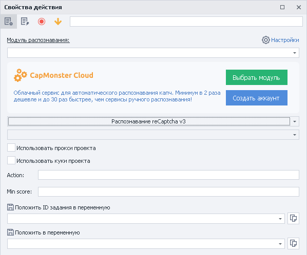

### Как добавить действие в проект?
Через контекстное меню: **Добавить действие → Табы → Распознать ReCaptcha**

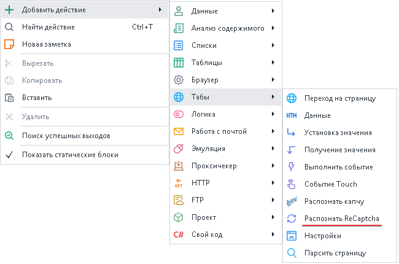

### Для чего это используется?
- Прохождение регистраций
- Парсинг сайтов и поисковых систем
- Выполнение массовых действий
_______________________________________________
## Принцип работы
### Основные настройки

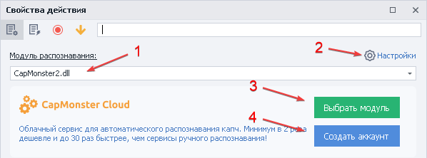

1. **Выбор модуля** для распознавания каптчи из выпадающего списка.
2. Предварительно надо указать ваш **API ключ** от сервиса в настройках.
3. Устанавливаем [CapMonster.Cloud](https://capmonster.cloud/ "https://capmonster.cloud/") в качестве сервиса по умолчанию
4. Регистрация аккаунта в [CapMonster.Cloud](https://capmonster.cloud/ "https://capmonster.cloud/").  
_______________________________________________
### Распознавание reCaptcha v2 во вкладке
> Разгадывание происходит прямо в окне браузера.

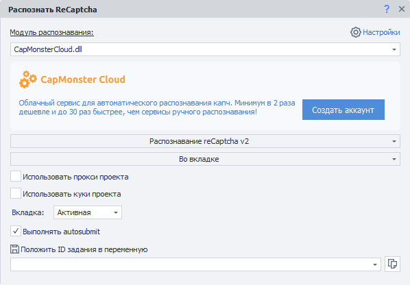

#### Метод распознавания
Выбираем **Распознавание reCaptcha v2** и метод **Во вкладке**.

#### Использовать прокси проекта
При включении на сервис для распознавания вместе с капчей будет отправлен текущий прокси проекта.

#### Использовать куки проекта
С этой настройкой вместе с капчей будут отправлены текущие куки проекта.

#### Вкладка
Выбираем на какой вкладке надо распознать капчу:
- **Активная** — таб, который у вас в данный момент перед глазами.  
- **Первая** — первое окно слева.  
- **По имени** — указать имя таба или переменную учитывая регистр букв.  
- **По номеру** — задаём номер вкладки. Нумерация идёт слева направо начиная с **0**.  

#### Выполнять autosubmit
Если на странице нет кнопки для отправления формы с разгаданной рекапчей, то необходимо включить эту опцию.

#### Положить ID задания в переменную
Указываем здесь название переменной, в которую хотим положить идентификатор задания.

_______________________________________________
### Распознавание reCaptcha v2 через sitekey
Процесс происходит без загрузки браузера.

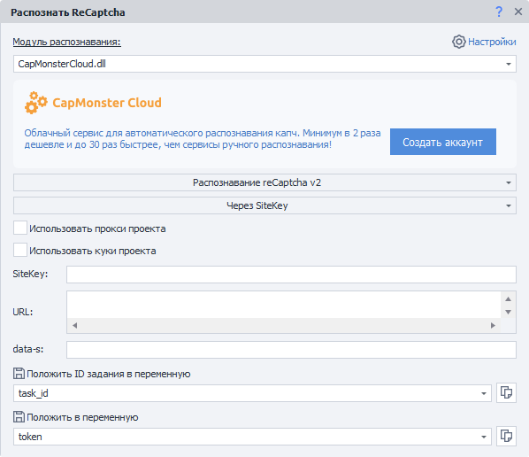

#### Метод распознавания
Выбираем **Распознавание reCaptcha v2** и метод **Через SiteKey**.

#### Использовать прокси проекта
При включении на сервис для распознавания вместе с капчей будет отправлен текущий прокси проекта.

#### Использовать куки проекта
С этой настройкой вместе с капчей будут отправлены текущие куки проекта.

#### SiteKey
**Уникальный** ключ, который находится в HTML-коде страницы. Он используется для идентификации сайта на серверах Google.


<details>
<summary>Как получить SiteKey</summary>

- В исходном коде страницы [DOM](./Data_Tab_Operations)


- В [окне трафика](/zennoposter/ProjectMaker/Program-interface/Traffic_Window) при загрузке страницы

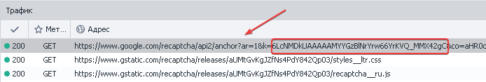

Нажимаем на запрос и переходим во вкладку Параметры, ищем `k` или `key`

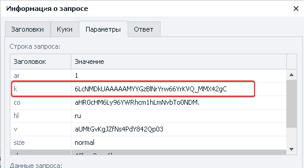

</details>  

#### URL
Полный адрес страницы, на которой находится Recaptcha.

#### data-s
**Необязательный параметр**, который встречается на некоторых сайтах.

> Например, он есть в поиске Google и на его сервисах.

#### Положить ID задания в переменную
Указываем здесь название переменной, в которую хотим положить идентификатор задания.

#### Положить в переменную
А в этой переменной сохранится ответ от сервиса распознавания — токен решённой Recaptcha.

#### Примеры отправки токена

<details>
<summary>Отправка Token в браузере</summary>

После получения токена его нужно подставить в соответствующее поле.

Вот как его найти:

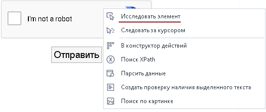

1. Через контекстное меню вызываем [Дерево Элементов](/zennoposter/ProjectMaker/Program-interface/Element_Tree_Window) и находим поле `textarea` для ввода внутри капчи

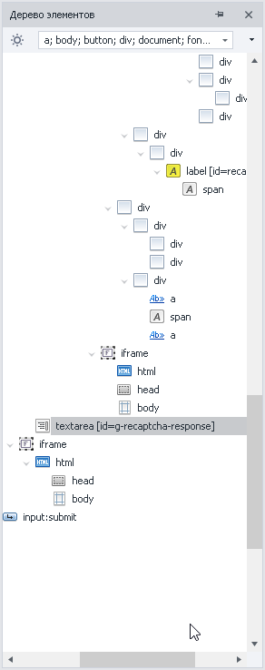

2. Теперь ПКМ → «В конструктор действий»

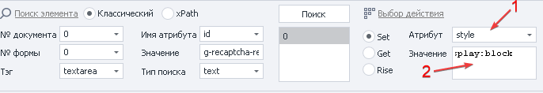

3. Выбираем атрибут `style` и пишем в значение `display:block`

4. Через кнопку «Тестировать» можно проверить, сработает функция или нет  

5. Далее добавляем экшен в проект

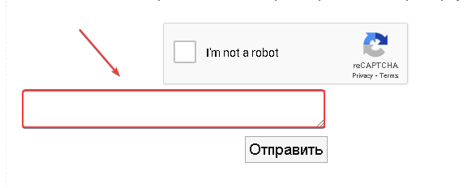

Под самой капчей появится поле для вставки токена, например, через [Установку значения](./Setting_Value)

</details>

<details>
<summary>Отправка Token на сервер через запросы</summary>

После успешного решения капчи в переменную будет добавлен ответ, содержащий `token` для отправки на сервер. Этот токен нужно подставить в запрос (аргумент `g-recaptcha-response`). 

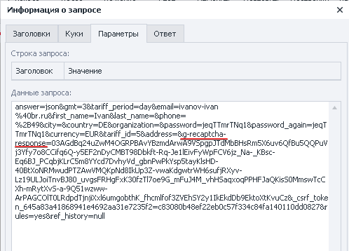

Пример запроса всегда можно посмотреть в [Окне трафика](/zennoposter/ProjectMaker/Program-interface/Traffic_Window)

</details>
_______________________________________________  
### Распознавание reCaptcha v3 во вкладке
> Разгадывание происходит прямо в окне браузера.

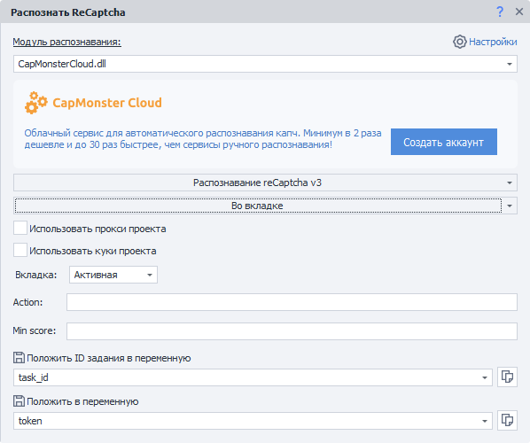

#### Метод распознавания
Выбираем **Распознавание reCaptcha v3** и метод **Во вкладке**.

#### Использовать прокси проекта
При включении на сервис для распознавания вместе с капчей будет отправлен текущий прокси проекта.

#### Использовать куки проекта
С этой настройкой вместе с капчей будут отправлены текущие куки проекта.

#### Вкладка
Выбираем на какой вкладке надо распознать капчу:
- **Активная** — таб, который у вас в данный момент перед глазами.  
- **Первая** — первое окно слева.  
- **По имени** — указать имя таба или переменную учитывая регистр букв.  
- **По номеру** — задаём номер вкладки. Нумерация идёт слева направо начиная с **0**.  

#### Action
Этот параметр находится в исходном коде сайта в вызове функции `grecaptcha.execute`

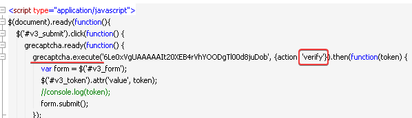

:::warning Уникален для каждого сайта
:::

#### Min score  
> *Диапазон от `0.1` до `0.9`*  

Рейтинг пользователя, который определяет успешность прохождения проверки. 

Чаще всего достаточно значения `0.3`, но для некоторых сайтов требуется подбирать индивидуально.

#### Положить ID задания в переменную
Указываем здесь название переменной, в которую хотим положить идентификатор задания.

#### Положить в переменную
А в этой переменной сохранится ответ от сервиса распознавания — токен решённой Recaptcha.
_______________________________________________
### Распознавание reCaptcha v3 через sitekey
Процесс разгадывания происходит без загрузки браузера.

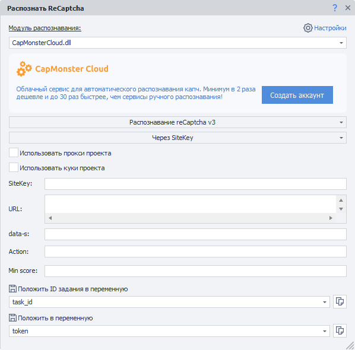

#### Метод распознавания
Выбираем **Распознавание reCaptcha v3** и метод **Через SiteKey**.

#### Использовать прокси проекта
При включении на сервис для распознавания вместе с капчей будет отправлен текущий прокси проекта.

#### Использовать куки проекта
С этой настройкой вместе с капчей будут отправлены текущие куки проекта.

#### SiteKey
**Уникальный** ключ, который находится в HTML-коде страницы. Он используется для идентификации сайта на серверах Google.

<details>
<summary>Как получить SiteKey</summary>

- В исходном коде страницы [DOM](./Data_Tab_Operations)


- В [окне трафика](/zennoposter/ProjectMaker/Program-interface/Traffic_Window) при загрузке страницы


Нажимаем на запрос и переходим во вкладку Параметры, ищем `k` или `key`


</details>  

#### URL
Полный адрес страницы, на которой находится Recaptcha.

#### data-s
**Необязательный параметр**, который встречается на некоторых сайтах.

> Например, он есть в поиске Google и на его сервисах.

#### Action
Этот параметр находится в исходном коде сайта в вызове функции `grecaptcha.execute`


:::warning Уникален для каждого сайта
:::

#### Min score  
> *Диапазон от `0.1` до `0.9`*  

Рейтинг пользователя, который определяет успешность прохождения проверки. 

Чаще всего достаточно значения `0.3`, но для некоторых сайтов требуется подбирать индивидуально.

#### Положить ID задания в переменную
Указываем здесь название переменной, в которую хотим положить идентификатор задания.

#### Положить в переменную
А в этой переменной сохранится ответ от сервиса распознавания — токен решённой Recaptcha.

### Примечание касательно RCv3
При загрузке страницы в [Окне трафика](/zennoposter/ProjectMaker/Program-interface/Traffic_Window) очень важно обратить внимание на запрос.  

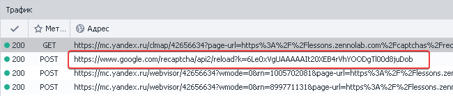

- Если запрос происходит при загрузке страницы, то выбираем распознавание reCaptcha v3 **через sitekey**.
- Когда запрос осуществляется после отправки формы на сайт, то распознавание reCaptcha v3 **во вкладке**.
- Параметры : `SiteKey`, `Action`, `Score`, `URL` можно задавать через переменные.  

:::info Подмена `token` происходит до отправки запроса
:::
_______________________________________________  
### Отчет об ошибке
Позволяет вернуть денежные средства за неудачную попытку разгадывания капчи (когда токен не был принят).  


**ID задания** указывается статичным значением или через переменную.

### Отчет об успехе
Сообщает сервису об успешном решении капчи.

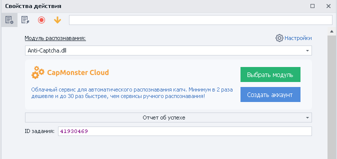

**ID задания** указывается статичным значением или через переменную.
_______________________________________________
## Примеры использования
### Отправка токена RCv3 при решении «Во вкладке»
Отправка токена в браузере происходит путём его подмены.  

> *Способ «Во вкладке» подходит только для запросов, которые происходят **после отправки формы**.*


Для примера обратимся к сайту с [reCAPTCHA V3 (Beta)](https://lessons.zennolab.com/captchas/recaptcha/v3.php?level=beta) 

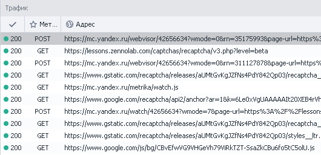

Во время загрузки сайта не было запроса к капче — метод разгадывания «Во вкладке» нам подходит.

|  Настраиваем кубик для разгадывания ReCaptcha v3 |
| -------- |
|    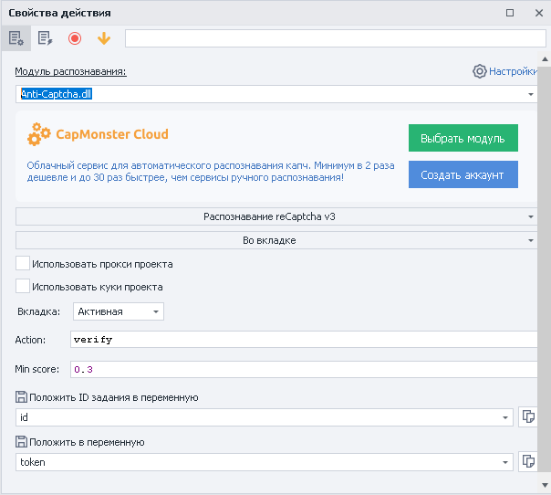|

Таким образом получаем `token`, а затем с помощью [C# сниппета](/zennoposter/ProjectMaker/Project-editor/Actions-in-ProjectMaker-Actions-Blocks/Custom_code/CSharp_Code) отправляем его сайту:

```json
var sitekey = project.Variables["имя_переменной_sitekey"].Value;
var newToken = project.Variables["имя_переменной_token"].Value;
var replaceRegex = @"(?&lt;=\[""rresp"","")[^""]+";
instance.ChangeResponse("https://www.google.com/recaptcha/api2/reload\\?k="+sitekey,
 new List&lt;string&gt; {replaceRegex}, new List<string> {newToken}, false);
```


:::tip Использовать SiteKey в сниппете необязательно
Однако без него будут перехватываться запросы от всех капч, включая ReCaptcha2.  

Если это не является проблемой, то можно использовать такую версию сниппета:

```json
var newToken = project.Variables["имя_переменной_token"].Value;
var replaceRegex = @"(?&lt;=\[""rresp"","")[^""]+";
instance.ChangeResponse("https://www.google.com/recaptcha/api2/reload\\?k=",
 new List&lt;string&gt; {replaceRegex}, new List<string> {newToken}, false);
```
:::

| По итогу отправляем форму на сайте:   |
| -------- |
| 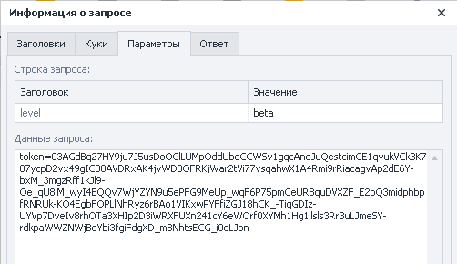 |
  
В окне трафика можно убедиться, что `token` успешно подменён.
_______________________________________________
### Отправка токена RCv3 при решении «через SiteKey»  
Если в [Окне трафика](/zennoposter/ProjectMaker/Program-interface/Traffic_Window) видим, что запрос выполняется вместе с загрузкой страницы сайта, то порядок действий отличается от разгадывания «Во вкладке».

| Сначала настраиваем кубик для разгадывания капчи и получаем `token`   |
| -------- |
| 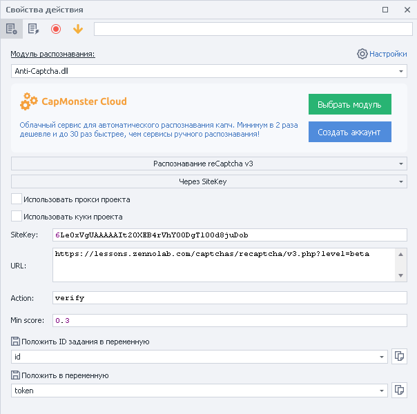 |


Далее с помощью [C# сниппета](/zennoposter/ProjectMaker/Project-editor/Actions-in-ProjectMaker-Actions-Blocks/Custom_code/CSharp_Code) отправляем его сайту:

```json
var sitekey = project.Variables["имя_переменной_sitekey"].Value;
var newToken = project.Variables["имя_переменной_token"].Value;
var replaceRegex = @"(?&lt;=\[""rresp"","")[^""]+";
instance.ChangeResponse("https://www.google.com/recaptcha/api2/reload\\?k="+sitekey,
 new List&lt;string&gt; {replaceRegex}, new List<string> {newToken}, false);
```

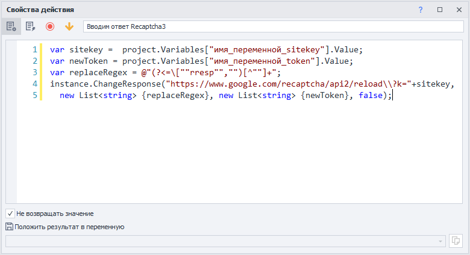

:::tip Использовать SiteKey в сниппете необязательно
Однако без него будут перехватываться запросы от всех капч, включая ReCaptcha2.  

Если это не является проблемой, то можно использовать такую версию сниппета:

```json
var newToken = project.Variables["имя_переменной_token"].Value;
var replaceRegex = @"(?&lt;=\[""rresp"","")[^""]+";
instance.ChangeResponse("https://www.google.com/recaptcha/api2/reload\\?k=",
 new List&lt;string&gt; {replaceRegex}, new List<string> {newToken}, false);
```
:::

Только после этого загружаем страницу с ReCaptcha v3 и производим необходимые действия.
_______________________________________________
### Работа с экшеном
При заходе на страницу антибот система просит подтвердить, что мы не робот.

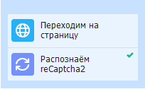

1. Заходим на страницу.
2. Добавляем в проект экшен разгадать reCaptcha.
3. Настраиваем кубик.
4. Проходим проверку сайта.

Многие ресурсы пользуются защитой от компании Google. Она помогает сайтам пресекать массовые действия или определять ботов, но благодаря функционалу **ZennoPoster** проходить такие проверки не составит труда.
_______________________________________________
## Полезные ссылки

1. [❗→ Окно трафика](/wiki/spaces/RU/pages/735805465 "/wiki/spaces/RU/pages/735805465")
2. [❗→ Окно переменных](/wiki/spaces/RU/pages/735608872 "/wiki/spaces/RU/pages/735608872")
3. [❗→ Данные](https://zennolab.atlassian.net/wiki/spaces/RU/pages/534085840/- "https://zennolab.atlassian.net/wiki/spaces/RU/pages/534085840/-")
4. [CapMonster Cloud](https://capmonster.cloud/ru/ "https://capmonster.cloud/ru/")