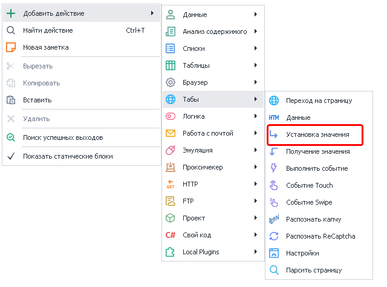
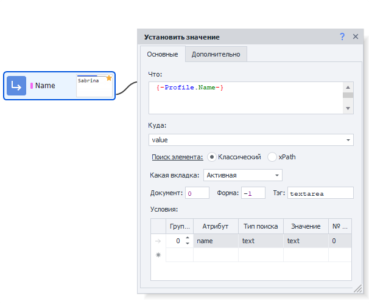
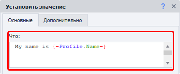
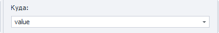
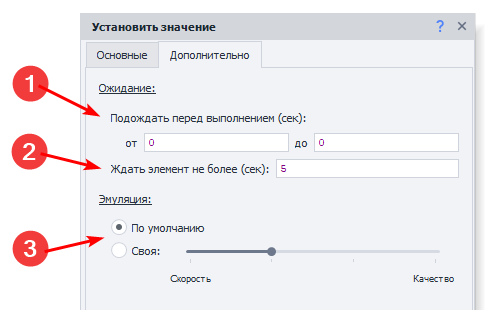
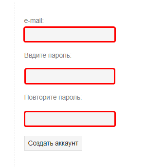
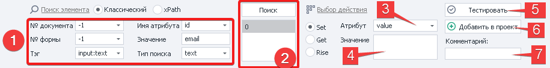
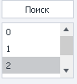
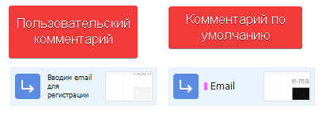

---
sidebar_position: 3
title: "Установка значения"
description: ""
date: "2025-07-30"
converted: true
originalFile: "Установка значения.txt"
targetUrl: "https://zennolab.atlassian.net/wiki/spaces/RU/pages/534315117"
---
import DisclaimerNotice from '@site/src/components/DisclaimerNotice';

<DisclaimerNotice />

> 🔗 **[Оригинальная страница](https://zennolab.atlassian.net/wiki/spaces/RU/pages/534315117)** — Источник данного материала

_______________________________________________  
## Описание
Этот экшен используется для задания значений различным HTML элементам: 
- **Однострочные поля ввода** — HTML тег `<input />`.  
Часто используется для установки имени, пароля, адреса и других значений. [**Пример**](https://lessons.zennolab.com/ru/registration "https://lessons.zennolab.com/ru/registration").    
- **Многострочные поля** — HTML тег `<textarea />`.  
Нужен для ввода сообщений, вставки статей или любого другого объемного текста.
- **Выпадающие списки** — HTML тег `<select />`.  
Их можно, например, встретить при выборе пола, страны или города проживания в различных формах регистрации.

[**Пример формы с вышеперечисленными элементами**](https://lessons.zennolab.com/ru/index).

С помощью данного действия можно изменять не только видимый текст, но и *код элементов на странице*. Это может быть полезно, когда один элемент перекрывает другой. Достаточно заменить код мешающего элемента на пустую строку, и он будет удалён со страницы.

### Как добавить действие в проект?
Через контекстное меню: **Добавить действие → Табы → Установка значения**

### Выбор поля для установки значения
Открываем в браузере ProjectMaker нужную страницу и кликаем ПКМ по элементу, которому хотим задать значение. Из контекстного меню выбираем **В конструктор действий** → он загрузится под окном браузера. Выбираем тип действия **Set** и нажимаем кнопку **Добавить в проект**.
_______________________________________________
## Вкладка «Основные» 

### Поле «Что»
Текст, который мы хотим вставить.  

Помимо простого текста можно также использовать макросы: `{ -Variable.someVar- }`, `{ -Profile.Name- }`.

### Куда
Тут нужно выбрать атрибут элемента, значение которого мы меняем:  

- **value** — значение элемента,
- **`innerHtml` или `outerHtml`** — HTML код элемента ([разница между inner и outer](http://www.quizful.net/interview/js/inner-outer-html-functions)).  
Элемент можно удалить со страницы, есть стереть значение одного из этих атрибутов.  
- **Более привычные HTML теги** — `id`, `name`, `class`, `style`.

> **Это неполный список возможных значений**. Есть и другие, но мы перечислили наиболее часто используемые.

:::tip В данном поле можно указать значение вручную
Не обязательно выбирать из предложенных.  

Так же тут можно использовать переменные проекта: `{ -Variable.var_name- }`
:::

### Поиск элемента
Прежде чем взаимодействовать с элементом на странице, его надо найти. Для экшенов:  
- [Выполнить событие](../../../Project-editor/Actions-in-ProjectMaker-Actions-Blocks/Tabs/Perform_Event),  
- [Установка значений](../../../Project-editor/Actions-in-ProjectMaker-Actions-Blocks/Tabs/Setting_Value),  
- [Взятие значений](../../../Project-editor/Actions-in-ProjectMaker-Actions-Blocks/Tabs/Getting_Value),  
- [Событие Touch](../../../Project-editor/Actions-in-ProjectMaker-Actions-Blocks/Tabs/Touch_Event),  
- [Событие Swipe](../../../Project-editor/Actions-in-ProjectMaker-Actions-Blocks/Tabs/Swipe_Event)  

существует два способа поиска элементов — классический и с помощью XPath.

#### Классический
Поиск по параметрам HTML элемента: тэг, атрибут и его значение.

#### XPath 
Поиск с помощью XPath выражений. Он позволяет реализовать более универсальный и устойчивый к изменениям вёрстки способ поиска данных в сравнении с классическим поиском или регулярными выражениями.

_______________________________________________
## Доступные параметры
### Какая вкладка
Выбираем вкладку, на которой будет производиться поиск элемента.  

#### Возможные значения:
- **Активная вкладка**;
- **Первая**;
- **По имени** — при выборе данного пункта появится поле ввода для названия вкладки;
- **По номеру** — в поле ввода надо будет ввести порядковый номер вкладки *(нумерация начинается с нуля!)*.

### Документ
Рекомендуется ставить значение `-1` (поиск во всех документах на странице). 

### Форма
Тоже лучше ставить `-1` (поиск по всем формам на странице). При выборе такого значения шаблон будет более универсальным.

:::tip Почему лучше ставить `-1` ?
**Пример.**
На странице размещены три формы: форма поиска, форма регистрации и форма оформления заказа. Для клика по кнопке в форме заказа в настройках действия указано значение поля «Форма» — `2` (нумерация начинается с нуля).  

Со временем на сайте появляется новая форма — форма входа, которая добавляется перед формой заказа. В результате форма заказа смещается, и под индексом `2` теперь оказывается форма входа.  

В такой ситуации шаблон либо выдаст ошибку о том, что нужная кнопка не найдена, либо — что гораздо опаснее — выполнит клик по другой кнопке в другой форме, приводя к некорректной работе шаблона.  
:::

#### Примечание
В настройках программы можно включить два параметра: **«Искать во всех формах на странице»** и **«Искать во всех документах на странице»**.
При их активации при добавлении элемента в *Конструктор действий* значения полей **«Номер документа»** и **«Номер формы»** автоматически устанавливаются в `-1`, что означает поиск элемента по всей странице без привязки к конкретному документу или форме.

### Тэг (только классический поиск)

Это HTML тэг, у которого нужно получить значение.

:::tip Можно указать сразу несколько тегов через `;` *(точка с запятой)*
:::

### Условия (только классический поиск)

:::info Для удаления условия поиска
Нужно кликнуть ЛКМ по полю слева от него (на скриншоте выделено синим цветом) и нажать кнопку `DELETE` на клавиатуре.
:::

**1.** **Группа** — это параметр, определяющий приоритет условия поиска. Чем меньше значение группы, тем выше приоритет условия.  

Поиск выполняется последовательно: сначала проверяются условия с наивысшим приоритетом. Если элемент по ним не найден, система переходит к условиям со следующим приоритетом и продолжает поиск до тех пор, пока элемент не будет найден или не закончатся все условия.  

Допускается добавление нескольких условий с одинаковым приоритетом. В этом случае поиск выполняется одновременно по всем условиям, относящимся к одной группе.  
**2.** **Атрибут** — атрибут HTML тэга по которому производится поиск.  
**3.** **Тип поиска**:
    - *text* — поиск по полному либо частичному вхождению текста;
    - *notext* — поиск элементов в которых не будет указанного текста;
    - *regexp* — поиск с использованием регулярных выражений. По умолчанию поиск выполняется без учёта регистра символов.  
    Если необходимо учитывать регистр, добавьте в начало регулярного выражения конструкцию `(?-i)`, которая отключает регистронезависимый режим поиска.  
4. **Значение** — значение атрибута HTML тега.
5. **№ совпадения** — порядковый номер найденного элемента *(нумерация с нуля!)*. В этом поле можно использовать **диапазоны** и **макросы переменных**.

:::tip Для поиска нужного элемента можно использовать несколько условий.
:::

> Всегда важно стараться подбирать условия поиска таким образом, чтоб оставался только один элемент, т.е. порядковый номер был `0` (нумерация с нуля).
_______________________________________________
## Вкладка «Дополнительно»

### 1. Подождать перед выполнением
Указываем интервал времени *в секундах*, который шаблон будет ждать **перед** установкой значения.

### 2. Ждать элемент не более
Если по истечении указанного времени *в секундах* элемент **не появился** на странице, то экшен завершит работу с ошибкой.

### 3. Эмуляция
- **По умолчанию** — берётся значение из [Настроек проекта](/zennoposter/ProjectMaker/Project-editor/Static_blocks/Project_Settings).
- **Своя** — выставляем персональный уровень эмуляции для данного экшена.  
*Настройки проекта в таком случае будут игнорироваться*.
_______________________________________________
## Пример использования
Рассмотрим работу экшена на реальном примере. В качестве тестового сайта используем страницу: https://lessons.zennolab.com/ru/registration. После перехода на неё мы увидим простую форму регистрации с тремя текстовыми полями и одной кнопкой.    

|  |
| :--: |
| В рамках данной статьи нас интересуют **только поля ввода текста**. |

Самый простой способ создать данный экшен — это кликнуть **ПКМ по полю ввода** → выбрать пункт **В конструктор действий**. Он откроется снизу, под браузером, если ранее не был активен. 

ProjectMaker сильно упрощает жизнь, поэтому в конструкторе действий значения для поиска будут сразу подставлены **(1)**. Не всегда программа подбирает оптимальные значения, иногда приходится делать это вручную. 

Когда вы подобрали параметры для поиска элемента, нажмите **Поиск**. Под этой кнопкой есть поле **(2)**, в котором появятся найденные, согласно заданным настройкам, элементы. В примере со скриншота был найден только один элемент, поэтому в данном поле отображается цифра `0`.  

> *Всегда старайтесь подбирать такие параметры поиска, чтобы находился только один элемент*. 

|  |
| :--: |
| Так выглядит поле, если найдено несколько элементов. |

Затем выбираем атрибут **(3)**, который надо обновить в найденном элементе.  

В нашем примере выбрано `value`, так что будет изменено непосредственно отображаемое значение поля ввода.  

После этого в поле **Значение (4)** вводим текст, который нужно вставить. Можно использовать **Переменные проекта** в виде макросов: `{ -Profile.Name- }`, `{ -Variable.generatedText- }`, `{ -Page.Url- }`.  

> *Из переменных можно составлять сложные конструкции. Вот как может выглядеть строка для вставки даты рождения из Профиля: `{ -Profile.BornDay- }.{ -Profile.BornMonth- }.{ -Profile.BornYear- }`.*

Далее нажимаем кнопку **Тестировать (5)** и смотрим, обновилось ли значение у нужного элемента.  

Можно также добавить **Комментарий (7)** для экшена, чтобы было проще читать проект.   

|  |
| :--: |
|  На основе вводимого **Значения** генерируется автоматический комментарий, который не всегда полезен. |

:::tip Комментарии особенно полезны в больших проектах
Они помогут быстро понять логику работы даже спустя недели или месяцы. Не понадобится даже запускать проект и разбираться в настройках.  

> *Дополнительно можно использовать [Заметки](../Project/Project_Notes).*
:::

Когда всё установлено и проверено, можно нажимать **Добавить в проект (6)** → на холсте проекта появится наш новый экшен.

_______________________________________________
## Полезные ссылки
- [❗→ Получение значения](/wiki/spaces/RU/pages/534315124 "/wiki/spaces/RU/pages/534315124")
- [❗→ Выполнить событие](/wiki/spaces/RU/pages/534020211 "/wiki/spaces/RU/pages/534020211")
- [❗→ Событие Touch](/wiki/spaces/RU/pages/735674386 "/wiki/spaces/RU/pages/735674386")
- [❗→ Событие Swipe](/wiki/spaces/RU/pages/735739970 "/wiki/spaces/RU/pages/735739970")
- [❗→ XPath](/wiki/spaces/RU/pages/862093419 "/wiki/spaces/RU/pages/862093419")
- [❗→ Конструктор действий и Поиск по XPath](/wiki/spaces/RU/pages/483426337 "/wiki/spaces/RU/pages/483426337")