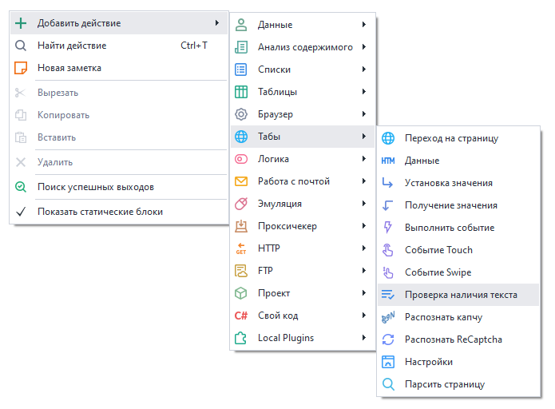
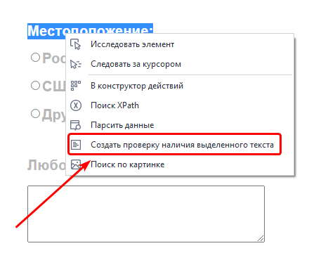
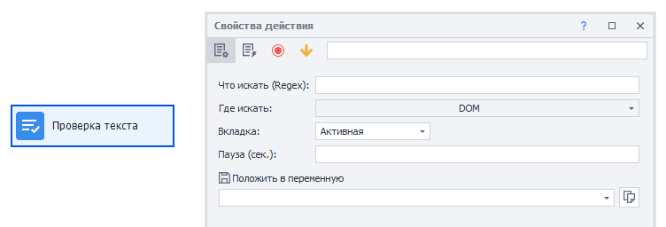

---
sidebar_position: 8
title: "Проверка наличия текста"
description: ""
date: "2025-07-30"
converted: true
originalFile: "Проверка наличия текста.txt"
targetUrl: "https://zennolab.atlassian.net/wiki/spaces/RU/pages/1308426253"
---
import DisclaimerNotice from '@site/src/components/DisclaimerNotice';

<DisclaimerNotice />

> 🔗 **[Оригинальная страница](https://zennolab.atlassian.net/wiki/spaces/RU/pages/1308426253)** — Источник данного материала

_______________________________________________  
## Описание
Данное действие используется для проверки наличия текста на странице или в URL. 

:::info Добавлено в ZennoPoster 7.3.1.0
:::

### Как добавить действие в проект?
- Через контекстное меню: **Добавить действие → Табы → Проверка наличия текста**

- **В окне браузера:** выделите текст, наличие которого надо проверить, и нажмите по нему **ПКМ → Создать проверку наличия выделенного текста**.

### Где это используется?
- Проверка успешности авторизации
- Подтверждение выполненного действия на странице
_______________________________________________ 
## Принцип работы

### Что искать (Regex)
Здесь пишем текст, который хотим найти.  

> *Поддерживаются регулярные выражения.*

### Где искать
Выбираем тип данных, в которых будет произведён поиск:

- **DOM**
- **Source**

:::info [В чём разница между DOM и Source?](./Data_Tab_Operations#разница-между-source-и-dom)
:::

- **Text** *(весь отображаемый текст на странице)*
- **URL**

### Вкладка
Указываем вкладку, откуда будем брать данные:
- **Активная** — текущая активная вкладка;
- **Первая** — если вкладок несколько, то взять первую по счёту;
- **По имени** — указать имя вкладки;
- **По номеру** — указать номер вкладки, если их несколько (нумерация с нуля).

### Пауза
Время ожидания в секундах перед тем, как будет выполнен поиск.

## Полезные ссылки

- [❗→ Создать проверку наличия выделенного текста](/wiki/spaces/RU/pages/534053296 "/wiki/spaces/RU/pages/534053296")
- [❗→ Регулярные выражения](/wiki/spaces/RU/pages/534086111 "/wiki/spaces/RU/pages/534086111")