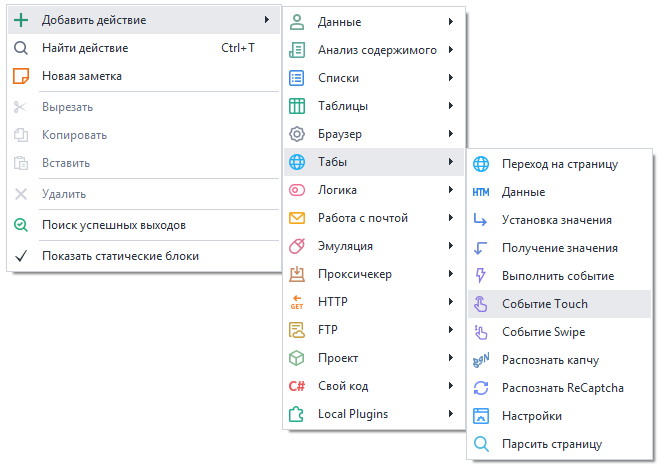
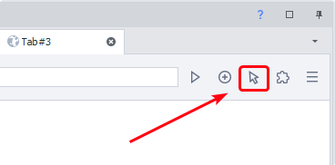
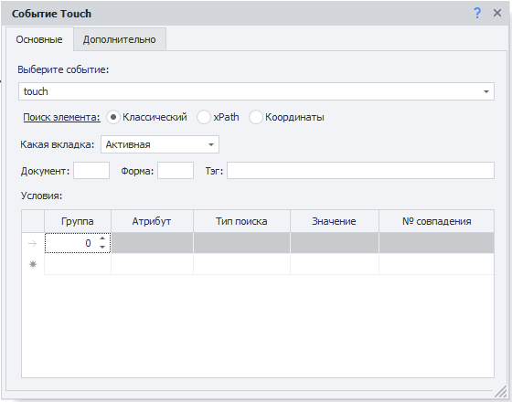
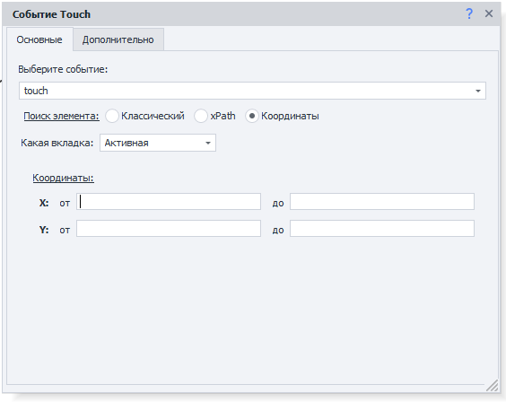
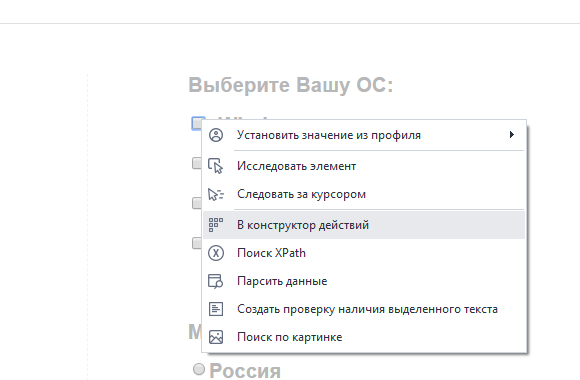
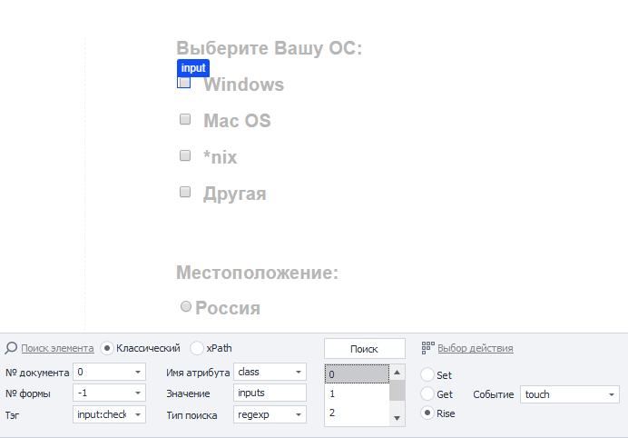
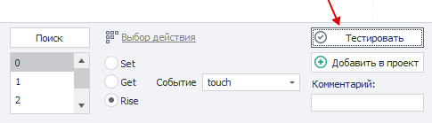
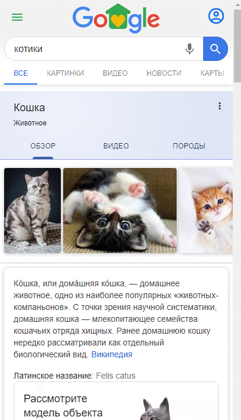

import DisclaimerNotice from '@site/src/components/DisclaimerNotice';

<DisclaimerNotice />

> 🔗 **[Оригинальная страница](https://zennolab.atlassian.net/wiki/spaces/RU/pages/735674386/Touch)** — Источник данного материала 
_______________________________________________
## Описание
Данный экшен позволяет эмулировать Touch-событие (нажатие пальцем). 

  
### Как добавить действие в проект?
Через контекстное меню: **Добавить действие → Табы → Событие Touch**

  


### Где это используется?
- В эмуляции телефона или любого другого устройства с сенсорным экраном,
- Для качественной имитации человека при автоматических действиях.
_______________________________________________
> *Перед началом работы нужно включить **Запись** и в Окне браузера переключить **Режим ввода** на Touch.*  
>
>  

## Вкладка «Основные»  
### Выбор события
- **Touch** — нажатие (клик/прикосновение);
- **Long Touch** — длительное зажатие.



### Поиск элемента
Прежде чем взаимодействовать с элементом на странице, его надо найти. Для экшенов:  
- [Выполнить событие](../../../Project-editor/Actions-in-ProjectMaker-Actions-Blocks/Tabs/Perform_Event),  
- [Установка значений](../../../Project-editor/Actions-in-ProjectMaker-Actions-Blocks/Tabs/Setting_Value),  
- [Взятие значений](../../../Project-editor/Actions-in-ProjectMaker-Actions-Blocks/Tabs/Getting_Value),  
- [Событие Touch](../../../Project-editor/Actions-in-ProjectMaker-Actions-Blocks/Tabs/Touch_Event),  
- [Событие Swipe](../../../Project-editor/Actions-in-ProjectMaker-Actions-Blocks/Tabs/Swipe_Event)  

существует два способа поиска элементов — классический и с помощью XPath.

#### Классический
Поиск по параметрам HTML элемента: тэг, атрибут и его значение.


#### XPath 
Поиск с помощью XPath выражений. Он позволяет реализовать более универсальный и устойчивый к изменениям вёрстки способ поиска данных в сравнении с классическим поиском или регулярными выражениями.


_______________________________________________
## Доступные параметры
### Какая вкладка
Выбираем вкладку, на которой будет производиться поиск элемента.  

#### Возможные значения:
- **Активная вкладка**;
- **Первая**;
- **По имени** — при выборе данного пункта появится поле ввода для названия вкладки;
- **По номеру** — в поле ввода надо будет ввести порядковый номер вкладки *(нумерация начинается с нуля!)*.

### Документ
Рекомендуется ставить значение `-1` (поиск во всех документах на странице). 

### Форма
Тоже лучше ставить `-1` (поиск по всем формам на странице). При выборе такого значения шаблон будет более универсальным.

:::tip Почему лучше ставить `-1` ?
**Пример.**
На странице размещены три формы: форма поиска, форма регистрации и форма оформления заказа. Для клика по кнопке в форме заказа в настройках действия указано значение поля «Форма» — `2` (нумерация начинается с нуля).  

Со временем на сайте появляется новая форма — форма входа, которая добавляется перед формой заказа. В результате форма заказа смещается, и под индексом `2` теперь оказывается форма входа.  

В такой ситуации шаблон либо выдаст ошибку о том, что нужная кнопка не найдена, либо — что гораздо опаснее — выполнит клик по другой кнопке в другой форме, приводя к некорректной работе шаблона.  
:::

#### Примечание
В настройках программы можно включить два параметра: **«Искать во всех формах на странице»** и **«Искать во всех документах на странице»**.
При их активации при добавлении элемента в *Конструктор действий* значения полей **«Номер документа»** и **«Номер формы»** автоматически устанавливаются в `-1`, что означает поиск элемента по всей странице без привязки к конкретному документу или форме.

### Тэг (только классический поиск)


Это HTML тэг, у которого нужно получить значение.

:::tip Можно указать сразу несколько тегов через `;` *(точка с запятой)*
:::

### Условия (только классический поиск)


:::info Для удаления условия поиска
Нужно кликнуть ЛКМ по полю слева от него (на скриншоте выделено синим цветом) и нажать кнопку `DELETE` на клавиатуре.
:::

**1.** **Группа** — это параметр, определяющий приоритет условия поиска. Чем меньше значение группы, тем выше приоритет условия.  

Поиск выполняется последовательно: сначала проверяются условия с наивысшим приоритетом. Если элемент по ним не найден, система переходит к условиям со следующим приоритетом и продолжает поиск до тех пор, пока элемент не будет найден или не закончатся все условия.  

Допускается добавление нескольких условий с одинаковым приоритетом. В этом случае поиск выполняется одновременно по всем условиям, относящимся к одной группе.  
**2.** **Атрибут** — атрибут HTML тэга по которому производится поиск.  
**3.** **Тип поиска**:
    - *text* — поиск по полному либо частичному вхождению текста;
    - *notext* — поиск элементов в которых не будет указанного текста;
    - *regexp* — поиск с использованием регулярных выражений. По умолчанию поиск выполняется без учёта регистра символов.  
    Если необходимо учитывать регистр, добавьте в начало регулярного выражения конструкцию `(?-i)`, которая отключает регистронезависимый режим поиска.  
4. **Значение** — значение атрибута HTML тега.
5. **№ совпадения** — порядковый номер найденного элемента *(нумерация с нуля!)*. В этом поле можно использовать **диапазоны** и **макросы переменных**.

:::tip Для поиска нужного элемента можно использовать несколько условий.
:::

> Всегда важно стараться подбирать условия поиска таким образом, чтоб оставался только один элемент, т.е. порядковый номер был `0` (нумерация с нуля).  

### Координаты
В рамках указанных координат будет совершено нажатие.



- **Какая вкладка:**  
    - Активная  
    - Первая  
    - По имени  
    - По номеру
- **Координаты** — необходимо вписать диапазон координат **X** и **Y**.  
*Можно использовать переменные проекта: `{ -Variable.example_var- }`*
_______________________________________________
## Вкладка «Дополнительно»


### Подождать перед выполнением
Указываем интервал времени *в секундах*, который шаблон будет ждать **перед** нажатием.

### Ждать элемент не более
Если по истечении указанного времени *в секундах* элемент **не появился** на странице, то экшен завершит работу с ошибкой.

_______________________________________________
## Пример использования
> Для примера возьмём наш ресурс, где можно потренироваться делать простые клики — https://lessons.zennolab.com/ru/index. 

1. Переходим на страницу в *ProjectMaker’e*.

2. На сайте опускаемся ниже и находим чекбокс для выбора ОС. Кликаем **ПКМ** по месту для *галочки* и отправляем элемент **В конструктор действий**.

|   |  |
| ----------- | ----------- |

3. Выбираем действие **Rise**, событие **touch**, а затем нажимаем на кнопку **Тестировать** для проверки.



4. Если клик совершился успешно, то **Добавляем в проект**.
_______________________________________________
## Примеры на C#
Начиная с версии 7.1.4.0, в CommandCenter.Tab добавлено свойство Touch с набором методов.  

Среди них базовые методы:  
- [TouchStart](https://help.zennolab.com/en/v7/zennoposter/7.1.4/webframe.html#topic693.html)  
- [TouchEnd](https://help.zennolab.com/en/v7/zennoposter/7.1.4/webframe.html#topic691.html)  
- [TouchMove](https://help.zennolab.com/en/v7/zennoposter/7.1.4/webframe.html#topic692.html)  
- [TouchCancel](https://help.zennolab.com/en/v7/zennoposter/7.1.4/webframe.html#topic690.html)  

А также комплексные методы с перегрузками:  
- [Touch](https://help.zennolab.com/en/v7/zennoposter/7.1.4/webframe.html#topic685.html)  
- [SwipeIntoView](https://help.zennolab.com/en/v7/zennoposter/7.1.4/webframe.html#topic683.html)  
- [SwipeBetween](https://help.zennolab.com/en/v7/zennoposter/7.1.4/webframe.html#topic679.html)  
- и другие

### Эмуляция тач-нажатия


```csharp
var tab = instance.ActiveTab;
var init = tab.FindElementByXPath("/html/body/button", 0); // Ищем HTML элемент через XPath
tab.Touch.Touch(init); // Жмём по нему
```

### Скролл


```csharp
var tab = instance.ActiveTab;
HtmlElement init = tab.FindElementByXPath(".//button", 0); // Ищем HTML элемент через XPath
tab.Touch.SwipeIntoView(init); // Скроллим экран тачами до нужного HTML элемента
```

### Свайп вправо


```csharp
var tab = instance.ActiveTab;

// Будем делать свайп внутри HTML элемента. Составим XPath выражение.
var canvas = tab.FindElementByXPath(@"//*[@id=""canvas""]", 0);

// Получаем его размеры: ширину и высоту
var width = canvas.BoundingClientWidth;
var height = canvas.BoundingClientHeight;

// Определяем координаты первого касания по оси X, и последнего - когда отпускаем палец
var offsetX = width / 4;
var minX = canvas.DisplacementInBrowser.X + offsetX;
var maxX = minX + width - 2*offsetX;

// Определяем координаты первого касания по оси Y, и последнего - когда отпускаем палец
var offsetY = height / 4;
var minY = canvas.DisplacementInBrowser.Y + offsetY;
var maxY = minY;

// Делаем свайп вправо
tab.Touch.SwipeBetween(minX, minY, maxX, maxY);
```

### Настройки
> Тут отображена только часть настроек. [Полный список](https://zennolab.atlassian.net/wiki/spaces/RU/pages/495058994).

```csharp
var tab = instance.ActiveTab;
var parameters = tab.Touch.GetCopyOfTouchEmulationParameters(); // Получаем текущие настройки тача
// Дальше пишем "parameters." и после точки syntax editor подскажет доступны поля этого объекта.

////////////////////////
// Некоторые примеры
////////////////////////
parameters.Acceleration = 1.2f; // Поставим ускорение посильнее

parameters.MinCurvature = 0; // Пусть минимальная кривизна - прямая линия
parameters.MaxCurvature = 1; // А максимальная кривизна - очень сильный изгиб

// Изгиб кривой ближе к начальной точке
parameters.MinCurvePeakShift = 0f;
parameters.MaxCurvePeakShift = 0.2f;

parameters.MinStep = 1; // Начальная скорость пониже
parameters.MaxStep = 60; // А финальная - выше

parameters.RightThumbProbability = 0.7f; // В 70% случаев будет использоваться правый палец, а в 30% - левый.

tab.Touch.SetTouchEmulationParameters(parameters); // ВАЖНО: ПРИМЕНЯЕМ НАСТРОЙКИ - ИНАЧЕ НИЧЕГО НЕ ИЗМЕНИТСЯ

// Ещё больше настроек здесь: https://help.zennolab.com/en/v7/zennoposter/7.1.4/webframe.html#topic951.html
// instance.ActiveTab.Touch.SetTouchEmulationParameters(new TouchEmulationParameters()); // Устанавливаем настройки по умолчанию
```

По умолчанию учитывается и рандомизируется ряд параметров: скорость, ускорение, кривая движения и другие. Все перемещения будут максимально естественными уже из «коробки», но если вам потребуется внести коррективы в поведение тач-событий – такая возможность тоже есть.


###  Демонстрационный проект


[ПРОЕКТ ДОСТУПЕН ТУТ](./assets/Touch_Event/touch-sample-project.zp)

## Полезные ссылки

- [❗→ Конструктор действий и Поиск по XPath](https://zennolab.atlassian.net/wiki/spaces/RU/pages/483426337 "https://zennolab.atlassian.net/wiki/spaces/RU/pages/483426337")
- [❗→ Событие Swipe](https://zennolab.atlassian.net/wiki/spaces/RU/pages/735739970 "https://zennolab.atlassian.net/wiki/spaces/RU/pages/735739970")
- [❗→ C# код (Си шарп код .net)](https://zennolab.atlassian.net/wiki/spaces/RU/pages/492011596 "https://zennolab.atlassian.net/wiki/spaces/RU/pages/492011596")
- [❗→ Выполнить событие](https://zennolab.atlassian.net/wiki/spaces/RU/pages/534020211 "https://zennolab.atlassian.net/wiki/spaces/RU/pages/534020211")
- [❗→ Диапазоны значений](https://zennolab.atlassian.net/wiki/spaces/RU/pages/488964137 "https://zennolab.atlassian.net/wiki/spaces/RU/pages/488964137")