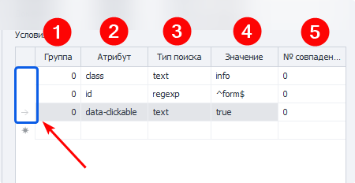

import DisclaimerNotice from '@site/src/components/DisclaimerNotice';

<DisclaimerNotice />

> 🔗 **[Оригинальная страница](https://zennolab.atlassian.net/wiki/spaces/RU/pages/735674386/Touch)** — Источник данного материала 

## Описание

Данный экшен позволяет эмулировать Touch-событие (нажатие пальцем). 

  

## Как добавить действие в проект?

Через контекстное меню **Добавить действие** → **Табы** → **Событие Touch**

  


Либо воспользуйтесь [❗→ умным поиском](https://zennolab.atlassian.net/wiki/spaces/RU/pages/506200090/ProjectMaker+7#%D0%A3%D0%BC%D0%BD%D1%8B%D0%B9-%D0%BF%D0%BE%D0%B8%D1%81%D0%BA-%D0%B4%D0%B5%D0%B9%D1%81%D1%82%D0%B2%D0%B8%D0%B9 "https://zennolab.atlassian.net/wiki/spaces/RU/pages/506200090/ProjectMaker+7#%D0%A3%D0%BC%D0%BD%D1%8B%D0%B9-%D0%BF%D0%BE%D0%B8%D1%81%D0%BA-%D0%B4%D0%B5%D0%B9%D1%81%D1%82%D0%B2%D0%B8%D0%B9").

  

## Где это можно применить?

- В случаях, когда вам необходимо эмулировать телефон или любое другое устройство с сенсорным экраном
- В случаях, когда вам нужно максимально приблизить все действия к человеческим.

  

## Как работать с экшеном?

Необходимо включить "Запись" и [❗→ режим ввода](https://zennolab.atlassian.net/wiki/spaces/RU/pages/534315373#%D0%A0%D0%B5%D0%B6%D0%B8%D0%BC-%D0%B2%D0%B2%D0%BE%D0%B4%D0%B0 "https://zennolab.atlassian.net/wiki/spaces/RU/pages/534315373#%D0%A0%D0%B5%D0%B6%D0%B8%D0%BC-%D0%B2%D0%B2%D0%BE%D0%B4%D0%B0") "Touch" в окне браузера, чтобы все действия, выполненные в браузере, автоматически записывались, как Touch-события. 


### Выбор события

- Touch - нажатие (клик/прикосновение);
- Long Touch - длительное зажатие (ПКМ)

### Поиск элемента

Прежде чем провзаимодействовать с элементом на странице его надо найти. В экшенах [❗→ Получение значения](https://zennolab.atlassian.net/wiki/spaces/RU/pages/534315124 "https://zennolab.atlassian.net/wiki/spaces/RU/pages/534315124") , [❗→ Установка значения](https://zennolab.atlassian.net/wiki/spaces/RU/pages/534315117 "https://zennolab.atlassian.net/wiki/spaces/RU/pages/534315117") , [❗→ Выполнить событие](https://zennolab.atlassian.net/wiki/spaces/RU/pages/534020211 "https://zennolab.atlassian.net/wiki/spaces/RU/pages/534020211") , [❗→ Событие Touch](https://zennolab.atlassian.net/wiki/spaces/RU/pages/735674386 "https://zennolab.atlassian.net/wiki/spaces/RU/pages/735674386") , [❗→ Событие Swipe](https://zennolab.atlassian.net/wiki/spaces/RU/pages/735739970 "https://zennolab.atlassian.net/wiki/spaces/RU/pages/735739970") существует два способа поиска элементов - классический и с помощью XPath.

  

**Классический** - Поиск по параметрам HTML элемента: тэг, атрибут и его значение.


**XPath** - поиск с помощью [❗→ XPath выражений](https://zennolab.atlassian.net/wiki/spaces/RU/pages/862093419/ "https://zennolab.atlassian.net/wiki/spaces/RU/pages/862093419/"). С помощью него Вы можете реализовать более универсальный и устойчивый к изменениям вёрстки способ поиска данных в сравнении с классическим поиском или регулярными выражениями.


### **Какая вкладка**

Выбираем вкладку, на которой будет производиться поиск элемента.
Возможные значения:

- Активная вкладка
- Первая
- По имени - при выборе данного пункта появится поле ввода для названия вкладки.
- По номеру - в поле ввода надо будет ввести порядковый номер вкладки (нумерация начинается с нуля!)

### **Документ**

Рекомендуется ставить значение **-1** (поиск во всех документах на странице). 

### **Форма**

Тоже лучше ставить **-1** (поиск по всем формам на странице). При выборе такого значения шаблон будет более универсальным.

<details>
<summary>Почему лучше ставить -1?</summary>

Пример: на странице 3 формы - поиск, регистрация, заказ товара. Нам надо кликнуть в форме заказа по кнопке и мы выбрали в качестве значения поля "Форма" - **2** (два) (нумерация с нуля). Спустя какое-то время на сайте появляется новая форма, для входа, и вставлена она перед формой заказа. Под номером 2 теперь будет форма входа и наш шаблон либо выдаст ошибку о том, что кнопка не найдена, либо (что гораздо хуже) будет кликать в другой форме по другой кнопке.

</details>
:::note На заметку
В настройках программы можно отметить два чекбокса - Искать во всех формах на странице и Искать во всех документах на странице  и тогда всегда при добавлении элемента в Конструктор действий для номера документа и формы будет стоять -1.
:::

### Тэг (только классический поиск)**


Собственно HTML тэг у которого нужно получить  значение.

:::tip Совет
Можно указать сразу несколько тегов, разделитель - ; (точка с запятой)
:::

### Условия (только классический поиск)**




1. **Группа** - приоритет данного условия. Чем выше это число тем приоритет ниже. Если не смогли найти элемент по условию  с наивысшим приоритетом, то переходим к условию со следующим приоритетом и так пока элемент не будет найден, либо пока не закончатся условия поиска. Можно добавлять несколько условий с одним приоритетом, тогда поиск будет производиться по всем условиям с одинаковым приоритетом одновременно.
2. **Атрибут** - атрибут HTML тэга по которому производится поиск.
3. **Тип поиска**:

 1. text - поиск по полному либо частичному вхождению текста;
 2. notext - поиск элементов в которых не будет указанного текста;
 3. regexp - поиск с помощью [❗→ регулярных выражений](https://zennolab.atlassian.net/wiki/spaces/RU/pages/534086111 "https://zennolab.atlassian.net/wiki/spaces/RU/pages/534086111") 
По умолчанию поиск регистронезависимый. Чтобы при поиске с помощью регулярного выражения учитывался регистр добавьте в самом начале выражения `(?-i)`(это означает отключение регистронезависимого поиска)
4. **Значение** - значение атрибута HTML тега
5. **№ совпадения** - порядковый номер найденного элемента (нумерация с нуля!). В этом поле можно [❗→ использовать диапазоны](https://zennolab.atlassian.net/wiki/spaces/RU/pages/488964137 "https://zennolab.atlassian.net/wiki/spaces/RU/pages/488964137") и макросы [❗→ переменных](https://zennolab.atlassian.net/wiki/spaces/RU/pages/486309922 "https://zennolab.atlassian.net/wiki/spaces/RU/pages/486309922").

:::note На заметку
Чтобы удалить условие поиска необходимо кликнуть ЛКМ по полю слева от него (на скриншоте выделено синим цветом) и нажать кнопку delete на клавиатуре.
:::

:::note На заметку
Для поиска нужного элемента может использоваться несколько условий.
:::

Всегда важно стараться подбирать условия поиска таким образом, чтоб оставался только один элемент, т.е. порядковый номер был 0 (нумерация с нуля).

### Координаты

Выполнить событие Touch в рамках указанных координат


1. **Какая вкладка** - Активная / Первая / По имени / По номеру
2. **Координаты** - необходимо вписать диапазон координат X и Y. Можно использовать [❗→ переменные](https://zennolab.atlassian.net/wiki/spaces/RU/pages/486309922 "https://zennolab.atlassian.net/wiki/spaces/RU/pages/486309922") проекта - `{ -Variable.example_var- }`
.

### Вкладка "Дополнительно"


**"Подождать перед выполнением".**

Сколько времени экшен будет ожидать перед выполнением.

**"Ждать элемент не более".**

Если по истечении указанного времени элемент не появился на странице, то экшен завершит работу с ошибкой.

  

## Пример использования

Возьмем за пример наш ресурс, где можно потренироваться делать простые клики - https://lessons.zennolab.com/ru/index. Для реализации воспользуемся [❗→ Конструктором действий](https://zennolab.atlassian.net/wiki/spaces/RU/pages/483426337 "https://zennolab.atlassian.net/wiki/spaces/RU/pages/483426337").

Переходим на страницу в ProjectMaker’e.


Опускаемся ниже и находим поле для нажатия и выбора ОС. Нажимаем на место для "галочки" правой кнопкой мыши и выбираем "В конструктор действий".


Выбираем действие **Rise** , Событие **touch**. Нажимаем на кнопку **Тестировать** для проверки.


Если клик совершился успешно, то нажимаем **Добавить в проект**

  

### Примеры работы на C#

Начиная с версии 7.1.4.0, в CommandCenter.Tab добавлено свойство Touch с набором методов. В свойстве Touch есть базовые методы: [<u data-renderer-mark="true">TouchStart</u>](https://help.zennolab.com/en/v7/zennoposter/7.1.4/webframe.html#topic693.html "https://help.zennolab.com/en/v7/zennoposter/7.1.4/webframe.html#topic693.html"), [<u data-renderer-mark="true">TouchEnd</u>](https://help.zennolab.com/en/v7/zennoposter/7.1.4/webframe.html#topic691.html "https://help.zennolab.com/en/v7/zennoposter/7.1.4/webframe.html#topic691.html"), [<u data-renderer-mark="true">TouchMove</u>](https://help.zennolab.com/en/v7/zennoposter/7.1.4/webframe.html#topic692.html "https://help.zennolab.com/en/v7/zennoposter/7.1.4/webframe.html#topic692.html"), [<u data-renderer-mark="true">TouchCancel</u>](https://help.zennolab.com/en/v7/zennoposter/7.1.4/webframe.html#topic690.html "https://help.zennolab.com/en/v7/zennoposter/7.1.4/webframe.html#topic690.html"), а также комплексные методы с перегрузками [<u data-renderer-mark="true">Touch</u>](https://help.zennolab.com/en/v7/zennoposter/7.1.4/webframe.html#topic685.html "https://help.zennolab.com/en/v7/zennoposter/7.1.4/webframe.html#topic685.html"), [<u data-renderer-mark="true">SwipeIntoView</u>](https://help.zennolab.com/en/v7/zennoposter/7.1.4/webframe.html#topic683.html "https://help.zennolab.com/en/v7/zennoposter/7.1.4/webframe.html#topic683.html"), [<u data-renderer-mark="true">SwipeBetween</u>](https://help.zennolab.com/en/v7/zennoposter/7.1.4/webframe.html#topic679.html "https://help.zennolab.com/en/v7/zennoposter/7.1.4/webframe.html#topic679.html") и другие.

#### Эмуляция тач-нажатия


```csharp
var tab = instance.ActiveTab;
var init = tab.FindElementByXPath("/html/body/button", 0); // Ищем HTML элемент через XPath
tab.Touch.Touch(init); // Жмём по нему
```

* * *

#### Скролл


```csharp
var tab = instance.ActiveTab;
HtmlElement init = tab.FindElementByXPath(".//button", 0); // Ищем HTML элемент через XPath
tab.Touch.SwipeIntoView(init); // Скроллим экран тачами до нужного HTML элемента
```


#### Свайп вправо


```csharp
var tab = instance.ActiveTab;

// Будем делать свайп внутри HTML элемента. Составим XPath выражение.
var canvas = tab.FindElementByXPath(@"//*[@id=""canvas""]", 0);

// Получаем его размеры: ширину и высоту
var width = canvas.BoundingClientWidth;
var height = canvas.BoundingClientHeight;

// Определяем координаты первого касания по оси X, и последнего - когда отпускаем палец
var offsetX = width / 4;
var minX = canvas.DisplacementInBrowser.X + offsetX;
var maxX = minX + width - 2*offsetX;

// Определяем координаты первого касания по оси Y, и последнего - когда отпускаем палец
var offsetY = height / 4;
var minY = canvas.DisplacementInBrowser.Y + offsetY;
var maxY = minY;

// Делаем свайп вправо
tab.Touch.SwipeBetween(minX, minY, maxX, maxY);
```

* * *

#### Настройки

Тут отображена только часть настроек. Полный список Вы можете найти в [❗→ документации](https://zennolab.atlassian.net/wiki/spaces/RU/pages/495058994 "https://zennolab.atlassian.net/wiki/spaces/RU/pages/495058994").

<details>
<summary>Нажмите здесь, чтобы развернуть</summary>

По умолчанию учитывается и рандомизируется ряд параметров: скорость, ускорение, кривая движения и другие. Все перемещения будут максимально естественными уже из «коробки», но если вам потребуется внести коррективы в поведение тач-событий – такая возможность тоже есть.


```csharp
var tab = instance.ActiveTab;
var parameters = tab.Touch.GetCopyOfTouchEmulationParameters(); // Получаем текущие настройки тача
// Дальше пишем "parameters." и после точки syntax editor подскажет доступны поля этого объекта.

////////////////////////
// Некоторые примеры
////////////////////////
parameters.Acceleration = 1.2f; // Поставим ускорение посильнее

parameters.MinCurvature = 0; // Пусть минимальная кривизна - прямая линия
parameters.MaxCurvature = 1; // А максимальная кривизна - очень сильный изгиб

// Изгиб кривой ближе к начальной точке
parameters.MinCurvePeakShift = 0f;
parameters.MaxCurvePeakShift = 0.2f;

parameters.MinStep = 1; // Начальная скорость пониже
parameters.MaxStep = 60; // А финальная - выше

parameters.RightThumbProbability = 0.7f; // В 70% случаев будет использоваться правый палец, а в 30% - левый.

tab.Touch.SetTouchEmulationParameters(parameters); // ВАЖНО: ПРИМЕНЯЕМ НАСТРОЙКИ - ИНАЧЕ НИЧЕГО НЕ ИЗМЕНИТСЯ

// Ещё больше настроек здесь: https://help.zennolab.com/en/v7/zennoposter/7.1.4/webframe.html#topic951.html
// instance.ActiveTab.Touch.SetTouchEmulationParameters(new TouchEmulationParameters()); // Устанавливаем настройки по умолчанию
```

</details>
  

####  Демонстрационный проект


❗→ touch-sample-project.zp 25 May 2021

## Полезные ссылки

- [❗→ Конструктор действий и Поиск по XPath](https://zennolab.atlassian.net/wiki/spaces/RU/pages/483426337 "https://zennolab.atlassian.net/wiki/spaces/RU/pages/483426337")
- [❗→ Событие Swipe](https://zennolab.atlassian.net/wiki/spaces/RU/pages/735739970 "https://zennolab.atlassian.net/wiki/spaces/RU/pages/735739970")
- [❗→ C# код (Си шарп код .net)](https://zennolab.atlassian.net/wiki/spaces/RU/pages/492011596 "https://zennolab.atlassian.net/wiki/spaces/RU/pages/492011596")
- [❗→ Выполнить событие](https://zennolab.atlassian.net/wiki/spaces/RU/pages/534020211 "https://zennolab.atlassian.net/wiki/spaces/RU/pages/534020211")
- [❗→ Диапазоны значений](https://zennolab.atlassian.net/wiki/spaces/RU/pages/488964137 "https://zennolab.atlassian.net/wiki/spaces/RU/pages/488964137")