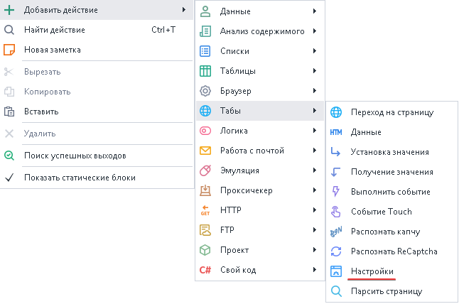
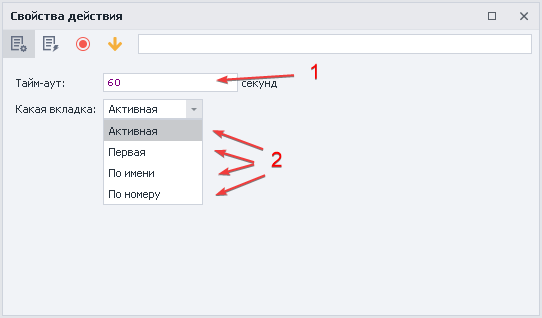

---
sidebar_position: 12
title: "Ожидание загрузки сайта"
description: ""
date: "2025-07-30"
converted: true
originalFile: "Настройки веб-страницы.txt"
targetUrl: "https://zennolab.atlassian.net/wiki/spaces/RU/pages/534020228/-"
---
import DisclaimerNotice from '@site/src/components/DisclaimerNotice';

<DisclaimerNotice />

> 🔗 **[Оригинальная страница](https://zennolab.atlassian.net/wiki/spaces/RU/pages/534020228/-)** — Источник данного материала

_______________________________________________  
## Описание
Экшен «Настройки» нужен для указания максимального времени ожидания загрузки сайта **на конкретной вкладке**.  

> *По умолчанию установлено **120 секунд**.*

### Как добавить действие в проект?
Через контекстное меню: **Добавить действие** → **Табы** → **Настройки**

_______________________________________________ 
## Принцип работы
Времени ожидания (*Тайм-аут*) полезно увеличивать в случаях долгой загрузки страницы.  

1. Указываем конкретное **число секунд** или переменную для ожидания загрузки сайта.
2. Для какого таба применить:  
    - **Активная** — текущая вкладка, которая у вас перед глазами;  
    - **Первая** — крайний слева таб;  
    - **По имени** — указать название вкладку или переменную соблюдая регистр букв;  
    - **По номеру** — отсчет слева направо с `0`. *Можно использовать переменную*.  

:::info Нумерация вкладок идёт слева направо и всегда начинается с `0`
:::
_______________________________________________
## Полезные ссылки

1. [❗→ Переход на страницу](https://zennolab.atlassian.net/wiki/spaces/RU/pages/534052989/Navigate "https://zennolab.atlassian.net/wiki/spaces/RU/pages/534052989/Navigate")
2. [❗→ Управление табом](/wiki/spaces/RU/pages/534020201 "/wiki/spaces/RU/pages/534020201")
3. [❗→ Окно переменных](/wiki/spaces/RU/pages/735608872 "/wiki/spaces/RU/pages/735608872")