---
sidebar_position: 5
title: "Выполнить событие"
description: ""
date: "2025-07-30"
converted: true
originalFile: "Выполнить событие.txt"
targetUrl: "https://zennolab.atlassian.net/wiki/spaces/RU/pages/534020211"
---
:::info **Пожалуйста, ознакомьтесь с [*Правилами использования материалов на данном ресурсе*](../Disclaimer).**
:::

> 🔗 **[Оригинальная страница](https://zennolab.atlassian.net/wiki/spaces/RU/pages/534020211)** — Источник данного материала

_______________________________________________   

## Описание

Данный экшен применяется когда нужно как-то провзаимодействовать с сайтом (кроме случаев ввода текста, когда используется экшен [❗→ Установить значение](https://zennolab.atlassian.net/wiki/spaces/RU/pages/534315117 "https://zennolab.atlassian.net/wiki/spaces/RU/pages/534315117")).

Что можно эмулировать:

- клик по элементу
- Наведение курсора мыши
- Нажатие кнопки
- Перетягивание элементов по сайту (drag&drop)
- И другие действия

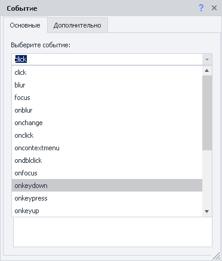


:::note На заметку
Как можно увидеть на скриншоте выше, список возможных действий довольно внушительный и не всегда может быть очевидно, что делает то или иное событие. Чтобы получить более подробную информацию скопируйте название события, вставьте в поисковую строку своего любимого поисковика и добавьте javascript; в итоге должно получиться что-то такое: “oncontextmenu javascript”, “javascript ondblclick”, “javascript onkeyup”. Таким образом Вы сможете найти описание интересующего Вас действия.
:::

## Как добавить действие в проект?

Через контекстное меню **Добавить действие** → **Табы** → **Выполнить событие**

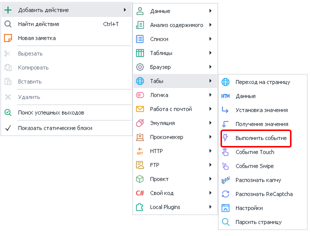


Через [❗→ конструктор действий](https://zennolab.atlassian.net/wiki/spaces/RU/pages/483426337 "https://zennolab.atlassian.net/wiki/spaces/RU/pages/483426337").

Либо воспользуйтесь [❗→ умным поиском](https://zennolab.atlassian.net/wiki/spaces/RU/pages/506200090/ProjectMaker+7#%D0%A3%D0%BC%D0%BD%D1%8B%D0%B9-%D0%BF%D0%BE%D0%B8%D1%81%D0%BA-%D0%B4%D0%B5%D0%B9%D1%81%D1%82%D0%B2%D0%B8%D0%B9 "https://zennolab.atlassian.net/wiki/spaces/RU/pages/506200090/ProjectMaker+7#%D0%A3%D0%BC%D0%BD%D1%8B%D0%B9-%D0%BF%D0%BE%D0%B8%D1%81%D0%BA-%D0%B4%D0%B5%D0%B9%D1%81%D1%82%D0%B2%D0%B8%D0%B9").

## Как выбрать элемент для выполнения события?

Рассмотрим на примере [этой страницы](https://learn.javascript.ru/article/mousemove-mouseover-mouseout-mouseenter-mouseleave/mouseoverout/ "https://learn.javascript.ru/article/mousemove-mouseover-mouseout-mouseenter-mouseleave/mouseoverout/").

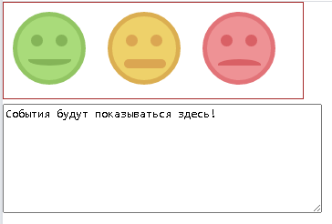


Когда курсор мыши находится над одним из смайлов, тот меняет цвет (это же касается и фона, глаз и рта смайла). Кликаем по любому из смайлов ПКМ и отправляем в [❗→ конструктор действий](https://zennolab.atlassian.net/wiki/spaces/RU/pages/483426337 "https://zennolab.atlassian.net/wiki/spaces/RU/pages/483426337")^(1)^. 

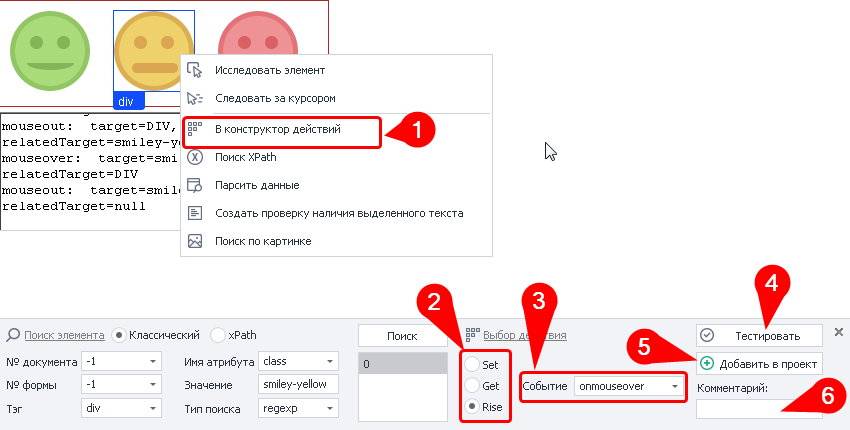


Параметры поиска элемента подставились автоматически, на них сейчас не будем заострять внимание. На что стоит обратить внимание:

- в пункте *Выбор действия* <sup>(2)</sup> необходимо выбрать *Rise* (по умолчанию стоит *Set* - [❗→ Установка значения](https://zennolab.atlassian.net/wiki/spaces/RU/pages/534315117 "https://zennolab.atlassian.net/wiki/spaces/RU/pages/534315117"))
- выбрать нужное *Событие* <sup>(3)</sup>, в нашем случае - [*onmouseover](https://learn.javascript.ru/mousemove-mouseover-mouseout-mouseenter-mouseleave "https://learn.javascript.ru/mousemove-mouseover-mouseout-mouseenter-mouseleave")
- обязательно нажмите кнопку *Тестировать* <sup>(4)</sup>, чтоб удостовериться, что всё настроено правильно (конкретно в нашем случае центральный, жёлтый, смайлик должен сменить цвет)
- (необязательно) добавьте комментарий <sup>(6)</sup>. Автоматический комментарий не очень информативный и, когда в Вашем шаблоне, будет много действий, то будет очень сложно понять что выполняет тот или иной экшен

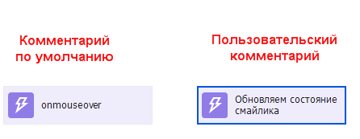


- если всё настроено и работает так как задумано, то добавляйте экшен в проект <sup>(5)</sup>

  

## Для чего используется?

- чаще всего Вы будете использовать этот экшен для кликов по кнопкам, пунктам в меню ([переключатели](http://htmlbook.ru/samhtml5/formy/pereklyuchateli "http://htmlbook.ru/samhtml5/formy/pereklyuchateli")), чекбоксам
- перетягивание элементов сайта
- эмуляция событий наведения мыши для получения всплывающей подсказки
- вызов JavaScript событий для полей ввода.

 - иногда создатели сайтов вешают на поля ввода дополнительные JavaScript скрипты (например проверка на то, что в поле введены корректные данные) и без срабатывания этих скриптов невозможно продолжить работу. В подобных случаях можно попробовать вызвать события *onchange, onkeypress и др. (если вызов этих событий не помогает, то можно воспользоваться [❗→ эмуляцией клавиатуры](https://zennolab.atlassian.net/wiki/spaces/RU/pages/735608949 "https://zennolab.atlassian.net/wiki/spaces/RU/pages/735608949") и [❗→ эмуляцией мыши](https://zennolab.atlassian.net/wiki/spaces/RU/pages/534315158 "https://zennolab.atlassian.net/wiki/spaces/RU/pages/534315158"))

## Как работать с экшеном?

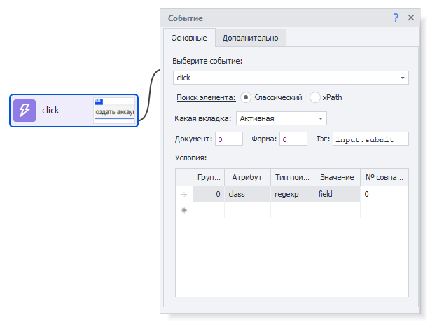


### Выберите событие

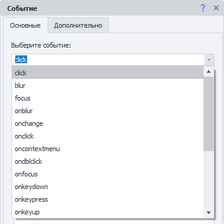


Выбираем что именно нужно сделать с элементом. 

:::note На заметку
В данном поле можно вручную указать значение, а не выбирать из предложенного. Так же тут можно использовать переменные проекта (`{ -Variable.var_name- }`)
:::

### Поиск элемента

Прежде чем провзаимодействовать с элементом на странице его надо найти. В экшенах [❗→ Получение значения](https://zennolab.atlassian.net/wiki/spaces/RU/pages/534315124 "https://zennolab.atlassian.net/wiki/spaces/RU/pages/534315124") , [❗→ Установка значения](https://zennolab.atlassian.net/wiki/spaces/RU/pages/534315117 "https://zennolab.atlassian.net/wiki/spaces/RU/pages/534315117") , [❗→ Выполнить событие](https://zennolab.atlassian.net/wiki/spaces/RU/pages/534020211 "https://zennolab.atlassian.net/wiki/spaces/RU/pages/534020211") , [❗→ Событие Touch](https://zennolab.atlassian.net/wiki/spaces/RU/pages/735674386 "https://zennolab.atlassian.net/wiki/spaces/RU/pages/735674386") , [❗→ Событие Swipe](https://zennolab.atlassian.net/wiki/spaces/RU/pages/735739970 "https://zennolab.atlassian.net/wiki/spaces/RU/pages/735739970") существует два способа поиска элементов - классический и с помощью XPath.

  

**Классический** - Поиск по параметрам HTML элемента: тэг, атрибут и его значение.

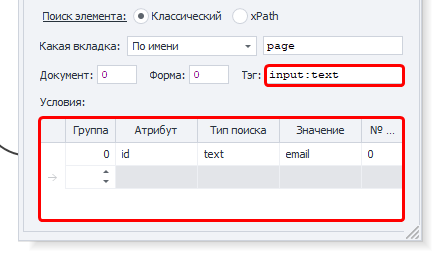


**XPath** - поиск с помощью [❗→ XPath выражений](https://zennolab.atlassian.net/wiki/spaces/RU/pages/862093419/ "https://zennolab.atlassian.net/wiki/spaces/RU/pages/862093419/"). С помощью него Вы можете реализовать более универсальный и устойчивый к изменениям вёрстки способ поиска данных в сравнении с классическим поиском или регулярными выражениями.

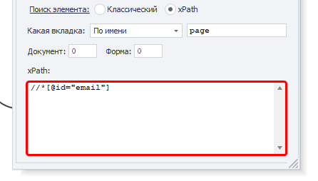


### **Какая вкладка**

Выбираем вкладку, на которой будет производиться поиск элемента.
Возможные значения:

- Активная вкладка
- Первая
- По имени - при выборе данного пункта появится поле ввода для названия вкладки.
- По номеру - в поле ввода надо будет ввести порядковый номер вкладки (нумерация начинается с нуля!)

### **Документ**

Рекомендуется ставить значение **-1** (поиск во всех документах на странице). 

### **Форма**

Тоже лучше ставить **-1** (поиск по всем формам на странице). При выборе такого значения шаблон будет более универсальным.

<details>
<summary>Почему лучше ставить "-1"?</summary>

Пример: на странице 3 формы - поиск, регистрация, заказ товара. Нам надо кликнуть в форме заказа по кнопке и мы выбрали в качестве значения поля “Форма” - **2** (два) (нумерация с нуля). Спустя какое-то время на сайте появляется новая форма, для входа, и вставлена она перед формой заказа. Под номером 2 теперь будет форма входа и наш шаблон либо выдаст ошибку о том, что кнопка не найдена, либо (что гораздо хуже) будет кликать в другой форме по другой кнопке.

</details>
:::note На заметку
В настройках программы можно отметить два чекбокса - Искать во всех формах на странице и Искать во всех документах на странице  и тогда всегда при добавлении элемента в Конструктор действий для номера документа и формы будет стоять -1.
:::

### **Тэг (только классический поиск)**


Собственно HTML тэг у которого нужно получить  значение.

:::tip Совет
Можно указать сразу несколько тегов, разделитель - ; (точка с запятой)
:::

### **Условия (только классический поиск)**


1. **Группа** - приоритет данного условия. Чем выше это число тем приоритет ниже. Если не смогли найти элемент по условию  с наивысшим приоритетом, то переходим к условию со следующим приоритетом и так пока элемент не будет найден, либо пока не закончатся условия поиска. Можно добавлять несколько условий с одним приоритетом, тогда поиск будет производиться по всем условиям с одинаковым приоритетом одновременно.
2. **Атрибут** - атрибут HTML тэга по которому производится поиск.
3. **Тип поиска**:

 1. text - поиск по полному либо частичному вхождению текста;
 2. notext - поиск элементов в которых не будет указанного текста;
 3. regexp - поиск с помощью [❗→ регулярных выражений](https://zennolab.atlassian.net/wiki/spaces/RU/pages/534086111 "https://zennolab.atlassian.net/wiki/spaces/RU/pages/534086111") 
По умолчанию поиск регистронезависимый. Чтобы при поиске с помощью регулярного выражения учитывался регистр добавьте в самом начале выражения `(?-i)`
(это означает отключение регистронезависимого поиска)
4. **Значение** - значение атрибута HTML тега
5. **№ совпадения** - порядковый номер найденного элемента (нумерация с нуля!). В этом поле можно [❗→ использовать диапазоны](https://zennolab.atlassian.net/wiki/spaces/RU/pages/488964137 "https://zennolab.atlassian.net/wiki/spaces/RU/pages/488964137") и макросы [❗→ переменных](https://zennolab.atlassian.net/wiki/spaces/RU/pages/486309922 "https://zennolab.atlassian.net/wiki/spaces/RU/pages/486309922").

:::note На заметку
Чтобы удалить условие поиска необходимо кликнуть ЛКМ по полю слева от него (на скриншоте выделено синим цветом) и нажать кнопку delete на клавиатуре.
:::

:::note На заметку
Для поиска нужного элемента может использоваться несколько условий.
:::

Всегда важно стараться подбирать условия поиска таким образом, чтоб оставался только один элемент, т.е. порядковый номер был 0 (нумерация с нуля).

### Координаты курсора мыши (только события drag и drop)

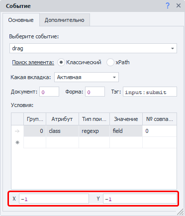


Это уникальные свойства и они доступны только для событий перетягивания элементов - *drag (откуда надо перетащить элемент) и *drop (куда его надо перетащить).

### Настройка действия:  Вкладка “Дополнительно”

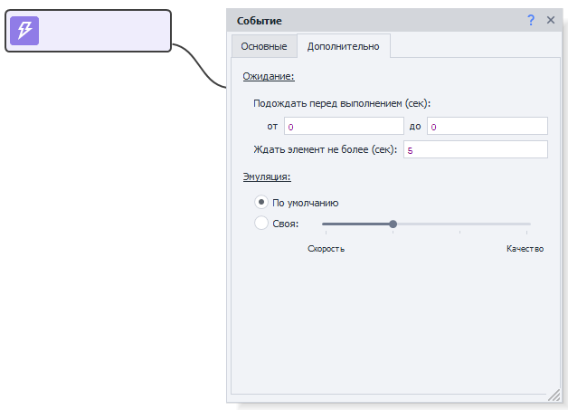


<u data-renderer-mark="true">Ожидание.</u>

1. “Подождать перед выполнением”.

Сколько времени шаблон будет ожидать перед тем как установить значение.
1. “Ждать элемент не более”.

Если по истечении указанного времени элемент не появился на странице, то экшен завершит работу с ошибкой.
<u data-renderer-mark="true">Эмуляция.</u>

1. “По умолчанию” - берется значение из настроек проекта.
2. “Своя” - выставляем персональный уровень эмуляции для данного экшена (настройки проекта в таком случае будут игнорироваться).

  

## Пример использования

### Простые клики

В простых кликах можно потренироваться на странице https://lessons.zennolab.com/ru/index (переключатели, чекбоксы) или тут https://lessons.zennolab.com/ru/registration (кнопка внизу формы).

Клик ПКМ по любому чекбоксу\переключателю - В конструктор действий - *Rise&gt;click - Тестировать (либо *Добавить в проект)

<details>
<summary>Скриншот</summary>

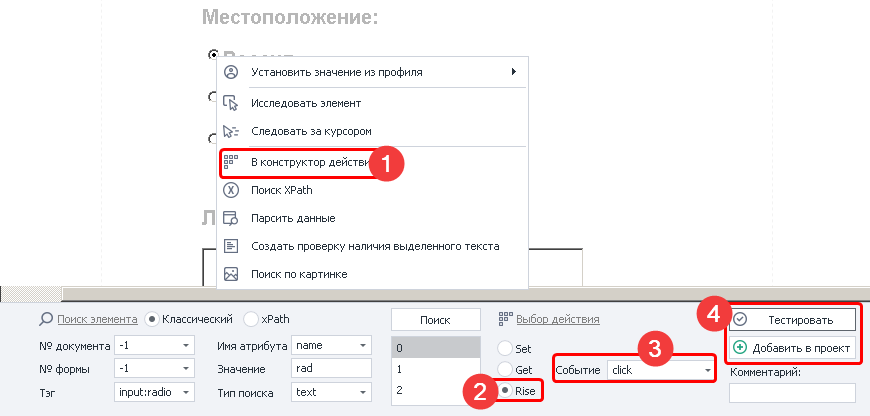


</details>
  

### Всплывающая подсказка

#### Пример №1

Такие подсказки появляются, когда пользователь наводит курсор мыши на тот или иной элемент сайта. 

Пример можно увидеть тут https://learn.javascript.ru/task/behavior-tooltip

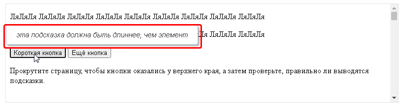


Но в данном случае необязательно заморачиваться с подбором и эмуляцией событий, можно взглянуть в исходный код страницы и заметить, что текст подсказки хранится в атрибуте 
```data-tooltip `и его значение можно с лёгкостью получить используя экшен [❗→ Взятие значения](https://zennolab.atlassian.net/wiki/spaces/RU/pages/534315124 "https://zennolab.atlassian.net/wiki/spaces/RU/pages/534315124"). Очень часто код таких подсказок хранится в коде самой страницы и если хорошенько поискать, то можно его найти.

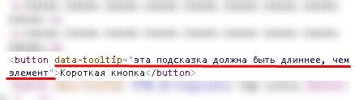


* * *

#### Пример №2

Но иногда всё немного сложнее - при наведении курсора мыши, с помощью скрипта на JavaScript, отправляется запрос на сервер, происходит ожидание ответа и, с помощью все того же JavaScript, ответ встраивается в тело страницы. В качестве примера можно привести форум Zennolab. При наведении курсора на название темы спустя короткое время появляется небольшое окно с контентом из темы

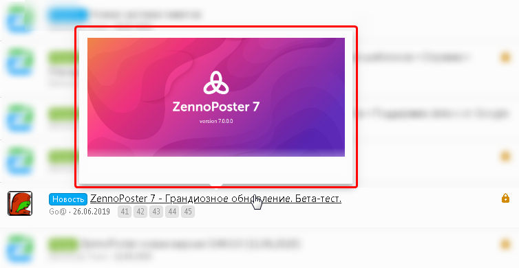


В такой ситуации есть несколько вариантов развития:

- можно с помощью экшена *Выполнить событие* эмулировать *onmouseover* дожидаться появления окна. Затем используя кубик [❗→ Взять значение](https://zennolab.atlassian.net/wiki/spaces/RU/pages/534315124 "https://zennolab.atlassian.net/wiki/spaces/RU/pages/534315124")парсить *innerHtml* и уже потом с помощью [❗→ Обработки текста](https://zennolab.atlassian.net/wiki/spaces/RU/pages/488865793 "https://zennolab.atlassian.net/wiki/spaces/RU/pages/488865793") достать нужные нам значения.
- либо можно попробовать повторить запрос, который отправляется на сервер. Для этого можно использовать как внешние средства, так и внутренние: либо [❗→ инструменты web-разработчика](https://zennolab.atlassian.net/wiki/spaces/RU/pages/1331134465 "https://zennolab.atlassian.net/wiki/spaces/RU/pages/1331134465") (доступно только для Chrome браузера), либо [❗→ Окно трафика](https://zennolab.atlassian.net/wiki/spaces/RU/pages/735805465 "https://zennolab.atlassian.net/wiki/spaces/RU/pages/735805465")

<details>
<summary>Инструменты для работы с запросами</summary>

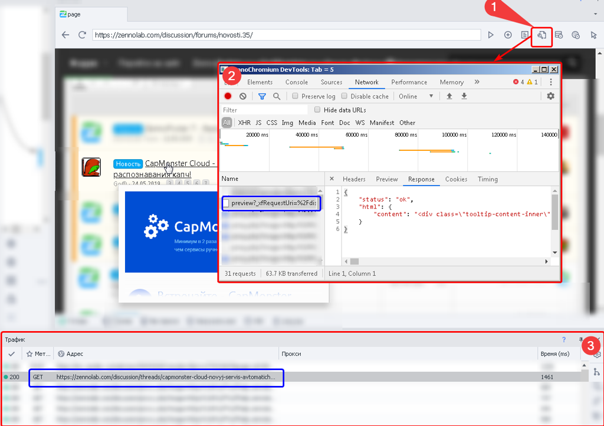


1. Кнопка запуска инструментов web-разработчика
2. Собственно окно инструментов web-разработчика
3. Монитор трафика

Синим выделен один и тот же запрос в инструментах и в окне трафика.

</details>
Одним из преимуществ Окна трафика является то, что из него автоматически можно создать экшен запроса. Клик ПКМ по нужному запросу и выбрать *Создать действие из запроса* :

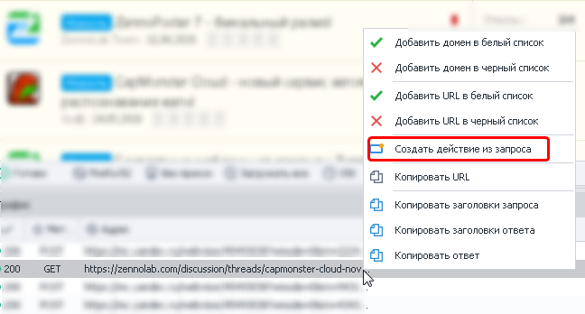


* * *

### Drag&Drop 

- Кликаем ПКМ по элементу, КОТОРЫЙ надо перетянуть, отправляем его в [❗→ Конструктор действий](https://zennolab.atlassian.net/wiki/spaces/RU/pages/483426337 "https://zennolab.atlassian.net/wiki/spaces/RU/pages/483426337"). 

 - Действие - *Rise,* событие - *drag.*
 - устанавливаем *X* и *Y -* это координаты начала движения. Координаты отсчитываются от верхнего левого угла выбранного элемента (у этого угла точка X=1 и точка Y=1). Тут шаблон совершит первый клик - захват (*drag)*.
- Теперь делаем клик ПКМ по элементу КУДА надо перетащить, так же отправляем в Конструктор действий.

 - Действие - *Rise,* событие - *drop.*
 - устанавливаем *X* и *Y -* это координаты конца движения. Координаты отсчитываются от верхнего левого угла выбранного элемента (у этого угла точка X=1 и точка Y=1). В эту точку второго элемента шаблон перетащит (*drop*) первый элемент.

<details>
<summary>Скриншот</summary>

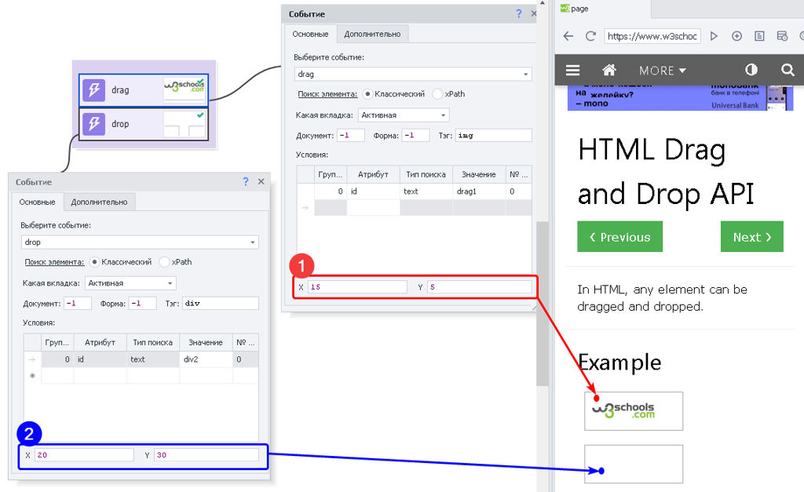


1. Откуда начинается движение.
2. Куда элемент перетягивается.

</details>
## Полезные ссылки

- [❗→ Конструктор действий и Поиск по XPath](https://zennolab.atlassian.net/wiki/spaces/RU/pages/483426337 "https://zennolab.atlassian.net/wiki/spaces/RU/pages/483426337")
- [❗→ Установка значения](https://zennolab.atlassian.net/wiki/spaces/RU/pages/534315117 "https://zennolab.atlassian.net/wiki/spaces/RU/pages/534315117")
- [❗→ Получение значения](https://zennolab.atlassian.net/wiki/spaces/RU/pages/534315124 "https://zennolab.atlassian.net/wiki/spaces/RU/pages/534315124")
- [❗→ Тестер регулярных выражений](https://zennolab.atlassian.net/wiki/spaces/RU/pages/534086111 "https://zennolab.atlassian.net/wiki/spaces/RU/pages/534086111")
- [❗→ Диапазоны значений](https://zennolab.atlassian.net/wiki/spaces/RU/pages/488964137 "https://zennolab.atlassian.net/wiki/spaces/RU/pages/488964137")
- [❗→ XPath](https://zennolab.atlassian.net/wiki/spaces/RU/pages/862093419 "https://zennolab.atlassian.net/wiki/spaces/RU/pages/862093419")
- [❗→ Работа с переменными](https://zennolab.atlassian.net/wiki/spaces/RU/pages/486309922 "https://zennolab.atlassian.net/wiki/spaces/RU/pages/486309922")
- [❗→ Эмуляция клавиатуры](https://zennolab.atlassian.net/wiki/spaces/RU/pages/735608949 "https://zennolab.atlassian.net/wiki/spaces/RU/pages/735608949")
- [❗→ Эмуляция мыши](https://zennolab.atlassian.net/wiki/spaces/RU/pages/534315158 "https://zennolab.atlassian.net/wiki/spaces/RU/pages/534315158")