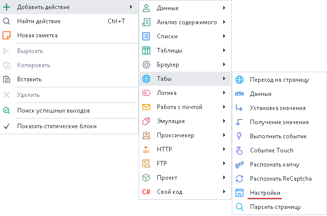
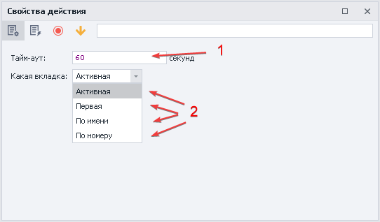

---
sidebar_position: 11
title: "Настройки веб-страницы"
description: ""
date: "2025-07-30"
converted: true
originalFile: "Настройки веб-страницы.txt"
targetUrl: "https://zennolab.atlassian.net/wiki/spaces/RU/pages/534020228/-"
---
:::info **Пожалуйста, ознакомьтесь с [*Правилами использования материалов на данном ресурсе*](../Disclaimer).**
:::

> 🔗 **[Оригинальная страница](https://zennolab.atlassian.net/wiki/spaces/RU/pages/534020228/-)** — Источник данного материала

_______________________________________________  

## Описание

Указание максимального времени ожидания загрузки сайта на конкретной вкладке. По умолчанию установлено 120 секунд.

## Как добавить действие в проект?

Через контекстное меню **Добавить действие** → **Табы** → **Настройки**

Либо воспользуйтесь [❗→ умным поиском](https://zennolab.atlassian.net/wiki/spaces/RU/pages/506200090/ProjectMaker+7#%D0%A3%D0%BC%D0%BD%D1%8B%D0%B9-%D0%BF%D0%BE%D0%B8%D1%81%D0%BA-%D0%B4%D0%B5%D0%B9%D1%81%D1%82%D0%B2%D0%B8%D0%B9 "https://zennolab.atlassian.net/wiki/spaces/RU/pages/506200090/ProjectMaker+7#%D0%A3%D0%BC%D0%BD%D1%8B%D0%B9-%D0%BF%D0%BE%D0%B8%D1%81%D0%BA-%D0%B4%D0%B5%D0%B9%D1%81%D1%82%D0%B2%D0%B8%D0%B9").

## Для чего это используется?

Изменение времени ожидания загрузки сайта может потребоваться в случаях длительной загрузки страницы.

## Как работать с экшеном?

1. Указываем паузу или переменную для ожидания загрузки сайта в секундах.
2. Для какого таба применить:  
a) *Активная* - текущая вкладка, которая у вас перед глазами  
b) *Первая* - крайний слева таб  
c) *По имени* - указать название вкладку или переменную соблюдая регистр букв  
d) *По номеру* - отсчет слева направо начиная с **0**. Можно использовать переменную  

:::info Информация
Нумерация вкладок идёт слева направо и всегда начинается с 0.
:::

  

## Полезные ссылки

1. [❗→ Переход на страницу](https://zennolab.atlassian.net/wiki/spaces/RU/pages/534052989/Navigate "https://zennolab.atlassian.net/wiki/spaces/RU/pages/534052989/Navigate")
2. [❗→ Управление табом](/wiki/spaces/RU/pages/534020201 "/wiki/spaces/RU/pages/534020201")
3. [❗→ Окно переменных](/wiki/spaces/RU/pages/735608872 "/wiki/spaces/RU/pages/735608872")