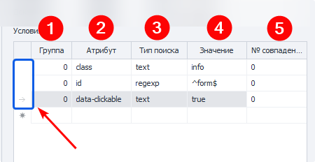

:::info **Пожалуйста, ознакомьтесь с [*Правилами использования материалов на данном ресурсе*](../Disclaimer).**
:::

> 🔗 **[Оригинальная страница](https://zennolab.atlassian.net/wiki/spaces/RU/pages/534315124)** — Источник данного материала

_______________________________________________  

  

## Описание

Данный экшен служит для получения значения указанного элемента. Это может быть:

- Высота\ширина
- Внутренний текст\HTML код
- HTML атрибуты - id, class, name, style и др.
- Имя тэга
- И многое другое

  

## Как добавить действие в проект?

Через контекстное меню **Добавить действие** → **Табы** → **Получение значения**

Через [❗→ конструктор действий](https://zennolab.atlassian.net/wiki/spaces/RU/pages/483426337/ "https://zennolab.atlassian.net/wiki/spaces/RU/pages/483426337/").

Либо воспользуйтесь [❗→ умным поиском](https://zennolab.atlassian.net/wiki/spaces/RU/pages/506200090/ProjectMaker+7#%D0%A3%D0%BC%D0%BD%D1%8B%D0%B9-%D0%BF%D0%BE%D0%B8%D1%81%D0%BA-%D0%B4%D0%B5%D0%B9%D1%81%D1%82%D0%B2%D0%B8%D0%B9 "https://zennolab.atlassian.net/wiki/spaces/RU/pages/506200090/ProjectMaker+7#%D0%A3%D0%BC%D0%BD%D1%8B%D0%B9-%D0%BF%D0%BE%D0%B8%D1%81%D0%BA-%D0%B4%D0%B5%D0%B9%D1%81%D1%82%D0%B2%D0%B8%D0%B9").

  

## Как выбрать элемент для взятия значения?

Рассмотрим на примере https://lessons.zennolab.com/ru/registration. Представим, что Вам нужно получить текст кнопки, которая отправляет форму. Для этого делаем клик ПКМ по этой кнопке, из контекстного меню выбираем *В конструктор действий.

Внизу, под окном браузера откроется [❗→ *Конструктор действий](https://zennolab.atlassian.net/wiki/spaces/RU/pages/483426337/.+XPath "https://zennolab.atlassian.net/wiki/spaces/RU/pages/483426337/.+XPath")

Данные для поиска будут автоматически подобраны таким образом, что в результате поиска останется только один элемент. Ваши действия

- В пункте *Действие выбрать *Get^(1)^(получить).
- Текст кнопки хранится в атрибуте value поэтому именно его и выбираем из выпадающего списка *Атрибут^(2)^. В поле *Значение появится то, что хранится в выбранном атрибуте^(2)^, в нашем случае - это текст “Создать аккаунт”.
- Перед добавлением экшена в проект не лишним будет протестировать его работу нажав соответствующую кнопку (особенно если Вы вносили изменения в конструкторе действий).
- (Необязательно, но желательно) Добавить комментарий к экшену (особенно это касается экшена *Получение значения т.к. комментарий по умолчанию крайне малоинформативен)
- Добавляем экшен в проект клинув кнопку *Добавить в проект

  

## Для чего это используется?

- Парсинг данных (правда для этого существует более подходящий инструмент - экшен [❗→ Парсить страницу](/wiki/spaces/RU/pages/534085857 "/wiki/spaces/RU/pages/534085857"))
- Проверка наличия элемента на странице. Это может быть полезно для:

 - определения того авторизовались ли мы (например, когда пользователь авторизован на сайте, то появляется кнопка перехода в личный кабинет, если она есть, значит всё ОК. Либо наоборот, когда пользователь авторизован, то пропадает какой-то элемент, как вариант - кнопка “Вход”, если её нет, значит мы вошли на сайт)
 - поиск сообщений с ошибками (очень полезно при разгадывании капчи: если капча была разгадана неверно, то очень часто на странице появляется новый HTML элемент с текстом ошибки; если после отправки капчи возвращается страница с таким элементом, то мы пробуем разгадать капчу ещё раз. Так же для проверки наличия текста на странице можно воспользоваться специальным экшеном [❗→ Проверка наличия текста](/wiki/spaces/RU/pages/1308426253 "/wiki/spaces/RU/pages/1308426253") )
- Проверка видимости элемента: бывают случаи, когда шаблон находит элемент, но по факту тот не отображается на странице (особенности построения HTML страниц), например это кнопка регистрации. Чтоб точно проверить отображена ли она на странице можно взять её атрибуты height (высота) и width (ширина), и проверить, чтоб каждый из них был больше 0.

  

## Настройка действия: Вкладка “Основные”

После добавление экшена через [❗→ конструктор действий](https://zennolab.atlassian.net/wiki/spaces/RU/pages/483426337/.+XPath "https://zennolab.atlassian.net/wiki/spaces/RU/pages/483426337/.+XPath") в проект, откроем его настройки:

### Что брать

Выбираем что именно нужно получить - `id, class, innerText, innerHtml, value, height, width, style `и др. 

В данном поле можно и вручную указать значение, а не выбирать из предложенного. 
На сайтах часто можно встретить атрибуты `data-... (примеры - data-name, data-value, data-testid, data-whatever, ...)`
вот такие атрибуты (которых нет в выпадающем списке экшена) можно прописать вручную.

:::note На заметку
Можно использовать переменные проекта (`{ -Variable.var\_name- }`)
:::

### Поиск элемента

Прежде чем провзаимодействовать с элементом на странице его надо найти. В экшенах [❗→ Получение значения](https://zennolab.atlassian.net/wiki/spaces/RU/pages/534315124 "https://zennolab.atlassian.net/wiki/spaces/RU/pages/534315124") , [❗→ Установка значения](https://zennolab.atlassian.net/wiki/spaces/RU/pages/534315117 "https://zennolab.atlassian.net/wiki/spaces/RU/pages/534315117") , [❗→ Выполнить событие](https://zennolab.atlassian.net/wiki/spaces/RU/pages/534020211 "https://zennolab.atlassian.net/wiki/spaces/RU/pages/534020211") , [❗→ Событие Touch](https://zennolab.atlassian.net/wiki/spaces/RU/pages/735674386 "https://zennolab.atlassian.net/wiki/spaces/RU/pages/735674386") , [❗→ Событие Swipe](https://zennolab.atlassian.net/wiki/spaces/RU/pages/735739970 "https://zennolab.atlassian.net/wiki/spaces/RU/pages/735739970") существует два способа поиска элементов - классический и с помощью XPath.

  

**Классический** - Поиск по параметрам HTML элемента: тэг, атрибут и его значение.

**XPath** - поиск с помощью [❗→ XPath выражений](https://zennolab.atlassian.net/wiki/spaces/RU/pages/862093419/ "https://zennolab.atlassian.net/wiki/spaces/RU/pages/862093419/"). С помощью него Вы можете реализовать более универсальный и устойчивый к изменениям вёрстки способ поиска данных в сравнении с классическим поиском или регулярными выражениями.

### **Какая вкладка**

Выбираем вкладку, на которой будет производиться поиск элемента.
Возможные значения:

- Активная вкладка
- Первая
- По имени - при выборе данного пункта появится поле ввода для названия вкладки.
- По номеру - в поле ввода надо будет ввести порядковый номер вкладки (нумерация начинается с нуля!)

### **Документ**

Рекомендуется ставить значение **-1** (поиск во всех документах на странице). 

### **Форма**

Тоже лучше ставить **-1** (поиск по всем формам на странице). При выборе такого значения шаблон будет более универсальным.

Почему лучше ставить "-1"?

Пример: на странице 3 формы - поиск, регистрация, заказ товара. Нам надо кликнуть в форме заказа по кнопке и мы выбрали в качестве значения поля “Форма” - **2** (два) (нумерация с нуля). Спустя какое-то время на сайте появляется новая форма, для входа, и вставлена она перед формой заказа. Под номером 2 теперь будет форма входа и наш шаблон либо выдаст ошибку о том, что кнопка не найдена, либо (что гораздо хуже) будет кликать в другой форме по другой кнопке.

:::note На заметку
В настройках программы можно отметить два чекбокса - Искать во всех формах на странице и Искать во всех документах на странице  и тогда всегда при добавлении элемента в Конструктор действий для номера документа и формы будет стоять -1.
:::

### **Тэг (только классический поиск)**

Собственно HTML тэг у которого нужно получить  значение.

:::tip Совет
Можно указать сразу несколько тегов, разделитель - ; (точка с запятой)
:::

### **Условия (только классический поиск)**

1. **Группа** - приоритет данного условия. Чем выше это число тем приоритет ниже. Если не смогли найти элемент по условию  с наивысшим приоритетом, то переходим к условию со следующим приоритетом и так пока элемент не будет найден, либо пока не закончатся условия поиска. Можно добавлять несколько условий с одним приоритетом, тогда поиск будет производиться по всем условиям с одинаковым приоритетом одновременно.
2. **Атрибут** - атрибут HTML тэга по которому производится поиск.
3. **Тип поиска**:

 1. text - поиск по полному либо частичному вхождению текста;
 2. notext - поиск элементов в которых не будет указанного текста;
 3. regexp - поиск с помощью [❗→ регулярных выражений](https://zennolab.atlassian.net/wiki/spaces/RU/pages/534086111 "https://zennolab.atlassian.net/wiki/spaces/RU/pages/534086111") 
По умолчанию поиск регистронезависимый. Чтобы при поиске с помощью регулярного выражения учитывался регистр добавьте в самом начале выражения 
`(?-i)`(это означает отключение регистронезависимого поиска)
4. **Значение** - значение атрибута HTML тега
5. **№ совпадения** - порядковый номер найденного элемента (нумерация с нуля!). В этом поле можно [❗→ использовать диапазоны](https://zennolab.atlassian.net/wiki/spaces/RU/pages/488964137 "https://zennolab.atlassian.net/wiki/spaces/RU/pages/488964137") и макросы [❗→ переменных](https://zennolab.atlassian.net/wiki/spaces/RU/pages/486309922 "https://zennolab.atlassian.net/wiki/spaces/RU/pages/486309922").

:::note На заметку
Чтобы удалить условие поиска необходимо кликнуть ЛКМ по полю слева от него (на скриншоте выделено синим цветом) и нажать кнопку delete на клавиатуре.
:::

:::note На заметку
Для поиска нужного элемента может использоваться несколько условий.
:::

Всегда важно стараться подбирать условия поиска таким образом, чтоб оставался только один элемент, т.е. порядковый номер был 0 (нумерация с нуля).

* * *

## Настройка действия: Вкладка “Дополнительно”

### Подождать перед выполнением

Сколько времени экшен будет ожидать перед выполнением.

### Ждать элемент не более

Если по истечении указанного времени элемент не появился на странице, то экшен завершит работу с ошибкой.

* * *

## Пример использования

Разберём один из способов применения. На примере https://lessons.zennolab.com/ru/advanced. 

С помощью [❗→ Установки значений](/wiki/spaces/RU/pages/534315117 "/wiki/spaces/RU/pages/534315117") и [❗→ переменных профиля](/wiki/spaces/RU/pages/486309922 "/wiki/spaces/RU/pages/486309922") заполняем поля формы. В реальном проекте нам бы пришлось [❗→ распознавать капчу](/wiki/spaces/RU/pages/534053026 "/wiki/spaces/RU/pages/534053026") с помощью сервисов или [❗→ вручную](/wiki/spaces/RU/pages/534053215 "/wiki/spaces/RU/pages/534053215"), но на данной странице капча-картинка всегда одна и та же. После ввода всех данных, с помощью экшена [❗→ Выполнить событие](/wiki/spaces/RU/pages/534020211 "/wiki/spaces/RU/pages/534020211"), кликаем по кнопке *Создать аккаунт.* Далее события могут развиваться в нескольких направлениях:

Если мы всё верно заполнили и правильно разгадали капчу, то получим страницу, где будет текст **Wellcome!**

Если капча разгадана неверно, то загрузится странице с текстом **wrong captcha**

Используя конструктор действий создаём экшен Взятия значения, в который сохраняется текст, показанный на скриншотах выше. Но в переменную попадает много лишнего - текст *adv\_reg,* названия пунктов меню. Используя [❗→ Обработку текста](https://zennolab.atlassian.net/wiki/spaces/RU/pages/488865793#Regex "https://zennolab.atlassian.net/wiki/spaces/RU/pages/488865793#Regex") и простое [❗→ регулярное выражение](/wiki/spaces/RU/pages/534086111 "/wiki/spaces/RU/pages/534086111") `(Wellcome!|wrong\ captcha)` ищем либо *Welcome* либо *wrong captcha.* С помощью [❗→ Switch](/wiki/spaces/RU/pages/534085864 "/wiki/spaces/RU/pages/534085864") делаем проверку на то, что содержится в переменной. Если там *Welcome*, то [❗→ отправляем](/wiki/spaces/RU/pages/534053050 "/wiki/spaces/RU/pages/534053050")информационное сообщение в [❗→ лог](/wiki/spaces/RU/pages/725352532 "/wiki/spaces/RU/pages/725352532"); если *wrong captcha -* отправляем сообщение в лог о том, что не удалось зарегистрироваться

## Полезные ссылки

- [❗→ Конструктор действий и Поиск по XPath](/wiki/spaces/RU/pages/483426337 "/wiki/spaces/RU/pages/483426337")
- [❗→ Установка значения](/wiki/spaces/RU/pages/534315117 "/wiki/spaces/RU/pages/534315117")
- [❗→ Выполнить событие](/wiki/spaces/RU/pages/534020211 "/wiki/spaces/RU/pages/534020211")
- [❗→ Обработка текста](/wiki/spaces/RU/pages/488865793 "/wiki/spaces/RU/pages/488865793")
- [❗→ Тестер регулярных выражений](/wiki/spaces/RU/pages/534086111 "/wiki/spaces/RU/pages/534086111")
- [❗→ Парсить страницу (Собрать данные со страницы)](/wiki/spaces/RU/pages/534085857 "/wiki/spaces/RU/pages/534085857")
- [❗→ Работа с переменными](/wiki/spaces/RU/pages/486309922 "/wiki/spaces/RU/pages/486309922")
- [❗→ XPath](/wiki/spaces/RU/pages/862093419 "/wiki/spaces/RU/pages/862093419")
- [❗→ Диапазоны значений](/wiki/spaces/RU/pages/488964137 "/wiki/spaces/RU/pages/488964137")
- [❗→ Проверка наличия текста](/wiki/spaces/RU/pages/1308426253 "/wiki/spaces/RU/pages/1308426253")