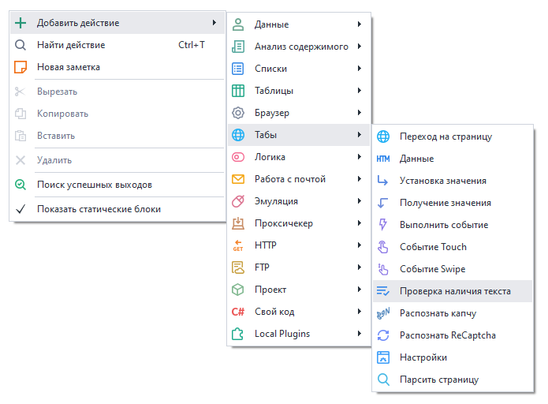
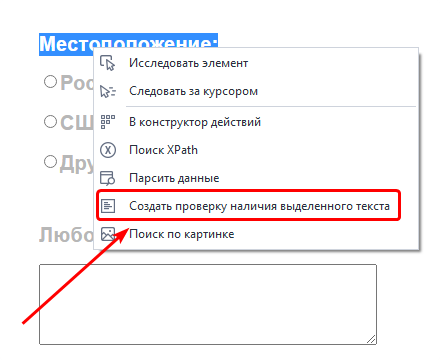
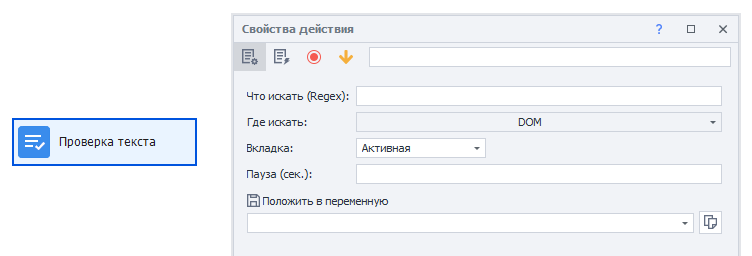

---
sidebar_position: 8
title: "Проверка наличия текста"
description: ""
date: "2025-07-30"
converted: true
originalFile: "Проверка наличия текста.txt"
targetUrl: "https://zennolab.atlassian.net/wiki/spaces/RU/pages/1308426253"
---
:::info **Пожалуйста, ознакомьтесь с [*Правилами использования материалов на данном ресурсе*](../Disclaimer).**
:::

> 🔗 **[Оригинальная страница](https://zennolab.atlassian.net/wiki/spaces/RU/pages/1308426253)** — Источник данного материала

_______________________________________________  

## Описание

Данное действие требуется для проверки наличия текста на странице или в URL. Является альтернативой функции [❗→ создания проверки наличия выделенного текста](/wiki/spaces/RU/pages/534053296 "/wiki/spaces/RU/pages/534053296").

:::info Информация
Добавлено в ZennoPoster 7.3.1.0
:::

  

## Как добавить действие в проект?

- Через контекстное меню **Добавить действие** → **Табы** → **Проверка наличия текста**

- Через контекстное меню браузера: выделите текст, наличие которого надо проверить, нажмите по нему ПКМ и выберите пункт *Создать проверку наличия выделенного текста.

- Либо воспользуйтесь [❗→ умным поиском](https://zennolab.atlassian.net/wiki/spaces/RU/pages/506200090/ProjectMaker+7#%D0%A3%D0%BC%D0%BD%D1%8B%D0%B9-%D0%BF%D0%BE%D0%B8%D1%81%D0%BA-%D0%B4%D0%B5%D0%B9%D1%81%D1%82%D0%B2%D0%B8%D0%B9 "https://zennolab.atlassian.net/wiki/spaces/RU/pages/506200090/ProjectMaker+7#%D0%A3%D0%BC%D0%BD%D1%8B%D0%B9-%D0%BF%D0%BE%D0%B8%D1%81%D0%BA-%D0%B4%D0%B5%D0%B9%D1%81%D1%82%D0%B2%D0%B8%D0%B9").

  

## Для чего это используется?

- Для проверки успешности авторизации
- Для проверки успешности выполненного действия на странице

  

## Как работать с экшеном?

### Что искать (Regex)

Текст, который необходимо найти. Поддерживаются [❗→ регулярные выражения](/wiki/spaces/RU/pages/534086111 "/wiki/spaces/RU/pages/534086111").

### Где искать

Выбрать данные, в которых будет произведён поиск

- DOM
- Source

:::note На заметку
В чём разница между DOM и Source?
:::

- Text (весь отображаемый текст на странице)
- URL

### Вкладка

Выбрать вкладку, с которой брать данные:

- *Активная - текущая активная вкладка;
- *Первая - если вкладок несколько, то взять первую по счёту;
- *По имени - указать имя вкладки;
- *По номеру - указать номер вкладки, если их несколько (нумерация с нуля).

### Пауза

Время ожидания в секундах перед тем, как будет выполнен поиск.

  

## Полезные ссылки

- [❗→ Создать проверку наличия выделенного текста](/wiki/spaces/RU/pages/534053296 "/wiki/spaces/RU/pages/534053296")
- [❗→ Регулярные выражения](/wiki/spaces/RU/pages/534086111 "/wiki/spaces/RU/pages/534086111")