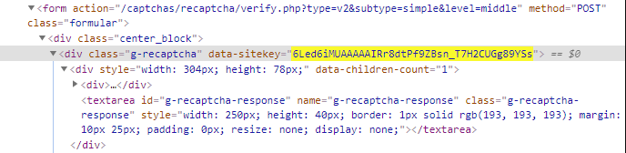

:::info **Пожалуйста, ознакомьтесь с [*Правилами использования материалов на данном ресурсе*](../Disclaimer).**
:::

> 🔗 **[Оригинальная страница](https://zennolab.atlassian.net/wiki/spaces/RU/pages/534053033/ReCaptcha)** — Источник данного материала

_______________________________________________  

## Описание

Позволяет пройти проверку на сайтах с установленной защитой от ботов. Метод подходит только для капч: **reCAPTCHA v2, reCAPTCHA v2 Invisible** и **reCAPTCHA v3**.


  

## Как добавить действие в проект?

Через контекстное меню **Добавить действие** → **Табы** → **Распознать ReCaptcha**


Либо воспользуйтесь [❗→ умным поиском](https://zennolab.atlassian.net/wiki/spaces/RU/pages/506200090/ProjectMaker+7#%D0%A3%D0%BC%D0%BD%D1%8B%D0%B9-%D0%BF%D0%BE%D0%B8%D1%81%D0%BA-%D0%B4%D0%B5%D0%B9%D1%81%D1%82%D0%B2%D0%B8%D0%B9 "https://zennolab.atlassian.net/wiki/spaces/RU/pages/506200090/ProjectMaker+7#%D0%A3%D0%BC%D0%BD%D1%8B%D0%B9-%D0%BF%D0%BE%D0%B8%D1%81%D0%BA-%D0%B4%D0%B5%D0%B9%D1%81%D1%82%D0%B2%D0%B8%D0%B9").

  

## Для чего это используется?

- Прохождение регистраций
- Парсинг сайтов и поисковых систем
- Выполнение массовых действий

  

## Как работать с экшеном?

### Основные настройки


1. Выбор модуля для распознавания каптчи. Из выпадающего списка необходимо выбрать желаемый сервис распознавания каптчи (предварительно надо указать его [❗→ API ключ в настройках](/wiki/spaces/RU/pages/808845385 "/wiki/spaces/RU/pages/808845385")).
2. [❗→ Настройки капчи сервисов](/wiki/spaces/RU/pages/808845385 "/wiki/spaces/RU/pages/808845385").
3. Устанавливаем [CapMonster.Cloud](https://capmonster.cloud/ "https://capmonster.cloud/") в качестве сервиса по умолчанию
4. Регистрация аккаунта в [CapMonster.Cloud](https://capmonster.cloud/ "https://capmonster.cloud/"). Все владельцы лицензии ZennoPoster получают бесплатно 5$ на баланс сервиса для разгадывания капч.

  

### Распознавание reCaptcha v2 во вкладке

Разгадывание происходит непосредственно в окне браузера.


#### Метод распознавания

Выбираем соответствующую функцию (**Распознавание reCaptcha v2**) и метод распознавания (**Во вкладке**)

#### Использовать прокси проекта

На сервис для распознавания вместе с капчей будет отправлен текущий прокси проекта.

#### Использовать куки проекта

На сервис для распознавания вместе с капчей будут отправлены текущие куки проекта.

#### Вкладка

Выбираем на какой вкладке надо распознать капчу:

a) **Активная** - таб, который у вас в данный момент перед глазами.  
b) **Первая** - первое окно слева.  
c) **По имени** - указать имя таба или переменную учитывая регистр букв.  
d) **По номеру** - задаём номер вкладки. Нумерация идёт слева направо начиная с 0.  

#### Выполнять autosubmit

Если на странице нет кнопки для отправления формы с разгаданной рекапчей, необходимо включить эту опцию, чтобы выполнить автосабмит.

#### Положить ID задания в переменную

Переменная для идентификатора задания.

  

### Распознавание reCaptcha v2 через sitekey

Процесс происходит без загрузки браузера.


#### Метод распознавания

Выбираем соответствующую функцию (**Распознавание reCaptcha v2**) и метод распознавания (**Через SiteKey**)

#### Использовать прокси проекта

На сервис для распознавания вместе с капчей будет отправлен текущий прокси проекта.

#### Использовать куки проекта

На сервис для распознавания вместе с капчей будут отправлены текущие куки проекта.

#### SiteKey

Recaptcha ключ сайта.

:::warning Внимание
Параметр Sitekey индивидуален для каждого сайта
:::

#### URL

Полный адрес страницы, на которой распознаётся Recaptcha.

#### data-s

Необязательно

Дополнительный параметр, который встречается не на всех сайтах, поэтому его передача опциональная.

Как минимум данный параметр встречается в поиске Google и на его сервисах.

#### Положить ID задания в переменную

Переменная для идентификатора задания.

#### Положить в переменную

В указанную здесь переменную сохранится ответ от сервиса распознавания - токен решённой Recaptcha.

#### Примеры отправки токена

<details>
<summary>Отправка Token в браузере</summary>

После получения *token необходимо подставить его в соответствующее поле.

Ниже рассмотрим как вызвать поле в браузере.


Через контекстное меню вызываем [❗→ Дерево Элементов](/wiki/spaces/RU/pages/727777355 "/wiki/spaces/RU/pages/727777355") и находим поле(**textarea**) для ввода внутри капчи


Правой кнопкой мыши вызываем контекстное меню и нажимаем **В конструктор действий**


1. Выбираем атрибут **style**
2. Значение выставляем **display:block**

Через кнопку **Тестировать** можно проверить в браузере сработает функция или нет. Далее добавляем экшен в проект.


Под самой капчей появится поле куда и нужно вводить *token. Это можно сделать с помощью действия [❗→ Установка значения](/wiki/spaces/RU/pages/534315117 "/wiki/spaces/RU/pages/534315117") .

</details>
<details>
<summary>Отправка Token на сервер через запросы</summary>

После успешного разгадывания капчи в переменную будет помещен ответ, содержащий *token, для отправки на сервер. Его необходимо подставить в запрос, чаще всего это аргумент **g-recaptcha-response**. 


Пример запроса на сайт всегда можно посмотреть в [❗→ окне трафика](/wiki/spaces/RU/pages/735805465 "/wiki/spaces/RU/pages/735805465")

</details>
  

### Распознавание reCaptcha v3 во вкладке

Разгадывание происходит непосредственно в окне браузера.


#### Метод распознавания

Выбираем соответствующую функцию (**Распознавание reCaptcha v3**) и метод распознавания (**Во вкладке**)

#### Использовать прокси проекта

На сервис для распознавания вместе с капчей будет отправлен текущий прокси проекта.

#### Использовать куки проекта

На сервис для распознавания вместе с капчей будут отправлены текущие куки проекта.

#### Вкладка

Выбираем на какой вкладке надо распознать капчу:

a) **Активная** - таб, который у вас в данный момент перед глазами.  
b) **Первая** - первое окно слева.  
c) **По имени** - указать имя таба или переменную учитывая регистр букв.  
d) **По номеру** - задаём номер вкладки. Нумерация идёт слева направо начиная с 0.  

#### Action

Параметр, который необходимо отыскать в исходном коде сайта.

Он находится в коде страницы в вызове функции **grecaptcha.execute**


:::warning Внимание
Индивидуален для каждого сайта!
:::

#### Min score

Рейтинг пользователя при котором прохождение проверки будет считаться успешным, диапазон от 0.1 до 0.9.

Чаще всего достаточно значения 0.3, но для каждого сайта надо проверять индивидуально.

#### Положить ID задания в переменную

Переменная для идентификатора задания.

#### Положить в переменную

В указанную здесь переменную сохранится ответ от сервиса распознавания - токен решённой Recaptcha.

  

### Распознавание reCaptcha v3 через sitekey

Процесс разгадывания происходит без загрузки браузера.


#### Метод распознавания

Выбираем соответствующую функцию (**Распознавание reCaptcha v3**) и метод распознавания (**Через SiteKey**)

#### Использовать прокси проекта

На сервис для распознавания вместе с капчей будет отправлен текущий прокси проекта.

#### Использовать куки проекта

На сервис для распознавания вместе с капчей будут отправлены текущие куки проекта.

#### SiteKey

Recaptcha ключ сайта.

:::warning Внимание
Параметр Sitekey индивидуален для каждого сайта
:::

<details>
<summary>Как получить SiteKey</summary>

- В исходном коде страницы [❗→ DOM](https://zennolab.atlassian.net/wiki/spaces/RU/pages/534085840/- "https://zennolab.atlassian.net/wiki/spaces/RU/pages/534085840/-")




- В [❗→ окне трафика](/wiki/spaces/RU/pages/735805465 "/wiki/spaces/RU/pages/735805465") при загрузке страницы


Нажимаем на запрос и переходим во вкладку Параметры


Параметр может называться **k** или **key**

</details>
#### URL

Полный адрес страницы, на которой распознаётся Recaptcha.

#### data-s

Необязательно

Дополнительный параметр, который встречается не на всех сайтах, поэтому его передача опциональная.

Как минимум данный параметр встречается в поиске Google и на его сервисах.

#### Action

Параметр, который необходимо отыскать в исходном коде сайта.

Он находится в коде страницы в вызове функции **grecaptcha.execute**


:::warning Внимание
Индивидуален для каждого сайта!
:::

#### Min score

Рейтинг пользователя при котором прохождение проверки будет считаться успешным, диапазон от 0.1 до 0.9.

Чаще всего достаточно значения 0.3, но для каждого сайта надо проверять индивидуально.

#### Положить ID задания в переменную

Переменная для идентификатора задания.

#### Положить в переменную

В указанную здесь переменную сохранится ответ от сервиса распознавания - токен решённой Recaptcha.

  

### Примечание касательно reCaptcha v3

При загрузке страницы в [❗→ окне трафика](/wiki/spaces/RU/pages/735805465 "/wiki/spaces/RU/pages/735805465") очень важно обратить внимание на запрос


- Если запрос происходит при загрузке страницы, то выбираем **распознавание reCaptcha v3 через sitekey**.
- Когда запрос осуществляется после отправки формы на сайт, то **распознавание reCaptcha v3 во вкладке**.
- Параметры : **SiteKey**, **Action**, **Score**, **Url** можно задавать через переменные.

:::note На заметку
Подмена token происходит до отправки запроса
:::

#### Пример отправки токена reCaptcha v3 при решении во вкладке

<details>
<summary>Как отправить токен в браузере</summary>

Отправка токена в браузере происходит путём его подмены. Способ во вкладке подходит, только когда запрос к Google-будет происходить после отправки формы


Рассмотрим на примере сайта [!\[\](https://lessons.zennolab.com/favicon.ico)reCAPTCHA V3 (Beta)](https://lessons.zennolab.com/captchas/recaptcha/v3.php?level=beta) 

Во время загрузки сайта не было запроса к капче - значит метод разгадывания во вкладке нам подходит.


Настраиваем кубик для разгадывания ReCaptcha v3


Получаем *token. Далее при помощи [❗→ C# сниппета](https://zennolab.atlassian.net/wiki/spaces/RU/pages/492011596/ "https://zennolab.atlassian.net/wiki/spaces/RU/pages/492011596/") отправляем его сайту:

```json
var sitekey = project.Variables["имя_переменной_sitekey"].Value;
var newToken = project.Variables["имя_переменной_token"].Value;
var replaceRegex = @"(?&lt;=\[""rresp"","")[^""]+";
instance.ChangeResponse("https://www.google.com/recaptcha/api2/reload\\?k="+sitekey,
 new List&lt;string&gt; {replaceRegex}, new List<string> {newToken}, false);
```


Использование SiteKey в сниппете не является обязательным. Но нужно учитывать, что без использования SiteKey будут перехватываться запросы от всех капч, включая ReCaptcha2.

Если это не является проблемой, вы можете использовать такую версию сниппета:

```json
var newToken = project.Variables["имя_переменной_token"].Value;
var replaceRegex = @"(?&lt;=\[""rresp"","")[^""]+";
instance.ChangeResponse("https://www.google.com/recaptcha/api2/reload\\?k=",
 new List&lt;string&gt; {replaceRegex}, new List<string> {newToken}, false);
```

Отправляем форму на сайте.


В окне трафика можно убедиться, что подмена *token на необходимый произошла

</details>
#### Пример отправки токена reCaptcha v3 при решении через SiteKey

<details>
<summary>Как подменить token</summary>

Если в [❗→ окне трафика](/wiki/spaces/RU/pages/735805465 "/wiki/spaces/RU/pages/735805465") видим, что запрос выполняется вместе с загрузкой страницы сайта, то порядок действий отличается от разгадывания во Вкладке

Сначала настраиваем кубик для разгадывания капчи и получаем *token


Получаем *token. Далее при помощи [❗→ C# сниппета](https://zennolab.atlassian.net/wiki/spaces/RU/pages/492011596/ "https://zennolab.atlassian.net/wiki/spaces/RU/pages/492011596/") отправляем его сайту:

```json
var sitekey = project.Variables["имя_переменной_sitekey"].Value;
var newToken = project.Variables["имя_переменной_token"].Value;
var replaceRegex = @"(?&lt;=\[""rresp"","")[^""]+";
instance.ChangeResponse("https://www.google.com/recaptcha/api2/reload\\?k="+sitekey,
 new List&lt;string&gt; {replaceRegex}, new List<string> {newToken}, false);
```


Использование SiteKey в сниппете не является обязательным. Но нужно учитывать, что без использования SiteKey будут перехватываться запросы от всех капч, включая ReCaptcha2.

Если это не является проблемой, вы можете использовать такую версию сниппета:

```json
var newToken = project.Variables["имя_переменной_token"].Value;
var replaceRegex = @"(?&lt;=\[""rresp"","")[^""]+";
instance.ChangeResponse("https://www.google.com/recaptcha/api2/reload\\?k=",
 new List&lt;string&gt; {replaceRegex}, new List<string> {newToken}, false);
```

Только после этого загружаем страницу с ReCaptcha v3 и производим необходимые действия

</details>

  

### Отчет об ошибке

Позволяет вернуть денежные средства в случае неудачной попытки разгадывания капчи.


**ID задания** указывается статичным значением или через переменную.

  

### Отчет об успехе

Сообщаем сервису об успешном разгадывании капчи.


**ID задания** указывается статичным значением или через переменную.

  

## Пример использования

При заходе на страницу антибот система просит подтвердить, что мы не робот.


1. Заходим на страницу.
2. Добавляем в проект экшен разгадать reCaptcha.
3. Настраиваем кубик.
4. Проходим проверку сайта.

На сегодняшний момент многие ресурсы пользуются защитой от компании Google. Она помогает сайтам пресекать массовые действия или определять ботов, но благодаря функционалу **Zennoposter** проходить такие проверки не составит труда.

  

## Полезные ссылки

1. [❗→ Окно трафика](/wiki/spaces/RU/pages/735805465 "/wiki/spaces/RU/pages/735805465")
2. [❗→ Окно переменных](/wiki/spaces/RU/pages/735608872 "/wiki/spaces/RU/pages/735608872")
3. [❗→ Данные](https://zennolab.atlassian.net/wiki/spaces/RU/pages/534085840/- "https://zennolab.atlassian.net/wiki/spaces/RU/pages/534085840/-")
4. [CapMonster Cloud](https://capmonster.cloud/ru/ "https://capmonster.cloud/ru/")