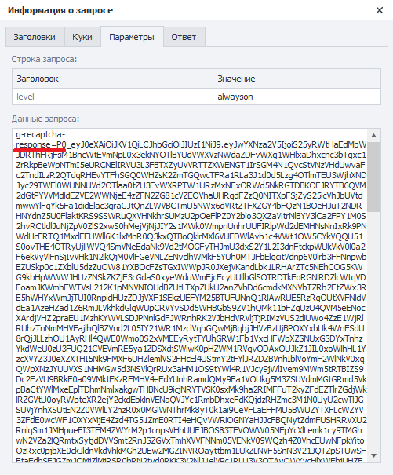

:::info **Пожалуйста, ознакомьтесь с [*Правилами использования материалов на данном ресурсе*](../Disclaimer).**
:::

> 🔗 **[Оригинальная страница](https://zennolab.atlassian.net/wiki/spaces/RU/pages/1795163670/hCaptcha)** — Источник данного материала

_______________________________________________  

## Описание

:::warning Внимание
Данная капча не распознается в данный момент.
:::

:::info Информация
Добавлено в ZennoPoster 7.5.0.0
:::

Позволяет пройти проверку на сайтах с установленной защитой от ботов. Метод подходит только для капч типа **hCaptcha**.

## Как добавить действие в проект?

Через контекстное меню **Добавить действие** → **Табы** → **Распознать hCaptcha**

Либо воспользуйтесь [❗→ умным поиском](https://zennolab.atlassian.net/wiki/spaces/RU/pages/506200090/ProjectMaker+7#%D0%A3%D0%BC%D0%BD%D1%8B%D0%B9-%D0%BF%D0%BE%D0%B8%D1%81%D0%BA-%D0%B4%D0%B5%D0%B9%D1%81%D1%82%D0%B2%D0%B8%D0%B9 "https://zennolab.atlassian.net/wiki/spaces/RU/pages/506200090/ProjectMaker+7#%D0%A3%D0%BC%D0%BD%D1%8B%D0%B9-%D0%BF%D0%BE%D0%B8%D1%81%D0%BA-%D0%B4%D0%B5%D0%B9%D1%81%D1%82%D0%B2%D0%B8%D0%B9").

  

## Для чего это используется?

- Прохождение регистраций
- Парсинг сайтов и поисковых систем
- Выполнение массовых действий

  

## Как работать с экшеном?

### Основные настройки

1. Выбор модуля для распознавания каптчи. Из выпадающего списка необходимо выбрать желаемый сервис распознавания каптчи (предварительно надо указать его [❗→ API ключ в настройках](/wiki/spaces/RU/pages/808845385 "/wiki/spaces/RU/pages/808845385")).
2. [❗→ Настройки капчи сервисов](/wiki/spaces/RU/pages/808845385 "/wiki/spaces/RU/pages/808845385").
3. Устанавливаем [CapMonster.Cloud](https://capmonster.cloud/ "https://capmonster.cloud/") в качестве сервиса по умолчанию
4. Регистрация аккаунта в [CapMonster.Cloud](https://capmonster.cloud/ "https://capmonster.cloud/"). Все владельцы лицензии ZennoPoster получают бесплатно 5$ на баланс сервиса для разгадывания капч.

  

### Перехват hCaptcha

:::info Информация
Добавлено в ZennoPoster 7.5.1.0
:::

:::warning Внимание
При включении перехвата Вы не сможете распознавать hCaptcha вручную.
:::

Опции “Начать перехват hCaptcha” и “Остановить перехват hCaptcha” необходимы для применения автосабмита при решении во вкладке. Они не потребуются, если автосабмит не используется, либо если используется разгадывание через сайткей. Наиболее корректный (и рекомендованный) способ использования данных кубиков - это включение перехвата непосредственно перед навигейтом на страницу с hCaptcha, и отключение перехвата непосредственно после решения целевой hCaptcha. Однако, технически ничего не препятствует Вам включать перехват hCaptcha в самом начале проекта, чтобы он был активен на протяжение всей его работы.

#### Начать перехват hCaptcha

Данное действие применяется в момент совершения последующего навигейта, поэтому выполнять его следует до перехода на страницу с hCaptcha. Пока перехват активен, можно решать hCaptcha во вкладке с использованием автосабмита. Обратите внимание, что речь идет именно об изменении url-а, указанного в адресной строке: то есть, если после некоторого действия в браузере (например, клика по кнопке) содержимое страницы изменилось и отобразилась hCaptcha, но текст в адресной строке остался прежним - то мы имеем дело с одной и той же страницей. Поэтому в таком случае перехват потребуется начать именно **до навигейта** на данную страницу (а не непосредственно перед кликом по кнопке в браузере).

#### Остановить перехват hCaptcha

Данное действие применяется в момент совершения последующего навигейта. Отключает перехват hCaptcha.

  

### Распознавание hCaptcha во вкладке

Разгадывание происходит непосредственно в окне браузера.

#### Метод распознавания

Выбираем соответствующую функцию (**Распознавание hCaptcha**) и метод распознавания (**Во вкладке**)

#### Использовать прокси проекта

На сервис для распознавания вместе с капчей будет отправлен текущий прокси проекта.

#### Использовать куки проекта

На сервис для распознавания вместе с капчей будут отправлены текущие куки проекта.

#### Вкладка

Выбираем на какой вкладке надо распознать капчу:

a) **Активная** - таб, который у вас в данный момент перед глазами.  
b) **Первая** - первое окно слева.  
c) **По имени** - указать имя таба или переменную учитывая регистр букв.  
d) **По номеру** - задаём номер вкладки. Нумерация идёт слева направо начиная с 0.  

#### Выполнять autosubmit

:::info Информация
Добавлено в ZennoPoster 7.5.1.0
:::

Выполнять автосабмит полученного токена.
Для корректной работы данной опции потребуется включить перехват hCaptcha до навигейта на страницу с капчей (описано выше).

#### Положить ID задания в переменную

Переменная для идентификатора задания.

  

### Распознавание hCaptcha через sitekey

Процесс происходит без загрузки браузера.

#### Метод распознавания

Выбираем соответствующую функцию (**Распознавание hCaptcha**) и метод распознавания (**Через SiteKey**)

#### Использовать прокси проекта

На сервис для распознавания вместе с капчей будет отправлен текущий прокси проекта.

#### Использовать куки проекта

На сервис для распознавания вместе с капчей будут отправлены текущие куки проекта.

#### SiteKey

hCaptcha ключ сайта.

:::warning Внимание
Параметр Sitekey индивидуален для каждого сайта
:::

Как получить SiteKey

- В исходном коде страницы [❗→ DOM](https://zennolab.atlassian.net/wiki/spaces/RU/pages/534085840/- "https://zennolab.atlassian.net/wiki/spaces/RU/pages/534085840/-")

- В [❗→ окне трафика](/wiki/spaces/RU/pages/735805465 "/wiki/spaces/RU/pages/735805465") при загрузки страницы

Нажимаем на запрос и проверяем полный адрес на вкладке “Заголовки”

#### URL

Полный адрес страницы, на которой распознаётся hCaptcha.

#### Положить ID задания в переменную

Переменная для идентификатора задания.

#### Положить в переменную

В указанную здесь переменную сохранится ответ от сервиса распознавания - токен решённой hCaptcha.

#### Примеры отправки токена

Отправка Token в браузере

После получения *token* необходимо подставить его в соответствующее поле. В случае hCaptcha таких полей, как правило, два.

Ниже рассмотрим как вызвать поле в браузере.

Открываем [❗→ Дерево Элементов](/wiki/spaces/RU/pages/727777355 "/wiki/spaces/RU/pages/727777355") и находим поля (**textarea**) для ввода внутри капчи.

Правой кнопкой мыши для каждого текстового поля вызываем контекстное меню и нажимаем **В конструктор действий**. ** Фильтр поиска элемента в каждом случае нужно немного изменить, т.к. окончание может быть уникальным для каждой загрузки страницы. Удаляем окончание в поле “Значение”, переключаем тип поиска на regexp.

В данные поля и требуется вставить полученный токен. Это можно сделать с помощью действия [❗→ Установка значения](/wiki/spaces/RU/pages/534315117 "/wiki/spaces/RU/pages/534315117") .

Отправка Token на сервер через запросы

После успешного разгадывания капчи в переменную будет помещен ответ, содержащий *token*, для отправки на сервер. Его необходимо подставить в запрос, чаще всего это аргументы (два, с одинаковым значением) **g-recaptcha-response** и **h-captcha-response**

Пример запроса на сайт всегда можно посмотреть в [❗→ окне трафика](/wiki/spaces/RU/pages/735805465 "/wiki/spaces/RU/pages/735805465")

  

### Отчет об ошибке

Позволяет вернуть денежные средства в случае неудачной попытки разгадывания капчи.

**ID задания** указывается статичным значением или через переменную.

  

### Отчет об успехе

Сообщаем сервису об успешном разгадывании капчи.

**ID задания** указывается статичным значением или через переменную.

  

## Пример использования

При заходе на страницу антибот система просит подтвердить, что мы не робот.

1. Для использования автосабмита, перед переходом на целевую страницу начинаем перехват hCaptcha
2. Заходим на страницу.
3. Добавляем в проект экшен разгадать hCaptcha.
4. Настраиваем кубик.
5. Проходим проверку сайта.
6. Отключаем перехват hCaptcha (опционально)

На сегодняшний момент многие ресурсы пользуются защитой от hCaptcha. Она помогает сайтам пресекать массовые действия или определять ботов, но благодаря функционалу **ZennoPoster** проходить такие проверки не составит труда.

  

## Полезные ссылки

1. [❗→ Окно трафика](/wiki/spaces/RU/pages/735805465 "/wiki/spaces/RU/pages/735805465")
2. [❗→ Окно переменных](/wiki/spaces/RU/pages/735608872 "/wiki/spaces/RU/pages/735608872")
3. [❗→ Данные](https://zennolab.atlassian.net/wiki/spaces/RU/pages/534085840/- "https://zennolab.atlassian.net/wiki/spaces/RU/pages/534085840/-")
4. [CapMonster Cloud](https://capmonster.cloud/ru/ "https://capmonster.cloud/ru/")