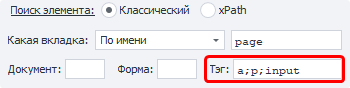

:::info **Пожалуйста, ознакомьтесь с [*Правилами использования материалов на данном ресурсе*](../Disclaimer).**
:::

> 🔗 **[Оригинальная страница](https://example.com/target-page)** — Источник данного материала

_______________________________________________  
# Распознать каптчу

  

## Описание

Экшен используется для автоматического решения каптчи через [❗→ сервисы](/wiki/spaces/RU/pages/808845385 "/wiki/spaces/RU/pages/808845385") или [❗→ вручную](/wiki/spaces/RU/pages/534053215 "/wiki/spaces/RU/pages/534053215").

Каптча (от CAPTCHA — англ. **C**ompletely **A**utomated **P**ublic **T**uring test to tell **C**omputers and **H**umans **A**part — полностью автоматизированный публичный тест Тьюринга для различения компьютеров и людей) - компьютерный тест, используемый для того, чтобы определить, кем является пользователь системы: человеком или компьютером.

|  |
| :--: |
| Некоторые виды капчи |


## Как добавить действие в проект?

Существует несколько способов добавления экшена в проект.

### Через контекстное меню БРАУЗЕРА

Для добавления экшена распознавания с помощью контекстного меню [❗→ браузера](/wiki/spaces/RU/pages/534315373 "/wiki/spaces/RU/pages/534315373")ProjectMaker Вы должны кликнуть ПКМ по картинке на сайте и выбрать пункт *Это каптча!


После добавления экшена сразу же откроется окно [❗→ распознавания каптчи вручную](/wiki/spaces/RU/pages/534053215 "/wiki/spaces/RU/pages/534053215"), которое пока можно закрыть и перейти к настройкам экшена.

### Через контекстное меню **ПРОЕКТА**

**Добавить действие** → **Табы** → **Распознать капчу**


Минус данного способа заключается в том, что Вам предварительно надо скачать изображение на компьютер и потом указать путь к файлу в экшене.

Либо воспользуйтесь [❗→ умным поиском](https://zennolab.atlassian.net/wiki/spaces/RU/pages/506200090/ProjectMaker+7#%D0%A3%D0%BC%D0%BD%D1%8B%D0%B9-%D0%BF%D0%BE%D0%B8%D1%81%D0%BA-%D0%B4%D0%B5%D0%B9%D1%81%D1%82%D0%B2%D0%B8%D0%B9 "https://zennolab.atlassian.net/wiki/spaces/RU/pages/506200090/ProjectMaker+7#%D0%A3%D0%BC%D0%BD%D1%8B%D0%B9-%D0%BF%D0%BE%D0%B8%D1%81%D0%BA-%D0%B4%D0%B5%D0%B9%D1%81%D1%82%D0%B2%D0%B8%D0%B9").

## Настройки экшена распознавания капчи. 

### Основное


#### Модуль распознавания

Выбор модуля (каптча-сервиса) через который будет распознана каптча. 

Из выпадающего списка необходимо выбрать желаемый сервис распознавания каптчи (предварительно надо указать его [❗→ API ключ в настройках](/wiki/spaces/RU/pages/808845385 "/wiki/spaces/RU/pages/808845385")). По умолчанию стоит *MonkeyEnter.dll* - [❗→ ручной ввод](/wiki/spaces/RU/pages/534053215 "/wiki/spaces/RU/pages/534053215"). 

:::note На заметку
В данном поле можно использовать переменные проекта.
:::

#### Настройки

При клике по кнопке *Настройки Вы попадёте в настройки программы, на [❗→ вкладку каптча сервисов](/wiki/spaces/RU/pages/808845385 "/wiki/spaces/RU/pages/808845385").

#### Поиск элемента

Прежде чем провзаимодействовать с элементом на странице его надо найти. В экшенах [❗→ Получение значения](https://zennolab.atlassian.net/wiki/spaces/RU/pages/534315124 "https://zennolab.atlassian.net/wiki/spaces/RU/pages/534315124") , [❗→ Установка значения](https://zennolab.atlassian.net/wiki/spaces/RU/pages/534315117 "https://zennolab.atlassian.net/wiki/spaces/RU/pages/534315117") , [❗→ Выполнить событие](https://zennolab.atlassian.net/wiki/spaces/RU/pages/534020211 "https://zennolab.atlassian.net/wiki/spaces/RU/pages/534020211") , [❗→ Событие Touch](https://zennolab.atlassian.net/wiki/spaces/RU/pages/735674386 "https://zennolab.atlassian.net/wiki/spaces/RU/pages/735674386") , [❗→ Событие Swipe](https://zennolab.atlassian.net/wiki/spaces/RU/pages/735739970 "https://zennolab.atlassian.net/wiki/spaces/RU/pages/735739970") существует два способа поиска элементов - классический и с помощью XPath.

  

**Классический** - Поиск по параметрам HTML элемента: тэг, атрибут и его значение.


**XPath** - поиск с помощью [❗→ XPath выражений](https://zennolab.atlassian.net/wiki/spaces/RU/pages/862093419/ "https://zennolab.atlassian.net/wiki/spaces/RU/pages/862093419/"). С помощью него Вы можете реализовать более универсальный и устойчивый к изменениям вёрстки способ поиска данных в сравнении с классическим поиском или регулярными выражениями.


### **Какая вкладка**

Выбираем вкладку, на которой будет производиться поиск элемента.
Возможные значения:

- Активная вкладка
- Первая
- По имени - при выборе данного пункта появится поле ввода для названия вкладки.
- По номеру - в поле ввода надо будет ввести порядковый номер вкладки (нумерация начинается с нуля!)

### **Документ**

Рекомендуется ставить значение **-1** (поиск во всех документах на странице). 

### **Форма**

Тоже лучше ставить **-1** (поиск по всем формам на странице). При выборе такого значения шаблон будет более универсальным.

<details>
<summary>Почему лучше ставить "-1"?</summary>

Пример: на странице 3 формы - поиск, регистрация, заказ товара. Нам надо кликнуть в форме заказа по кнопке и мы выбрали в качестве значения поля “Форма” - **2** (два) (нумерация с нуля). Спустя какое-то время на сайте появляется новая форма, для входа, и вставлена она перед формой заказа. Под номером 2 теперь будет форма входа и наш шаблон либо выдаст ошибку о том, что кнопка не найдена, либо (что гораздо хуже) будет кликать в другой форме по другой кнопке.

</details>
:::note На заметку
В настройках программы можно отметить два чекбокса - Искать во всех формах на странице и Искать во всех документах на странице  и тогда всегда при добавлении элемента в Конструктор действий для номера документа и формы будет стоять -1.
:::

### **Тэг (только классический поиск)**




Собственно HTML тэг у которого нужно получить  значение.

:::tip Совет
Можно указать сразу несколько тегов, разделитель - ; (точка с запятой)
:::

### **Условия (только классический поиск)**


1. **Группа** - приоритет данного условия. Чем выше это число тем приоритет ниже. Если не смогли найти элемент по условию  с наивысшим приоритетом, то переходим к условию со следующим приоритетом и так пока элемент не будет найден, либо пока не закончатся условия поиска. Можно добавлять несколько условий с одним приоритетом, тогда поиск будет производиться по всем условиям с одинаковым приоритетом одновременно.
2. **Атрибут** ** - атрибут HTML тэга по которому производится поиск.
3. **Тип поиска**:

 1. text - поиск по полному либо частичному вхождению текста;
 2. notext - поиск элементов в которых не будет указанного текста;
 3. regexp - поиск с помощью [❗→ регулярных выражений](https://zennolab.atlassian.net/wiki/spaces/RU/pages/534086111 "https://zennolab.atlassian.net/wiki/spaces/RU/pages/534086111") 
По умолчанию поиск регистронезависимый. Чтобы при поиске с помощью регулярного выражения учитывался регистр добавьте в самом начале выражения `(?-i)`(это означает отключение регистронезависимого поиска)
4. **Значение** - значение атрибута HTML тега
5. **№ совпадения** - порядковый номер найденного элемента (нумерация с нуля!). В этом поле можно [❗→ использовать диапазоны](https://zennolab.atlassian.net/wiki/spaces/RU/pages/488964137 "https://zennolab.atlassian.net/wiki/spaces/RU/pages/488964137") и макросы [❗→ переменных](https://zennolab.atlassian.net/wiki/spaces/RU/pages/486309922 "https://zennolab.atlassian.net/wiki/spaces/RU/pages/486309922").

:::note На заметку
Чтобы удалить условие поиска необходимо кликнуть ЛКМ по полю слева от него (на скриншоте выделено синим цветом) и нажать кнопку delete на клавиатуре.
:::

:::note На заметку
Для поиска нужного элемента может использоваться несколько условий.
:::

Всегда важно стараться подбирать условия поиска таким образом, чтоб оставался только один элемент, т.е. порядковый номер был 0 (нумерация с нуля).

#### Положить результат в переменную

Результат распознавания будет сохранён в указанную здесь [❗→ переменную проекта](/wiki/spaces/RU/pages/486309922 "/wiki/spaces/RU/pages/486309922").

  

### Дополнительно


#### Ожидание


*Подождать перед выполнением
Если в полях *ОТ и *ДО указаны положительные числа, то экшен будет делать паузу перед тем как начать работу (время будет выбрано случайно исходя из указанного диапазона).

*Ждать элемент не более
Если по истечении указанного здесь времени элемент не будет найден, то экшен выйдет по красной ветке (с ошибкой).

#### Параметры модуля


В данном поле можно ввести дополнительные параметры (условия) для разгадывания капчи - чувствительна к регистру, только русские символы, математическая капча, несколько слов и др. 

Формат: `название_параметра=значение_параметра` Несколько параметров разделяются символом ***&*** (амперсанд)

Пример (основан на API RuCaptcha) `phrase=1&numeric=2&regsense=1`
- капча состоит из двух и более слов, только из букв, чувствительна к регистру


<details>
<summary>Примеры параметров с разных сервисов</summary>

:::warning Внимание
Дополнительные параметры и значение, которые эти параметры могут принимать, индивидуальны для каждого сервиса.
:::

Рассмотрим несколько примеров на основе двух популярных сервисов для разгадывания каптчи.

*RuCaptcha* - при переходе на страницу с описанием API https://rucaptcha.com/api-rucaptcha#solving_normal_captcha пролистав ниже можно найти таблицу, где указаны параметры, которые можно указать

|  |
| :--: |
| тут только часть из возможных параметров |


*Anti-Captcha* - на [❗→ странице документации](https://anticaptcha.atlassian.net/wiki/spaces/API/pages/4227078/ImageToTextTask "https://anticaptcha.atlassian.net/wiki/spaces/API/pages/4227078/ImageToTextTask") по решению простых текстовых каптч тоже есть таблица с допустимыми параметрами


Даже на основе только этих двух сервисов и только небольшой части их параметров можно увидеть, что 

- некоторые параметры, которые отвечают за одно и то же называются по-разному (чувствительность к регистру - *case и *regesense)
- другие имеют одно и тоже название, отвечают за одно и тоже, но принимают разные типы значений (*phrase)
- есть параметры, которые совпадают по имени, назначению, принимаемым значениям, но в одном сервисе можно передать чуть больше значений, чем в другом (*numeric)

Будьте крайне внимательны, когда пишите проект под несколько каптча сервисов с использованием дополнительных параметров.

</details>
#### Параметры каптчи


*Масштаб*
С помощью данной настройки Вы можете уменьшить или увеличить размер отправляемой картинки-каптчи.

*Склеивать каптчи*
Бывает, что каптча состоит из нескольких картинок, тогда их можно объединить, чтобы не тратиться на распознавание отдельных частей. Для объединения каптч, если вы не объединили их при записи шаблона, нужно в окне свойств первого элемента каптчи установить флаг «Склеивать каптчи». Потом кликаете ПКМ по следующему элементу и в контекстном меню появится новый пункт *Приклеить к каптче. 


При каждом клике будет создаваться новый экшен, у последнего будет ставиться чекбокс *Последняя каптча (у предыдущих данный чекбокс снимается).

#### Асинхронное распознавание


Данная настройка позволяет не ждать ответа от сервиса, а продолжить выполнение шаблона.

При включении данной опции создаётся новый экшен *Ожидание распознавания капчи. Настроек у него нет, только кнопка *В начало распознавания при клике которой Вы будете перенаправлены на основной экшен (очень удобно, когда в шаблоне данные экшены находятся в разных краях холста экшенов). В основном экшене есть обратная кнопка - *В конец распознавания.


После того, как шаблон дойдёт до основного экшена *Распознавание капчти, то он отправит каптчу на сервис и продолжит работу, пока не наткнётся на экшен *Ожидание… , на этом действии он остановится и будет ждать ответа от сервиса. После получения ответа можно использовать переменные, которые были указаны в основном экшене.

#### URL для жалобы


Капчту на сервисе разгадывают люди, а людям, как известно, свойственно ошибаться. Иногда работники ошибаются, либо невнимательно читают задание и вместо того, чтобы написать ответ на выражение 
`3+88=?`
, пишут само выражение, хотя в настройках было указано, что это каптча где надо решить математическую задачку.

Для таких случаев и служит данная настройка - если каптча была разгадана неверно, то отправив запрос по данному урлу, Вы пожалуетесь на это конкретное распознавание и сервис вернёт Вам деньги.

:::warning Внимание
Не злоупотребляйте данной возможностью и используйте только тогда, когда работник действительно ошибся и неверно разгадал каптчу. Если же Вы будете жаловаться и возвращать деньги за правильно разгаданные капчи Вас очень быстро забанят.
:::

#### Сохранение


С помощью данных настроек Вы можете сохранить картинку с каптчей и ответ в указанный каталог. 

- *Каталог -* директория, в которую будут сохраняться картинки (можно использовать [❗→ переменные](/wiki/spaces/RU/pages/486309922 "/wiki/spaces/RU/pages/486309922"))
- *Ответы -* куда сохранять ответы на каптчи:

 - *В названии файла -* удобно, но не всегда подходит, т.к. в каптчах могут встречаться символы, которые в Windows нельзя использовать в именах файлов.


 - *В файл -* при выборе данной настройки в указанной директории будет сохранятся картинка каптчи с именем *captcha(X)**.png**,* где *X -* это порядковый номер каптчи. Так же будет создан файл *captcha(X)**.txt*** в котором будет ответ на эту каптчу. В данном случае уже будут нестрашны ограничения системы на именование файлов.
- *Игнорировать ответ “sorry” -* при некоторых ошибках экшен *Распознать каптчу* возвращает *sorry* вместо ответа на каптчу. При включении данной опции программа не будет сохранять каптчи с таким ответом.

##### Где это может быть полезным:

- если Вы захотите [создать свой модуль](https://zennolab.atlassian.net/wiki/pages/createpage.action?spaceKey=APIS&amp;title=%D0%A1%D0%BE%D0%B7%D0%B4%D0%B0%D0%BD%D0%B8%D0%B5%20%D0%BF%D0%BE%D0%BB%D1%8C%D0%B7%D0%BE%D0%B2%D0%B0%D1%82%D0%B5%D0%BB%D1%8C%D1%81%D0%BA%D0%BE%D0%B3%D0%BE%20%D0%BC%D0%BE%D0%B4%D1%83%D0%BB%D1%8F "https://zennolab.atlassian.net/wiki/pages/createpage.action?spaceKey=APIS&amp;title=%D0%A1%D0%BE%D0%B7%D0%B4%D0%B0%D0%BD%D0%B8%D0%B5%20%D0%BF%D0%BE%D0%BB%D1%8C%D0%B7%D0%BE%D0%B2%D0%B0%D1%82%D0%B5%D0%BB%D1%8C%D1%81%D0%BA%D0%BE%D0%B3%D0%BE%20%D0%BC%D0%BE%D0%B4%D1%83%D0%BB%D1%8F") для сервиса [CapMonster Cloud](https://capmonster.cloud/ "https://capmonster.cloud/").
- при использовании [❗→ CapMonster 2](/wiki/spaces/RU/pages/475332615 "/wiki/spaces/RU/pages/475332615") (программа для автоматического распознавания каптч) - у данного софта много каптч, которые он поддерживает, как говорится, из коробки, но бывают и такие для которых надо [❗→ создавать модули самостоятельно](/wiki/spaces/RU/pages/515932198 "/wiki/spaces/RU/pages/515932198"). А для создания модуля нужна база правильно разгаданных каптч, вот тут-то и приходят на помощь данные настройки экшена - Вы распознаете каптчу вручную или с помощью сервисов, сохраняете каптчи и ответы, а потом на их основе обучаете CapMonster 2.

* * *

## Дополнительная информация

### Текстовые каптчи

Довольно часто, особенно на слабозащищенных ресурсах, встречается текстовая каптча. Отличается она от простой (графической) каптчи тем, что не нарисована на картинке, а просто написана текстом. Такую каптчу, отсылать, в принципе, никуда не нужно, ее можно взять (выпарсить) прямо из текста страницы. Чтобы выпарсить каптчу из текста страницы нужно взять текст страницы с помощью действия [❗→ Данные](https://zennolab.atlassian.net/wiki/spaces/RU/pages/534085840/- "https://zennolab.atlassian.net/wiki/spaces/RU/pages/534085840/-") , выбрать текст страницы и, отметив «парсить результат», в параметры вписать [❗→ регулярное выражение](/wiki/spaces/RU/pages/534086111 "/wiki/spaces/RU/pages/534086111") для парсинга страницы.

### Математическа каптча

Также встречается математическая текстовая каптча. Эта та же текстовая каптча, только на ней обычно пишут математическое выражение типа 58+63. Можно превратить этот текст в картинку и отправить на распознавание, а можно использовать JavaScript. Для решения каптчи можно использовать действие [❗→ JavaScript](/wiki/spaces/RU/pages/489259137 "/wiki/spaces/RU/pages/489259137") из категории «Свой код». В поле для кода можно вставить ссылку на переменную, в которой содержится выпарсенное выражение, например 58+63 и после выполнения действие вернет результат 121.

### Flash каптча и каптча из любого другого элемента

Если вам встретится flash каптча, ее можно превратить (отрендерить) в обычную картинку и также отправить на распознавание. Найдите этот элемент в [❗→ дереве элементов](/wiki/spaces/RU/pages/727777355 "/wiki/spaces/RU/pages/727777355"), правой кнопкой мыши вызовите меню для выбора действий над этим элементом. Выберите там пункт «Это каптча»… все!

### Как обрабатывать ошибки распознавания CAPTCHA

<iframe width="560" height="315" src="https://www.youtube.com/embed/z1uLzCEUcZ8" title="YouTube video player" frameborder="0" allow="accelerometer; autoplay; clipboard-write; encrypted-media; gyroscope; picture-in-picture; web-share" allowfullscreen></iframe>

:::warning Внимание
Видео записано для устаревшей версии ZennoPoster, на сам алгоритм обработки остался таким же и не зависит от версии программы.
:::

### Как сделать скриншот браузера с помощью экшена Распознать капчу?

Иногда возникает необходимость сделать скриншот либо определённого HTML элемента, либо всего сайта (даже тех его частей, который находятся вне зоны видимости).

:::warning Внимание
Если Вам нужен скриншот только окна браузера (видимой области сайта), то лучше воспользоваться экшеном Обработка изображений
:::

Для этого 

- добавьте в проект экшен Распознавания каптчи (обязательно через контекстное меню браузера , для этого можно кликнуть ПКМ по любой картинке на сайте).
- в качестве модуля распознавания выберите *CaptchaSaver.dll*
- внесите критерии поиска элемента, для которого надо сделать скриншот
- во вкладке *Дополнительно* в *Параметрах модуля* укажите полный путь для сохранения изображения (можно использовать [❗→ макросы переменных](/wiki/spaces/RU/pages/486309922 "/wiki/spaces/RU/pages/486309922"))

<details>
<summary>Пример настроек экшена для скриншота всего сайта</summary>


</details>
* * *

## Пример использования

### Типичный случай

- кликаете правой кнопкой мыши (ПКМ) по изображению капчи и из контекстного меню выбираете *Это каптча!* 

 - сразу после добавления этого экшена откроется [❗→ окно ручного распознавания](/wiki/spaces/RU/pages/534053215 "/wiki/spaces/RU/pages/534053215"), его можно закрыть
- выбираете необходимый модуль распознавания (по умолчанию стоит *MonkeyEnter.dll* - ввод вручную)

 - убедитесь, что Вы указали API ключ в [❗→ настройках](/wiki/spaces/RU/pages/808845385 "/wiki/spaces/RU/pages/808845385") и на сервисе есть средства
- После этого кликаете ПКМ в поле, куда надо ввести ответ на капчу и выбираете пункт *Поле для результата распознавания каптчи*, после чего будет добавлен ещё один [❗→ экшен](/wiki/spaces/RU/pages/486342706 "/wiki/spaces/RU/pages/486342706") для ввода ответа капчи (для этого должна быть включена *Запись* в проекте)

 - либо Вы можете вручную найти поле с помощью [❗→ Конструктора действий](/wiki/spaces/RU/pages/483426337 "/wiki/spaces/RU/pages/483426337") и ввести ответ при помощи экшена [❗→ Установка значения](/wiki/spaces/RU/pages/534315117 "/wiki/spaces/RU/pages/534315117")

### Склеивание

Для данного примера будет использоваться страница следующего содержания:

<details>
<summary>Исходный код тестовой страницы.</summary>

```html
<!DOCTYPE html>
<html>
<head>
	<title>CAPTCHA Test</title>
</head>
<body>
	
	
	
	
</body>
</html>
```

</details>
Каждый символ - отдельный HTML элемент. Кликаем по первой картинке ПКМ-*Это каптча!,* в настройках выбираем *Склеивать каптчи,* кликаем ПКМ по остальным картинкам и у них выбираем из контекстного меню *Приклеить к каптче.* В итоге должно получиться четыре экшена:


После запуска первые три экшена будут только собирать картинки и приклеивать друг к другу и только последний экшен приклеит заключительную часть и отправит на сервис для распознавания полной каптчи.

### Дополнительные параметры при отправке

Представим, что есть подобная капча:


Она состоит из отдельных частей и надо написать результат выражения (в конкретном случае - сложение).

<details>
<summary>Исходный код страницы с каптчей</summary>

```html
<!DOCTYPE html>
<html>
<head>
	<title>CAPTCHA Test</title>
</head>
<body>
	
	
	
	
</body>
</html>
```

</details>
Для начала надо склеить все отдельные картинки в одну. Затем у последнего экшена выбираем необходимый сервис (в этом примере - RuCaptcha) и в *Параметрах* на вкладке *Дополнительно* указать, что тут надо произвести математическое действие (для RuCaptcha - 
```calc=1`)


  

## Полезные ссылки

- [❗→ Экшен ReCaptcha2](https://zennolab.atlassian.net/wiki/spaces/RU/pages/534053033/ReCaptcha "https://zennolab.atlassian.net/wiki/spaces/RU/pages/534053033/ReCaptcha")
- [❗→ Настройки каптча сервисов](/wiki/spaces/RU/pages/808845385 "/wiki/spaces/RU/pages/808845385")
- [Страниц с разными видами каптч](https://lessons.zennolab.com/captchas/ "https://lessons.zennolab.com/captchas/")
- [❗→ Браузер](/wiki/spaces/RU/pages/534315373 "/wiki/spaces/RU/pages/534315373")
- [❗→ Тестер регулярных выражений](/wiki/spaces/RU/pages/534086111 "/wiki/spaces/RU/pages/534086111")