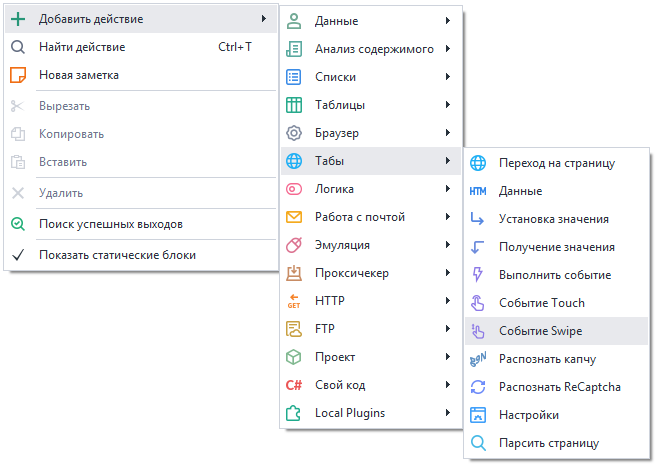
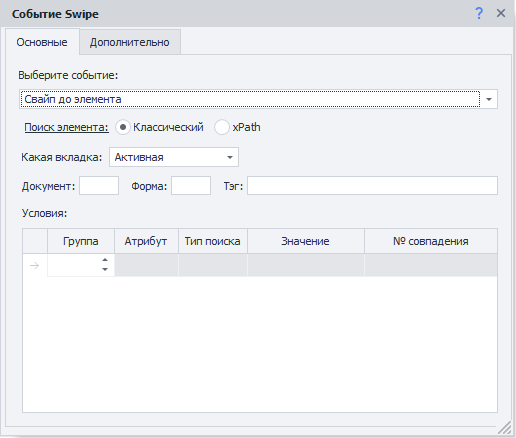
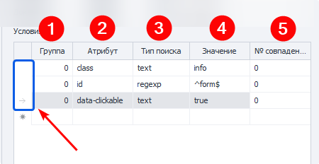

---
sidebar_position: 6
title: "Событие Touch"
description: ""
date: "2025-07-30"
converted: true
originalFile: "Событие Touch.txt"
targetUrl: "https://zennolab.atlassian.net/wiki/spaces/RU/pages/735674386/Touch"
---
:::info **Пожалуйста, ознакомьтесь с [*Правилами использования материалов на данном ресурсе*](../Disclaimer).**
:::

> 🔗 **[Оригинальная страница](https://zennolab.atlassian.net/wiki/spaces/RU/pages/735674386/Touch)** — Источник данного материала

_______________________________________________  
# Событие Swipe

Нажмите здесь, чтобы развернуть оглавление

- 1 Описание
- 2 Как добавить действие в проект?
- 3 Где это можно применить?
- 4 Как работать с экшеном?
 - 4.1 Выбор события
 - 4.2 Поиск элемента
 - 4.3 Вкладка “Дополнительно”
- 5 Пример использования
- 6 Полезные ссылки

  

## Описание

Данный экшен позволяет эмулировать движения пальцем по экрану (свайп). 

  

## Как добавить действие в проект?

Через контекстное меню **Добавить действие** → **Табы** → **Событие Swipe**

Либо воспользуйтесь [❗→ умным поиском](https://zennolab.atlassian.net/wiki/spaces/RU/pages/506200090/ProjectMaker+7#%D0%A3%D0%BC%D0%BD%D1%8B%D0%B9-%D0%BF%D0%BE%D0%B8%D1%81%D0%BA-%D0%B4%D0%B5%D0%B9%D1%81%D1%82%D0%B2%D0%B8%D0%B9 "https://zennolab.atlassian.net/wiki/spaces/RU/pages/506200090/ProjectMaker+7#%D0%A3%D0%BC%D0%BD%D1%8B%D0%B9-%D0%BF%D0%BE%D0%B8%D1%81%D0%BA-%D0%B4%D0%B5%D0%B9%D1%81%D1%82%D0%B2%D0%B8%D0%B9").

  

## Где это можно применить?

- В случаях, когда вам необходимо эмулировать телефон или любое другое устройство с сенсорным экраном
- В случаях, когда вам нужно максимально приблизить все действия к человеческим.

  

## Как работать с экшеном?

Необходимо включить “Запись“ и [❗→ режим ввода](https://zennolab.atlassian.net/wiki/spaces/RU/pages/534315373#%D0%A0%D0%B5%D0%B6%D0%B8%D0%BC-%D0%B2%D0%B2%D0%BE%D0%B4%D0%B0 "https://zennolab.atlassian.net/wiki/spaces/RU/pages/534315373#%D0%A0%D0%B5%D0%B6%D0%B8%D0%BC-%D0%B2%D0%B2%D0%BE%D0%B4%D0%B0") “Touch“ в окне браузера, чтобы все действия, выполненные в браузере, автоматически записывались, как Touch-события. 

### Выбор события

- **Свайп до элемента** - листать страницу, пока элемент не станет видимым.
- **Простой свайп** - Вверх / Вниз / Влево / Вправо.

  

### Поиск элемента

Прежде чем провзаимодействовать с элементом на странице его надо найти. В экшенах [❗→ Получение значения](https://zennolab.atlassian.net/wiki/spaces/RU/pages/534315124 "https://zennolab.atlassian.net/wiki/spaces/RU/pages/534315124") , [❗→ Установка значения](https://zennolab.atlassian.net/wiki/spaces/RU/pages/534315117 "https://zennolab.atlassian.net/wiki/spaces/RU/pages/534315117") , [❗→ Выполнить событие](https://zennolab.atlassian.net/wiki/spaces/RU/pages/534020211 "https://zennolab.atlassian.net/wiki/spaces/RU/pages/534020211") , [❗→ Событие Touch](https://zennolab.atlassian.net/wiki/spaces/RU/pages/735674386 "https://zennolab.atlassian.net/wiki/spaces/RU/pages/735674386") , [❗→ Событие Swipe](https://zennolab.atlassian.net/wiki/spaces/RU/pages/735739970 "https://zennolab.atlassian.net/wiki/spaces/RU/pages/735739970") существует два способа поиска элементов - классический и с помощью XPath.

  

**Классический** - Поиск по параметрам HTML элемента: тэг, атрибут и его значение.

**XPath** - поиск с помощью [❗→ XPath выражений](https://zennolab.atlassian.net/wiki/spaces/RU/pages/862093419/ "https://zennolab.atlassian.net/wiki/spaces/RU/pages/862093419/"). С помощью него Вы можете реализовать более универсальный и устойчивый к изменениям вёрстки способ поиска данных в сравнении с классическим поиском или регулярными выражениями.

### **Какая вкладка**

Выбираем вкладку, на которой будет производиться поиск элемента.
Возможные значения:

- Активная вкладка
- Первая
- По имени - при выборе данного пункта появится поле ввода для названия вкладки.
- По номеру - в поле ввода надо будет ввести порядковый номер вкладки (нумерация начинается с нуля!)

### **Документ**

Рекомендуется ставить значение **-1** (поиск во всех документах на странице). 

### **Форма**

Тоже лучше ставить **-1** (поиск по всем формам на странице). При выборе такого значения шаблон будет более универсальным.

Почему лучше ставить &amp;quot;-1&amp;quot;?

Пример: на странице 3 формы - поиск, регистрация, заказ товара. Нам надо кликнуть в форме заказа по кнопке и мы выбрали в качестве значения поля “Форма” - **2** (два) (нумерация с нуля). Спустя какое-то время на сайте появляется новая форма, для входа, и вставлена она перед формой заказа. Под номером 2 теперь будет форма входа и наш шаблон либо выдаст ошибку о том, что кнопка не найдена, либо (что гораздо хуже) будет кликать в другой форме по другой кнопке.

:::note На заметку
В настройках программы можно отметить два чекбокса - Искать во всех формах на странице и Искать во всех документах на странице  и тогда всегда при добавлении элемента в Конструктор действий для номера документа и формы будет стоять -1.
:::

### **Тэг (только классический поиск)**

Собственно HTML тэг у которого нужно получить  значение.

:::tip Совет
Можно указать сразу несколько тегов, разделитель - ; (точка с запятой)
:::

### **Условия (только классический поиск)**

1. **Группа** - приоритет данного условия. Чем выше это число тем приоритет ниже. Если не смогли найти элемент по условию  с наивысшим приоритетом, то переходим к условию со следующим приоритетом и так пока элемент не будет найден, либо пока не закончатся условия поиска. Можно добавлять несколько условий с одним приоритетом, тогда поиск будет производиться по всем условиям с одинаковым приоритетом одновременно.
2. **Атрибут** ** - атрибут HTML тэга по которому производится поиск.
3. **Тип поиска**:

 1. text - поиск по полному либо частичному вхождению текста;
 2. notext - поиск элементов в которых не будет указанного текста;
 3. regexp - поиск с помощью [❗→ регулярных выражений](https://zennolab.atlassian.net/wiki/spaces/RU/pages/534086111 "https://zennolab.atlassian.net/wiki/spaces/RU/pages/534086111") 
По умолчанию поиск регистронезависимый. Чтобы при поиске с помощью регулярного выражения учитывался регистр добавьте в самом начале выражения `(?-i)`(это означает отключение регистронезависимого поиска)
4. **Значение** - значение атрибута HTML тега
5. **№ совпадения** - порядковый номер найденного элемента (нумерация с нуля!). В этом поле можно [❗→ использовать диапазоны](https://zennolab.atlassian.net/wiki/spaces/RU/pages/488964137 "https://zennolab.atlassian.net/wiki/spaces/RU/pages/488964137") и макросы [❗→ переменных](https://zennolab.atlassian.net/wiki/spaces/RU/pages/486309922 "https://zennolab.atlassian.net/wiki/spaces/RU/pages/486309922").

:::note На заметку
Чтобы удалить условие поиска необходимо кликнуть ЛКМ по полю слева от него (на скриншоте выделено синим цветом) и нажать кнопку delete на клавиатуре.
:::

:::note На заметку
Для поиска нужного элемента может использоваться несколько условий.
:::

Всегда важно стараться подбирать условия поиска таким образом, чтоб оставался только один элемент, т.е. порядковый номер был 0 (нумерация с нуля).

### Вкладка “Дополнительно”

**“Подождать перед выполнением”.**

Сколько времени экшен будет ожидать перед выполнением.

**“Ждать элемент не более”.**

Если по истечении указанного времени элемент не появился на странице, то экшен завершит работу с ошибкой.

  

## Пример использования

Отлично сочетается с [❗→ Touch](https://zennolab.atlassian.net/wiki/spaces/RU/pages/735674386 "https://zennolab.atlassian.net/wiki/spaces/RU/pages/735674386") . Сначала выполняете Swipe до элемента, потом Touch.

Также, может пригодиться для эмуляции живого скроллинга страницы или “пролистывания” фотографий. 

В статье о Touch есть [❗→ примеры свайпа на C#](https://zennolab.atlassian.net/wiki/spaces/RU/pages/735674386/Touch#%D0%9F%D1%80%D0%B8%D0%BC%D0%B5%D1%80%D1%8B-%D1%80%D0%B0%D0%B1%D0%BE%D1%82%D1%8B-%D0%BD%D0%B0-C%23 "https://zennolab.atlassian.net/wiki/spaces/RU/pages/735674386/Touch#%D0%9F%D1%80%D0%B8%D0%BC%D0%B5%D1%80%D1%8B-%D1%80%D0%B0%D0%B1%D0%BE%D1%82%D1%8B-%D0%BD%D0%B0-C%23").

  

## Полезные ссылки

- [❗→ Конструктор действий и Поиск по XPath](https://zennolab.atlassian.net/wiki/spaces/RU/pages/483426337 "https://zennolab.atlassian.net/wiki/spaces/RU/pages/483426337")
- [❗→ Событие Touch](https://zennolab.atlassian.net/wiki/spaces/RU/pages/735674386 "https://zennolab.atlassian.net/wiki/spaces/RU/pages/735674386")
- [❗→ C# код (Си шарп код .net)](https://zennolab.atlassian.net/wiki/spaces/RU/pages/492011596 "https://zennolab.atlassian.net/wiki/spaces/RU/pages/492011596")
- [❗→ Выполнить событие](https://zennolab.atlassian.net/wiki/spaces/RU/pages/534020211 "https://zennolab.atlassian.net/wiki/spaces/RU/pages/534020211")
- [❗→ Диапазоны значений](https://zennolab.atlassian.net/wiki/spaces/RU/pages/488964137 "https://zennolab.atlassian.net/wiki/spaces/RU/pages/488964137")