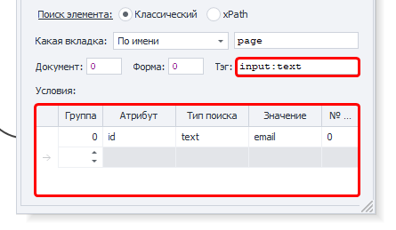

:::info **Пожалуйста, ознакомьтесь с [*Правилами использования материалов на данном ресурсе*](../Disclaimer).**
:::

> 🔗 **[Оригинальная страница](https://zennolab.atlassian.net/wiki/spaces/RU/pages/534315117)** — Источник данного материала

_______________________________________________  

## Описание

Экшен “**Установка значения**” используется для установки значений различным HTML элементам: 

- Однострочные поля ввода. HTML тег `<input />`. Часто используется для установки имени, пароля, адреса и других значений. [Пример](https://lessons.zennolab.com/ru/registration "https://lessons.zennolab.com/ru/registration")    
- Многострочные поля. HTML тег `<textarea />`. Используется в случаях, если нужно ввести сообщение, текст статьи или любой другой объемный текст.
- Выпадающие списки. HTML тег `<select />`. Их можно встретить при выборе пола, страны и\или города проживания в различных формах регистрации.

Пример формы с вышеперечисленными полями:

- https://lessons.zennolab.com/ru/registration
- [<u data-renderer-mark="true">https://lessons.zennolab.com/ru/index</u>](https://lessons.zennolab.com/ru/index "https://lessons.zennolab.com/ru/index")

Также, с помощью данного экшена можно изменять не только видимый текст, но и код элементов на странице. Это может быть полезно когда один элемент перекрывает другой, в таком случае достаточно заменить код лишнего элемента на пустую строку и он будет удалён со страницы.

  

## Как добавить действие в проект?

Через контекстное меню **Добавить действие** → **Табы** → **Установка значения**


Через [❗→ конструктор действий](https://zennolab.atlassian.net/wiki/spaces/RU/pages/483426337/ "https://zennolab.atlassian.net/wiki/spaces/RU/pages/483426337/").

Либо воспользуйтесь [❗→ умным поиском](https://zennolab.atlassian.net/wiki/spaces/RU/pages/506200090/ProjectMaker+7#%D0%A3%D0%BC%D0%BD%D1%8B%D0%B9-%D0%BF%D0%BE%D0%B8%D1%81%D0%BA-%D0%B4%D0%B5%D0%B9%D1%81%D1%82%D0%B2%D0%B8%D0%B9 "https://zennolab.atlassian.net/wiki/spaces/RU/pages/506200090/ProjectMaker+7#%D0%A3%D0%BC%D0%BD%D1%8B%D0%B9-%D0%BF%D0%BE%D0%B8%D1%81%D0%BA-%D0%B4%D0%B5%D0%B9%D1%81%D1%82%D0%B2%D0%B8%D0%B9").

  

## Как выбрать поле для установки значения?

Открываем в браузере ProjectMaker нужную нам страницу и кликаем ПКМ по элементу, которому мы хотим установить значение. Из контекстного меню выбираем “[❗→ В конструктор действий](https://zennolab.atlassian.net/wiki/spaces/RU/pages/483426337/ "https://zennolab.atlassian.net/wiki/spaces/RU/pages/483426337/")”, под окном браузера загрузится конструктор, выбираем тип действия “**Set**” и нажимаем кнопку “**Добавить в проект**”.

  

## Настройка действия: Вкладка “Основные”


### Что


Текст, который необходимо вставить. Можно использовать как простой текст так и макросы `{ -Variable.someVar- }`, `{ -Profile.Name- }`.

### Куда


Тут нужно выбирать атрибут элемента для которого надо изменить значение: 

- value - значение элемента,
- innerHtml\outerHtml ([в чём разница](http://www.quizful.net/interview/js/inner-outer-html-functions "http://www.quizful.net/interview/js/inner-outer-html-functions")) - HTML код элемента (заменив значение одного из этих атрибутов на пустоту можно удалить элемент со страницы).
- Так же тут можно указать и более привычные HTML теги - `id`, `name`, `class`, `style`, `placeholder```json
.

Это неполный список возможных значений, есть и другие, но это наиболее часто используемые.

:::note На заметку
В данном поле можно вручную указать значение, а не только выбирать из предложенного. Так же тут можно использовать переменные проекта (`{ -Variable.var_name- }`)
:::

### Поиск элемента

Прежде чем провзаимодействовать с элементом на странице его надо найти. В экшенах [❗→ Получение значения](https://zennolab.atlassian.net/wiki/spaces/RU/pages/534315124 "https://zennolab.atlassian.net/wiki/spaces/RU/pages/534315124") , [❗→ Установка значения](https://zennolab.atlassian.net/wiki/spaces/RU/pages/534315117 "https://zennolab.atlassian.net/wiki/spaces/RU/pages/534315117") , [❗→ Выполнить событие](https://zennolab.atlassian.net/wiki/spaces/RU/pages/534020211 "https://zennolab.atlassian.net/wiki/spaces/RU/pages/534020211") , [❗→ Событие Touch](https://zennolab.atlassian.net/wiki/spaces/RU/pages/735674386 "https://zennolab.atlassian.net/wiki/spaces/RU/pages/735674386") , [❗→ Событие Swipe](https://zennolab.atlassian.net/wiki/spaces/RU/pages/735739970 "https://zennolab.atlassian.net/wiki/spaces/RU/pages/735739970") существует два способа поиска элементов - классический и с помощью XPath.

  

**Классический** - Поиск по параметрам HTML элемента: тэг, атрибут и его значение.




**XPath** - поиск с помощью [❗→ XPath выражений](https://zennolab.atlassian.net/wiki/spaces/RU/pages/862093419/ "https://zennolab.atlassian.net/wiki/spaces/RU/pages/862093419/"). С помощью него Вы можете реализовать более универсальный и устойчивый к изменениям вёрстки способ поиска данных в сравнении с классическим поиском или регулярными выражениями.


### **Какая вкладка**

Выбираем вкладку, на которой будет производиться поиск элемента.
Возможные значения:

- Активная вкладка
- Первая
- По имени - при выборе данного пункта появится поле ввода для названия вкладки.
- По номеру - в поле ввода надо будет ввести порядковый номер вкладки (нумерация начинается с нуля!)

### **Документ**

Рекомендуется ставить значение **-1** (поиск во всех документах на странице). 

### **Форма**

Тоже лучше ставить **-1** (поиск по всем формам на странице). При выборе такого значения шаблон будет более универсальным.

<details>
<summary>Почему лучше ставить "-1"?</summary>

Пример: на странице 3 формы - поиск, регистрация, заказ товара. Нам надо кликнуть в форме заказа по кнопке и мы выбрали в качестве значения поля “Форма” - **2** (два) (нумерация с нуля). Спустя какое-то время на сайте появляется новая форма, для входа, и вставлена она перед формой заказа. Под номером 2 теперь будет форма входа и наш шаблон либо выдаст ошибку о том, что кнопка не найдена, либо (что гораздо хуже) будет кликать в другой форме по другой кнопке.

</details>
:::note На заметку
В настройках программы можно отметить два чекбокса - Искать во всех формах на странице и Искать во всех документах на странице  и тогда всегда при добавлении элемента в Конструктор действий для номера документа и формы будет стоять -1.
:::

### **Тэг (только классический поиск)**


Собственно HTML тэг у которого нужно получить  значение.

:::tip Совет
Можно указать сразу несколько тегов, разделитель - ; (точка с запятой)
:::

### **Условия (только классический поиск)**


1. **Группа** - приоритет данного условия. Чем выше это число тем приоритет ниже. Если не смогли найти элемент по условию  с наивысшим приоритетом, то переходим к условию со следующим приоритетом и так пока элемент не будет найден, либо пока не закончатся условия поиска. Можно добавлять несколько условий с одним приоритетом, тогда поиск будет производиться по всем условиям с одинаковым приоритетом одновременно.
2. **Атрибут** ** - атрибут HTML тэга по которому производится поиск.
3. **Тип поиска**:

 1. text - поиск по полному либо частичному вхождению текста;
 2. notext - поиск элементов в которых не будет указанного текста;
 3. regexp - поиск с помощью [❗→ регулярных выражений](https://zennolab.atlassian.net/wiki/spaces/RU/pages/534086111 "https://zennolab.atlassian.net/wiki/spaces/RU/pages/534086111") 
По умолчанию поиск регистронезависимый. Чтобы при поиске с помощью регулярного выражения учитывался регистр добавьте в самом начале выражения 
```(?-i)`(это означает отключение регистронезависимого поиска)
4. **Значение** - значение атрибута HTML тега
5. **№ совпадения** - порядковый номер найденного элемента (нумерация с нуля!). В этом поле можно [❗→ использовать диапазоны](https://zennolab.atlassian.net/wiki/spaces/RU/pages/488964137 "https://zennolab.atlassian.net/wiki/spaces/RU/pages/488964137") и макросы [❗→ переменных](https://zennolab.atlassian.net/wiki/spaces/RU/pages/486309922 "https://zennolab.atlassian.net/wiki/spaces/RU/pages/486309922").

:::note На заметку
Чтобы удалить условие поиска необходимо кликнуть ЛКМ по полю слева от него (на скриншоте выделено синим цветом) и нажать кнопку delete на клавиатуре.
:::

:::note На заметку
Для поиска нужного элемента может использоваться несколько условий.
:::

Всегда важно стараться подбирать условия поиска таким образом, чтоб оставался только один элемент, т.е. порядковый номер был 0 (нумерация с нуля).

## Настройка действия: Вкладка “Дополнительно”


### **Ожидание**

### **1. Подождать перед выполнением**

Сколько времени шаблон будет ожидать перед тем как установить значение.

### **2. Ждать элемент не более**

Если по истечении указанного времени элемент не появился на странице, то экшен завершит работу с ошибкой.

### **3. Эмуляция**

**По умолчанию** - берётся значение из [❗→ настроек проекта](/wiki/spaces/RU/pages/534315477 "/wiki/spaces/RU/pages/534315477").
**Своя** - выставляем персональный уровень эмуляции для данного экшена (настройки проекта в таком случае будут игнорироваться)

* * *

## Пример использования

Рассмотрим экшен на живом примере. В качестве подопытного сайта будем использовать https://lessons.zennolab.com/ru/registration. Перейдя на указанную страницу мы увидим простую форму с тремя полями ввода и одной кнопкой, в рамках данной статьи нас интересуют только поля ввода текста


Самый простой способ создать данный экшен - это кликнуть ПКМ по полю ввода и из контекстного меню выбрать пункт “В конструктор действий”. Под браузером ProjectMaker’а появится [❗→ конструктор действий](https://zennolab.atlassian.net/wiki/spaces/RU/pages/483426337/ "https://zennolab.atlassian.net/wiki/spaces/RU/pages/483426337/") (если до этого он не был активирован). 


ProjectMaker пытается максимально упростить Вам жизнь и поэтому в конструкторе действий уже будут подставлены значения для поиска^(1)^ (о том, что эти поля означают было написано чуть выше). Не всегда программа подбирает оптимальные значения, иногда приходится делать это вручную. 

После того как были подобраны параметры для поиска элемента, нажмите **Поиск**, под этой кнопкой есть поле^(2)^ в котором появится столько элементов, сколько было найдено согласно заданным настройкам (в нашем случае найден только один элемент, поэтому в данном поле отображается цифра “0”. Как уже было сказано выше, всегда старайтесь подбирать такие параметры поиска, чтоб находился только один элемент). А вот как это же поле будет выглядеть, если будет найдено несколько элементов:


Потом выбираем какой атрибут^(3)^ надо обновить в найденном элементе. В нашем случаем выбрано **value,** т.е. будет изменено непосредственно отображаемое значение поля ввода. После этого в поле **Значение**^(4)^ вводим текст, который нужно вставить. В данном полей можно использовать [❗→ переменные проекта](/wiki/spaces/RU/pages/735608872 "/wiki/spaces/RU/pages/735608872") в виде макросов - `{ -Profile.Name- }`, `{ -Variable.generatedText- }`, `{ -Page.Url- }`. Из переменных можно составлять сложные конструкции: вот как может выглядеть строка для вставки даты рождения, основанной на значениях из [❗→ профиля](/wiki/spaces/RU/pages/735903758 "/wiki/spaces/RU/pages/735903758") `{ -Profile.BornDay- }.{ -Profile.BornMonth- }.{ -Profile.BornYear- }`.

Далее нажимаем кнопку **Тестировать**^(5)^ и смотрим обновилось ли значение у нужного элемента. Для того, чтобы было проще читать проект можно добавить комментарий^(7)^ экшена (автоматический комментарий генерируется на основе вводимого значения из поля **Значение** и он не всегда полезный)

:::info Информация
Если Вы разрабатываете большой и сложный проект, который надо будет поддерживать на протяжении долгого времени, то старайтесь как можно больше пользоваться Комментариями к экшенам. Спустя неделю, месяц или пол года открыв проект Вы по комментариям сможете понять что и как работает, не будет необходимости запускать выполнение проекта (чтоб наглядно увидеть что же этот экшен делает) и/или лезть в настройки экшена. Так же можно использовать заметки в проекте.
:::


После того как всё установлено и проверено, можно нажимать **Добавить в проект -** на холсте проекта появится наш новый экшен.

* * *

## Полезные ссылки

- [❗→ Получение значения](/wiki/spaces/RU/pages/534315124 "/wiki/spaces/RU/pages/534315124")
- [❗→ Выполнить событие](/wiki/spaces/RU/pages/534020211 "/wiki/spaces/RU/pages/534020211")
- [❗→ Событие Touch](/wiki/spaces/RU/pages/735674386 "/wiki/spaces/RU/pages/735674386")
- [❗→ Событие Swipe](/wiki/spaces/RU/pages/735739970 "/wiki/spaces/RU/pages/735739970")
- [❗→ XPath](/wiki/spaces/RU/pages/862093419 "/wiki/spaces/RU/pages/862093419")
- [❗→ Конструктор действий и Поиск по XPath](/wiki/spaces/RU/pages/483426337 "/wiki/spaces/RU/pages/483426337")