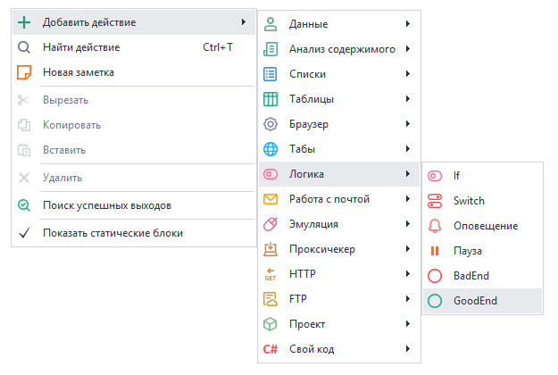
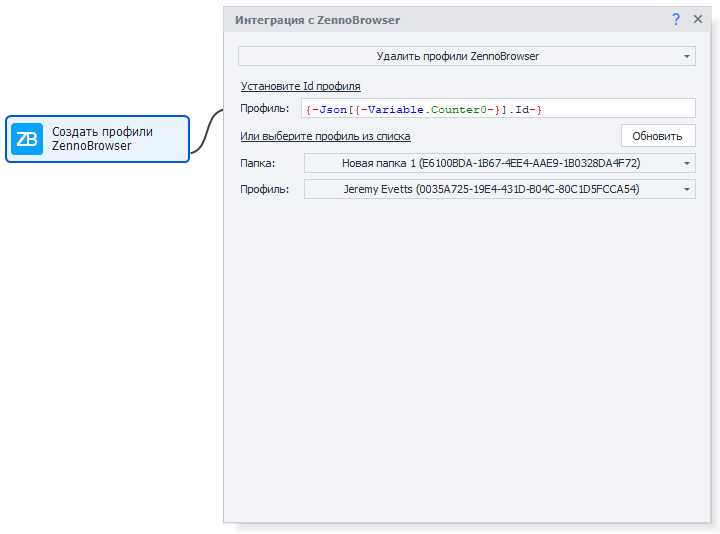
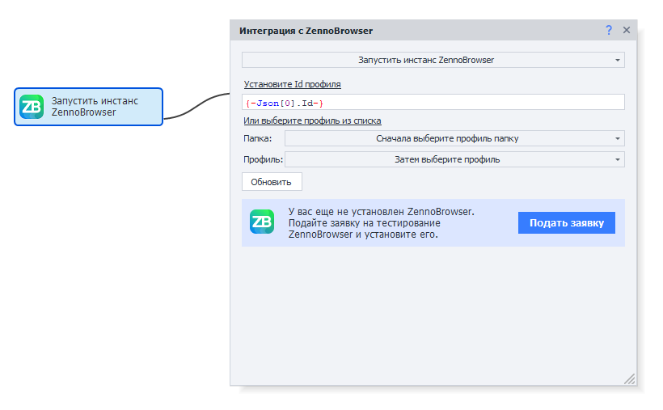
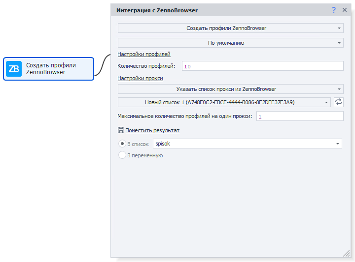
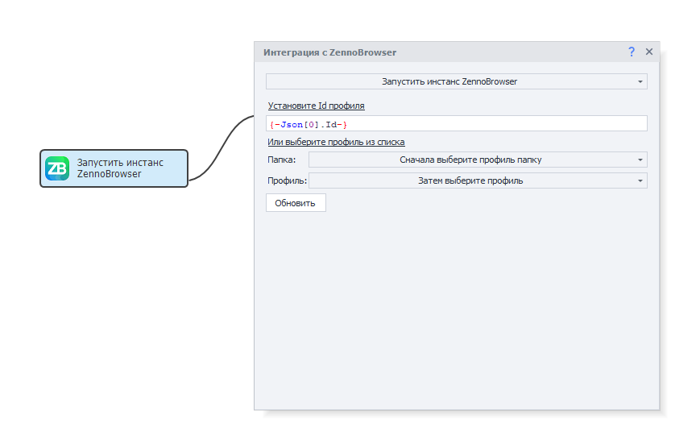
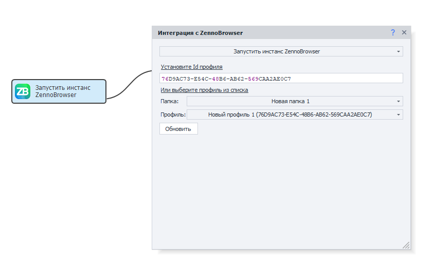
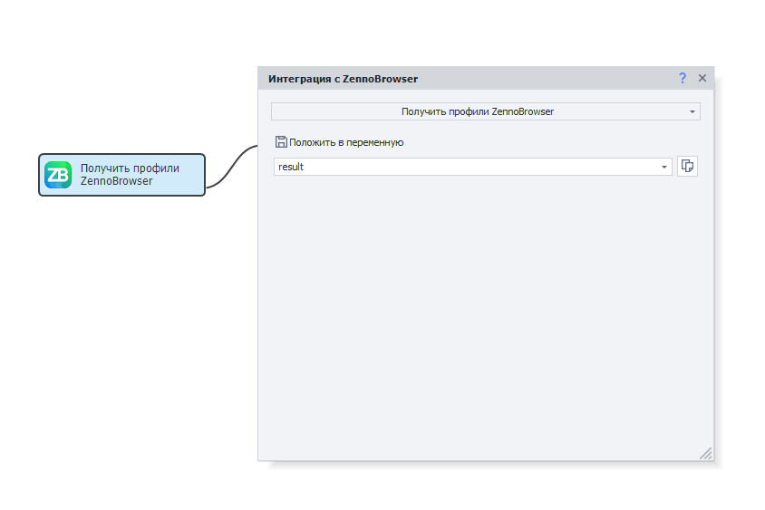
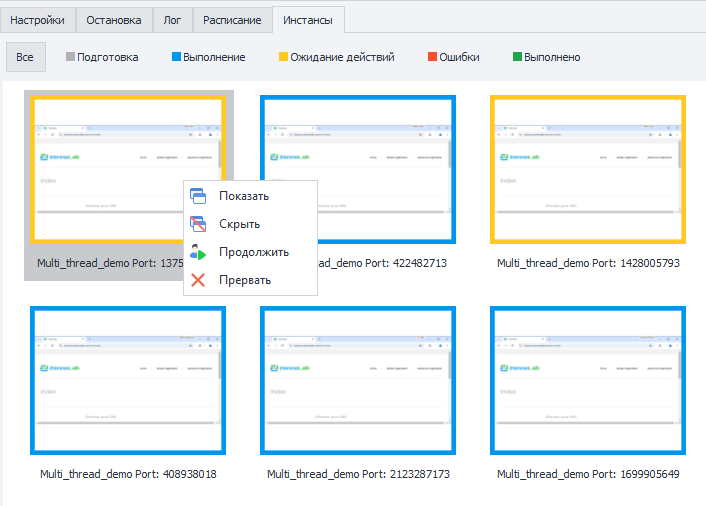

---
sidebar_position: 15
title: "Интеграция ZennoPoster с ZennoBrowser"
description: ""
date: "2025-08-04"
converted: true
originalFile: "Интеграция ZennoPoster с ZennoBrowser.txt"
targetUrl: "https://zennolab.atlassian.net/wiki/spaces/RU/pages/3641737224/ZennoPoster+ZennoBrowser"
---
:::info **Пожалуйста, ознакомьтесь с [*Правилами использования материалов на данном ресурсе*](../Disclaimer).**
:::

> 🔗 **[Оригинальная страница](https://zennolab.atlassian.net/wiki/spaces/RU/pages/3641737224/ZennoPoster+ZennoBrowser)** — Источник данного материала

_______________________________________________  
# Интеграция ZennoPoster с ZennoBrowser

ZennoPoster 7 представляет новые возможности автоматизации веб-задач благодаря интеграции с ZennoBrowser — специализированным антидетект-браузером для работы с множественными профилями. Данная интеграция позволяет пользователям ZennoPoster7 использовать все преимущества ZennoBrowser, включая управление цифровыми отпечатками, работу с прокси-серверами и создание изолированных браузерных сред. В этом руководстве рассматриваются основные функции интеграции: получение и управление профилями, запуск браузерных инстансов, создание и удаление профилей, а также особенности работы с новым типом браузера в среде ZennoPoster7. Интеграция обеспечивает бесшовное взаимодействие между двумя продуктами, сохраняя привычный интерфейс ZennoPoster7 и добавляя мощные возможности ZennoBrowser для профессиональной автоматизации веб-процессов.

## **<u data-renderer-mark="true">1. Получение профилей ZennoBrowser</u>**

Действие "Получить профили ZennoBrowser" предназначено для извлечения информации о существующих профилях браузера из системы ZennoBrowser.

Open AD\_4nXeU\_ib6LPQqGAz2nnpgsTM9jqtUVAzPUfafv84DemGD982-9eNofndMV22g7ykiqZHCn7IEztBOIF\_q9Zk3PK2-\_4rTLXOiQQspfbyZlfCn08T6sAMZIpKn6Va-cBMQIMltY1QnbA?key=YZY71xn4q4K\_PxdeMAaw-Q

### **Принцип работы**

Действие выполняет запрос к ZennoBrowser и возвращает полную информацию о всех доступных профилях в виде структурированных данных.

### **Формат результата**

Результат выполнения представляет собой **JSON-массив объектов**, где каждый объект содержит детальную информацию об отдельном профиле:

- ID профиля
- Имя профиля
- Настройки браузера
- Статус профиля
- Данные прокси
- Другие метаданные

### **Обработка результатов**

Для корректной работы с полученными данными **рекомендуется использовать действие "Парсинг JSON"**, которое позволит:

- Извлечь конкретные параметры профилей
- Отфильтровать профили по заданным критериям
- Преобразовать данные в удобный для работы формат

### **Обработка ошибок**

В случае проблем с подключением к ZennoBrowser (недоступность сервиса, неверные настройки соединения) действие вернет соответствующую ошибку, которую необходимо обработать в логике проекта.

### **Сохранение результата**

Укажите переменную для сохранения JSON-ответа в поле **"Поместить в переменную"** для дальнейшего использования в проекте.

## **<u data-renderer-mark="true">2. Запуск инстанса ZennoBrowser</u>**

### **Действие "Запустить инстанс ZennoBrowser"**

Данное действие предназначено для запуска браузера с использованием конкретного профиля ZennoBrowser по его идентификатору.

Open AD\_4nXdQmgDpUpU9gvddlteWDS2gpXNnAc8ImcQIMxPqGBd0Kk9M7x2eRJO1dJAngh4lJ8vjV7Y2bnk7\_kw7rUpFDLZqLPyU8ZuOOkOSh5eyuctKX6u\_y2hZhu\_S9n6XWQcZyUT2X5XPEQ?key=YZY71xn4q4K\_PxdeMAaw-Q

### **Принцип работы**

Действие принимает **ID профиля ZennoBrowser** и инициирует запуск браузерного инстанса с соответствующими настройками профиля, включая:

- Цифровые отпечатки браузера
- Настройки прокси
- Пользовательские данные
- Расширения и конфигурации

### **Настройка профиля**

При первом открытии настроек действия автоматически загружается актуальный список профилей из ZennoBrowser. Доступны два способа указания профиля:

**Ручной ввод ID:**

- Введите идентификатор профиля в соответствующее поле

**Выбор из списка:**

1. Сначала выберите **папку профилей** из выпадающего списка
2. Затем выберите конкретный **профиль** внутри выбранной папки

### **Обновление списка профилей**

Для получения актуальной информации о доступных профилях используйте кнопку **"Обновить"** в настройках действия. Это особенно полезно при добавлении новых профилей в ZennoBrowser.

Open AD\_4nXeqkWU3wdcaPKxmNPH952Boasqh-tHvx2XPHCiCIVYcVQS3h1Sov\_OU0hHyCKsiuYDcRIanlsTHmkn4jnksq-\_EIhQVt0Le8\_XilsDt8-fTxZL2JyEf9Zjk2KOGqRf0jPZrDbJlBQ?key=YZY71xn4q4K\_PxdeMAaw-Q

## **<u data-renderer-mark="true">3. Создание профилей ZennoBrowser</u>**

Действие "Создание профилей ZennoBrowser" предоставляет два метода создания новых профилей браузера:

- **Создание профилей по умолчанию**

При выборе режима "По умолчанию" профили создаются с оптимизированными настройками. Необходимо указать:

- **Количество профилей** — требуемое количество создаваемых профилей
- **Настройки прокси** — параметры прокси-серверов для профилей

Open AD\_4nXdqgHwL42YiuiZvci2E\_xhjbFTr8lJR-N3nyEp0CW5W5dd-cWH9rGR2eaJqllv1U1AUPCD1IJNgz\_sypFUBgGR6Yn2NSEr2JjjSu7auGCzXZmgY6IKplnCikrHobDGaenDtpn2dvQ?key=YZY71xn4q4K\_PxdeMAaw-Q

- **Создание на основе профиля-донора**

При выборе режима "Использовать данные профиля" новые профили наследуют все настройки указанного существующего профиля-донора:

- Укажите **ID профиля-донора** или выберите его из списка
- Будут скопированы настройки отпечатков браузера, расширения и другие параметры конфигурации

**Важно:** копируются настройки отпечатков, а не сами отпечатки — каждый созданный профиль получит уникальные отпечатки в соответствии с настройками донора

Open AD\_4nXfVe-Pm-q3ZhQTLr1c4UPH79eABy3g1Ke7XUX0JaXLYWSqTTn4pCq5G4doKrgL3lhlUWA7q7fN7ZmOVbVjMCODblg0wp3Q1HkS8rSBph45BrpnyQt38IyogjwY3wW60yiYJP0T5?key=YZY71xn4q4K\_PxdeMAaw-Q

### **Настройки прокси**

Система поддерживает гибкое управление прокси-серверами:

- **Указать список прокси** — выберите готовый список из ZennoBrowser
- **Максимальное количество профилей на прокси** — ограничение для предотвращения перегрузки прокси
- **Исключение повторений** — каждый прокси используется только один раз при создании профилей

### **Сохранение результатов**

Данные созданных профилей обязательно должны быть сохранены для дальнейшего использования:

- **В список** — для работы с множественными профилями
- **В переменную** — для сохранения информации об одном профиле

## **<u data-renderer-mark="true">4. Удаление профилей ZennoBrowser</u>**

Действие "Удалить профили ZennoBrowser" предназначено для безвозвратного удаления выбранных профилей браузера из системы ZennoBrowser.

Open AD\_4nXcDLORsPZYdW8Gd5VNmuUU8ZJP3s0vX0KQjGukUn9JN6AiHR0ipCoCYUfqFFl\_23mDNEAOKWFYkjk3ZsT6Sr1FbTOK3P8DUccy8I8RrCbP-qTWskpc1CwdA-nFRDzFwldr9PaGnKA?key=YZY71xn4q4K\_PxdeMAaw-Q

### **Способы указания профилей для удаления**

**Ручной ввод ID:**

- Укажите идентификатор профиля в поле **"Установите ID профилей"**
- Поддерживается использование переменных для динамического указания ID

**Выбор из списка:**

- Выберите **папку профилей** из выпадающего списка
- Выберите конкретный **профиль** для удаления из выбранной папки

### **Обновление списка профилей**

Для получения актуального списка доступных профилей используйте кнопку **"Обновить"** в настройках действия.

## **<u data-renderer-mark="true">5. Особенности интеграции ZennoBrowser</u>**

### **Работа с браузером**

1. Интегрированный браузер функционирует в ZennoPoster7 аналогично другим, т.е. действия работы со страницами и элементами браузера работают нативно.
2. Если у вас не установлен ZennoBrowser, то действие запуска инстанса предложит вам подать заявку на тестирование нового продукта, чтобы вы смогли установить его.

Open AD\_4nXdlOQVONf9gElkVTa-CJ2jHv52g1pI\_bnmH8bP-\_LwUKWt7cBHnP2hRvJ3GpXbzm6ckWjS9GiTfUWS5iGR4TQnXM1MXrfqfHpNh6JsKFKAX3\_ULIhahw7lJW8ZpdD5vhaWxw6M7iA?key=YZY71xn4q4K\_PxdeMAaw-Q

### **Запуск и подключение**

1. Для работы интеграции не обязательно, чтобы ZennoBrowser был запущен. ZennoPoster7 сможет запустить его самостоятельно. Однако, если ZennoBrowser будет запущен предварительно, получение профилей или запуск нового браузера выполнятся быстрее.
2. Когда ZennoPoster7 запустит браузер, в ZennoBrowser будет отражаться его состояние и будет доступна кнопка Stop. Вы можете остановить браузер и освободить профиль в любой момент, но это может привести к ошибкам в работе проекта ZennoPoster7.
3. В случае, если ZennoPoster7 не смог подключиться к ZennoBrowser, новые действия вернут ошибку. Также ZennoBrowser может отклонить запуск браузера по некоторым причинам, например, профиль уже занят, это тоже приведет к ошибке действия.

### **Различия в ProjectMaker и ZennoPoster**

1. При запуске нового браузера в ProjectMaker, браузер нативно встраивается в UI и вы можете пользоваться всеми доступными инструментами ProjectMaker. При этом, как и в браузере Chromium, для ProjectMaker отключено использование GPU. В ZennoPoster для нового браузера GPU используется, аналогично включенной настройке "Альтернативная отрисовка браузера Chromium".

### **Работа с профилями**

1. При работе с новым браузером применяются профили и эмуляции ZennoBrowser. Вся работа эмуляций и настроек браузера ZP7 и работа с профилем ZP7 игнорируется. При этом соответствующие действия выполняются без ошибок, но не производят никаких изменений. Все действия, которые могут повлиять на профиль игнорируются.

### **Управление окном браузера**

1. В ZennoPoster7 при показе инстанса отображается реальный браузер. Кнопки свернуть\закрыть работают как стандартные кнопки окна и могут привести к непредвиденному поведению браузера, поэтому не рекомендуется их использовать. Для удобства работы с реальным браузером в ZennoPoster в окне превью инстансов было расширено контекстное меню. В будущем планируется сделать работу кнопок свернуть\закрыть аналогично с другими типами браузеров в ZennoPoster7.

## **Новое контекстное меню превью инстанса**

Для удобства работы с окнами Chromium из ZennoBrowser контекстное меню в ZennoPoster7 было расширено дополнительными функциями управления.

### **Добавленные пункты меню**

**Показать** — отображает окно браузера, если оно было скрыто

**Скрыть** — скрывает окно браузера без завершения его работы

**Продолжить** — используется для продолжения выполнения при "Ожидании действий пользователя"

Open AD\_4nXfNHArd\_JqZalTPzhBfqceoMgmyrbs4CTKILtSTFcldrWAeudyB51SVkxoesnwGmUU7FoLE1XSjfxmUfHdx8XwDFP5UegpQBlsSV800MYLWrpkQCkpDFVQIYhJEffMKDZ56eOqk3A?key=YZY71xn4q4K\_PxdeMAaw-Q

### **Преимущества**

Расширенное контекстное меню позволяет управлять всеми ключевыми функциями ZennoPoster прямо из интерфейса превью инстансов, обеспечивая полный контроль над браузерами ZennoBrowser без необходимости переключения между различными окнами приложения.