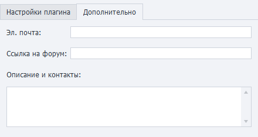

:::info **Пожалуйста, ознакомьтесь с [*Правилами использования материалов на данном ресурсе*](../Disclaimer).**
:::

> 🔗 **[Оригинальная страница](https://zennolab.atlassian.net/wiki/spaces/RU/pages/475365697)** — Источник данного материала

_______________________________________________  
# Плагины

## Описание

Плагины - это экшены, созданные пользователем.
По сути - это шаблоны с [❗→ интерфейсом бота (BotUI)](https://zennolab.atlassian.net/wiki/spaces/RU/pages/725352539 "https://zennolab.atlassian.net/wiki/spaces/RU/pages/725352539"), сохранённые особым образом. Плагины имеют расширение `.zpg`, могут возвращать результат своей работы. 

Каждое поле в которое можно ввести данные поддерживает [❗→ макросы](https://zennolab.atlassian.net/wiki/spaces/RU/pages/486309922 "https://zennolab.atlassian.net/wiki/spaces/RU/pages/486309922") переменных.

  

Плагины очень похожи на [❗→ проект в проекте](https://zennolab.atlassian.net/wiki/spaces/RU/pages/489291822 "https://zennolab.atlassian.net/wiki/spaces/RU/pages/489291822"), но они гораздо удобнее:

- можно создать удобный интерфейс для передачи в него значений (при работе через проект в проекте необходимо сопоставлять переменные из основного шаблона и вызываемого, из-за этого приходится часто переходить в подшаблон, чтоб вспомнить для чего используется та или иная [❗→ переменная](https://zennolab.atlassian.net/wiki/spaces/RU/pages/486309922 "https://zennolab.atlassian.net/wiki/spaces/RU/pages/486309922"))
- устанавливаются один раз и после этого доступны во всех проектах как [❗→ стандартные экшены](https://zennolab.atlassian.net/wiki/spaces/RU/pages/486342706 "https://zennolab.atlassian.net/wiki/spaces/RU/pages/486342706") (проект в проекте требует каждый раз указывать полный путь к вызываемому шаблону и если случайно или намеренно изменить местоположение подшаблона на компьютере или переименовать его, то все проекты, которые вызывали данный шаблон поломаются)
- можно [❗→ продать шаблон с неограниченным количеством плагинов](https://zennolab.atlassian.net/wiki/spaces/RU/pages/494895200 "https://zennolab.atlassian.net/wiki/spaces/RU/pages/494895200") всего за $12 (в то время как при использовании вложенных проектов стоимость шаблона возрастала в зависимости от количества подшаблонов)

## Где это можно применить?

В плагин можно упаковать любые повторяющиеся действия:

- например Вам нужно искать видео на YouTube и сохранять ссылки на них. Для этих целей у Вас уже написана группа экшенов (или даже отдельный шаблон), которые отлично справляются со своей работой. Для того, чтобы добавить этот функционал в другой шаблон, приходится либо подключить [❗→ проект в проекте](https://zennolab.atlassian.net/wiki/spaces/RU/pages/489291822 "https://zennolab.atlassian.net/wiki/spaces/RU/pages/489291822"), либо копировать экшены и вставлять в нужном месте. На первый взгляд метод копировать-вставить может показаться очень простым и удобным, но представьте, что в Вашем шаблоне есть 6 мест, в которых надо искать видео, Вы шесть раз копируете необходимые экшены. Всё работает, всё хорошо. И тут Вам захотелось внести правки в функционал поиска видео на YouTube, теперь Вам придётся искать все места, куда Вы ранее вставляли эти экшены и вносить правки (а если шаблон не один, а 10-20-33…). С другой стороны можно всё это упаковать в плагин и вызывать его. И, если надо будет внести правки в его работу, то изменить нужно будет только плагин и переустановить его .
- отправка оповещений в Telegram/ВК/что-то ещё. Пока Вы отправляете только текст, то можно воспользоваться одним кубиком [❗→ GET](https://zennolab.atlassian.net/wiki/spaces/RU/pages/534315165 "https://zennolab.atlassian.net/wiki/spaces/RU/pages/534315165") или [❗→ POST](https://zennolab.atlassian.net/wiki/spaces/RU/pages/534315180 "https://zennolab.atlassian.net/wiki/spaces/RU/pages/534315180") запроса. Но потом захочется отправлять форматированный текст, добавлять к нему картинки, аудио файлы и другие вложения. Со временем один [❗→ экшен](https://zennolab.atlassian.net/wiki/spaces/RU/pages/486342706 "https://zennolab.atlassian.net/wiki/spaces/RU/pages/486342706") разрастётся до большой группы кубиков и в этом случае тоже стоит задуматься об упаковке всех их в плагин.
- взять случайную строку из указанного текстового файла. Для этого надо создать отдельный список, привязать список к файлу (желательно проверить, что такой файл вообще существует), получить случайную строку из списка - минимум три экшена. Возможно захочется сделать так, чтоб все буквы были в верхнем или, наоборот, нижнем регистре, или обрезать строку до 80 символов. Всё это можно будет упаковать в плагин.
- Любой шаблон можно сделать плагином. В применении плагинов Вас ограничивает только Ваша фантазия.

  

## Установка плагинов в ProjectMaker

Существует несколько способов установки готовых плагинов:

1. Самый простой - делаем двойной клик по файлу плагина. Если плагин с таким же именем файла уже был ранее установлен, то появится диалоговое окно с предложением заменить установленный. Если же это первая установка этого плагина, то появится окно сообщающее об успешной установке.
2. Добавление через [❗→ настройки](https://zennolab.atlassian.net/wiki/spaces/RU/pages/735379481/ "https://zennolab.atlassian.net/wiki/spaces/RU/pages/735379481/"). Преимуществом данного метода является то, что можно выделить сразу несколько файлов и установить их все сразу. Если будет попытка добавить плагин имя файла которого совпадает с уже установленным, то появится окно с перечислением плагинов, которые не удалось установить. После добавления плагины сразу же готовы к работе.
3. Копирование плагинов в локальную директорию на компьютере (по умолчанию это `C:\Users\[имя_пользователя]\Documents\ZennoLab\Plugins\Local`), после этого необходимо перезагрузить ProjectMaker.

## Удаление плагинов

1. Через [❗→ настройки](https://zennolab.atlassian.net/wiki/spaces/RU/pages/735379481/ "https://zennolab.atlassian.net/wiki/spaces/RU/pages/735379481/"):

2. Второй способ - удалить файлы из локальной директории на компьютере (в таком случае лучше перезагрузить ProjectMaker).

  

## Как добавить плагины в проект?

Есть несколько способов:

- Контекстное меню **Добавить действие** → **Local Plugins**
- В самом низу [❗→ окна *Действия](https://zennolab.atlassian.net/wiki/spaces/RU/pages/727777324 "https://zennolab.atlassian.net/wiki/spaces/RU/pages/727777324")
- Либо воспользуйтесь [❗→ умным поиском](https://zennolab.atlassian.net/wiki/spaces/RU/pages/506200090/ProjectMaker+7#%D0%A3%D0%BC%D0%BD%D1%8B%D0%B9-%D0%BF%D0%BE%D0%B8%D1%81%D0%BA-%D0%B4%D0%B5%D0%B9%D1%81%D1%82%D0%B2%D0%B8%D0%B9 "https://zennolab.atlassian.net/wiki/spaces/RU/pages/506200090/ProjectMaker+7#%D0%A3%D0%BC%D0%BD%D1%8B%D0%B9-%D0%BF%D0%BE%D0%B8%D1%81%D0%BA-%D0%B4%D0%B5%D0%B9%D1%81%D1%82%D0%B2%D0%B8%D0%B9").

  

## Как работать с плагинами?

Работа с пользовательскими плагинами практически ничем не отличается от работы со стандартными [❗→ экшенами](https://zennolab.atlassian.net/wiki/spaces/RU/pages/486342706 "https://zennolab.atlassian.net/wiki/spaces/RU/pages/486342706") - добавляете плагин в проект удобным для Вас способом, заполняете [❗→ входящие настройки](https://zennolab.atlassian.net/wiki/spaces/RU/pages/725352539 "https://zennolab.atlassian.net/wiki/spaces/RU/pages/725352539") (в этих настройках можно использовать [❗→ переменные проекта](https://zennolab.atlassian.net/wiki/spaces/RU/pages/486309922 "https://zennolab.atlassian.net/wiki/spaces/RU/pages/486309922"))

  

## Сохранение шаблона как плагина?

### Способы сохранения

Существует несколько способов сохранение шаблона в виде плагина:

- в верхнем меню выбираем *Файл-Опубликовать проект (либо комбинация горячих клавиш для того же действия **Ctrl+Alt+P**). Появится окно публикации проекта, в выпадающем списке *Что сделать выбираем *Сохранить как плагин.

- в том же верхнем меню выбираем *Файл-Сохранить проект как плагин
- кликаем ПКМ по вкладке нужного проекта в окне с проектами и из контекстно меню выбираем *Сохранить проект как плагин

### Настройки сохранения

#### Главное окно и вкладка “Настройки плагина”

:::note На заметку
Если навести курсор мыши на поле ввода или название поля , то появится всплывающая подсказка по данному полю.
:::

##### **Куда сохранять**

Выбираем место на компьютере, куда сохранится файл плагина.

:::note На заметку
При установке плагина в программу этот файл будет скопирован в Директорию установленных плагинов.
:::

##### **Шифровать проект**

Эта опция позволяет зашифровать весь файл с проектом. Если включено встраивание внешних библиотек они так же будут зашифрованы.

:::warning Внимание
При продаже плагины не должны быть зашифрованы, т.к. их повторное шифрование невозможно. То есть, вы не сможете перепродать плагин, который купили сами.
:::

##### **Название**

Задаём название плагина (с таким именем он будет отображаться в ProjectMaker). 

:::note На заметку
ProjectMaker позволяет сохранять плагины с одинаковыми именами, но, во избежание путаницы, старайтесь задавать каждый раз уникальное имя.
:::

##### **Версия**

Устанавливаем необходимую версию плагина.

##### **Иконка**

Загружаем иконку для своего плагина. 

Поддерживаемые форматы - png, ico, bmp; размеры - от 16х16, до 128х128. Если у плагина будет своя иконка, то его визуально проще будет отыскать среди других [❗→ экшенов](https://zennolab.atlassian.net/wiki/spaces/RU/pages/486342706 "https://zennolab.atlassian.net/wiki/spaces/RU/pages/486342706").

##### **Выводить ошибки плагина в лог**

Если отмечен данный чекбокс и шаблон завершился с необработанной ошибкой то в лог попадёт текст этой ошибки (например - “Не найден HTML элемент по условиям поиска”). В противном случае будет только сообщение “Ошибка при обработке плагина“

#### Вкладка “Дополнительно”

Данную вкладку стоит заполнить, если Вы собираетесь продавать свой плагин, либо просто поделитесь им с другими людьми. На ней вносим свой email для обратной связи, добавляем описание и доп. контакты, а так же ссылку темы плагина на форуме http://zennolab.com (если хотите добавить сам плагин в тему, то можно сначала создать и оформить тему, опубликовать её, затем добавить ссылку на эту тему в плагин и потом отредактировать сообщение в теме добавив сам файл плагина).

#### Предпросмотр и публикация

Перед сохранением плагина можно нажать кнопку *Предпросмотр, чтоб увидеть как будет выглядеть его описание.

После клика по кнопке “Выполнить публикацию” начнётся проверка и сборка проекта в плагин. Если в процессе сборки не было ошибок, то появятся две новые кнопки: 

- Открыть папку с плагином
- Добавить в ProjectMaker

  

## Продажа проектов с плагинами

Подробнее в статье [❗→ Продажа ботов с плагинами](https://zennolab.atlassian.net/wiki/spaces/RU/pages/494895200 "https://zennolab.atlassian.net/wiki/spaces/RU/pages/494895200") 

  

## Входящие настройки плагина

Входящие настройки для плагинов создаются с использованием [❗→ BotUI](https://zennolab.atlassian.net/wiki/spaces/RU/pages/725352539 "https://zennolab.atlassian.net/wiki/spaces/RU/pages/725352539"). Но при создании настроек для плагинов есть несколько дополнительных возможностей - это Mapper и возвращаемое значение.

### Mapper

Данный контроль позволяет передавать из основного шаблона в плагин [❗→ списки](https://zennolab.atlassian.net/wiki/spaces/RU/pages/534053375 "https://zennolab.atlassian.net/wiki/spaces/RU/pages/534053375"), [❗→ таблицы](https://zennolab.atlassian.net/wiki/spaces/RU/pages/735903776 "https://zennolab.atlassian.net/wiki/spaces/RU/pages/735903776") или [❗→ Google таблицы](https://zennolab.atlassian.net/wiki/spaces/RU/pages/509411347/ "https://zennolab.atlassian.net/wiki/spaces/RU/pages/509411347/").

:::warning Внимание
Изменения внесённые внутри плагина в передаваемый список\таблицу отразятся и на списке\таблице в основном шаблоне!
:::

Чтоб добавить *Mapper в *Редакторе интерфейса бота прокручиваем ползунок на *Панели инструментов в самый низ перетягиваем с него контрол на основное окно. Кликаем по вновь добавленном контролу и настраиваем его (настройки находятся справа):

1. DataType - тип передаваемого объекта. Возможные значения:

 1. [❗→ List (список)](https://zennolab.atlassian.net/wiki/spaces/RU/pages/534053375 "https://zennolab.atlassian.net/wiki/spaces/RU/pages/534053375")
 2. [❗→ Table (простая таблица)](https://zennolab.atlassian.net/wiki/spaces/RU/pages/735903776 "https://zennolab.atlassian.net/wiki/spaces/RU/pages/735903776")
 3. [❗→ GoogleSpreadsheet (Google таблица)](https://zennolab.atlassian.net/wiki/spaces/RU/pages/509411347/ "https://zennolab.atlassian.net/wiki/spaces/RU/pages/509411347/")
2. BindingElement - внутренний объект (список или таблица) в который будут попадать данные из внешнего шаблона (данный объект должен существовать на момент создания настроек).

Теперь мы можем с лёгкостью передать список в плагин:

### Возвращаемое значение

Плагин может возвращать результат своей работы. Для того, чтобы включить эту возможность необходимо в *Редакторе интерфейса бота, в основном окне, куда добавляются все контролы, кликнуть в любом пустом месте и справа отметить чекбокс *Возвращать значение (Plugin Mode):

Существует несколько типов возвращаемых значений:

1. [❗→ Переменная](https://zennolab.atlassian.net/wiki/spaces/RU/pages/486309922 "https://zennolab.atlassian.net/wiki/spaces/RU/pages/486309922")
2. [❗→ Список](https://zennolab.atlassian.net/wiki/spaces/RU/pages/534053375 "https://zennolab.atlassian.net/wiki/spaces/RU/pages/534053375")
3. [❗→ Таблица](https://zennolab.atlassian.net/wiki/spaces/RU/pages/735903776 "https://zennolab.atlassian.net/wiki/spaces/RU/pages/735903776")
4. Переменные (дополнительно можно указать *описание для каждой переменной, чтоб человеку, который будет пользоваться плагином было проще сориентироваться)

Вид настроек при СОЗДАНИИ плагина (возврат нескольких переменных)

Вид настроек при ВЫЗОВЕ плагина (возврат нескольких переменных)

При выборе любого типа возвращаемого значение с ним надо будет сопоставить внутренний объект, в котором это возвращаемое значение будет храниться.

  

## Пример пользовательских плагинов с форума [ZennoLab](https://zennolab.com/discussion/ "https://zennolab.com/discussion/") 

:::warning Внимание
Не запускайте плагины полученные из ненадёжных источников - они могут нанести вред Вашему компьютеру!
:::

С открытым исходным кодом:

- [FindPhraseOrExc](https://zennolab.com/discussion/threads/plugin-uluchshenie-dejstvija-sozdat-proverku-nalichija-vydelennogo-teksta-plagin-findphraseorexc.57861/ "https://zennolab.com/discussion/threads/plugin-uluchshenie-dejstvija-sozdat-proverku-nalichija-vydelennogo-teksta-plagin-findphraseorexc.57861/")
- [Диалоговое окно](https://zennolab.com/discussion/threads/plugin-dialogovoe-okno.54849/ "https://zennolab.com/discussion/threads/plugin-dialogovoe-okno.54849/")

С закрытым кодом:

- [Плагин отправки уведомлений в Telegram](https://zennolab.com/discussion/threads/otlov-oshibok-shablona-s-momentalnym-opovescheniem-v-telegram.46438/page-5#post-492430 "https://zennolab.com/discussion/threads/otlov-oshibok-shablona-s-momentalnym-opovescheniem-v-telegram.46438/page-5#post-492430")
- [Свой кубик для лога.](https://zennolab.com/discussion/threads/plugin-projectmaker-svoj-kubik-dlja-loga.70497/ "https://zennolab.com/discussion/threads/plugin-projectmaker-svoj-kubik-dlja-loga.70497/")
- [Ошибки шаблона, с моментальным оповещением в telegram](https://zennolab.com/discussion/threads/plugin-oshibki-shablona-s-momentalnym-opovescheniem-v-telegram.72596/ "https://zennolab.com/discussion/threads/plugin-oshibki-shablona-s-momentalnym-opovescheniem-v-telegram.72596/")

  

## Полезные ссылки

- [❗→ Интерфейс бота BotUI](https://zennolab.atlassian.net/wiki/spaces/RU/pages/492175377 "https://zennolab.atlassian.net/wiki/spaces/RU/pages/492175377")
- [❗→ Работа с переменными](https://zennolab.atlassian.net/wiki/spaces/RU/pages/486309922 "https://zennolab.atlassian.net/wiki/spaces/RU/pages/486309922")
- [❗→ Проект в проекте (Вложенные проекты)](https://zennolab.atlassian.net/wiki/spaces/RU/pages/489291822 "https://zennolab.atlassian.net/wiki/spaces/RU/pages/489291822")
- [❗→ Продажа ботов с плагинами](https://zennolab.atlassian.net/wiki/spaces/RU/pages/494895200 "https://zennolab.atlassian.net/wiki/spaces/RU/pages/494895200")
- [❗→ Окно действий](https://zennolab.atlassian.net/wiki/spaces/RU/pages/727777324 "https://zennolab.atlassian.net/wiki/spaces/RU/pages/727777324")
- [❗→ Список](https://zennolab.atlassian.net/wiki/spaces/RU/pages/534053375 "https://zennolab.atlassian.net/wiki/spaces/RU/pages/534053375")
- [❗→ Таблица](https://zennolab.atlassian.net/wiki/spaces/RU/pages/735903776 "https://zennolab.atlassian.net/wiki/spaces/RU/pages/735903776")
- [❗→ Google таблицы (PM)](https://zennolab.atlassian.net/wiki/spaces/RU/pages/735576090 "https://zennolab.atlassian.net/wiki/spaces/RU/pages/735576090")