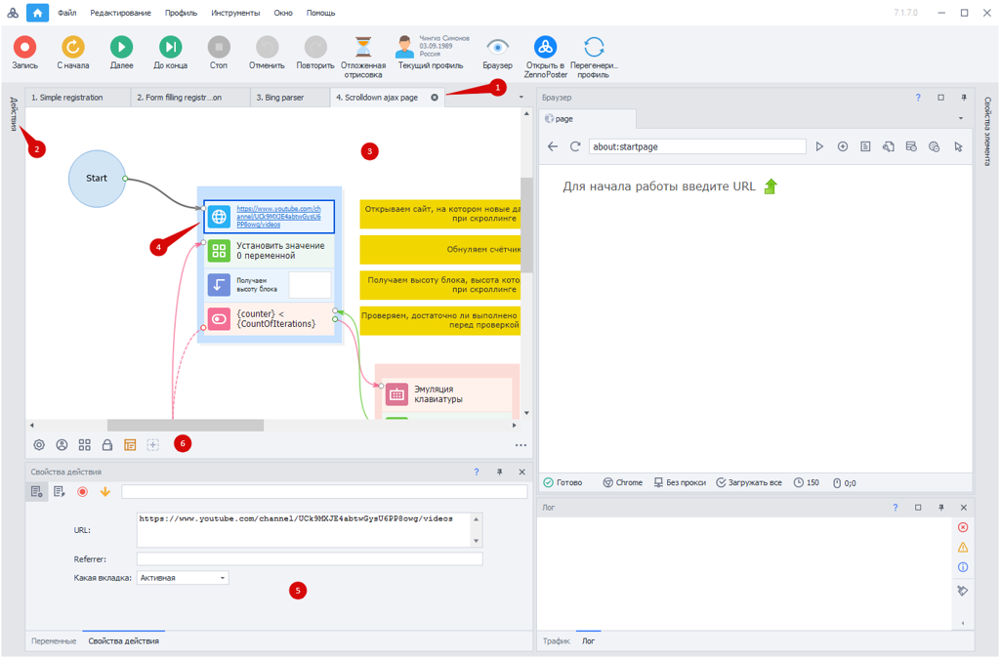
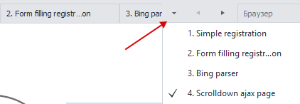
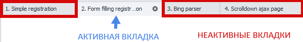
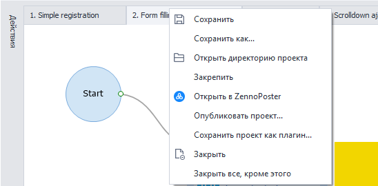
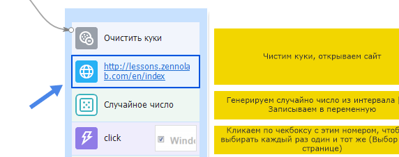
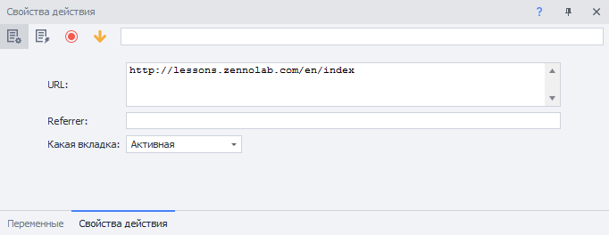
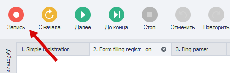

---
sidebar_position: 0
title: "Редактор проектов"
description: " "
date: "2025-07-24"
converted: true
originalFile: "Редактор проектов.txt"
targetUrl: "https://zennolab.atlassian.net/wiki/spaces/RU/pages/534052914"
---
import DisclaimerNotice from '@site/src/components/DisclaimerNotice';

<DisclaimerNotice />

> 🔗 **[Оригинальная страница](https://zennolab.atlassian.net/wiki/spaces/RU/pages/534052914)** — Источник данного материала

export const VideoSample = ({source}) => (
  <video controls playsInline muted preload="auto" className='docsVideo'>
    <source src={source} type="video/mp4" />
</video>
); 

_______________________________________________  
## Описание
**Редактор проектов в ProjectMaker** — основное место для работы с проектами. Давайте посмотрим, из чего он состоит.

1. Панель открытых проектов
2. Панель действий
3. Текущий выбранный проект
4. Текущее выбранное действие
5. Свойства выбранного действия
6. Панель статических блоков проекта

### Панель открытых проектов
Когда вы открываете несколько проектов, все они располагаются в виде вкладок на панели редактора. Если вкладки не умещаются, то можно воспользоваться специальным меню:

### Панель действий
:::info Панель действий содержит в себе более сотни функций. 
[Все они доступны тут](../../category/actions-in-projectmaker).
:::

Посмотрите, как можно добавить действие в проект:

<VideoSample source={require("@site/static/video/adding_action.mp4").default}/>  

:::tip Эту панель можно закрепить, чтобы она не скрывалась.
:::
_______________________________________________ 
## Текущий проект
Через состояние вкладок в панели открытых проектов можно определить, в каком именно проекте вы находитесь.

Кроме того, вы можете вызвать контекстное меню и совершить некоторые действия с проектом. Для этого необходимо нажать **правой кнопкой мыши** по вкладке проекта.

### Выбранное действие
Для выбора определенного действия, по нему необходимо нажать **левой кнопкой мыши**.

|      | 
| :-----------: | 
| Выбранное действие подсвечивается рамкой.     | 

### Свойства действия
Здесь отображается весь функционал выбранного экшена. В данном окне его также можно настроить под определённые задачи.  

Есть возможность открытия нескольких окон под разные действия. 

### Панель статических блоков
В каждом проекте в нижней части есть специальное поле — панель статических блоков. Это элементы, которые принадлежат сразу всему проекту и доступны из любой его части. В отличии от действий (кубиков), выполнение которых происходит последовательно во времени.

Каждый статический блок отвечает за одно или несколько свойств проекта. Такие как настройки проекта, настройки профиля в проекте, шифрование, а также списки и таблицы с данными.

При создании проекта в нем уже имеются несколько обязательных статических блоков, которые нельзя удалить.

[Подробнее о ней](./Static_blocks/General_Principles_of_Operation).
### Окно браузера
Здесь отображается всё происходящее: автоматизированные клики, ввод текста и другие действия. 

Нажав на кнопку **Запись**, вы можете записать любые действия, которые выполните в окне браузера. Необходимые экшены автоматически добавятся в проект.

