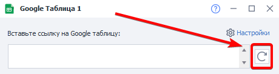
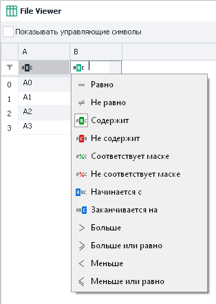

:::info **Пожалуйста, ознакомьтесь с [*Правилами использования материалов на данном ресурсе*](../Disclaimer).**
:::

> 🔗 **[Оригинальная страница](https://zennolab.atlassian.net/wiki/spaces/RU/pages/724566092/Google)** — Источник данного материала

_______________________________________________  
# Google таблица

  

## Создание Google таблицы

### В ProjectMaker

Создать новую Google-таблицу можно:

- из контекстного меню **Добавить действие → Таблицы → Google таблица**:

- через [❗→ панель статических блоков](https://zennolab.atlassian.net/wiki/spaces/RU/pages/534053179 "https://zennolab.atlassian.net/wiki/spaces/RU/pages/534053179"):

- Либо воспользуйтесь [❗→ умным поиском](https://zennolab.atlassian.net/wiki/spaces/RU/pages/506200090/ProjectMaker+7#%D0%A3%D0%BC%D0%BD%D1%8B%D0%B9-%D0%BF%D0%BE%D0%B8%D1%81%D0%BA-%D0%B4%D0%B5%D0%B9%D1%81%D1%82%D0%B2%D0%B8%D0%B9 "https://zennolab.atlassian.net/wiki/spaces/RU/pages/506200090/ProjectMaker+7#%D0%A3%D0%BC%D0%BD%D1%8B%D0%B9-%D0%BF%D0%BE%D0%B8%D1%81%D0%BA-%D0%B4%D0%B5%D0%B9%D1%81%D1%82%D0%B2%D0%B8%D0%B9").

Созданная таблица отобразится в панели статических блоков:

### В облаке

- Авторизуйтесь в своём Google аккаунте
- Зайдите в свой [Google диск](https://drive.google.com/drive/my-drive "https://drive.google.com/drive/my-drive") и в левом верхнем углу выберите **Создать → Google Таблицы → Создать пустую таблицу**.

- Вы можете записать любые стартовые данные либо оставить новую таблицу пустой.
- Подождите пока таблица загрузится и скопируйте URL из адресной строки браузера, он понадобится при привязке таблицы к ProjectMaker.

  

## Настройки таблицы

:::warning Внимание
Перед началом работы с Google Таблицами их надо подключить к программе в Настройках. Как настроить подключение можно прочитать в статье Настройка подключения Google Таблиц
:::

### Вставьте ссылку на Google таблицу

В это поле ввода необходимо вставить ссылку на таблицу, с которой будет производиться работа

### Перезагрузить Google Таблицу

Эта кнопка позволяет обновить данные в таблице.

:::note На заметку
Может быть полезно, если изменения были произведены не через программу, а с обычного браузера или с другого устройства.
:::

### Превью Google таблицы

В этом окне будут отображены данные таблицы.

:::warning Внимание
Тут могут отображаться не все данные из таблицы, а только часть.
:::

### Сохранять изменения таблицы в облако

Стоит ли сохранять в облако изменения, которые внесёт ZennoPoster в таблицу?

### Первая строка - заголовки

Использовать первую строку таблицы под заголовки

### Использовать атомарное добавление строк

Включение данной настройки может быть полезным, когда с таблицей работает сразу несколько копий ZennoPoster. Более подробно об атомарном добавлении можно почитать в статье [❗→ Многопоточная работа с Google-таблицами (Версия 7.1.7.0 и выше)](https://zennolab.atlassian.net/wiki/spaces/RU/pages/851673094 "https://zennolab.atlassian.net/wiki/spaces/RU/pages/851673094") 

### Запоминать закреплённые строки и столбы

:::info Информация
Добавлено в ZennoPoster 7.6.0.0
:::

Если в таблице есть закреплённые строки или столбцы и Вы хотите сохранить их закреплённое состояние, то нужно включить данную опцию.
При этом будет отправлен дополнительный запрос, который расходует [❗→ лимиты](https://zennolab.atlassian.net/wiki/spaces/RU/pages/1667727363/Google#%D0%9B%D0%B8%D0%BC%D0%B8%D1%82%D1%8B-%D0%B7%D0%B0%D0%BF%D1%80%D0%BE%D1%81%D0%BE%D0%B2-%D0%BA-API "https://zennolab.atlassian.net/wiki/spaces/RU/pages/1667727363/Google#%D0%9B%D0%B8%D0%BC%D0%B8%D1%82%D1%8B-%D0%B7%D0%B0%D0%BF%D1%80%D0%BE%D1%81%D0%BE%D0%B2-%D0%BA-API").

### Разделитель строк

Указывает, что будет использоваться в качестве разделителя строк таблицы. В качестве разделителя может использоваться “Новая строка“, “Свой разделитель“ или “Несколько разделителей“

### Разделитель столбцов

Указывает, что будет использоваться в качестве разделения столбцов таблицы. В качестве разделителя может использоваться символ “;“, символ табуляции “Tab“, любой свой разделитель или несколько разделителей.

### Просмотр содержимого

Позволяет полностью просмотреть содержимое всей таблицы. В этом разделе можно включить отображение управляющих символов, задать фильтр для поиска нужной строки и ячейки, а так же воспользоваться конструктором фильтра. 

  

## Принцип работы Google-таблиц в программе

- При каждом новом старте проекта, в программе создаётся виртуальная копия Google-таблицы.
- Виртуальная копия содержит в себе все данные из Google-таблицы.
- В процессе выполнения проекта, программа работает с виртуальной копией.
- Если установлена галочка **Сохранять изменения таблицы в облако**, программа периодически будет записывать данные из виртуальной копии в Вашу Google-таблицу.

:::warning Внимание
Важно: Данные в Google-таблице появляются не моментально, а в течении 10-60 секунд.
:::

  

## Полезные ссылки:

- [❗→ Настройки Google Таблиц](https://zennolab.atlassian.net/wiki/spaces/RU/pages/735576090/Google+PM "https://zennolab.atlassian.net/wiki/spaces/RU/pages/735576090/Google+PM")
- [❗→ Настройка подключения Google Таблиц](https://zennolab.atlassian.net/wiki/spaces/RU/pages/1667727363 "https://zennolab.atlassian.net/wiki/spaces/RU/pages/1667727363")
- [❗→ Многопоточная работа с Google-таблицами (Версия 7.1.7.0 и выше)](https://zennolab.atlassian.net/wiki/spaces/RU/pages/851673094 "https://zennolab.atlassian.net/wiki/spaces/RU/pages/851673094")
- [❗→ Операции над Google-таблицами](https://zennolab.atlassian.net/wiki/spaces/RU/pages/509411347 "https://zennolab.atlassian.net/wiki/spaces/RU/pages/509411347")