---
sidebar_position: 3
title: "Профиль"
description: ""
date: "2025-08-04"
converted: true
originalFile: "Профиль.txt"
targetUrl: "https://zennolab.atlassian.net/wiki/spaces/RU/pages/483426308"
---
import DisclaimerNotice from '@site/src/components/DisclaimerNotice';

<DisclaimerNotice />

> 🔗 **[Оригинальная страница](https://zennolab.atlassian.net/wiki/spaces/RU/pages/483426308)** — Источник данного материала

_______________________________________________  
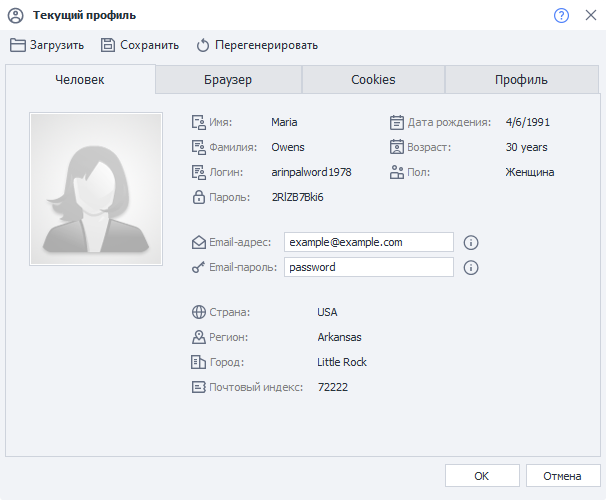  
_______________________________________________
**Профиль** — это виртуальная личность, параметры которой генерируются при каждом новом запуске шаблона. В ProjectMaker генерация происходит во время нажатия кнопки **«Сначала»**; а в ZennoDroid — при каждом новом выполнении проекта. Подробная информация о профиле указана в **Окне профиля**.   

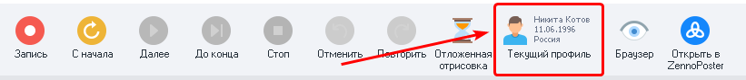   

При выполнении проекта в профиле сгенерируются все необходимые данные. Такие как:  
- личные, которые используются при регистрации;    
- от устройства, они нужны для работы с сервисами.  
:::warning **Важно**
Лучше избегать переназначений отдельных настроек профиля в рамках одного выполнения проекта — вместо этого просто завершите проект и выполните его ещё столько раз, сколько потребуется. Это позволит не усложнять проект внутренними циклами.
::: 

При регистрации аккаунтов правильная логика работы с проектом выглядит так:  
**1.** Старт проекта.  
**2.** Генерация одного нового профиля.  
**3.** Выполнение необходимых действи.  
**4.** Завершение проекта. 
_______________________________________________
## Настройки генерации профиля для текущего проекта
Для открытия параметров генерации профиля необходимо кликнуть по иконке **Профиля** на **Панели статических блоков**. Она находится под холстом с экшенами:  

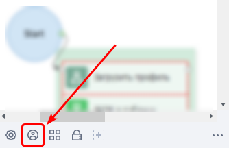

:::info **Не отображается *Панель Статических Блоков*?**
Нужно кликнуть правой кнопкой мыши в любом пустом месте холста с экшенами и выбрать соответствующую настройку из контекстного меню, которая включает эту область.

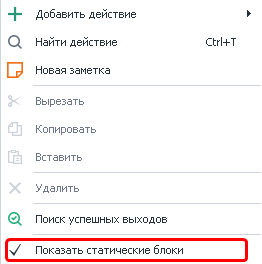 
:::    
_______________________________________________
## Вкладка «Пользователь» 
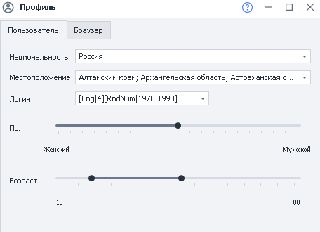

### Национальность
:::tip **Национальность по умолчанию.**
*Можно выставить в Настройках, во вкладке Профиль. Также там можно указать email и пароль от него.*
::: 

Доступно 6 национальностей:  
- Россия,  
- USA (США),  
- Germany (Германия),  
- France (Франция),  
- Spain (Испания),  
- United Kingdom (Великобритания).

### Местоположение
Местоположение настраивается при помощи выпадающего списка с возможностью выбора нескольких значений. Содержимое списка зависит от выбранной страны:  
- Россия — области, края, республики, некоторые большие города (Москва, Сочи и другие);  
- США — штаты;  
- Германия — земли;  
- Франция — регионы;  
- Испания — автономные сообщества;  
- Великобритания — страны, входящие в её состав.  

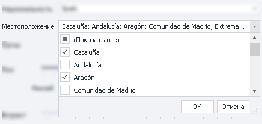

### Логин
При генерации логина используется формула из нескольких частей. По умолчанию в настройках уже сохранены несколько видов формул. Вы также можете вписать туда свою.  

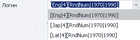
#### Подробное описание формул  
На данный момент для формул поддерживаются языки: `Eng` — английский, `Lat` — латынь, `Jap` — японский.  
Например, при вводе значения `[Eng|4]` сгенерируется никнейм длиной в 4 английских слога с вероятностью таких же сочетаний слогов, как в реальных словах. Через изменение формулы можно создавать более сложные конструкции. Разберем такую формулу:  

`[RndSym|[RndNum|0|4]|0123456789][Lat|3][RndSym|[RndNum|0|2]|-][Jap|1][RndText|2|D]`  

`[RndSym|[RndNum|0|4]|0123456789]` — означает, что в начале ника будет использоваться от 0 до 3 цифр;  
`[Lat|3]` — генерируем 3 слога на латыни;  
`[RndSym|[RndNum|0|2]|-]` — берем случайные 2 буквы или цифры.  

В результате генерации получатся такие ники:  
- 053bomenca-iem,  
- 7lialeme-nozr,  
- 46atbemig-poex,  
- simpvido-se8f,  
- 3afosuxhif6,  
- frigulimdeif,  
- misssefu-yucn.  

### Пол
С помощью этого ползунка устанавливается вероятность генерации того или иного пола. 

### Возраст
Этот параметр позволяет выставить диапазон, в пределах которого будет генерироваться возраст для профиля.

_______________________________________________
## Вкладка «Браузер» 
По умолчанию эти настройки скрыты — необходимо выбрать **Настроить вручную** из выпадающего списка.

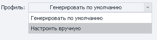

После активации настроек появится такое окно:

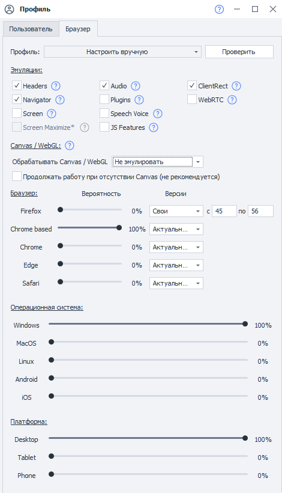

### Проверить
В самом конце, после настройки всех параметров, нажмите эту кнопку, чтобы проверить, что **выбранные значения корректны и совместимы друг с другом**.
_______________________________________________  
### Эмуляции
С помощью данных настроек можно включать или отключать блоки из которых состоит [отпечаток браузера](https://ru.wikipedia.org/wiki/%D0%A6%D0%B8%D1%84%D1%80%D0%BE%D0%B2%D0%BE%D0%B9_%D0%BE%D1%82%D0%BF%D0%B5%D1%87%D0%B0%D1%82%D0%BE%D0%BA_%D1%83%D1%81%D1%82%D1%80%D0%BE%D0%B9%D1%81%D1%82%D0%B2%D0%B0).    

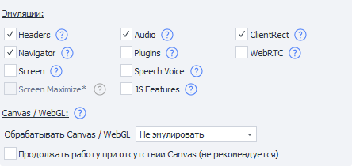  

> *Клик по знаку вопроса возле любой из настроек открывает справку по ней.*

#### Headers
Каждый браузер отправляет собственный набор [HTTP-заголовков](https://developer.mozilla.org/en-US/docs/Web/HTTP/Headers), например: `Accept`, `Accept-Encoding`, `Accept-Charset`, `Accept-Language`. В ZennoPoster эти заголовки можно изменять через действия работы с профилем или с помощью C#-кода.  

При создании нового профиля значения в блоке [Headers](https://developer.mozilla.org/en-US/docs/Web/HTTP/Headers) автоматически подбираются так, чтобы они корректно соответствовали данным из блока [Navigator](https://developer.mozilla.org/ru/docs/Web/API/Navigator).

#### Navigator
Данный блок содержит корректный набор полей и значений, характерных для выбранного браузерного профиля. 

При включении эмуляции Navigator изменяются не только сами значения полей, но и их видимость. То, что раньше приходилось настраивать вручную с помощью крупных сниппетов, теперь выполняется автоматически.

#### [Screen](https://developer.mozilla.org/ru/docs/Web/API/Screen)
Этот блок отвечает за параметры экрана, включая его разрешение.  

Раньше эти значения можно было эмулировать через действия работы с профилем или C#-код. Теперь они устанавливаются автоматически и согласуются с текущими данными Navigator и другими блоками профиля.  

#### Screen Maximize  
> *Доступно в **ZennoPoster 7.3.0.0 и выше**. Для работы настройки необходимо включить блок **Screen**.*  

Автоматически устанавливает размер окна браузера в соответствии со сгенерированными параметрами **Screen**.

**Аналогичный C#-метод:** `SetWindowSize`.

:::warning Внимание
На некоторых сайтах использование этой настройки может вызывать проблемы с вёрсткой.
:::

#### Plugins
Каждый браузер поддерживает наборы плагинов, различающиеся в зависимости от его типа, операционной системы и платформы. Мы предоставляем универсальный набор плагинов, которые установятся автоматически.

#### Audio
ZennoPoster также позволяет автоматически эмулировать контекст и некоторые параметры audio-окружения браузера. Именно за это и отвечает блок [Audio](https://developer.mozilla.org/ru/docs/Web/API/AudioContext "https://developer.mozilla.org/ru/docs/Web/API/AudioContext").

#### Speech Voice
:::info *Доступно с версии 7.3.0.0*
:::

[Web Speech API](https://developer.mozilla.org/ru/docs/Web/API/Web_Speech_API "https://developer.mozilla.org/ru/docs/Web/API/Web_Speech_API") позволяет взаимодействовать с голосовыми интерфейсами для распознавания и синтеза речи.  

А Speech Voice — это пресеты голосов, которые используются для генерации аудио представления информации.

#### Canvas / WebGL
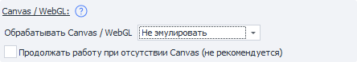  

Что такое Canvas и WebGL?

Canvas — это элемент HTML5, который предназначен для создания графики на веб-страницах.

WebGL — это API для рисования 3D графики в браузере.  

Их можно использовать для получения браузерных отпечатков. Например, с помощью WebGL Image.

Снятие отпечатков происходит примерно так: на странице сайта прорисовывается скрытое изображение, из которого затем получается хэш. На разных устройствах результат будет отличаться из-за комбинации железа, драйверов и браузера. Это различие и позволяет отслеживать пользователей.

**Начиная с версии 7.7.0.0 мы значительно улучшили эмуляцию Canvas/WebGL.**

Теперь есть три варианта работы:

- **Не эмулировать**. Используется одинаковый отпечаток браузера для всех создаваемых профилей.
- **Добавлять шум**. Создаёт новый отпечаток для каждого профиля.  
Однако итоговый отпечаток получается неестественным из-за своей уникальности. Такие редко бывают у обычных браузеров. Но для большинства сайтов этого режима достаточно.
- **Супер эмуляция** ***(только на движке Chromium)***. Генерирует наиболее натуральный отпечаток, который позволит слиться с толпой, поскольку во всём мире существует много похожих устройств.  

:::warning Использовать GPU для ускорения отрисовки
Требуется активировать эту настройку в «Инстанс» для работы WebGL в браузере.
:::

##### Продолжить работу при отсутствии Canvas (*не рекомендуем*)  
Данная настройка позволяет продолжить работу проекта при ошибке в генерации Canvas.  

Когда она **выключена**, шаблон завершается с ошибкой, если не удалось сгенерировать Canvas.

#### JS Features
Для проверки браузера используется множество изощренных техник. Например, функция `toString()`, вызванная для любого объекта, или другие **функции JavaScript** могут многое рассказать о вашем браузере.  

Блок **JS Features** предназначен для включения защиты от подобных техник определения браузера.

#### ClientRect
Размер элементов, применённые к ним стили и прочие детали несут информацию о вашем оборудовании.  

Включение блока **ClientRect** защитит ваш браузер от отпечатков такого типа.

#### WebRTC
Любые устройства: камеры, наушники, микрофоны, могут быть видны в вашем браузере через [WebRTC](https://developer.mozilla.org/ru/docs/Web/API/WebRTC_API). Они также являются достоверным отпечатком браузера.  

Блок **WebRTC** предоставляет вам универсальный набор устройств для выбранной платформы, ОС и браузера.
_______________________________________________
### Браузер
С помощью ползунков можно настраивать вероятность генерации того или иного браузера.  

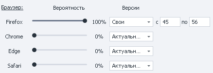

:::warning Здесь генерируется значение *User-Agent*
Эта строка отправляется вместе с запросом и содержит в себе информацию о браузере, ОС и её разрядности, а также прочую информацию.  

Не путайте с *Типом браузера* из текущего проекта, который можно изменить в **Настройках проекта**.
:::

#### Операционная система и Платформа
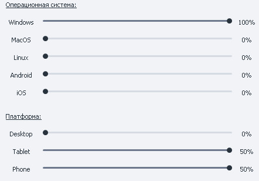

Ползунками вы можете регулировать вероятность генерации той или иной платформы и ОС.

_______________________________________________ 
## Для чего нужен Профиль?     
Для регистрации на сайтах, форумах, блогах, в социальных сетях и т.д. Благодаря ему вам не нужно ломать голову над тем, где взять имена, фамилии, индексы, города, логины и как генерировать различные параметры устройства. Всё это уже встроено в программу. Вы же можете сосредоточиться на решении более важных задач.

_______________________________________________ 

## Полезные ссылки

- [❗→ Окно профиля](https://zennolab.atlassian.net/wiki/spaces/RU/pages/735903758 "https://zennolab.atlassian.net/wiki/spaces/RU/pages/735903758")
- [❗→ Операции над профилем](https://zennolab.atlassian.net/wiki/spaces/RU/pages/486539291 "https://zennolab.atlassian.net/wiki/spaces/RU/pages/486539291")
- [❗→ Профиль (PM)](https://zennolab.atlassian.net/wiki/spaces/RU/pages/735608848 "https://zennolab.atlassian.net/wiki/spaces/RU/pages/735608848")