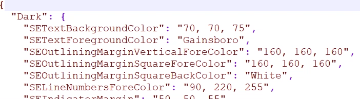

:::info **Пожалуйста, ознакомьтесь с [*Правилами использования материалов на данном ресурсе*](../Disclaimer).**
:::

> 🔗 **[Оригинальная страница](https://zennolab.atlassian.net/wiki/spaces/RU/pages/534086229/Using-)** — Источник данного материала

_______________________________________________  
# Using-директивы и общий код

## Описание

:::note На заметку
Начиная с версии ZennoPoster 7.3.2.0 появилась возможность подключить Visual Studio. Подробную инструкцию Вы можете найти в статье Проект Visual Studio
:::

Общий код - это функционал ZennoPoster расширяющий возможности стандартных [❗→ кубиков C#](https://zennolab.atlassian.net/wiki/spaces/RU/pages/492011596 "https://zennolab.atlassian.net/wiki/spaces/RU/pages/492011596"). Общий код используется для вставки дополнительных классов и функций, которые, в последствии, могут использоваться в экшенах C#. Using-директивы служат для доступа к функциям и классам и создания пространства имён (**namespaсes**).

:::info Информация
Работа с общим кодом предусматривает, что у пользователя уже имеются базовые знания C#
:::

## Как добавить действие в проект?

Через контекстное меню **Добавить действие** → **Свой код** → **Директивы using и общий код**


Либо воспользуйтесь [❗→ умным поиском](https://zennolab.atlassian.net/wiki/spaces/RU/pages/506200090/ProjectMaker+7#%D0%A3%D0%BC%D0%BD%D1%8B%D0%B9-%D0%BF%D0%BE%D0%B8%D1%81%D0%BA-%D0%B4%D0%B5%D0%B9%D1%81%D1%82%D0%B2%D0%B8%D0%B9 "https://zennolab.atlassian.net/wiki/spaces/RU/pages/506200090/ProjectMaker+7#%D0%A3%D0%BC%D0%BD%D1%8B%D0%B9-%D0%BF%D0%BE%D0%B8%D1%81%D0%BA-%D0%B4%D0%B5%D0%B9%D1%81%D1%82%D0%B2%D0%B8%D0%B9").

При добавлении действия в [❗→ панели статических блоков](https://zennolab.atlassian.net/wiki/spaces/RU/pages/534053179 "https://zennolab.atlassian.net/wiki/spaces/RU/pages/534053179") появится новый блок "**Директивы using и общий код**".

## Где это можно применить?

- Для более эффективной и удобной работы с C# кодом
- Для создания новых пространств имён
- Для организации работы с большими объемами кода, чтобы не было конфликтов в пространствах имён

## Как работать с окном?

Окно "**Директивы using и общий код**" состоит из двух табов: **Общий код** и **Директивы using**.

### Окно Общий код

Представляет собой редактор кода с подсветкой синтаксиса во многом аналогичный редактору кода [❗→ C# код (Си шарп код .net)](https://zennolab.atlassian.net/wiki/spaces/RU/pages/492011596 "https://zennolab.atlassian.net/wiki/spaces/RU/pages/492011596") . В нём также можно в контекстном меню получить доступ к базовому функционалу по редактированию кода: копирование, вставка, комментирование, поиск, замена и т. д.

Кроме того, возможно загружать общий код из своего файла в формате `.txt` или `.cs` (C# source file) - этому служит чекбокс и поле в нижней части окна.


В верхней части редактора перечислены все using используемые в проекте, а ниже идет пример объявления `namespace ZennoLab.OwnCode`. Пользователи по аналогии могут создавать свои пространства имён и в дальнейшем обращаться к ним из [❗→ экшенов C#](https://zennolab.atlassian.net/wiki/spaces/RU/pages/492011596/C+.net "https://zennolab.atlassian.net/wiki/spaces/RU/pages/492011596/C+.net").

Для доступа к функциям и методам общего кода их нужно объявлять с модификатором доступа `public` . Классы можно объявлять статичными (`public static`), если не нужно работать с объектами этого класса. Если наследование не требуется, то сразу лучше объявить класс как `public sealed`.

:::warning Внимание
В общем коде невозможно напрямую получить доступ к сущностям `instance` или `project` в отличие от кубиков C#. Поэтому для работы, например с инстансом, эти объекты необходимо инициировать через `new` (`Instance instance = new Instance("127.0.0.1", 40500, "server");`) или передать их через аргументы функций. Аналогично с переменными проекта - их значения необходимо передавать посредством аргументов функций.
:::

### Директивы Using

Этот таб имеет две области. В верхней пользователь может добавить namespaces, которые требуются для выполнения кода в экшенах **C#**. Например, если пользователю необходимо парсить XML, то он должен добавить `using System.Xml;`.

В нижней части перечислены все using, которые используются проектом по умолчанию. Они не редактируются.


### Тонкая настройка внешнего вида редактора кода

:::info Информация
Добавлено в ZennoPoster 7.2.1.0
:::

:::warning Внимание
Эти настройки влияют как на Директивы Using и общий код, так и на отображение кода в экшене C# код (Си шарп код .net)
:::

У Вас есть возможность самостоятельной настройки цветов оформления редактора кода. Файл настройки `SyntaxEditorColors.json` находится в директории: `%AppData%\ZennoLab\ZennoPoster\7\ProjectMaker`. Цвета для светлой и тёмной темы настраиваются отдельно, в формате RGB или по именам.




  

## Примеры использования

В примере ниже в общем коде используется передача в функцию `HtmlClick` объекта `instance` и затем поиск HTML-элемента по атрибутам и клик по нему. В случае успеха или не успеха возвращается строка для контроля результатов.

```csharp
namespace ZennoLab.OwnCode
{
	public class CommonCode
	{
		public static string HtmlClick(Instance instance) {
			HtmlElement he = instance.ActiveTab.FindElementByAttribute("div", "class", "html", "regexp", 0);
			if (he.IsVoid) {
				return "fail";
			} else {
				he.Click();
				return "success";
			}
		}
    }
}
```

 Для вызова этой функции используется [❗→ кубик C#](https://zennolab.atlassian.net/wiki/spaces/RU/pages/492011596/C+.net "https://zennolab.atlassian.net/wiki/spaces/RU/pages/492011596/C+.net") со следующей командой: 
`return ZennoLab.OwnCode.CommonCode.HtmlClick(instance);`
В случае, если этот HTML элемент будет обнаружен на странице, то по нему будет произведен клик, если нет, придёт сообщение "fail". Такое использование обосновано, если в проекте есть много мест где требуется кликнуть по одному и тому же элементу.

  

В следующем примере на вход метода `SetImageOpacity` подается изображение и коэффициент прозрачности, который нужно применить к картинке. В результате возвращается картинка с эффектом полупрозрачности.

```csharp
public static Image SetImageOpacity(Image image, float opacity)  
{  
    try  {  
		Bitmap bmp = new Bitmap(image.Width, image.Height);
        //создание графики из картинки
        using (Graphics gfx = Graphics.FromImage(bmp)) {
            //создание объекта color matrix  
            ColorMatrix matrix = new ColorMatrix();      
            //установка прозрачности 
            matrix.Matrix33 = opacity;  
            //создание новых атрибутов
            ImageAttributes attributes = new ImageAttributes();      
            //установка цвета прозрачности картинки
            attributes.SetColorMatrix(matrix, ColorMatrixFlag.Default, ColorAdjustType.Bitmap);    
            //отрисовываем картинку
            gfx.DrawImage(image, new Rectangle(0, 0, bmp.Width, bmp.Height), 0, 0, image.Width, image.Height, GraphicsUnit.Pixel, attributes);
        }
        return bmp;  
    }  
    catch (Exception ex) {  
        return null;  
    }  
} 
```

А вот так эта функция вызывается из экшена **C#**:  
```csharp
Image img = OwnCode.CommonCode.SetImageOpacity(Image.FromFile(project.Directory + "//image.jpg"), .5f);
```

Полученное изображение из файла обрабатывается с помощью эффекта наложения полупрозрачности и затем может быть сохранено на диск.

  

## Полезные ссылки

- [❗→ Проект Visual Studio](https://zennolab.atlassian.net/wiki/spaces/RU/pages/1375109121 "https://zennolab.atlassian.net/wiki/spaces/RU/pages/1375109121")
- [❗→ Ссылки из GAC](https://zennolab.atlassian.net/wiki/spaces/RU/pages/534315491 "https://zennolab.atlassian.net/wiki/spaces/RU/pages/534315491")
- [Директива using (справочник по C#)](https://docs.microsoft.com/ru-ru/dotnet/csharp/language-reference/keywords/using-directive "https://docs.microsoft.com/ru-ru/dotnet/csharp/language-reference/keywords/using-directive")
- Экшен [❗→ C# код (Си шарп код .net)](https://zennolab.atlassian.net/wiki/spaces/RU/pages/492011596 "https://zennolab.atlassian.net/wiki/spaces/RU/pages/492011596")