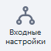
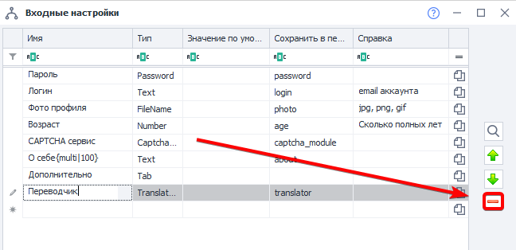
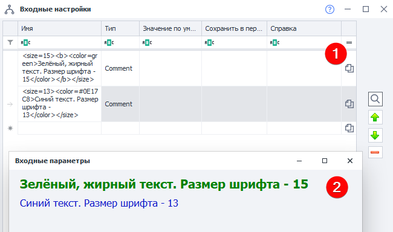

:::info **Пожалуйста, ознакомьтесь с [*Правилами использования материалов на данном ресурсе*](../Disclaimer).**
:::

> 🔗 **[Оригинальная страница](https://zennolab.atlassian.net/wiki/spaces/RU/pages/534020594)** — Источник данного материала

_______________________________________________  
# Входные настройки проекта

  

## Описание

С помощью входных параметров, вы сможете внести нужные вашему проекту значения,
для корректного запуска шаблона в [❗→ ZennoPoster](https://zennolab.atlassian.net/wiki/spaces/RU/pages/475562059 "https://zennolab.atlassian.net/wiki/spaces/RU/pages/475562059") или [❗→ ZennoBox](https://zennolab.atlassian.net/wiki/spaces/RU/pages/495386651 "https://zennolab.atlassian.net/wiki/spaces/RU/pages/495386651").

:::warning Внимание
Входные настройки считываются только при старте потока!Изменение входных настроек во время выполнения проекта никак на последнем не отразится, пока не начнётся новое выполнение.
:::

  

## Добавить "Входные настройки" в проект

Для этого, необходимо нажать "***Добавить***" на [❗→ панели статических блоков](https://zennolab.atlassian.net/wiki/spaces/RU/pages/534053179 "https://zennolab.atlassian.net/wiki/spaces/RU/pages/534053179") [❗→ редактора проекта ProjectMaker](https://zennolab.atlassian.net/wiki/spaces/RU/pages/534052914 "https://zennolab.atlassian.net/wiki/spaces/RU/pages/534052914"), и в появившемся контекстном меню, выбрать "***Добавить входные настройки***", или нажав правой кнопкой мыши в любой области нижней части, вызвать контекстное меню.

На панели появится соответствующая иконка, которая открывается двойным кликом мыши.

:::info Информация
Обратите внимание, что данный блок не может одновременно присутствовать в проекте с блоком "Интерфейс бота". При добавлении "Входные настройки", блок интерфейса "BotUI" удаляется! Равнозначно происходит и наоборот! Будьте внимательны и предварительно, сохраняйте входные настройки интерфейса!
:::

  

## Форма для редактирования входных параметров

### Имя

Под указанным здесь названием настройка будет отображена пользователю

### Тип

Входные настройки поддерживают разные типы данных. От выбранного типа зависит какие данные сможет внести пользователь и как эта настройка будет ему отображена. 

Ниже каждый тип описан подробно, а также приведён скриншот того, как настройка отображается для пользователя.

### Значение по умолчанию

Начальное значение параметра, которое, при старте шаблона, будет находиться в [❗→ переменной проекта](https://zennolab.atlassian.net/wiki/spaces/RU/pages/735608872 "https://zennolab.atlassian.net/wiki/spaces/RU/pages/735608872"), на случай, если пользователь проигнорировал данный параметр.

### Сохранить в переменную

Имя переменной проекта, в которую будет записываться значение, введенное пользователем в форме.

### Справка

Справочное пояснение для поля, в виде всплывающей подсказки.

### Предварительный просмотр

В любой момент редактирования настроек Вы можете посмотреть как они будут отображаться пользователю. Для этого надо кликнуть справа в окне по кнопке со значком "лупы". 

Пример

#### Экспорт

Позволяет сохранить текущие настройки в файл.

#### Импорт

Позволяет загрузить настройки из файла, которые были сохранены с помощью кнопки "Экспорт"

#### По умолчанию

Сбрасывает настройки до значений выставленных по умолчанию

### Перемещение настроек вверх и вниз

Для того, чтобы переместить настройку выше или ниже по списку её надо выделить и перемещать с помощью кнопок "вверх" и "вниз" справа.

Пример

### Удаление настройки

Для удаления надо выделить настройку и нажать кнопку "Удалить" в правой части окна

### Скопировать макрос переменной в буфер обмена

Для того, чтобы скопировать макрос переменной в буфер обмена, надо кликнуть по соответствующей кнопке напротив необходимой настройки

## Доступные типы параметров

#### Label

Заголовок. Может применяться, как визуальное разделение логических секций.

#### Boolean

Чекбокс (галочка). Может принимать значения True или False.

#### Number

Поле, где можно указать целое число.

#### Text

Текстовое поле. Может содержать однострочный текст (по умолчанию) или многострочный текст. Чтобы вставить многострочный текст, нужно указать в имени параметра дополнительные установки в виде: `{multi|height}`. Например, если вам нужно многострочное поле «Пост», высотой 100 пикселей, укажите в имени параметра: `Пост {multi|100}`.

##### **Однострочный текст**

Редактор

Конечный вид

##### **Многострочный текст**

Редактор

Конечный вид

#### Select

Группа радио-кнопок, представляющая собой выбор из нескольких вариантов. Вам нужно указать в имени параметра все возможные варианты, например: `{HTTP|SOCKS4|SOCKS5}`.

Редактор

Конечный вид

#### FileName

Поле ввода для указания пути к файлу или директории в файловой системе. Можно прописать путь вручную, либо выбрать файл\директорию через окно выбора файлов кликнув по кнопке […].

Вы можете менять тип диалогового окна, которое будет открыто при клике по […]:

##### **Открыть файл**

Стандартное поведение этого поля. Открывается диалог для выбора существующего файла. Удобно использовать, когда надо выбрать файл из которого будут считываться данные.

| ![Окно в редакторе настроек (1), настройка, как её видит пользователь (2) и диалоговое окно, которое открывается при клике по […] в Windows 10 (3)](./assets/Входные_настройки_проекта/Входные_настройки_проекта_pic19.png) |
| :--: |
| Окно в редакторе настроек (1), настройка, как её видит пользователь (2) и диалоговое окно, которое открывается при клике по […] в Windows 10 (3) |

##### **Сохранить файл**

Чтобы по клику по […] вызывался диалог на сохранение файла, то нужно к имени настройки добавить конструкцию вида `{save}`

Данный диалог удобно использовать, когда необходимо указать файл, в который будет сохраняться результат работы.

| ![Окно в редакторе настроек (1), настройка, как её видит пользователь (2) и диалоговое окно, которое открывается при клике по […] в Windows 10 (3)](./assets/Входные_настройки_проекта/Входные_настройки_проекта_pic20.png) |
| :--: |
| Окно в редакторе настроек (1), настройка, как её видит пользователь (2) и диалоговое окно, которое открывается при клике по […] в Windows 10 (3) |

:::note На заметку
Можно указать несуществующий файл. В то время как при диалоге "Открыть файл" указываемый файл обязательно должен существовать.
:::

##### **Путь к директории**

Для указания пути к директории к имени параметра необходимо добавить `{folder}`

| ![Окно в редакторе настроек (1), настройка, как её видит пользователь (2) и диалоговое окно, которое открывается при клике по […] в Windows 10 (3)](./assets/Входные_настройки_проекта/Входные_настройки_проекта_pic21.png) |
| :--: |
| Окно в редакторе настроек (1), настройка, как её видит пользователь (2) и диалоговое окно, которое открывается при клике по […] в Windows 10 (3) |

#### Dropdown

Выпадающий список с выбором значения.
Есть 2 варианта настройки DropDown.

##### **Отображать элементы "Как есть"**

Пользователю варианты в выпадающем списке будут отображены так же, как Вы их зададите в редакторе настроек.

Синтаксис такой - `Имя настройки {Вариант1|Вариант2|Вариант3}` , соответственно значение по умолчанию будет одним из вариантов.

|  |
| :--: |
| Окно в редакторе настроек (1), настройка, как её видит пользователь (2) |

##### **Именованные элементы** 

Синтаксис - `Имя настройки {Вариант1:Значение1|Вариант2:Значение2|Вариант3:Значение3}` Пользователю будет отображено название (`Вариант1`, `Вариант2`, `Вариант3`), но в шаблон попадёт значение (`Значение1`, `Значение2`, `Значение3`)

|  |
| :--: |
| Окно в редакторе настроек (1), настройка, как её видит пользователь (2). В переменную сохранится RU, EN либо UA. |

#### DropDownMultiSelect

Выпадающий список с множественным выбором значений. Позволяет выбрать чекбоксами несколько значений одновременно. В поле значения по умолчанию можно прописать несколько значений через запятую.

Синтаксис такой же как и у типа DropDown - `Имя настройки {Вариант1|Вариант2|Вариант3}`
(только вариант "Как есть", именованные значения не поддерживаются). Если выбрано несколько вариантов, то в переменную они сохранятся через запятую.

#### CaptchaModules

Выбор сервиса [❗→ распознавания каптч](https://zennolab.atlassian.net/wiki/spaces/RU/pages/534053026 "https://zennolab.atlassian.net/wiki/spaces/RU/pages/534053026") из списка доступных в ZennoPoster.

#### SmsServices

Выбор сервиса для [❗→ приёма смс](https://zennolab.atlassian.net/wiki/spaces/RU/pages/486539308/SMS "https://zennolab.atlassian.net/wiki/spaces/RU/pages/486539308/SMS") из списка доступных в ZennoPoster.

#### TranslateServices

Выбор сервиса для [❗→ перевода текста](https://zennolab.atlassian.net/wiki/spaces/RU/pages/808747136/ZennoPoster "https://zennolab.atlassian.net/wiki/spaces/RU/pages/808747136/ZennoPoster") из списка доступных в ZennoPoster.

#### Tab

Добавление ещё одной вкладки в окно настроек. Например, можно разделить "Основные" и "Дополнительные настройки" по вкладкам.

#### Comment

Поле с комментарием или описанием, позволяющее вставлять текст во всю ширину окна настроек. Может использоваться как описание к другим настройкам.

##### **Форматирование**

Отображаемое значение в типе *Comment можно немного видоизменять. Поддерживаемые теги:

| **Описание** | **Синтаксис** |
| --- | --- |
| Жирный текст | `<b>Текст</b>` |
| Цвет шрифта | `<color=red>Красный цвет шрифта</color>` `<color=#00ff00>Зеленый цвет шрифта</color>`|
| Размер текста | `<size=6>Размер текста</size>` |

Пример отформатированного текста

Первая строка - `<size=15><b><color=green>Зелёный, жирный текст. Размер шрифта - 15</color></b></size>`  
Вторая строка - `<size=13><color=#0E17C8>Синий текст. Размер шрифта - 13</color></size>`

#### Password

Данные, вводимые в поле этого формата будут скрыты от просмотра (но в проект попадут в открытом виде)

### Символы Unicode

Во всех полях можно использовать Unicode символы. Пример - ± ♻ 📞 💙 🚢 (учтите, что браузер отображает их цветным, а в настройках эти символы отображаются так, как показано на скриншоте ниже):

  

## Обзор входных настроек в программе ZennoPoster

Для того, чтобы открыть "Входные настройки проекта", необходимо нажать правой кнопкой мыши на проекте, в появившемся контекстом меню, выбрать "Настройки" или дважды кликнуть по проекту в списке проектов.

Вот такой простой и в тоже время понятный, получился интерфейс для входных настроек, это не заняло много времени или каких-то особых знаний! Теперь мы можем легко передать наш проект другому пользователю программы ZennoPoster, и у него не возникнет проблем с запуском проекта!