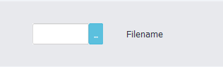
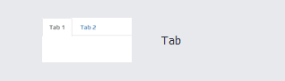
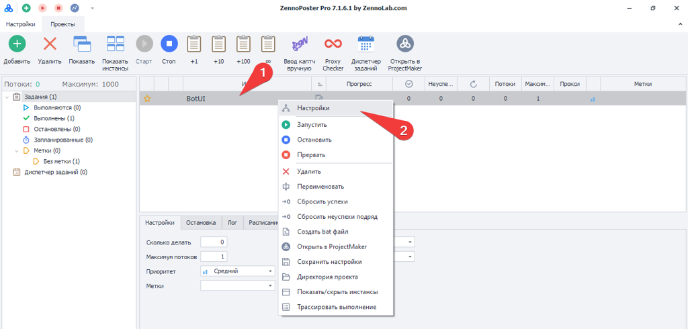

:::info **Пожалуйста, ознакомьтесь с [*Правилами использования материалов на данном ресурсе*](../Disclaimer).**
:::

> 🔗 **[Оригинальная страница](https://zennolab.atlassian.net/wiki/spaces/RU/pages/725352539)** — Источник данного материала

_______________________________________________  
# Интерфейс бота

Интерфейс бота (англ. bot user interface, далее BotUI) – это визуальный конструктор, для создания интерфейса на основе web-технологий: HTML, CSS, Java Script. С помощью данного редактора, вы сможете, без особых знаний веб разработки, просто и быстро создавать красивый, интуитивно понятный, современный, мультиязычный интерфейс для ваших проектов! BotUI включает функционал настроек и позволяет передавать входные параметры шаблону/плагину для его последующего выполнения в ZennoPoster.

  

## Добавить "Интерфейс бота" в проект

Для этого, необходимо нажать "***Добавить***" на [❗→ панели статических блоков](https://zennolab.atlassian.net/wiki/spaces/RU/pages/534053179 "https://zennolab.atlassian.net/wiki/spaces/RU/pages/534053179") редактора проекта ProjectMaker, и в появившемся контекстном меню, выбрать "***Добавить интерфейс бота***", или нажав правой кнопкой мыши в любой области нижней части, вызвать контекстное меню.

|  |
| :--: |
| Добавить интерфейс бота в проект ZennoPoster |

На панели появится соответствующая иконка, которая открывается двойным кликом мыши.

:::info Информация
Обратите внимание, что данный блок не может одновременно присутствовать в проекте с блоком "Входные настройки". При добавлении "BotUI", блок "Входные настройки" удаляется! Равнозначно происходит и наоборот! Будьте внимательны и предварительно, сохраняйте входные настройки интерфейса!
:::

## Редактор интерфейса бота

|  |
| :--: |
| Редактор интерфейса бота |

### **Визуальный конструктор разделяется на 2 основных раздела:**

**Основные настройки интерфейса**

- Меню
- Рабочая область

**Локализация интерфейса**

- Меню
- Панель элементов

### - Далее, мы рассмотрим пошагово, каждый из разделов.

## **Раздел: Основные настройки**

  

### **Меню**

- **Новый** – создать новый интерфейс, при этом, полностью очищает основное полотно и удаляет все имеющиеся, на нем, элементы.
- **Просмотр** – открывает форму предварительного просмотра интерфейса, который при сохранении проекта, и добавление его в ZennoPoster, будет выглядеть аналогичным образом.
- **Отменить** – вернуться на шаг назад.
- **Повторить** – вернуться на шаг вперёд.
- **Открыть код** – открывает редактор исходного кода, визуального конструктора.
- **Язык** – переключатель между языковой-локализацией интерфейса.
- **Справка** – справочная информация по редактору пользовательского интерфейса.

### **Рабочая область**

|  |
| :--: |
| Рабочее пространство для создания интерфейса |

**Рабочая область для создания интерфейса, состоит их 3-х частей:**

1. Панель инструментов
2. Внешний вид интерфейса
3. Свойства элемента

Слева панель инструментов с различными элементами: формы для ввода текста, выбор между вариантами, дополнительные модули и сервисы, кнопки, чекбоксы и другие элементы (каждый разберем ниже), которые позволяют строить привлекательный, интуитивно понятный клиентский интерфейс. В центре макет ваших будущих входных настроек (полотно), на которое вы можете перетаскивать нужные вам элементы из панели инструментов слева и располагать их нужным вам образом. А справа панель с настройками свойств, того или иного элемента, где можно указать цвет, шрифт, переменную в которую будет попадать значение из этого элемента и много других настроек, о которых мы ещё расскажем.

### **Панель инструментов**

**Text** – ** обычный текст для пометок на полотне.

|  |
| :--: |
| Обычный текст для пометок на полотне интерфейса |

**Textbox** – поле для ввода однострочного текста.

|  |
| :--: |
| Поле для ввода однострочного текста |

**Password** – ** поле для ввода пароля (отличается от Textbox тем, что визуально символы заменяются на кружочки).

|  |
| :--: |
| Поле для ввода пароля |

**Number** – поле, в котором можно указать только целочисленное значение.

|  |
| :--: |
| Поле для целочисленного значения |

**Boolean** – чекбокс, может принимать значение true или false.

|  |
| :--: |
| Чекбокс, принимает значение истина или ложь |

**TextArea** – поле для ввода многострочного текста.

|  |
| :--: |
| Поле для ввода многострочного текста |

**Select** – выпадающий список. Варианты для выбора задаются через свойство “Options”, в котором “Text” - отображаемый текст варианта, “Value” - значение которое будет передаваться в переменную при выборе варианта.

|  |
| :--: |
| Выпадающий список |

**Radio** – группа из радиокнопок. Варианты для выбора задаются через свойство “Options”, в котором “Text” – отображаемый текст варианта, “Value” - значение которое будет передаваться в переменную при выборе варианта.

**Filename** – поле для ввода пути к файлу. Значение по умолчанию указывается через свойство FilePath, в ZennoPoster значение устанавливается через диалоговое окно, вызываемое по нажатию кнопки **[…]**.

|  |
| :--: |
| Путь до указанного файла |

**Button** – кнопка, с возможностью добавления JavaScript-события, которое будет применено к текущему элементу.

|  |
| :--: |
| кнопка с возможностью добавления JavaScript-события |

**Multiselect** – выпадающий список с возможностью выбора нескольких вариантов. Варианты для выбора задаются через свойство Options, в котором Text - отображаемый текст варианта, Value - значение которое будет передаваться в переменную при выборе варианта.

|  |
| :--: |
| Выпадающий список с возможностью выбора нескольких вариантов |

**Capcha Modules** – выпадающий список для выбора сервиса «[❗→ распознавания каптч](https://zennolab.atlassian.net/wiki/spaces/RU/pages/808845385 "https://zennolab.atlassian.net/wiki/spaces/RU/pages/808845385")» из доступных в ZennoPoster.

|  |
| :--: |
| Выпадающий список для выбора сервиса распознавания каптч |

**Sms Service** – выпадающий список для выбора сервиса «[❗→ приём смс](https://zennolab.atlassian.net/wiki/spaces/RU/pages/809074773/ "https://zennolab.atlassian.net/wiki/spaces/RU/pages/809074773/")» из доступных в ZennoPoster.

|  |
| :--: |
| Выпадающий список для выбора сервиса приёма SMS |

**Translate Service** – выпадающий список для выбора сервиса «[❗→ перевод текста](https://zennolab.atlassian.net/wiki/spaces/RU/pages/808747136/ZennoPoster "https://zennolab.atlassian.net/wiki/spaces/RU/pages/808747136/ZennoPoster")» из доступных в ZennoPoster.

|  |
| :--: |
| Выпадающий список для выбора сервиса перевод текста |

**Tab** – контроль содержащий в себе коллекцию вкладок, вкладка может содержать в себе любые контролы кроме Tab. Коллекцию вкладок можно редактировать через свойство Tabs.

|  |
| :--: |
| Коллекция вкладок |

**Language Selector** – выпадающий список, для отображения той языковой-локализации интерфейса, настройки которой, указываются в разделе: «Редактор интерфейса бота» – «Локализация».

|  |
| :--: |
| Выбор языкового интерфейса бота |

**Start Button** – кнопка старт.

**Stop Button** – кнопка стоп.

**Interrupt Button** – кнопка прервать.

|  |
| :--: |
| Кнопка для интерфейса бота в программе ZennoPoster |

**Proxy Control** – контроль для настройки использования прокси из текущего проекта.

|  |
| :--: |
| Proxy Control |

Proxy Control, соответствует настройкам прокси и правила в проекте ZennoPoster.

|  |
| :--: |
| Настройки прокси шаблона в проекте ZennoPoster |

**Mapper** – элемент для синхронизации списков/таблиц/google таблиц текущего проекта, с плагином.

**User Control** – пользовательский контроль, позволяющий добавлять в себя любые пользовательские элементы, которые можно добавить с помощью HTML кода.

|  |
| :--: |
| User Control |

### Добавить элемент на интерфейс

Каждый элемент, легко перетаскивается мышкой с панели инструментов на полотно, на котором, могут располагать элементы, только в видимой области.

### **Внешний вид интерфейса**

Полотно (или холст), на котором располагаются элементы будущего интерфейса.

### **Свойства элемента**

Данная область, разделяется на 2 раздела:

- **Основные**

При нажатие на элемент (который располагается на полотне), в окне свойств, появляются параметры, в которые можно указать значения: шрифт, размер шрифта, цвет текста и пр. Каждый элемент имеет свои уникальный параметры, описание которых, можно посмотреть ниже в том же окне.

- **Дополнительно**

Дополнительные свойства (метаданные) элемента, которые служат, для более тонкой настройки отображения.

Пример: “*Поле для ввода пароля”

Настроек много, каждая из них описана в нижней области окна

## **Раздел: Локализация**

  

Локализация пользовательского интерфейса также интуитивно понятна, как и сам редактор. В верхней части находится элемент меню: “Выбор языков”.

Выбрав нужный(е) вам языки, в панели “Элемент”, вы можете сделать интерфейс ещё более отзывчивым, для разных языковых групп.

## Пример интерфейса в проекте ZennoPoster

  

### Входные настройки проекта с использованием BotUI 

|  |
| :--: |
| Входные настройки проекта |

Чтобы вызвать пользовательский интерфейс настроек проекта, необходимо нажать правой кнопкой мыши на проекте, в появившемся контекстом меню, выбрать “Настройки”.

|  |
| :--: |
| Входные настройки проекта, через интерфейс бота |

Вуаля! Так просто и легко, вы можете создать привлекательный, интуитивно понятный и информативный интерфейс для своего проекта/плагина, который, в последующем можете передать другому пользователю программы ZennoPoster и у него не возникнет трудностей с его использованием.