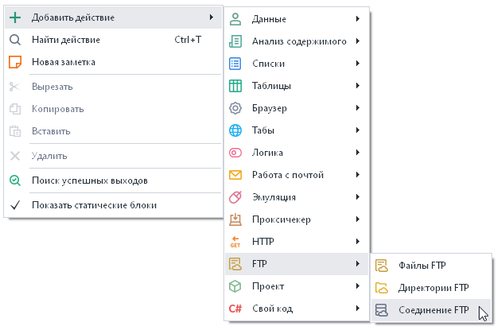
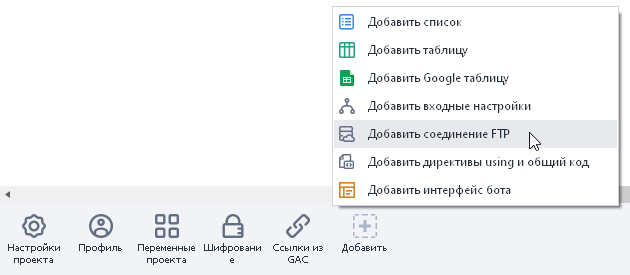
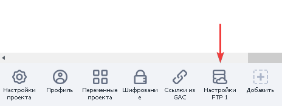
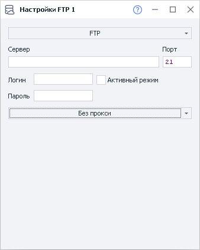
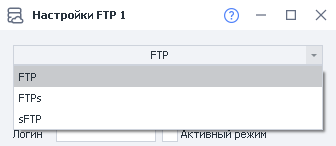
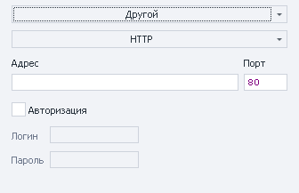

---
sidebar_position: 9
title: "Настройки FTP"
description: ""
date: "2025-08-04"
converted: true
originalFile: "Настройки FTP.txt"
targetUrl: "https://zennolab.atlassian.net/wiki/spaces/RU/pages/534315484/FTP"
---
:::info **Пожалуйста, ознакомьтесь с [*Правилами использования материалов на данном ресурсе*](../Disclaimer).**
:::

> 🔗 **[Оригинальная страница](https://zennolab.atlassian.net/wiki/spaces/RU/pages/534315484/FTP)** — Источник данного материала

_______________________________________________  
# Настройки FTP

## Описание

В ZennoPoster есть встроенные возможности для работы с FTP-ресурсами. Программа позволяет автоматически загружать файлы на FTP-сервер, создавать и удалять директории, а так же производить другие операции по FTP. Это удобно, например, если файлы данных проектов, с которыми производится работа, хранятся на FTP-сервере.

## Создание FTP соединения

Создать новое FTP соединение можно из контекстного меню **Добавить действие → FTP → соединение FTP**:

Или

Либо воспользуйтесь [❗→ умным поиском](https://zennolab.atlassian.net/wiki/spaces/RU/pages/506200090/ProjectMaker+7#%D0%A3%D0%BC%D0%BD%D1%8B%D0%B9-%D0%BF%D0%BE%D0%B8%D1%81%D0%BA-%D0%B4%D0%B5%D0%B9%D1%81%D1%82%D0%B2%D0%B8%D0%B9 "https://zennolab.atlassian.net/wiki/spaces/RU/pages/506200090/ProjectMaker+7#%D0%A3%D0%BC%D0%BD%D1%8B%D0%B9-%D0%BF%D0%BE%D0%B8%D1%81%D0%BA-%D0%B4%D0%B5%D0%B9%D1%81%D1%82%D0%B2%D0%B8%D0%B9").

Созданное FTP соединение отобразится в панели статических блоков:

## Настройки FTP соединения

### Основные

- **Выбор типа протокола передачи** - FTP, FTPs или sFTP:
FTP (File Transfer Protocol) - стандартный протокол, предназначенный для передачи файлов;
FTPs (File Transfer Protocol + SSL, или FTP/SSL) - защищённый протокол для передачи файлов;
sFTP (SSH File Transfer Protocol) – протокол для операций с файлами поверх надёжного и безопасного соединения.
- **Сервер** - имя FTP сервера (обязательный параметр);
- **Порт** - порт FTP соединения (обязательный параметр). По умолчанию порт имеет значение 21;
- **Логин и Пароль** - параметры авторизации для соединения (необязательные параметры). В случае, если данные параметры не указаны и сервер поддерживает соединение без авторизации, то соединение будет установлено;
- **Активный режим** - отметить, если нужно использовать активный режим работы FTP;
- **Режим работы с прокси** - можно выбрать режимы “Без прокси“, “Текущий прокси проекта“, “Строка формата protocol://login:pass@ip:port“, “Другой“. В режиме “Другой“ можно вставить прокси в любом своём формате, указав для этого в полях необходимую информацию - адрес, порт и данные для авторизации.

Подробная работа с FTP соединением описана в статьях [❗→ Файлы FTP](https://zennolab.atlassian.net/wiki/spaces/RU/pages/534315197/FTP "https://zennolab.atlassian.net/wiki/spaces/RU/pages/534315197/FTP") и [❗→ Директории FTP](https://zennolab.atlassian.net/wiki/spaces/RU/pages/534085901/FTP "https://zennolab.atlassian.net/wiki/spaces/RU/pages/534085901/FTP").